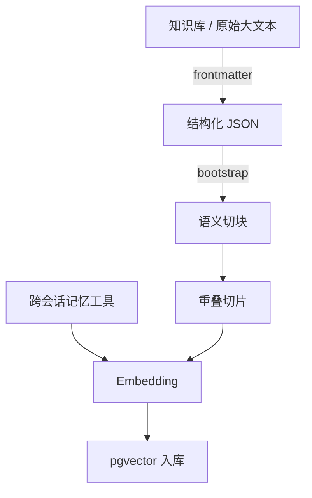
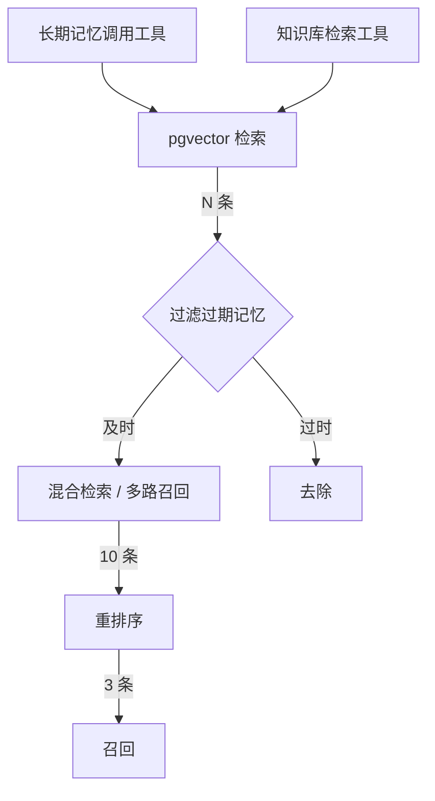
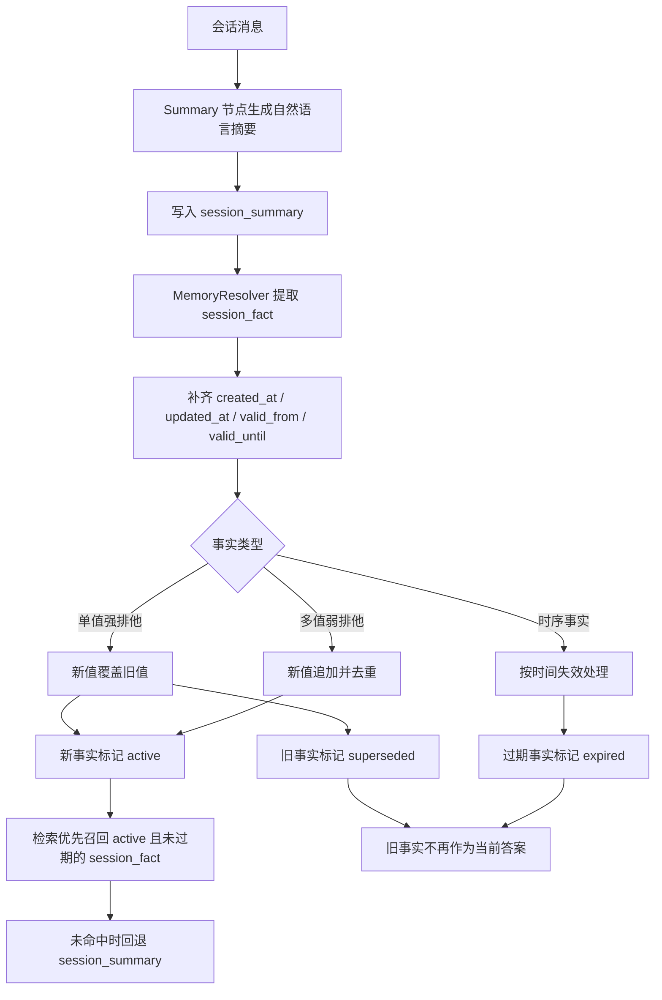

# Agent-Core-Service 智能体插件微服务

## 产品定位

##### 项目目标
本项目的目标是设计一个独立于主要软件后台之外的、可定制可编排的通用智能体微服务 `Agent-Core-Service`。

##### 主要服务人群
不是给终端用户直接使用的，而是为能够写代码、追求高度自定义智能体、希望自己搭建智能体能力的开发者准备。

## 项目设计

### 各部分设计

项目设计遵循分布式设计原则，形成可插拔、可定制的独立微服务。

各部分的设计如下：

1. 智能体核心 `AgentCore` 设计：采用 ReAct 思考模式，但不再硬编码节点流，而是形成可配置、可展示、可定制的节点流。
2. 节点设计：除了提供项目自带的节点，还提供用户自己编写节点的能力（继承节点父类），并提供用户节点配置持久化。
   基础节点有以下几种：
   - 输入/输出节点
   - 工具调用节点
   - 安全审核节点
   - 控制节点集，包含：
     - 启动/终止节点
     - 决策/汇合节点
     - 推理规划节点
     - 反思节点
   - 记忆节点集，包含：
     - 上下文压缩与事实持久化节点
     - 跨会话记忆检索节点
     - 知识库检索节点
     - 摘要节点
3. 工具系统设计：采用 **Function Calling** 模式，并对接 **MCP 协议** 接入用户可自定义的工具。除了系统自带的默认工具，还可以实现用户对工具的高度自定义。
4. 数据库设计：必须按照分布式设计规范来制定。关联库 PostgreSQL 只存储智能体相关的内容，向量库采用 pgvector。
5. 服务间调用：完全采用 **gRPC 协议** 函数化接口，只暴露特定的对外接口，如智能体信息流、思考轨迹、数据库调用等。
6. 配置管理：配置一个 `AgentConfig` 类，含有 `Constants`、`StorageConfig`、`ModelConfig`、`MemoryConfig` 等子配置类，配置类应提供外部配置参数的接口 `AgentConfig.load_config(...) -> AgentConfig`。
   调用配置应该从 `AgentCore` 隐式使用 `AgentConfig` 规范为 `agent = AgentCore(config=AgentConfig.load_config(...))` 的显式调用。
7. 可观测性：配置一个前端，观测 Agent 在后台的一切行动，包括节点状态、上下文构建器的 JSON、RAG 召回的条目、召回筛选过程、会话摘要等。配置完备的日志系统，所有的 Agent 行动也应该记录下来，务必保证信息传递过程完全可视化。
   - 前端轨迹面板可以参考 AI Agent Debugger 的思路，消费 LangGraph 节点事件、工具调用事件和状态更新事件来还原智能体行动过程。
8. 输出可定制性：可以根据实际业务定制所需的字段，甚至可以定制 display 模式来控制输出字段。
9. 记忆管理：优化长短记忆的算法和机制。
   - 短期记忆：即会话内上下文管理，不超过上下文长度的直接追加到上下文构建器 `ContextBuilder`，超过上下文长度的采用滑动窗口 + 关键信息摘要的方式压缩。
   - 会话管理：仍然采用 Session 会话管理机制。每次连续提问就从 PostgreSQL 中读取同 ID 会话并加载到上下文构建器。
   - 长期记忆：采用 RAG 检索增强生成 + pgvector 向量库作为长期记忆提取方式。
     - 跨对话记忆：Tag 为 `Memory`，每次发送 prompt 且内容有用时自动异步提取摘要，存储到用户会话向量库中。
     - 知识库 / 大文本记忆：Tag 为 `Knowledge`，需包含切片来源和时效性有关字段。本地知识库文件采用哈希锁来锁定文件已读状态。原始数据会先进行 `frontmatter_bootstrap` 处理，提取元结构 JSON，然后再进行 `knowledge_bootstrap` 处理得到可操作对象，再进行后续切片。
     - 用户个性长期记忆：不经过 RAG 流程，置入工具直接提供智能体使用。
   - 提高 RAG 召回率：采用以下策略：
     - 分块策略：按照语义切块，标题、段落、表格、列表分开处理。
     - 切片策略：采用重叠切片，`512 ~ 1024` 个 token 一个 chunk，重叠部分为 `128 ~ 256` 个 token。
     - 混合检索：采用多路召回，RAG 模糊检索与关键词检索并行，各取相关度最高的 5 条（默认），然后合并去重。
     - 重排序：引入 ReRank 模型，进行相关度精排序。对于混合检索得到的所有条目，取出时效性 + 相关性最高的 3 条（默认）。
10. 注意力优化：上下文拼装优先级为 `短期历史消息 -> 当前 session 摘要记忆 -> 外部知识库片段`，避免知识库内容覆盖用户刚刚明确给出的事实。
11. 信息时效性：为了保证信息时效性，每条记忆都要含有内容有效性时间戳字段（`created_at`、`updated_at`、`valid_from`、`valid_until`），检索时采用优先新内容、旧内容降权、过期内容直接过滤的算法：
     1. 过滤层：过滤 `valid_until < now` 的过时信息。
     2. 排序层：相关性 + 时效性联合排序，公式：$$Score = 0.5 * relevance + 0.3 * freshness + 0.2 * authority$$
     3. 时效状态管理：配置 `MemoryResolver` 作为独立记忆裁决层，先把自然语言摘要解析为结构化事实单元 `session_fact`，再为事实写入 `active / superseded / expired` 状态。
     4. 事实更新策略：针对单值强排他事实执行新值覆盖旧值，针对多值弱排他事实执行新值追加，针对时序事实执行到期失效处理，不再仅依赖向量检索排序推断新旧关系。
     5. 事实类型裁决：已知 `fact_key` 走 schema 固定类别，未知 `fact_key` 由 LLM 提供候选类别，最终由程序统一裁决，避免同一事实在不同轮次被判成不同类型。
### 记忆机制流程图

##### 长期记忆 / 知识库入库流程

##### RAG 召回流程

##### 记忆时效性机制

## 技术栈

- 版本：Python 3.12
- 微服务框架：FastAPI + gRPC
- 观测面板：Vue 3 + Pinia
- 反向代理：Vite（开发阶段） / Nginx（生产阶段）
- 智能体编排：LangGraph（可配置工作流 / 节点流转）
- 模型接入：LangChain + OpenAI Compatible API
- 工具协议：MCP
- 关联数据库：PostgreSQL
- 向量数据库：pgvector
- 长期记忆方案：RAG（向量检索 + 关键词检索 + ReRank）
- 配置管理：Pydantic / dataclass 风格 AgentConfig
- 异步任务：asyncio
- 日志与监控：logging / structlog + Prometheus + Grafana
- 容器化部署：Docker + Docker Compose
- 测试与质量：Pytest + Ruff + mypy
