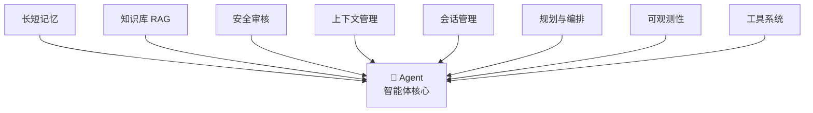
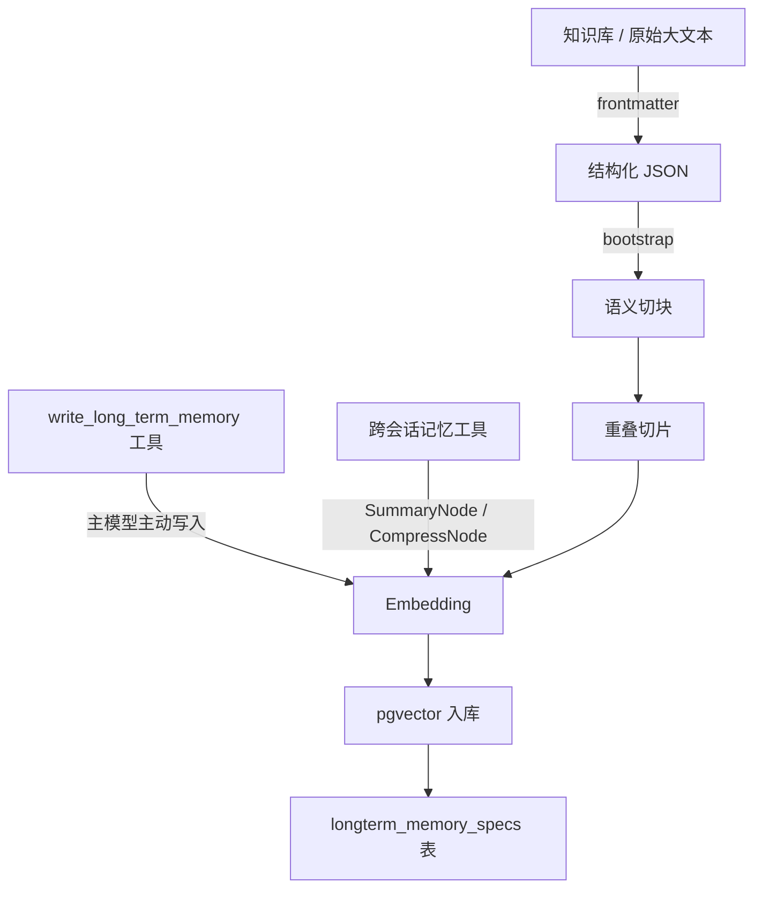
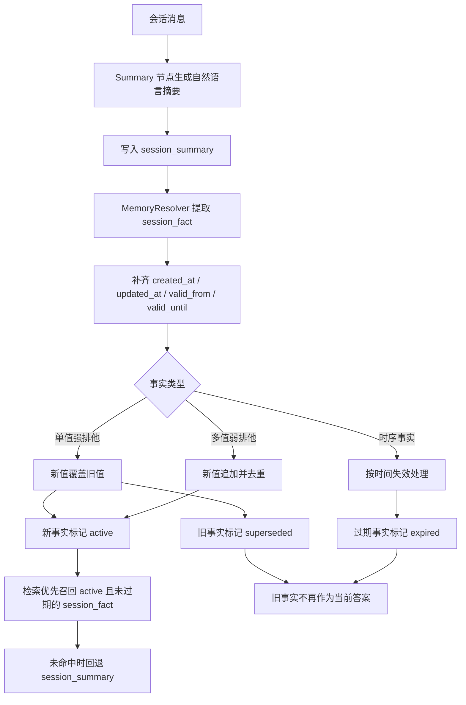
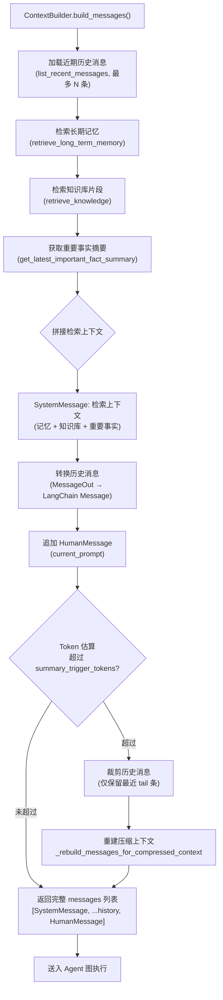
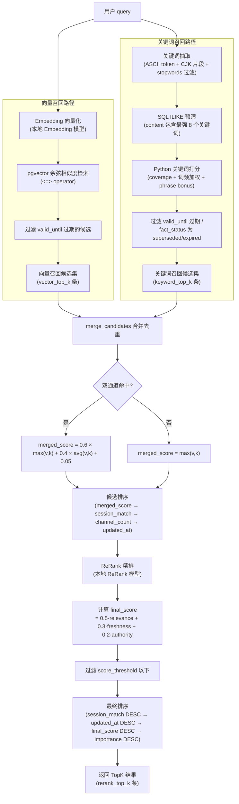
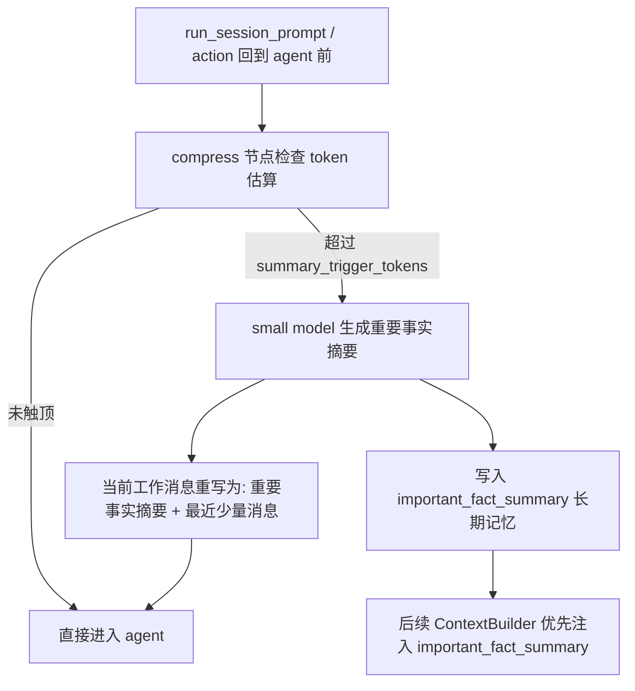
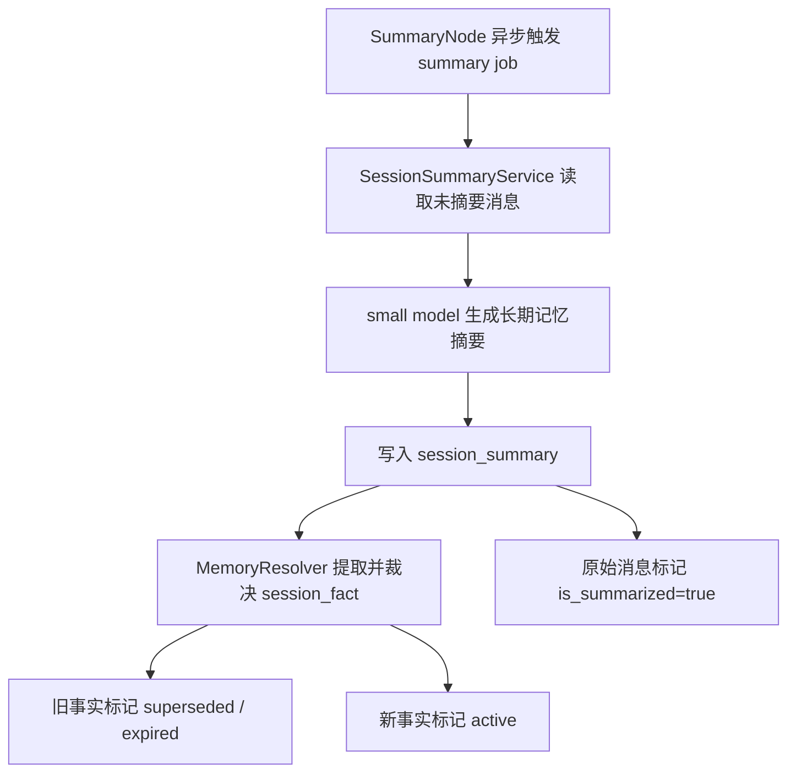
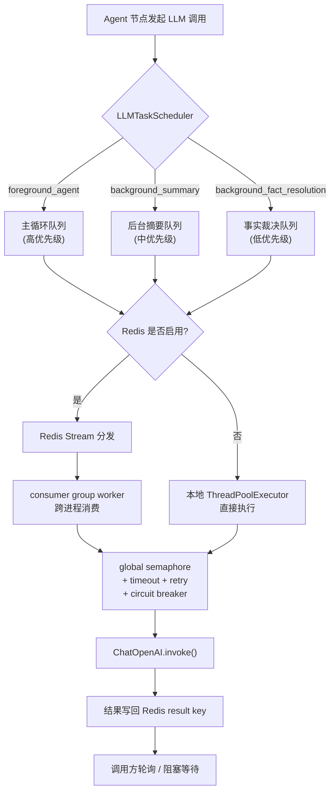
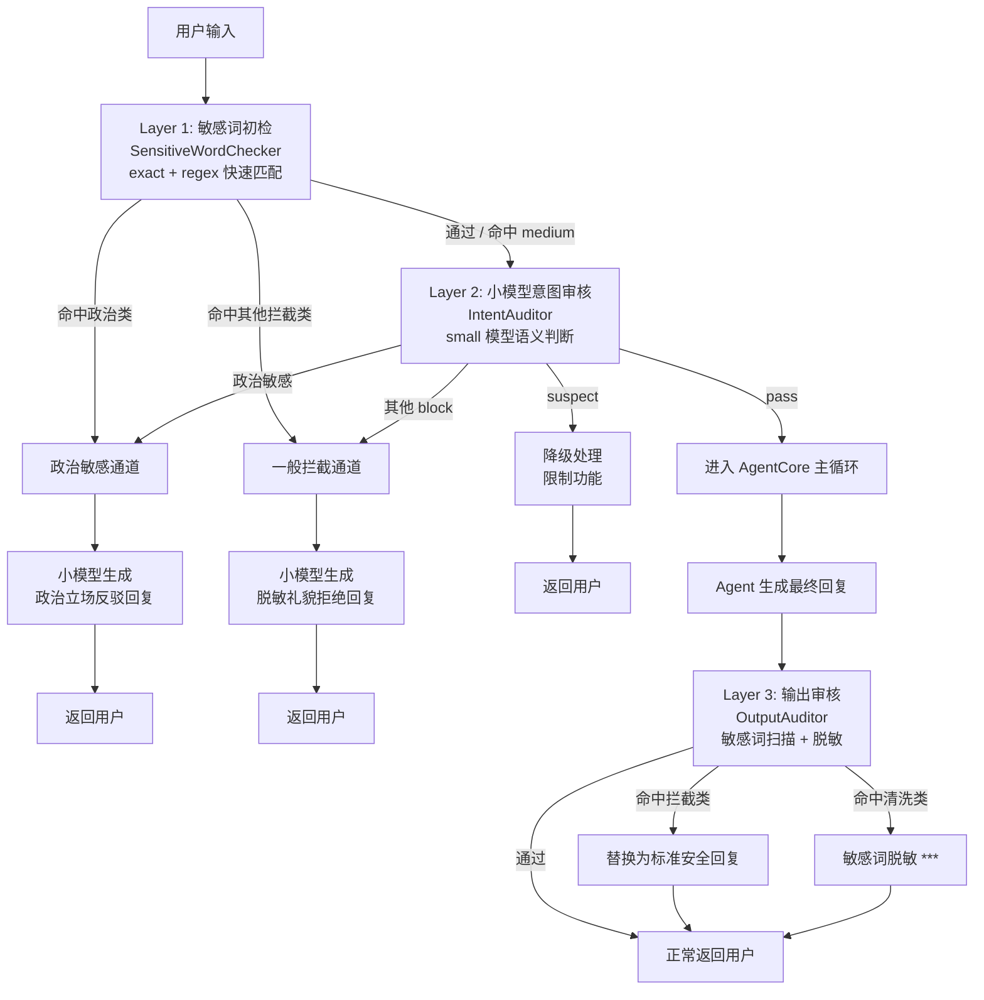

# Agent-Core-Service 智能体插件微服务

## 产品定位

##### 项目目标
本项目的目标是设计一个独立于主要软件后台之外的、可定制可编排的通用智能体微服务 `Agent-Core-Service`。

##### 主要服务人群
不是给终端用户直接使用的，而是为能够写代码、追求高度自定义智能体、希望自己搭建智能体能力的开发者准备。

## 项目设计
### 核心结构设计
##### Agent宏观结构

##### Agent状态转移图

### 各部分设计

项目设计遵循分布式设计原则，形成可插拔、可定制的独立微服务。

各部分的设计如下：

1. 智能体核心 `AgentCore` 设计：采用 ReAct 思考模式，但不再硬编码节点流，而是形成可配置、可展示、可定制的节点流。
2. 节点设计：基础节点有以下几种：
   - 启动/终止节点
   - 决策/汇合节点
   - 工具调用节点
     - 跨会话记忆检索
     - 上下文压缩与事实持久化
     - 知识库检索
     - 其他内置工具
     - MCP外部工具
   - 安全审核节点（输入/输出两阶段）
     - `safety_input` 输入安全审核（入口）
     - `safety_output` 输出安全审核（出口）
   - 推理规划节点
   - 反思节点
   - 摘要节点
   - 上下文压缩节点
     
3. 工具系统设计：采用 **Function Calling** 模式，并对接 **MCP 协议** 接入用户可自定义的工具。除了系统自带的默认工具，还可以实现用户对工具的高度自定义。
4. 数据库设计：必须按照分布式设计规范来制定。关联库 PostgreSQL 只存储智能体相关的内容，向量库采用 pgvector。
5. 服务间调用：完全采用 **gRPC 协议** 函数化接口，只暴露特定的对外接口，如智能体信息流、思考轨迹、数据库调用等。
6. 配置管理：配置一个 `AgentConfig` 类，含有 `Constants`、`StorageConfig`、`ModelConfig`、`MemoryConfig` 等子配置类，配置类应提供外部配置参数的接口 `AgentConfig.load_config(...) -> AgentConfig`。
   调用配置应该从 `AgentCore` 隐式使用 `AgentConfig` 规范为 `agent = AgentCore(config=AgentConfig.load_config(...))` 的显式调用。
7. 可观测性：配置一个前端，观测 Agent 在后台的一切行动，包括节点状态、上下文构建器的 JSON、RAG 召回的条目、召回筛选过程、会话摘要等。配置完备的日志系统，所有的 Agent 行动也应该记录下来，务必保证信息传递过程完全可视化。
    - 前端轨迹面板可以参考 AI Agent Debugger 的思路，消费 LangGraph 节点事件、工具调用事件和状态更新事件来还原智能体行动过程。
8. 记忆管理：优化长短记忆的算法和机制。
    - 短期记忆：即会话内上下文管理，不超过上下文长度的直接追加到上下文构建器 `ContextBuilder`，超过 `summary_trigger_tokens` 阈值时会先进入 `compress` 节点,用小模型生成“重要事实摘要”,再把工作上下文重写为 `重要事实摘要 + 最近少量消息`。
    - 会话管理：仍然采用 Session 会话管理机制。每次连续提问就从 PostgreSQL 中读取同 ID 会话并加载到上下文构建器。
    - 长期记忆：采用 RAG 检索增强生成 + pgvector 向量库作为长期记忆提取方式。
       - 跨对话记忆：Tag 为 `Memory`，每次发送 prompt 且内容有用时自动异步提取摘要，存储到用户会话向量库中。
       - 知识库 / 大文本记忆：Tag 为 `Knowledge`，需包含切片来源和时效性有关字段。本地知识库文件采用哈希锁来锁定文件已读状态。原始数据会先进行 `frontmatter_bootstrap` 处理，提取元结构 JSON，然后再进行 `knowledge_bootstrap` 处理得到可操作对象，再进行后续切片。
       - 重要事实摘要记忆：上下文压缩后生成的摘要会写入 `important_fact_summary` 长期记忆,供后续 `ContextBuilder` 优先注入。
       - 用户个性长期记忆：不经过 RAG 流程，置入工具直接提供智能体使用。
    - 提高 RAG 召回率：采用以下策略：
      - 分块策略：按照语义切块，标题、段落、表格、列表分开处理。
      - 切片策略：采用重叠切片，`512 ~ 1024` 个 token 一个 chunk，重叠部分为 `128 ~ 256` 个 token。
      - 混合检索：采用多路召回，RAG 模糊检索与关键词检索并行，各取相关度最高的 5 条（默认），然后合并去重。
      - 重排序：引入本地 ReRank 模型，进行相关度精排序。对于混合检索得到的所有条目，先做 ReRank，再叠加时效性与权威性得到最终 TopK。
9. 注意力优化：上下文拼装优先级为 `短期历史消息 -> important_fact_summary -> 当前 session 的 session_fact / session_summary -> 外部知识库片段`，避免知识库内容覆盖用户刚刚明确给出的事实。
10. 信息时效性：为了保证信息时效性，每条记忆都要含有内容有效性时间戳字段（`created_at`、`updated_at`、`valid_from`、`valid_until`），检索时采用优先新内容、旧内容降权、过期内容直接过滤的算法：
    1. 过滤层：过滤 `valid_until < now` 的过时信息。
    2. 排序层：先经过 score_threshold 过滤无关候选，再以**时间优先**策略排序。主排序键为 `updated_at DESC`（最新优先），次排序键为 `final_score DESC`（联合得分）。理由：通过阈值过滤的候选均已相关，在此集合中越新的信息越可能是当前事实，可避免查询中携带的旧关键词（如"1111111 还算当前值吗"）通过 BM25 带偏排序。联合得分公式（用于同级时间的次排序）：$$Score = 0.5 \cdot relevance + 0.3 \cdot freshness + 0.2 \cdot authority$$
    3. 时效状态管理：配置 `MemoryResolver` 作为独立记忆裁决层，先把自然语言摘要解析为结构化事实单元 `session_fact`，再为事实写入 `active / superseded / expired` 状态。
    4. 事实更新策略：针对单值强排他事实执行新值覆盖旧值，针对多值弱排他事实执行新值追加，针对时序事实执行到期失效处理，不再仅依赖向量检索排序推断新旧关系。
    5. 事实类型裁决：已知 `fact_key` 走 schema 固定类别，未知 `fact_key` 由 LLM 提供候选类别，最终由程序统一裁决，避免同一事实在不同轮次被判成不同类型。
11. 多级队列与并发: 设置一个限流调度器`LLMTaskScheduler`,所有的LLM调用都要通过它.内部存在多级队列调度(按主 Agent、Summary、Fact Extraction 三个等级分配到不同队列),同时增加 `large / small` 双模型池路由,主推理走大模型池,摘要/事实抽取/上下文压缩走小模型池,并分别配备独立并发上限、超时、熔断与重试机制.
    - 大小模型分流机制：调度器先按任务语义决定 `model_tier`,再按 `model_tier` 选择实际模型配置。主回答模型负责复杂推理与最终回答,小模型负责重要事实摘要、长期记忆摘要、事实抽取、分类与轻量语义压缩,以降低主模型的延迟与负载压力。
    - 物理模型隔离：如果配置 `AGENT_SMALL_MODEL_NAME / AGENT_SMALL_MODEL_API_KEY / AGENT_SMALL_MODEL_BASE_URL`,则 `small` 任务会真正调用独立小模型;未配置时才会回退到主模型配置,但仍占用 `small pool` 的并发配额。
12. 安全审核机制：采用**三层递进式**安全防线,在 Agent 输入和输出两个位置执行审核,阻断风险请求并清洗敏感输出。
    - 第一层 — 敏感词初检（`services/safety/sensitive_word_checker.py`）：
      在请求进入 Agent 主循环前,使用分类词库（`resources/safety/sensitive_words.json`）执行快速的 `exact` 精确匹配 + `regex` 正则匹配。
      词库按 `politics / pornography / violence / illegal / spam_ad / prompt_injection / data_exfiltration` 七大类分组,
      每类标记 `risk_level`（high/medium/low）和 `block` 标记。high 级别命中直接拦截,medium 级别交由第二层进一步判断。
    - 第二层 — 小模型意图审核（`services/safety/intent_auditor.py`）：
      敏感词初检通过后,使用小模型（通过 `LLMTaskScheduler` 路由到 `small` 模型池,`foreground_agent` 优先级）对用户意图做语义级安全判断。
      审核维度包括：恶意攻击（越狱/注入）、非法请求、信息窃取、骚扰滥用、正常请求。输出 `pass / block / suspect` 三态裁决。
    - 第三层 — 输出审核（`services/safety/output_auditor.py`）：
      在 Agent 生成最终回复后、返回用户前,对输出内容执行敏感词扫描。命中拦截类敏感词（政治/色情/暴力/违法）直接替换为标准安全回复;
      命中清洗类敏感词（广告/Prompt注入/数据窃取）执行脱敏替换（`***`）。
    - 拦截回复差异化生成（`SafetyService.generate_block_message()`）：
     被拦截的用户请求不是返回统一硬编码提示,而是根据拦截类型调用**小模型**生成两类差异化回复：
      - 政治敏感：命中 `politics` 分类或意图审核判定"政治敏感" → 小模型生成立场正确的反驳性回复（如"这种说法是完全错误的。中国共产党始终坚持……"）。
      - 一般拦截：色情/暴力/违法/注入/广告等其他类别 → 小模型生成脱敏的礼貌拒绝（如"对不起,我不能回答这个问题,因为[脱敏理由]。如需其他帮助请随时告诉我。"）。
     两项回复均通过 `SafetyService._get_block_message_prompt()` 选择对应系统提示词,经 `LLMTaskScheduler` → `small` 模型池生成;小模型不可用时回退到静态后备文案。

### 项目工作原理流程图
#### 记忆机制
##### 长期记忆 / 知识库入库流程

##### RAG 召回流程

##### 记忆时效性机制

##### 上下文构建器

**消息角色优先级（上下文拼装顺序）：**  
`SystemMessage(检索上下文)` → `历史消息按时间正序` → `HumanMessage(当前输入)`  
检索上下文内部优先级：`important_fact_summary > 当前 session 摘要 > 长期记忆 > 知识库`

##### 混合检索与ReRank机制

#### 任务调度机制
##### compress 路径: 上下文压缩 / 重要事实摘要流程

##### summary 路径: 长期记忆摘要流程

##### 模型路由与大/小模型池

##### Redis多级队列调度

#### 安全机制
##### 三层审核设计

## 技术栈

- 版本：Python 3.12
- 微服务框架：FastAPI + gRPC
- 观测面板：Vue 3 + Pinia
- 反向代理：Vite（开发阶段） / Nginx（生产阶段）
- 智能体编排：LangGraph（可配置工作流 / 节点流转）
- 模型接入：LangChain + OpenAI Compatible API
- 工具协议：MCP
- 关联数据库：PostgreSQL
- 向量数据库：pgvector
- 长期记忆方案：RAG（向量检索 + 关键词检索 + ReRank）
- 配置管理：Pydantic / dataclass 风格 AgentConfig
- 异步任务：asyncio
- 日志与监控：logging / structlog + Prometheus + Grafana
- 容器化部署：Docker + Docker Compose
- 测试与质量：Pytest + Ruff + mypy
