# Agent-Core-Service 通用智能体微服务

## 产品定位

##### 项目目标
本项目是一个独立的、可定制、可观测、可接MCP的通用智能体微服务 `Agent-Core-Service`。

##### 主要服务人群
不是给终端用户直接使用的，而是为能够写代码、追求高度自定义智能体、希望自己搭建智能体能力的开发者准备。

## 快速启动

### 环境要求

- Python 3.12+
- Node.js 18+
- 已配置 LLM API（OpenAI 兼容接口）

### 1. 配置环境变量

在根目录创建.env文件,配置如下环境变量：
```bash
# 必填：大小模型API-KEY,主模型默认为deepseek-v4-flash,小模型默认为moonshot-v1-8k
AGENT_MODEL_API_KEY=sk-xxxxxxxx
AGENT_SMALL_MODEL_API_KEY=sk-yyyyyyyy
```

### 2. 启动后端（FastAPI）

```bash
# 安装后端依赖
pip install -r agent_service/requirements.txt

# 启动服务（HTTP: 8002, gRPC: 50051）
uvicorn main:app --host 0.0.0.0 --port 8002
```

启动时自动执行知识库灌库：扫描 `resources/knowledge/` 下的 Markdown/TXT 文件，结构化 → 向量化 → 写入 ChromaDB。已入库且内容未变更的文件会被哈希锁跳过。

### 3. 启动前端（Vite + Vue 3）

```bash
cd console
npm i --verbose
npm run dev          # 开发模式 → http://localhost:8003
# npm run build      # 构建静态文件 → console/dist/
```

前端开发服务器自动代理到 `localhost:8002`。

### 4. 验证

浏览器访问 `http://localhost:8003`，在控制台输入问题即可测试 Agent。

后端健康检查：`curl http://localhost:8002/health`

## 构建

### 前端 — 静态 HTML

```bash
cd console
npm i --verbose
npm run build          # 输出 → console/dist/
```

### 后端 — 单文件 exe

```bash
# 安装 PyInstaller
pip install pyinstaller

# 打包（读取 AgentService.spec）
pyinstaller AgentService.spec
```

产物为 `dist/AgentService.exe`。`.spec` 配置将 `console/dist/`（前端静态资源）和 `resources/`（知识库、MCP 配置、安全词库）一并打包进 exe。

### 部署结构

首次启动自动生成空 `resources/` 和 `runtime/` 目录骨架:

```
AgentService.exe
├── .env                 # 模型 API Key 等配置
├── resources/           # 自动生成空目录,放入文件即可覆盖 exe 内置默认
│   ├── knowledge/       # 放 .md / .txt 知识文档,重启自动灌库
│   ├── mcp/             # 放 .json MCP 服务器配置,重启自动加载
│   └── safety/          # 放 sensitive_words.json,覆盖内置安全词库
└── runtime/             # 自动生成: db/ models/ frontmatter/ logs/
```

> **读取规则**: 外置目录有文件则用外置,外置为空则回退到 exe 内置副本。按需在外置目录增删文件即生效,无需重新打包。

### 单 exe 运行

双击启动或命令行:

```bash
AgentService.exe
```

启动时自动启动默认浏览器访问 `http://localhost:8002`，后端同时提供 API 和前端界面。`runtime/` 和 `resources/` 目录和 `.env` 空文件首次启动自动生成。
首次启动时无法使用.需要在`.env`里面配置大小模型API-KEY,然后才能启动exe.

> 开发模式下前后端分离（后端 8002 + 前端 8003），打包后后端直接托管前端静态文件，无需额外 Web 服务器。

## MCP 工具接入

AgentService 通过 MCP（Model Context Protocol）协议对接外部工具服务器。Agent 启动时自动发现并注册 MCP 工具，注册后的工具与内置工具无差别可用。

### 启用 MCP
在.env中:
```bash
AGENT_MCP_ENABLED=true
```
### 配置 MCP 服务器

在 `resources/mcp/` 目录下创建 `.json` 配置文件：

```json
[
  {
    "server_id": "filesystem",
    "command": "npx",
    "args": ["-y", "@modelcontextprotocol/server-filesystem", "/path/to/allowed/dir"],
    "enabled": true
  },
  {
    "server_id": "web-search",
    "command": "python",
    "args": ["-m", "my_mcp_server"],
    "enabled": true,
    "env": {
      "API_KEY": "your-api-key"
    }
  }
]
```

每个服务器条目支持以下字段：

| 字段 | 必填 | 说明 |
|---|---|---|
| `server_id` | 是 | 唯一标识符，只允许小写字母、数字、下划线 |
| `command` | 是 | 启动 MCP 服务器的可执行文件（`npx`、`python` 等） |
| `args` | 否 | 命令行参数列表 |
| `env` | 否 | 注入子进程的环境变量 |
| `enabled` | 否 | 是否启用，默认 `true` |
| `encoding` | 否 | stdio 编码，默认 `"utf-8"` |

如需用环境变量配置，可设置 `AGENT_MCP_SERVERS_JSON`（JSON 字符串）或逐个服务器的环境变量。但推荐使用 JSON 文件方式，更直观且支持多服务器管理。


### 工具命名与调用规则

MCP 工具自动注册为 `{prefix}__{server_id}__{tool_name}` 格式：

- `prefix` — 默认为 `mcp`，可通过 `AGENT_MCP_TOOL_NAME_PREFIX` 自定义
- `server_id` — 配置中指定的服务器标识
- `tool_name` — MCP 服务器上报的工具名称

例如 `filesystem` 服务器的 `read_file` 工具注册为 `mcp__filesystem__read_file`，Agent 在对话中调用此工具时即通过 MCP 协议转发到对应服务器进程执行。

### 运行机制

1. 启动时 AgentCore 扫描 `resources/mcp/*.json`，加载服务器配置
2. 对每个启用的服务器启动子进程，通过 stdio 建立 MCP 会话
3. 调用 `list_tools()` 发现该服务器提供的工具
4. 将所有 MCP 工具包装为与内置工具相同的 `StructuredTool`，注册到工具注册表
5. 对话中 LLM 选择调用 MCP 工具时，通过同步-异步桥接转发到对应 MCP 服务器执行

MCP 工具与内置工具共用同一个工具选择池，LLM 根据任务自动决定是否调用以及调用哪个。


## 项目设计
### 核心结构设计
##### Agent宏观结构
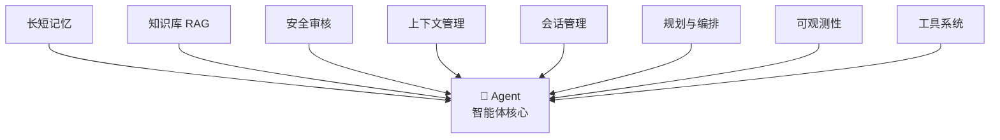
##### Agent状态转移图

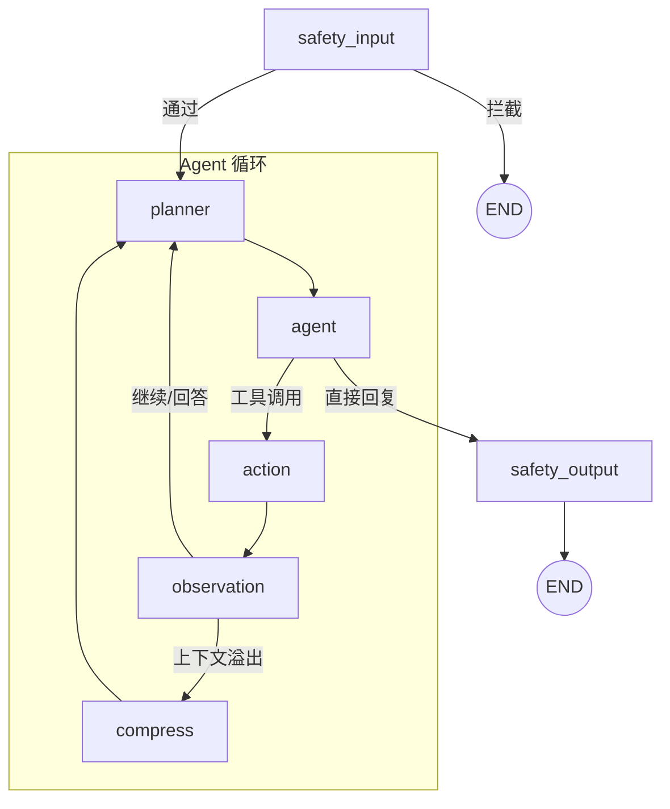

### 技术栈

- 版本：Python 3.12
- 微服务框架：FastAPI 
- 通信与工具协议: gRPC + REST/HTTP + MCP
- 观测面板：Vue 3 + Pinia
- 反向代理：Vite
- 智能体编排：LangGraph + LangChain
- 模型接入：DeepSeek-v4-flash(大模型) + Moonshot-v1-8k(小模型)
- 关联数据库：SQLite
- 向量数据库：ChromaDB
- 长期记忆方案：RAG（向量检索 + 关键词检索 + ReRank）
- 配置管理：Pydantic / dataclass 风格 AgentConfig
- 异步任务：asyncio
- 日志与监控：logging / structlog + Prometheus + Grafana
- 测试与质量：Pytest + Ruff + mypy

### 各部分设计

项目设计遵循分布式设计原则，形成可插拔、可定制的独立微服务。

各部分的设计如下：

1. 智能体核心 `AgentCore` 设计：采用 ReAct 思考模式，节点流可配置、可展示、可定制，不硬编码。
2. 节点设计：基础节点有以下几种：
   - 启动/终止节点
   - 决策/汇合节点
   - 工具调用节点
     - 跨会话记忆检索
     - 上下文压缩与事实持久化
     - 知识库检索
     - 其他内置工具
     - MCP外部工具
   - 安全审核节点（输入/输出两阶段）
     - `safety_input` 输入安全审核（入口）
     - `safety_output` 输出安全审核（出口）
   - 推理规划节点
   - 反思节点
   - 摘要节点
   - 上下文压缩节点
     
3. 工具系统设计：采用 **Function Calling** 模式，对接 **MCP 协议** 接入外部工具。系统自带默认工具，同时支持用户对工具的高度自定义。
4. 数据库设计：关联库采用 SQLite 存储智能体会话与消息，向量库采用 ChromaDB。
5. 服务间调用：采用 **gRPC 协议** 函数化接口，暴露智能体信息流、思考轨迹、数据库调用等对外接口。
6. 配置管理：`AgentConfig` 类包含 `Constants`、`StorageConfig`、`ModelConfig`、`MemoryConfig` 等子配置类，通过 `AgentConfig.load_config(...)` 加载外部配置参数。配置通过 `agent = AgentCore(config=AgentConfig.load_config(...))` 显式传入 AgentCore。
7. 可观测性：前端面板实时展示 Agent 行动轨迹，包括节点状态、上下文构建器 JSON、RAG 召回条目、召回筛选过程、会话摘要等。日志系统记录全部 Agent 行动，信息传递过程完全可视化。
    - 前端轨迹面板消费 LangGraph 节点事件、工具调用事件和状态更新事件，还原智能体行动过程。
8. 记忆管理：分层长短记忆的算法和机制。
    - 短期记忆：即会话内上下文管理，不超过上下文长度的直接追加到上下文构建器 `ContextBuilder`，超过 `summary_trigger_tokens` 阈值时会先进入 `compress` 节点,用小模型生成“重要事实摘要”,再把工作上下文重写为 `重要事实摘要 + 最近少量消息`。
    - 会话管理：基于 Session 机制，每次连续提问从 SQLite 读取同 ID 会话并加载到上下文构建器。
    - 长期记忆：采用 RAG 检索增强生成 + ChromaDB 向量库作为长期记忆提取方式。
       - 跨对话记忆：Tag 为 `Memory`，每次发送 prompt 且内容有用时自动异步提取摘要，存储到用户会话向量库中。
       - 知识库 / 大文本记忆：Tag 为 `Knowledge`，需包含切片来源和时效性有关字段。本地知识库文件采用哈希锁来锁定文件已读状态。原始数据会先进行 `frontmatter_bootstrap` 处理，提取元结构 JSON，然后再进行 `knowledge_bootstrap` 处理得到可操作对象，再进行后续切片。
       - 重要事实摘要记忆：上下文压缩后生成的摘要会写入 `important_fact_summary` 长期记忆,供后续 `ContextBuilder` 优先注入。
       - 用户个性长期记忆：不经过 RAG 流程，置入工具直接提供智能体使用。
    - 提高 RAG 召回率：采用以下策略：
      - 分块策略：按照语义切块，标题、段落、表格、列表分开处理。
      - 切片策略：采用重叠切片，`512 ~ 1024` 个 token 一个 chunk，重叠部分为 `128 ~ 256` 个 token。
      - 混合检索：采用多路召回，RAG 模糊检索与关键词检索并行，各取相关度最高的 5 条（默认），然后合并去重。
      - 重排序：引入本地 ReRank 模型，进行相关度精排序。对于混合检索得到的所有条目，先做 ReRank，再叠加时效性与权威性得到最终 TopK。
9. 注意力优化：上下文拼装优先级为 `短期历史消息 -> important_fact_summary -> 当前 session 的 session_fact / session_summary -> 外部知识库片段`，避免知识库内容覆盖用户刚刚明确给出的事实。
10. 信息时效性：为了保证信息时效性，每条记忆都要含有内容有效性时间戳字段（`created_at`、`updated_at`、`valid_from`、`valid_until`），检索时采用优先新内容、旧内容降权、过期内容直接过滤的算法：
    1. 过滤层：过滤 `valid_until < now` 的过时信息。
    2. 排序层：先经过 score_threshold 过滤无关候选，再以**时间优先**策略排序。主排序键为 `updated_at DESC`（最新优先），次排序键为 `final_score DESC`（联合得分）。理由：通过阈值过滤的候选均已相关，在此集合中越新的信息越可能是当前事实，可避免查询中携带的旧关键词（如"1111111 还算当前值吗"）通过 BM25 带偏排序。联合得分公式（用于同级时间的次排序）：$$Score = 0.5 \cdot relevance + 0.3 \cdot freshness + 0.2 \cdot authority$$
    3. 时效状态管理：配置 `MemoryResolver` 作为独立记忆裁决层，先把自然语言摘要解析为结构化事实单元 `session_fact`，再为事实写入 `active / superseded / expired` 状态。
    4. 事实更新策略：针对单值强排他事实执行新值覆盖旧值，针对多值弱排他事实执行新值追加，针对时序事实执行到期失效处理，不再仅依赖向量检索排序推断新旧关系。
    5. 事实类型裁决：已知 `fact_key` 走 schema 固定类别，未知 `fact_key` 由 LLM 提供候选类别，最终由程序统一裁决，避免同一事实在不同轮次被判成不同类型。
11. 多级队列与并发: 限流调度器 `LLMTaskScheduler` 统一管理所有 LLM 调用。内部多级队列按主 Agent、Summary、Fact Extraction 三个等级分配,同时设置 `large / small` 双模型池路由——主推理走大模型池,摘要/事实抽取/上下文压缩走小模型池,分别配备独立并发上限、超时、熔断与重试机制。
    - 大小模型分流机制：调度器先按任务语义决定 `model_tier`,再按 `model_tier` 选择实际模型配置。主回答模型负责复杂推理与最终回答,小模型负责重要事实摘要、长期记忆摘要、事实抽取、分类与轻量语义压缩,以降低主模型的延迟与负载压力。
    - 物理模型隔离：如果配置 `AGENT_SMALL_MODEL_NAME / AGENT_SMALL_MODEL_API_KEY / AGENT_SMALL_MODEL_BASE_URL`,则 `small` 任务会真正调用独立小模型;未配置时才会回退到主模型配置,但仍占用 `small pool` 的并发配额。
12. 安全审核机制：采用**三层递进式**安全防线,在 Agent 输入和输出两个位置执行审核,阻断风险请求并清洗敏感输出。
    - 第一层 — 敏感词初检（`services/safety/sensitive_word_checker.py`）：
      在请求进入 Agent 主循环前,使用分类词库（`resources/safety/sensitive_words.json`）执行快速的 `exact` 精确匹配 + `regex` 正则匹配。
      词库按 `politics / pornography / violence / illegal / spam_ad / prompt_injection / data_exfiltration` 七大类分组,
      每类标记 `risk_level`（high/medium/low）和 `block` 标记。high 级别命中直接拦截,medium 级别交由第二层进一步判断。
    - 第二层 — 小模型意图审核（`services/safety/intent_auditor.py`）：
      敏感词初检通过后,使用小模型（通过 `LLMTaskScheduler` 路由到 `small` 模型池,`foreground_agent` 优先级）对用户意图做语义级安全判断。
      审核维度包括：恶意攻击（越狱/注入）、非法请求、信息窃取、骚扰滥用、正常请求。输出 `pass / block / suspect` 三态裁决。
    - 第三层 — 输出审核（`services/safety/output_auditor.py`）：
      在 Agent 生成最终回复后、返回用户前,对输出内容执行敏感词扫描。命中拦截类敏感词（政治/色情/暴力/违法）直接替换为标准安全回复;
      命中清洗类敏感词（广告/Prompt注入/数据窃取）执行脱敏替换（`***`）。
    - 拦截回复差异化生成（`SafetyService.generate_block_message()`）：
     被拦截的用户请求不是返回统一硬编码提示,而是根据拦截类型调用**小模型**生成两类差异化回复：
      - 政治敏感：命中 `politics` 分类或意图审核判定"政治敏感" → 小模型生成立场正确的反驳性回复（如"这种说法是完全错误的。中国共产党始终坚持……"）。
      - 一般拦截：色情/暴力/违法/注入/广告等其他类别 → 小模型生成脱敏的礼貌拒绝（如"对不起,我不能回答这个问题,因为[脱敏理由]。如需其他帮助请随时告诉我。"）。
     两项回复均通过 `SafetyService._get_block_message_prompt()` 选择对应系统提示词,经 `LLMTaskScheduler` → `small` 模型池生成;小模型不可用时回退到静态后备文案。
13. 可定制性: 用户可自定义长期记忆和系统提示词并持久化.
  - 用户自定义长期记忆:用户可以管理长期记忆,可以增加新的自定义长期记忆注入到向量库,或者删除长期记忆.
  - 用户自定义系统提示词:用户可编辑"用户设置系统提示词",追加到原本的系统提示词中.
## 工作原理流程图
### 记忆机制
##### 长期记忆 / 知识库入库流程


##### RAG 召回流程

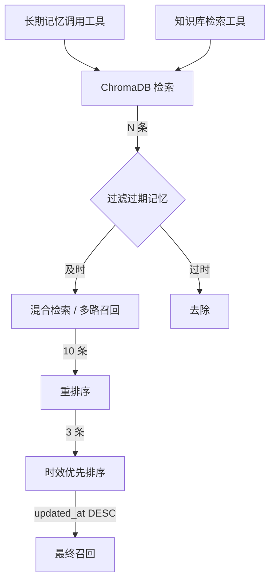

##### 记忆时效性机制

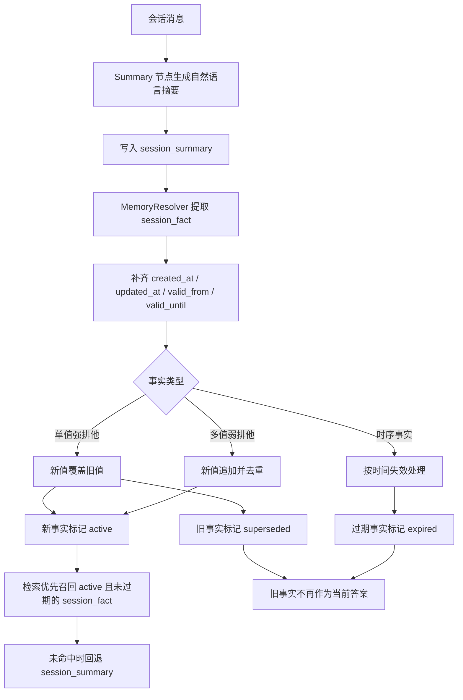


##### 混合检索与ReRank机制

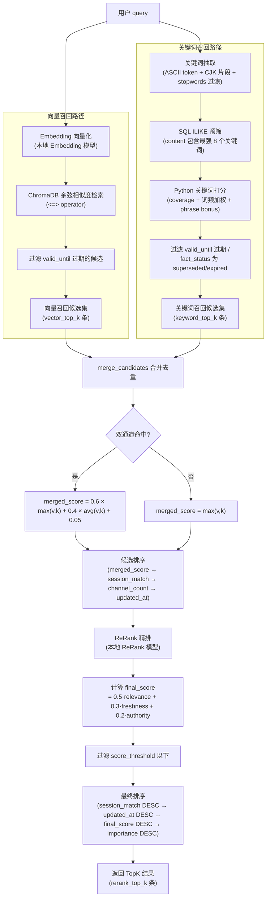
### 上下文与状态机制
##### 上下文构建器

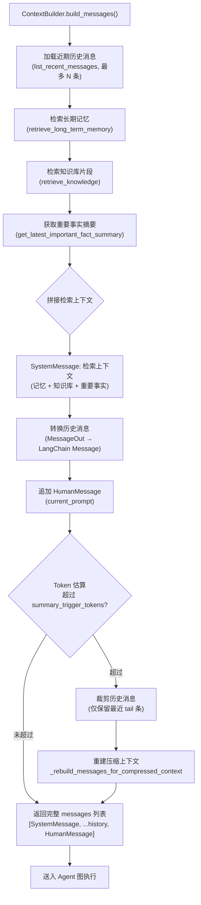
**消息角色优先级（上下文拼装顺序）：**  
`SystemMessage(检索上下文)` → `历史消息按时间正序` → `HumanMessage(当前输入)`  
检索上下文内部优先级：`important_fact_summary > 当前 session 摘要 > 长期记忆 > 知识库`

##### 上下文压缩机制
###### compress 路径: 上下文压缩 / 重要事实摘要流程

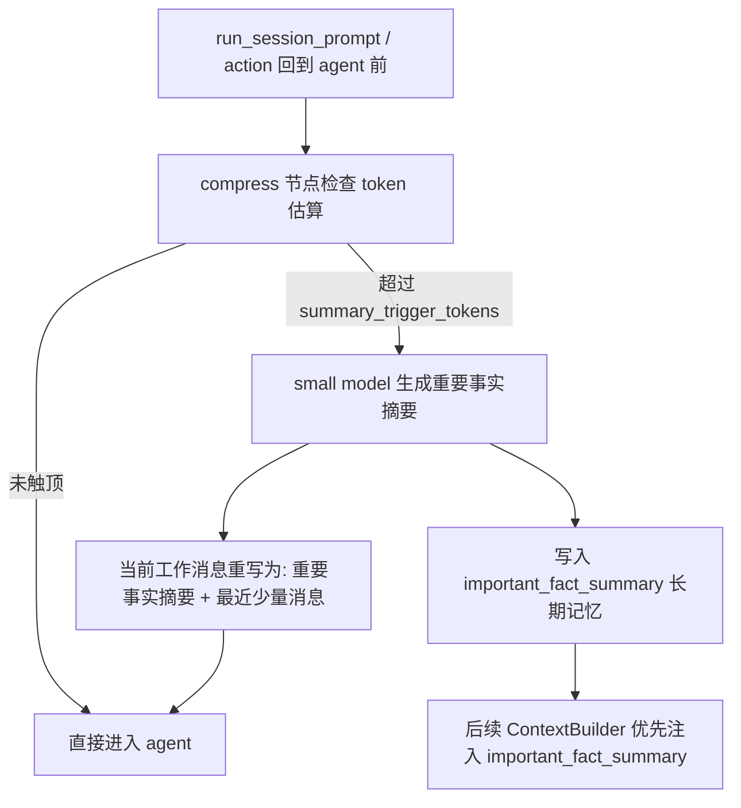

###### summary 路径: 长期记忆摘要流程

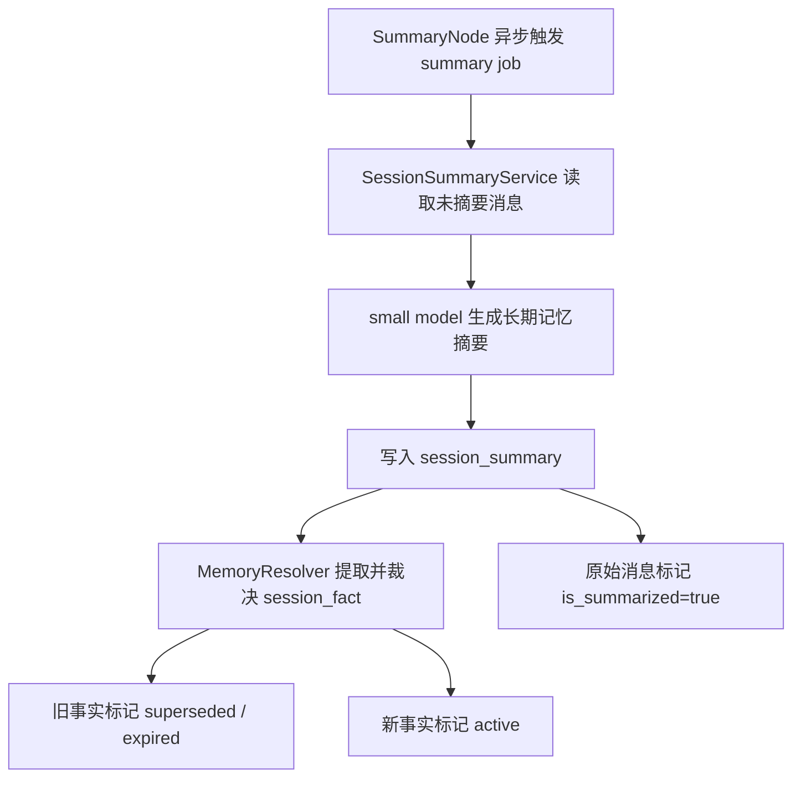

##### 探索状态机制

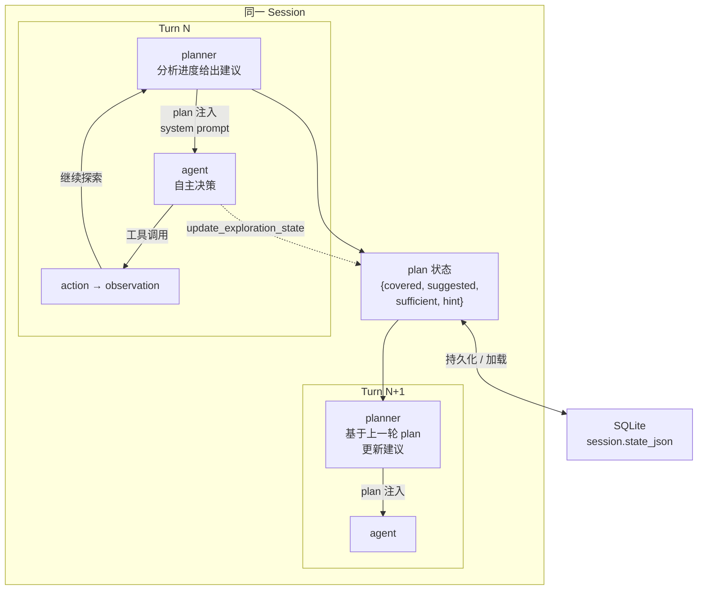

### 任务调度与节流机制

##### 模型路由与大/小模型池

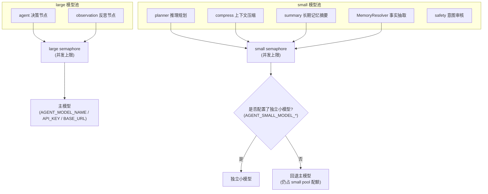

##### Redis多级队列调度

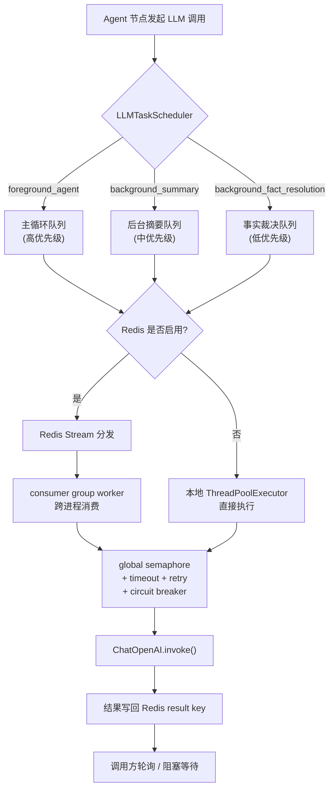

##### 节流机制

流式对话中每个 SSE token 都直接写入 Vue 响应式对象，触发完整响应链（`visibleMessages` 全量 reduce → 模板重渲染 → vdom diff → scroll 计算）。随会话消息累积（100+ 条），每秒 30~60 次的全量重算产生 ~3,000 个临时对象，GC 频繁停顿导致卡顿。

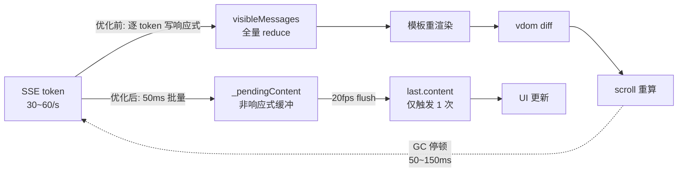

**_pendingContent**（`src/stores/chat.js`）：非响应式字符串缓冲，`updateStreamContent` 存入最新累积内容（0 次响应链触发），`flushStreamContent` 每 50ms 写入 `last.content`（1 次响应链触发），`forceFlushContent` 在流结束/中断/异常时立即清空缓冲防丢字。

| 指标 | 优化前 | 优化后 |
|---|---|
| 每次 token 响应链触发 | 1 次 | 0 次 |
| 每秒响应链触发（100 条消息） | ~30 次 | ~20 次 |
| 每秒临时对象 | ~3,000 | ~1,000 |
| 长对话滚动 | 频繁卡顿，无法滚动 | 平滑跟随 |

### 安全机制
##### 三层审核设计

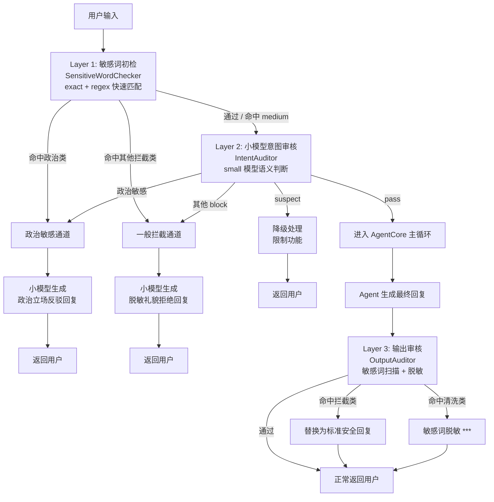


## 接口设计

本服务同时提供 **REST (FastAPI)** 和 **gRPC (protobuf)** 两套接口，二者功能完全等价、返回结构一致，可根据客户端需求任选其一。

> 约定：下表中参数字段名在 REST 和 gRPC 中相同；REST 使用 JSON body / query string，gRPC 使用对应的 proto message。

### 一、Session 管理

| 方法 | REST | gRPC | 功能 | 请求参数 | 返回结构 |
|------|------|------|------|----------|----------|
| ListSessions | `GET /sessions?user_id=` | `ListUserSessions` | 列出用户全部会话，按更新时间倒序 | `user_id` (string, 必填) | `[{session_id, user_id, session_name, created_at, updated_at}]` |
| CreateSession | `POST /sessions` | `CreateSession` | 创建新会话 | `user_id` (string, 必填), `session_name` (string, 可选) | `{session_id, user_id, session_name, created_at, updated_at}` |
| GetSession | `GET /sessions/{id}` | `GetSession` | 获取单个会话详情 | `session_id` (string, 必填) | `{session_id, user_id, session_name, created_at, updated_at}` |
| UpdateSessionName | `PUT /sessions/{id}/name` | `UpdateSessionName` | 重命名会话 | `session_id` (string, 必填), `session_name` (string, 必填) | `{session_id, user_id, session_name, created_at, updated_at}` |
| DeleteSession | `DELETE /sessions/{id}` | `DeleteSession` | 删除单个会话 | `session_id` (string, 必填) | `{ok, deleted_count}` |
| DeleteAllSessions | `DELETE /sessions?user_id=` | `DeleteAllSessions` | 清空用户全部会话 | `user_id` (string, 必填) | `{ok, deleted_count}` |

### 二、消息历史

| 方法 | REST | gRPC | 功能 | 请求参数 | 返回结构 |
|------|------|------|------|----------|----------|
| ListMessages | `GET /sessions/{id}/messages?user_id=&limit=` | `ListMessages` | 拉取会话历史消息 | `session_id` (string, 必填), `user_id` (string, 必填), `limit` (int, 默认 50) | `[{message_id, session_id, user_id, role, content, tool_calls, metadata, created_at}]` |

### 三、Agent 流式对话

| 方法 | REST | gRPC | 功能 | 请求参数 | 流事件字段 |
|------|------|------|------|----------|------------|
| StreamSessionPrompt | `GET /agent/stream?prompt=&user_id=&session_id=` | `StreamSessionPrompt` | 带 Session 上下文的 SSE 流式对话（长期记忆 + 知识库 + 持久化） | `prompt` (string, 必填), `user_id` (string, 必填), `session_id` (string, 必填) | `node, content, tool_calls, trace, model_name, type, context_messages, metadata, error, done` |
| StreamRun | `GET /agent/stream-run?prompt=&user_id=&session_id=` | `StreamRun` | 无状态 SSE 流式运行（无记忆/召回/持久化） | 同上 | 同上 |

> 流事件说明：
> - `type`: 普通 chunk 为空；`"system_prompt"` 时 `metadata` 含 RAG 指标；`"context_mirror"` 时 `context_messages` 含模型完整上下文
> - `done`: 流结束标志（REST 以 `data: [DONE]\n\n` 结束）
> - `error`: 仅在发生错误时非空，含友好错误描述

### 四、Agent 非流式调用

| 方法 | REST | gRPC | 功能 | 请求参数 | 返回结构 |
|------|------|------|------|----------|----------|
| RunSessionPrompt | `POST /agent/run` | `RunSessionPrompt` | 带 Session 上下文的单次运行 | `prompt` (string, 必填), `user_id` (string, 必填), `session_id` (string, 必填) | `{graph_diagram_path, graph_diagram, final_output, events}` |
| RunOnce | `POST /agent/run-once` | `RunOnce` | 无状态单次运行 | 同上 | 同上 |
| CancelSession | `POST /agent/cancel` | `CancelSession` | 取消正在执行的 Agent 图 | `session_id` (string, 必填) | `{ok}` |

### 五、观测

| 方法 | REST | gRPC | 功能 | 请求参数 | 返回结构 |
|------|------|------|------|----------|----------|
| GetEvents | `GET /agent/events?session_id=&user_id=` | `GetEvents` | 获取最近一次执行的 trace 事件列表 | `session_id` (string, 必填), `user_id` (string, 必填) | `{session_id, user_id, event_count, events: [{message_id, role, node, content, tool_calls, created_at, metadata}]}` |
| GetRecallDetails | `GET /agent/recall-details?session_id=&user_id=` | `GetRecallDetails` | 获取最近一次 RAG 召回快照（pre/post rerank） | 同上 | `{session_id, user_id, created_at, query, rag_metrics, memory_recall, knowledge_recall}` |

### 六、用户设置

| 方法 | REST | gRPC | 功能 | 请求参数 | 返回结构 |
|------|------|------|------|----------|----------|
| ListSystemPromptEntries | `GET /settings/system-prompt?user_id=` | `ListSystemPromptEntries` | 列出用户全部系统提示词条目 | `user_id` (string, 必填) | `{entries: [{prompt_id, content, created_at}]}` |
| AddSystemPromptEntry | `POST /settings/system-prompt/entries` | `AddSystemPromptEntry` | 添加一条系统提示词条目 | `user_id` (string, 必填), `content` (string, 必填) | `{prompt_id, content, created_at}` |
| DeleteSystemPromptEntry | `DELETE /settings/system-prompt/entries/{prompt_id}` | `DeleteSystemPromptEntry` | 删除指定提示词条目 | `prompt_id` (string, 必填) | `{ok, deleted_count}` |
| ListCustomMemories | `GET /settings/memories?user_id=` | `ListCustomMemories` | 列出用户全部自定义长期记忆 | `user_id` (string, 必填) | `[{memory_id, content, importance, created_at}]` |
| AddCustomMemory | `POST /settings/memories` | `AddCustomMemory` | 添加一条自定义长期记忆（自动向量化入库） | `user_id` (string, 必填), `content` (string, 必填), `importance` (float, 可选, 默认 0.5) | `{memory_id, content, importance, created_at}` |
| DeleteCustomMemory | `DELETE /settings/memories/{memory_id}` | `DeleteCustomMemory` | 删除指定自定义长期记忆 | `memory_id` (string, 必填) | `{ok, deleted_count}` |

> 系统提示词条目在每次 Agent 对话时自动全部加载并拼接到系统提示词末尾；自定义长期记忆通过向量检索在相关对话中自动召回。

