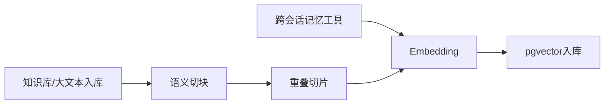

# Agent-Core-Service 智能体插件微服务  
## 产品定位  
##### 项目目标  
本项目的目标是设计一个独立于主要软件后台之外的,可定制可编排的通用智能体微服务Agent-Core-Service.  
##### 主要服务人群  
不是给用户设计的,而是为可以写代码且追求高度自定义智能体的,为了手搓智能体功能而焦头烂额的**开发者**准备.  
## 项目设计  
项目设计遵循分布式设计原则,形成可插拔可定制的独立微服务.  
各部分的设计如下:  
1. 智能体核心`AgentCore`设计: 采用ReAct思考模式,但不再硬编码节点流,而是达成可配置的节点流,可展示,可定制化.  
2. 节点设计: 除了提供项目自带的节点,还提供用户自己写节点的功能(继承节点父类),并提供用户节点配置持久化.  
    基础节点有以下几种:
    - 输入/输出节点  
    - 工具调用节点  
    - 安全审核节点  
    - 控制节点集,包含:  
       - 启动/终止节点  
       - 决策/汇合节点  
       - 推理规划节点  
       - 反思节点  
    - 记忆节点集,包含:  
       - 上下文压缩与事实持久化节点  
       - 跨会话记忆检索节点  
       - 知识库检索节点  
       - 摘要节点  
    3. 工具系统设计: 采用更独立的**MCP协议**接入用户可自定义的工具,除了系统自带的默认工具,还可以实现用户对工具的高度自定义化.  
3. 数据库设计: 必须按照分布式设计规范来制定,关联库PostgreSQL只存储智能体相关的内容,向量库采用pgvector.  
4. 服务间调用: 完全采用**gRPC协议**函数化接口,只暴露特定的对外接口,如智能体信息流,思考轨迹,数据库调用等.  
5. 配置管理: 配置一个`AgentConfig`类,含有`Constants`,`StorageConfig`,`ModelConfig`,`MemoryConfig`等子配置类,配置类应提供外部配置参数的接口`AgentConfig.load_config(...) -> AgentConfig`.   
    调用配置应该从`AgentCore`隐式使用`AgentConfig`规范为`agent = AgentCore(config=AgentConfig.load_config(...))`的显式调用.  
6. 可观测性: 配置一个前端,观测Agent在后台的一切行动,包括节点状态,上下文构建器的JSON,RAG召回的条目,召回筛选过程,会话摘要等. 配置完备的日志系统,所有的Agent行动也应该记录下来. 务必保证一切的信息传递过程的完全可视化.  
7. 输出可定制性: 可以根据实际业务定制所需的字段,甚至可以定制display模式来控制输出的字段.  
8. 记忆管理: 优化长短记忆的算法和机制.  
    - 短期记忆: 即会话内上下文管理,不超过上下文长度的直接追加到**上下文构建器**`ContextBuilder`,超过上下文长度的采用**滑动窗口+关键信息摘要**的方式压缩.  
    - 会话管理: 仍然采用Session会话管理机制.每次连续提问就从PostgreSQL中读取同ID会话并加载到上下文构建器.  
   - 长期记忆: 采用 RAG检索增强生成+pgvector向量库 作为长期记忆提取方式.   
      - 信息时效性: 为了保证信息时效性,每条记忆都要含有内容有效性时间戳字段(`created_at`,`updated_at`,`valid_from`,`valid_until`), 检索时采用**优先新内容, 旧内容降权, 过期内容直接过滤**的算法:  
         1. 过滤层: 过滤`valid_until`<`now`的过时信息.  
         2. 排序层: 相关性+时效性联合排序,公式:$$Score = 0.5 * relevance + 0.3 * freshness + 0.2 * authority$$  
       - 跨对话记忆: Tag为'`Memory`',每次发送prompt且内容有用时自动异步提取摘要,存储到用户会话向量库中.  
      - 知识库/大文本记忆: Tag为'`Knowledge`',需包含切片来源和时效性有关字段,本地知识库文件采用哈希锁来锁定文件已读性状态.  
      - 提高RAG召回率: 采用以下策略:  
         - 分块策略: 按照**语义切块**, 标题、段落、表格、列表分开处理.  
         - 切片策略: 采用**重叠切片**,512~1024个token一个chunk,重叠部分为128~256个token.  
         - 混合检索: 采用**多路召回**,RAG模糊检索与关键词检索并行,各取相关度最高的5条(默认),然后合并去重.  
         - 重排序: 引入**ReRank**模型,进行相关度精排序,对于混合检索得到的所有条目,取出时效性+相关性最高的3条(默认).  
        

   ```mermaid  
   flowchart LR  
	   A[长期记忆调用工具] --> B[pgvector检索]  
	   C[知识库检索工具] --> B 
	   B -->|N条| H[过滤过期记忆]
	   H -->|及时| D[混合检索,多路召回]  
	   D -->|10条| E[重排序]  
	   E -->|3条| F[召回]  
	   H -->|过时| G[去除]  
   ```      

##  技术栈  
- 版本:Python 3.12  
- 微服务框架:FastAPI+gRPC  
- 观测面板:Vue 3+ Pinia   
- 反向代理: Vite(开发阶段) / Nginx(生产阶段)  
- 智能体编排:LangGraph（可配置工作流 / 节点流转）  
- 模型接入:LangChain+OpenAI Compatible API  
- 工具协议:MCP  
- 关联数据库:PostgreSQL  
- 向量数据库:pgvector  
- 长期记忆方案:RAG（向量检索 + 关键词检索 + ReRank）  
- 配置管理:Pydantic/dataclass风格AgentConfig  
- 异步任务:asyncio  
- 日志与监控:logging/structlog+Prometheus+Grafana  
- 容器化部署:Docker+Docker Compose  
- 测试与质量:Pytest+Ruff+mypy