# MetaWeave 元织 - 个人多模态知识库Agent

## 产品定位

##### 项目目标

本项目是一个可观测、可溯源、建立在个人知识库上的多模态智能知识库`MetaWeave`(元织)。

##### 项目简介

MetaWeave 是一个面向复杂任务处理的智能 Agent 服务与可视化工作台，集成多轮对话、工具调用、长期记忆、知识库召回、RAG 指标观测、任务队列与多模式推理流程，支持在 simple、react、plan 等不同思考模式下完成问答、检索、文档理解和自动化执行，并通过前端观测面板实时展示模型用量、节点耗时、召回质量与执行轨迹，帮助用户更清晰地理解 Agent 的决策过程与运行状态。

##### 主要服务人群

- 希望在个人文件系统上建立Agent中枢的智能知识库的人.
- 追求高度自定义智能体、希望自己搭建智能体能力的开发者。
- 希望快速使用Agent接口,而不希望手动搭建复杂智能体思考链的人.

##### 项目小心得
做了agent之后发现,用agent骨架是无法弥补LLM自己的幻觉能力的,LLM往往会基于自己的认知就认为这个东西怎么怎么样,而懒得去搜.幻觉和迷之自信是LLM与生俱来的,外部Agent框架只会提供给LLM知识的能力,而不能本质上改变LLM的底层认知.

## 快速启动

### 环境要求

* Python 3.12+
* Node.js 18+
* 已配置 LLM API（OpenAI 兼容接口）

### 1. 配置环境变量

在根目录创建.env文件,配置如下环境变量：

```bash
# 必填：大小模型API-KEY,主模型默认为deepseek-v4-flash,小模型默认为moonshot-v1-8k
AGENT_MODEL_API_KEY=sk-xxxxxxxx
AGENT_SMALL_MODEL_API_KEY=sk-yyyyyyyy
```

### 2. 启动后端（FastAPI）

```bash
# 安装后端依赖
pip install -r agent_service/requirements.txt

# 启动服务（HTTP: 8002, gRPC: 50051）
uvicorn main:app --host 0.0.0.0 --port 8002
```
后端默认将项目目录下的`resources/knowledge/`作为知识库根目录,用户可在前端自行重新选择知识库目录,更换知识库时库内将进行多模态文档扫描,进入向量数据库供Agent使用. 服务启动不执行任何自动灌库,知识库由前端 `/knowledge/rebuild`、单文件灌库与上传灌库按需触发,启动阶段不占用 embedding/rerank 与磁盘资源.

### 3. 启动前端（Electron + Vite + Vue 3）

##### 编辑器(Editor)--主要关注知识库与图谱的可视化
```bash
cd editor
npm i --verbose
npm run dev:electron # 开发模式 → http://localhost:5173
```

### 4. 验证

编辑器: `npm run dev:electron`时Electron自动打开浏览器内核窗口.或者在浏览器中访问 `http://localhost:5173`,但浏览器模式下可能某些文件服务不兼容.

后端健康检查：`curl http://localhost:8002/health`

### 5. 必要设置

1. **务必在editor客户端的设置中配置大小模型的api-key,api-name,api-url**,大模型默认为`deepseek-v4-flash`(`https://api.deepseek.com`),小模型默认为`Moonshot-v1-8k`(`https://api.moonshot.cn/v1`).
    **未配置模型字段时无法使用Agent功能**.
2. 如果需要启用联网搜索引擎,则需要在设置中配置好代理地址(如:`http://127.0.0.1:11719`),因为DuckDuckGo需要连接外网才能正常使用,否则即使启用了联网引擎也无法使用联网.

## 构建

### 前端 — 静态 HTML
##### 编辑器(Editor)
```bash
cd editor
npm i --verbose
npm run build:electron # 输出 → editor/dist/
```

### 后端 — 单文件 exe

```bash
# 安装 PyInstaller
pip install pyinstaller
# 安装后端依赖
pip install -r agent_service/requirements.txt
# 打包（读取 AgentService.spec）
pyinstaller AgentService.spec
```

产物为 `dist/AgentService.exe`。`.spec` 配置将 `editor/dist/`（前端静态资源）和 `resources/`（知识库、MCP 配置、安全词库）一并打包进 exe。

### 部署结构

首次启动自动生成空 `resources/` 和 `runtime/` 目录骨架:

```
AgentService.exe
├── resources/           # 自动生成空目录,放入文件即可覆盖 exe 内置默认
│   ├── knowledge/       # 默认知识库,启动不自动灌库,按需触发
│   ├── mcp/             # 放 .json MCP 服务器配置,重启自动加载
│   └── safety/          # 放 sensitive_words.json,覆盖内置安全词库
└── runtime/             # 自动生成: db/ models/ frontmatter/ logs/
```

> **读取规则**: 外置目录有文件则用外置,外置为空则回退到 exe 内置副本。按需在外置目录增删文件即生效,无需重新打包。

### 单 exe 运行

双击启动或命令行:

```bash
AgentService.exe
```

启动时自动启动默认浏览器访问 `http://localhost:8002`，后端同时提供 API 和前端界面。`runtime/` 和 `resources/` 目录和 `.env` 空文件首次启动自动生成。
首次启动时无法使用.需要在`.env`里面配置大小模型API-KEY,然后才能启动exe.

## 技术与要求


### 技术栈

* 版本：Python 3.12
* 微服务框架：FastAPI
* 通信与工具协议: gRPC + REST/HTTP + MCP
* 观测面板：Vue 3 + Pinia + TypeScript/JavaScript
* 知识图谱：D3.js + Canvas
* 文档编辑器: Vditor(Markdown格式) + CodeEditor(代码格式)
* 反向代理：Vite
* 智能体编排：LangGraph + LangChain
* 模型接入：DeepSeek-v4-flash(大模型) + Moonshot-v1-8k(小模型)
* 关联数据库：SQLite
* 向量数据库：ChromaDB
* 长期记忆方案：RAG（向量检索 + 关键词检索 + ReRank）
* 配置管理：Pydantic / dataclass 风格 AgentConfig
* 异步任务：asyncio
* 知识库文件监听: watchdog
* 联网搜索引擎: DuckDuckGo + ddgs
* OCR引擎: PaddleOCR
* 日志与监控：logging / structlog + Prometheus + Grafana
* 测试与质量：Pytest + Ruff + mypy

## 功能与设计

后端服务设计遵循分布式设计原则，配备 REST + gRPC 两套对外接口,形成可插拔、可定制的独立微服务。

### Agent设计
#### 智能体状态转移设计
在LangGraph状态转移图入口处有一个入口节点,调用一次小模型,按照用户提问内容区分三种模式的入口,用户在同一session前后提出简单和困难的问题时,会以小模型决策以下三种图的模式:
      1. 简答模式: 对于明显不需要思考的短输入,不经过循环,只保留 RAG 上下文构建,用小模型直接输出.
      2. ReAct模式: 不经过`planner`节点和`observation`节点,标准的ReAct图.agent节点同时充当观察者和决策者,一个循环只需要调用一次LLM.
      3. 深度思考模式(Plan-and-Execute模式): 经过规划-执行-观察的循环,一个循环会调用2~3次LLM,适合长时间思考.
   auto模式会先调用小模型路由器输出`simple/react/plan`,显式选择模式时不经过路由器;当小模型认为自己能力不足、不确定能否可靠回答、需要事实核验或外部信息时,至少进入`react`,不能选择`simple`;当小模型不可用或输出无法解析时,才回退到本地保守规则.
   前端提供 `auto`/`simple`/`react`/`plan` 思考模式切换,Agent 观测面板状态图按实际执行模式切换.
#### 节点设计
节点有以下几种：
   * 启动/终止节点 `START`/`END`
   * 决策/汇合节点 `agent`
   * 工具调用节点 `action`
     * 跨会话记忆检索
     * 上下文压缩与事实持久化
     * 知识库检索
     * 其他内置工具
     * MCP外部工具
   * 安全审核节点（输入/输出两阶段）,包括:
     * 输入安全审核（入口）`safety_input` 
     * 输出安全审核（出口）`safety_output` 
   * 推理规划节点 `planner` : 具备全局规划思想,拆解问题, 跨轮保持计划 + sub_question 状态机 + 绕圈检测,成为agent执行节点的"调度者".
   * 反思节点 `observation`: 根据观察选择路径,可选性的规划而不是每次都进入planner节点. 产出四种状态.
      首次: planner（拆解问题，出 sub_questions）
      agent → action → observation（精炼结果 + 提取事实 + 判方向）
      │ 针对observation的不同输出
      ├─ [continue] → planner（更新计划）→ agent（继续）
      ├─ [answer]   → agent（出最终回复）
      ├─ [retry]    → agent（换参数重试同一工具）
      └─ [abandon]  → agent（承认查不到，给出已有信息）
   * 摘要节点 `summary`
   * 上下文压缩节点 `compress`
#### 工具系统设计
采用 **Function Calling** 模式，对接 **MCP 协议** 接入外部工具。系统自带默认工具,包括记忆召回,知识库检索,规则创建,文件操作,联网搜索等。
   * 注册与执行架构：工具注册器`ToolRegistry` 维护 `工具名 → 工具功能` 映射，支持 JSON Schema 参数校验并自动转换为工具体；工具执行器`ToolExecutor` 负责运行时调度，通过 `get_tool_runtime()` 注入当前用户/会话上下文，确保跨用户隔离与工具函数无状态复用。
   * 工具可开关: 用户可在设置中对Agent可使用的工具进行开关,或者直接在Agent观测页面的工具注册表进行工具开关.
   * 工具全量绑定: 每轮决策直接绑定当前已启用的全部工具(已剔除用户禁用工具),任意工具随时可直接调用,无需在正文中点名或等待下一轮放开,避免多轮长任务因工具缺失或等待绑定导致可用性下降.
   * 工具自发现: 常驻"查看可用工具"工具(`list_available_tools`),任何时候都可查询全部工具的中文名、确切工具名与一句话用途(含 MCP 工具),便于模型快速掌握当前可用工具的完整面貌.
   * 可观测性执行流程：每步工具调用逐一执行，产生 start 与 end 双向 trace（含工具名、参数摘要、结果摘要与条目数），通过异步回调实时推送前端观测面板, 工具调用结果则写回消息历史供后续观察节点 `observation`/`agent` 审视，形成完整的可追溯闭合回路。
    Agent可操作用户本地知识库文件.Agent既可以通过RAG获取用户指代的最相关文件,又可以通过通过文件管理系统API具体调查和操作任何所需的具体文档,实现了"中枢智能体"的理念.
#### Skill能力

Skill能力是Agent从通用Agent走向专用Agent的关键。其设计如下：

- 所有的内置Skill默认统一存放在根目录的`resources/skills/`文件夹中，用户级Skill放在用户知识库目录下的`.agents/skills/`文件夹中。
- 统一兼容[OpenAI开放标准](https://developers.openai.com/api/docs/guides/tools-skills)作为主标准，兼容[Anthropic标准](https://platform.claude.com/docs/en/agents-and-tools/agent-skills/overview)扩展字段。
- 目录结构：
  ```text
  skill-name/
    SKILL.md (必须有）
    scripts/ （可选）
    references/ （可选）
    assets/ （可选）
  ```
- 用户级Skill按用户知识库隔离，**用户登录或知识库目录变更时**扫描Skill目录，读取元信息，建立索引。索引只作为本地路由数据使用，不把所有已启用Skill的索引信息全量注入主模型上下文。
- 对于非Simple思考模式下的每次用户输入，Agent决策前先进行本地候选召回：基于Skill的`name`、`description`、`keywords`、`triggers`等元信息做关键词/BM25式粗筛，只保留少量候选（默认不超过20个）交给`Skill路由器`。`Skill路由器`调用小模型从候选中返回针对当前询问场景适合的3个Skill；小模型不可用或返回异常时，使用本地候选分数兜底。随后只将命中的Skill正文（`SKILL.md`）注入本轮运行上下文（用户下一轮询问后从上下文中去除），Skill正文默认只对当前轮生效，下一轮重新路由。
- 主模型上下文只允许看到本轮候选Skill的简短摘要和已路由Skill的正文，不允许看到全量Skill注册表。用户级Skill正文按用户上下文注入，不能提升为不可覆盖的系统级规则。
- 配备有2个Agent工具：列出所有Skill；使用Skill（主动召唤`SKILL.md`正文）。

#### 可观测性
##### 对话内观测
Agent对话框分为"对话模式"和"工具模式":
  - 对话模式: agent思考过程默认折叠,被归类为"深度思考",处理后最终得到统一输出.
  - 工具模式: 显性展示模型思考过程和工具调用过程.
##### 观测面板
Agent观测面板实时展示 Agent 行动轨迹，包括节点状态、上下文构建器、RAG 召回条目、召回筛选过程、会话摘要等。日志系统记录全部 Agent 行动，信息传递过程完全可视化。观测面板不重新推理业务结果，而是从会话消息、系统上下文快照、工具轨迹与模型返回元数据中派生统计值；统计口径按会话累计，同一 session 内不会因为图循环或单个节点结束而清零。
  * 数据采集流程：后端在每个节点执行时记录轨迹。模型节点记录真实 token 用量，工具节点记录开始、结束、参数摘要、结果摘要、结果条数与耗时；RAG 上下文构建器记录自动召回的指标和召回明细。前端观测层只做归并、过滤和累计，不二次生成业务结论。
  * RAG 三率：统计来源包括两类，一类是上下文自动召回，另一类是知识库工具返回的召回条目。每次召回形成一个样本点，会话级指标取累计均值：$$FillRate_t=\frac{1}{t}\sum_{i=1}^{t} fill_i,\quad AvgRelevance_t=\frac{1}{t}\sum_{i=1}^{t} relevance_i,\quad Confidence_t=\frac{1}{t}\sum_{i=1}^{t} confidence_i$$ 知识库工具召回没有显式分数时用 0 作为相关性兜底；填充率按返回条数与请求上限估算，平均相关性取各召回条目重排序分数的均值。请求上限在各通道检索时记录（$memory\\_limit$ + $knowledge\\_limit$），而非硬编码 $top\\_k \\times 2$：$$fill_i=\min(\frac{memory\\_count_i + knowledge\\_count_i}{memory\\_limit_i + knowledge\\_limit_i}\times100,100),\quad relevance_i=\frac{1}{n}\sum_{j=1}^{n} final\\_score_j\times100$$ 上下文自动召回时 $final\\_score_j$ 为 ReRank 精排结果；工具召回时从返回文本中尝试提取重排序分数，提取失败则兜底为 $0$。
  * Token 用量：只统计真实模型调用返回的 token 用量，不按文本长度估算，也不把工具执行、安全审核等运行时节点计入模型用量。模型节点按池归并为大模型和小模型：$$TokenPool_t(p)=\sum_{i=1}^{t}\sum_{调用\in p} tokens(调用)$$ 其中 $p\in\{大模型,小模型\}$，前端图表只展示“大模型 / 小模型”两类。
  * 思考耗时：优先使用节点记录的真实耗时；缺失时才回退到相邻轨迹时间戳或消息时间差估计。每轮耗时为该轮节点耗时之和：$$Latency_k=\sum_{节点\in 第k轮} duration(节点)$$ 折线图展示累计耗时：$$CumulativeLatency_t=\sum_{k=1}^{t}Latency_k$$ 节点饼图和柱状图展示截至当前轮次的累计节点占比：$$Share_t(节点)=\frac{\sum_{k=1}^{t}duration_k(节点)}{\sum_{k=1}^{t}\sum_{n}duration_k(n)}\times100$$
  * 召回条目与上下文：长期记忆召回、知识库片段召回和上下文拼装视图都按当前会话累计展示，自动召回与工具召回分别保留来源、分数、重排序前后状态和引用映射，便于追溯最终回答引用了哪些材料。
#### 记忆系统
##### 短期记忆
即会话内上下文管理.
* 不超过上下文长度的直接追加到上下文，超过最大上下文阈值时会先进入 `compress` 节点,用小模型生成“重要事实摘要”,再把工作上下文重写为 `重要事实摘要 + 最近少量消息`。
* 上下文拼装优先级为 `短期历史消息 -> 压缩摘要 -> 历史摘要/事实 -> 外部知识库片段`，避免知识库内容覆盖用户刚刚明确给出的事实。
###### 上下文压缩机制

上下文压缩用于解决会话越聊越长的问题。Agent 每次进入模型决策前都会估算当前消息长度，低于阈值时继续使用原上下文，超过阈值时才进入压缩流程。

压缩流程会把较早的对话整理成一段重要事实摘要，再保留最近几条消息。摘要负责保留已经形成的事实，最近消息负责保留当前正在执行的动作。
压缩摘要会写入长期记忆，后续对话仍可通过语义召回重新取回。也就是说，被压缩掉的旧消息不会继续原样留在短期上下文里，但其中的重要事实会进入可检索的记忆层。

压缩节点只处理消息上下文。它不会修改任务列表、planner 状态或其他会话级执行状态，避免上下文整理影响 Agent 的长期任务进度。

###### 任务列表

任务列表用于管理复杂任务的长期进度。它属于当前会话，会跨消息保留，直到 Agent 主动结束任务列表。它独立于旧 TODO 体系，状态由专门的任务列表服务读写。

任务列表有三个核心动作：创建列表、完成列表项、结束列表。创建后，系统会记录每个列表项的 ID，并标记当前正在处理的一项。Agent 完成某一项后必须写入完成概要，然后才能继续处理下一项。

每轮 Agent 启动时，后端都会把当前任务列表写入系统提示词。模型能看到列表状态、当前项、已完成项和完成概要，因此后续回复会继续围绕这份任务列表推进。只要任务列表存在，Agent 会进入具备工具调用能力的执行路径，避免长程任务被简单问答流程截断。

前端右侧栏只展示任务列表状态。Agent 工具更新任务列表后，后端通过流式事件把新状态推给前端，前端收到后自动勾选完成项并显示概要。工具不直接操作界面，界面只根据后端状态渲染。

任务列表和上下文压缩相互隔离。旧消息被压缩后，任务列表仍会保留当前项、完成概要和完成状态，Agent 下一轮仍能从会话状态中恢复任务进度。

###### TODO/待办系统

TODO 系统用于管理用户侧的独立待办事项，与 Agent 会话内的任务列表分离。普通待办用于记录人工事项；自动化任务是 TODO 的特殊分类，用于把一段 Agent 指令绑定到指定时间或循环计划上。

自动化任务创建后会同时生成一条关联 TODO，并把自动化定义持久化到 SQLite。定义内容包括任务提示词、下一次运行时间、时区、循环规则、权限模式、启用状态和最近运行结果。前端 TODO 侧边栏会展示自动化任务及其下一次运行时间。

后端启动时会创建自动化调度器。调度器定期扫描已启用且到期的自动化任务，通过数据库租约抢占任务，避免同一任务被重复执行。到点后，调度器会创建独立 Agent 会话，把自动化任务保存的提示词交给 Agent 执行，并记录本次运行的成功、失败、输出或错误。

自动化任务支持单次、每日、每周和每月循环。循环任务执行完成后会按任务时区计算并写入下一次运行时间；单次任务执行后不再安排下一次。当前实现会更新自动化运行记录和下一次运行时间，但不会把关联 TODO 自动勾选完成，也不会主动向前端推送实时刷新；前端需要重新拉取后才能看到最新状态。

Agent 也可以通过 `add_automation` 工具创建自动化任务。适合的场景包括定时提醒、周期性整理、按计划执行代码库维护命令等。涉及文件写入、提交、删除或联网操作的任务必须选择匹配的权限模式，否则到点执行时可能因权限不足或需要用户确认而中断。


##### 长期记忆/语义召回
采用 **RAG 检索增强生成**作为提取方式。底层数据分为以下类型：
- `会话摘要(session_summary)`：每轮异步摘要，记录对话要点。
- `会话事实(session_fact)`：从摘要中提取的结构化事实单元，由 MemoryResolver 裁决并维护 active/superseded/expired 状态。
- `重要事实摘要(important_fact_summary)`：ContextBuilder 内 compress 节点生成的跨会话重要事实。
- `知识切片(knowledge_chunk)`：知识库文件的语义切片。
- `自定义记忆(user_custom)`：用户手动写入的自定义记忆。
- `用户规则(user_rule)`：用户自定义的长期规则，不经过 RAG 检索，以系统提示词形式直接注入。

##### 长期记忆/语义召回管线完整流程

1. **向量召回** — 使用 ChromaDB 余弦距离检索，`vector_score = clamp(1.0 - distance)`。若 ChromaDB 不可用或返回零得分，回退到 SQLite 内嵌 JSON 向量的余弦相似度（归一化到 [0,1]）。

2. **关键词召回** — 从 query 提取英文 token + 中文 2~4 字子串，过停用词后以 SQL ILIKE 预筛出候选 doc，再用 Python 覆盖率 + 词频加权打分：每个词按长度加权（`weight = min(max(len, 2), 6) / 6`），出现次数加成（`+ min(occ-1, 2) * 0.08 * weight`），最终 `keyword_score = coverage_score + phrase_bonus`（phrase_bonus 为 `min(matched_terms, 4) * 0.03`）。

3. **合并去重** — 以 `memory_id` 为 key 去重。两路都命中的候选：`merged_score = 0.6 × max(v, k) + 0.4 × avg(v, k) + 0.05`（通道奖励）；仅一路命中：`merged_score = max(v, k)`。

4. **CrossEncoder ReRank** — 使用本地 CrossEncoder 模型 `BAAI/bge-reranker-v2-m3` 对 `(query, document)` 对做语义精排，原始 logit 通过 sigmoid 归一化到 [0,1]。未配置 ReRank 模型时回退到 merged_score + 通道数 + importance 排序。

5. **最终联合评分** — 对 ReRank 后的每条结果计算三维分数：
   $$
   relevance\_score = \max(rerank\_score, merged\_score)
   $$
   $$
   freshness\_score = \frac{1}{1 + age\_days / 30}
   $$
   $$
   final\_score = 0.5 \times relevance + 0.3 \times freshness + 0.2 \times authority
   $$
   权重来自配置项 `relevance_weight=0.5, freshness_weight=0.3, authority_weight=0.2`。

6. **阈值过滤** — `final_score < score_threshold` 的直接丢弃。阈值可配置，默认约 0.3。

7. **最终排序** — **以 `updated_at DESC（最新优先）为首要维度**，同等新度下按 `final_score DESC` → `current_session_match DESC` → `relevance DESC` → `importance DESC` 排列。理由是 score_threshold 已经过滤了无关内容，候选集内越新的信息越可能反映当前事实，而非 pure relevance。

8. **四层合并 & topK 截断** — `会话事实` / `重要事实摘要` / `会话摘要` / `自定义记忆` 四路记忆按 `memory_type` 独立执行上述 1~7 步，各自返回 topK（`rerank_top_k`，默认 5），再跨类型合并去重，按 final_score 截断总条数上限，最终注入系统提示词的检索上下文。

##### 信息时效性
每条记忆携带 `created_at` / `updated_at` / `valid_from` / `valid_until` 时间戳，以及 `fact_status: active | superseded | expired`。检索时在过滤层先排除 `expired` 和 `superseded` 条目；排序层内优先召回新内容。事实更新策略：
- 单值强排他事实：新值覆盖旧值，旧事实标记 superseded。
- 多值弱排他事实：新值追加并去重。
- 时序事实：到期自动失效，标记 expired。
- 程序定义事实（如项目规则配置）：以规则为准，LLM 的输出仅作为全新事实的补充。

#### 安全审核机制
采用**三层递进式**安全防线,在 Agent 输入和输出两个位置执行审核,阻断风险请求并清洗敏感输出。
    * 输入审核范围：`safety_input`只审核用户真实问题本身。当前端或`ContextBuilder`把“引用文档片段 + 用户问题”组合成一条`HumanMessage`时,安全审核会先抽取`用户问题:`之后的真实 prompt,不会把引用材料正文当作用户意图来拦截。这样总结、阅读、分析知识库文件时,文档正文中的敏感词不会误伤正常文件问答;如果用户问题本身命中风险规则,仍然会正常拦截。
    * 第一层 — **敏感词初检**：
        在请求进入 Agent 主循环前,使用分类词库（`resources/safety/sensitive_words.json`）执行快速的"精确匹配 + 正则匹配"。
       词库按 `政治危险/色情/暴力/非法/垃圾广告/提示词注入/数据窃取` 七大类分组,
       每类标记风险等级（high/medium/low）, high 级别命中直接拦截,medium 级别交由第二层进一步判断。
    * 第二层 — **小模型意图审核**：
       敏感词初检通过后,使用小模型对用户意图做语义级安全判断, 审核维度包括：恶意攻击（越狱/注入）、非法请求、信息窃取、骚扰滥用、正常请求。输出 `pass / block / suspect` 三态裁决。
    * 第三层 — **输出审核**：
       在 Agent 生成最终回复后、返回用户前,对输出内容执行敏感词扫描。命中拦截类敏感词（政治/色情/暴力/违法）直接替换为标准安全回复;
       命中清洗类敏感词（广告/Prompt注入/数据窃取）执行脱敏替换（`***`）。
    * 拦截回复差异化生成：
       被拦截的用户请求根据拦截类型调用**小模型**生成两类差异化回复：
           * 政治敏感：命中"政治危险"分类或意图审核判定"政治敏感" → 小模型生成"立场正确的反驳性回复"（如"这种说法是完全错误的。中国共产党始终坚持……"）。(先有意识形态,再有意识这一块)
           * 一般拦截：色情/暴力/违法/注入/广告等其他类别 → 小模型生成脱敏的礼貌拒绝（如"对不起,我不能回答这个问题,因为`[脱敏理由]`。如需其他帮助请随时告诉我。"）。
       两项回复均有对应的内置系统提示词,经小模型生成最终回答;小模型不可用时回退到静态后备文案。
用户可自行设置是否开启敏感词初检,或者自行设置是否开启安全审核总开关.
#### 终端沙盒

Agent 通过内置工具 `run_terminal_command` 获得非交互式终端能力。该工具不接受整条 shell 字符串,必须传入结构化参数: `shell`、`cwd`、`segments`。`segments` 分为两类:

- `internal_command`: 由后端直接实现,不经过系统 shell。读取类包括 `pwd`、`ls/dir`（支持 `-R`/`/s` 递归和 `*.docx` glob 通配符）、`cat/type`、`head`、`tail`、`stat`、`wc`（支持 `-l`/`-w`/`-c` 标志和多文件）;写入类包括 `write`、`append`、`touch`、`mkdir`（自动 `-p`）、`rm/del`、`mv/move`。所有内部命令已移除单文件/单路径限制,支持多参数批量操作。
- `external_program`: 通过 `subprocess.run(..., shell=False)` 执行。受权限模式控制:沙盒模式下走白名单+安全参数校验;完全访问模式下跳过白名单,仅拦截嵌套 shell（`cmd`/`powershell`/`bash`/`sh`/`wt`）和 `python -c`、`node -e`、包安装、`git push` 等高风险入口。

终端权限和文件工具权限分开控制:终端权限调控内部读写指令、外部程序和路径边界;文件工具只操作当前知识库,只读模式会拒绝写文件、删除、重命名、建目录、保存附件和重建知识库等写操作。

| 权限 | 终端读 | 终端写 | 终端外部程序 | 文件工具读 | 文件工具写 |
|---|---|---|---|---|---|
| 只读 | 全目录可读 | 禁止 | 禁止 | 知识库内可读 | 禁止 |
| 沙盒 | 全目录可读 | 仅终端工作区内 | 仅终端工作区内，且白名单/安全参数 | 知识库内可读 | 知识库内可写 |
| 完全访问 | 全目录可读 | 全目录可写 | 全目录可用，跳过白名单，仅拦截嵌套 shell 等高风险入口 | 知识库内可读 | 知识库内可写 |
#### 可定制性
* 用户自定义长期记忆:用户可以管理长期记忆,可以增加新的自定义长期记忆注入到向量库,或者删除长期记忆.
* 用户自定义系统提示词:用户可编辑"用户设置系统提示词",追加到原本的系统提示词中.

#### 引用溯源
**引用溯源**只展示最终回答真正使用的来源,而不是把所有召回结果都挂在气泡下面。自动RAG召回的长期记忆使用数字编号,如`[1]`、`[2]`;Agent主动调用知识库工具得到的结果使用工具编号,如`[K1]`、`[K2]`;联网搜索得到的网页来源使用网络编号,如`[N1]`、`[N2]`;用户上传文件的引用则使用上传编号,如`[A1]`、`[A2]`.
一轮对话开始时,`ContextBuilder`会把自动RAG召回结果写入系统上下文,同时生成本轮初始`citation_map`。这些自动来源来自长期记忆(session_fact/session_summary/user_custom),适合在模型直接使用预检索片段时标注。Agent如果继续主动调用`get_knowledge_context`、`search_knowledge`、`read_knowledge_file`或`read_multimodal_file_info`,工具运行时会通过`register_tool_citation()`把工具来源登记进同一个`citation_map`,并在工具返回文本中显式携带`Citation ID: [Kx]`或`[Kx]`提示模型引用. Agent调用`web_search`时,搜索结果会通过`register_network_citation()`登记为`[N1]`、`[N2]`这类网络来源,`source_uri`保存网页URL,`title/content/source=network`写入同一个`citation_map`.
工具来源分两类处理:`get_knowledge_context`、`read_knowledge_file`和`read_multimodal_file_info`属于明确读取/提供正文内容的来源,会标记为`adopted_by_default`;`search_knowledge`返回的是搜索候选列表,不会默认视为已采纳来源。联网搜索结果同样不会默认采纳,只有最终回答正文里真正使用并标注了对应`[N1]`/`[N2]`的网页,才会进入本条消息的`used_citations`和气泡下方来源列表。这样模型漏写引用时,系统只会兜底处理已经被明确读入的本地文档,不会把搜索命中的全部候选或联网结果都挂到气泡下面.
模型生成最终回答时应在具体断言、文档行、主题行或联网事实句末尾标注对应来源,例如`01_climate_change_nasa.md ... [K2]`或`某网页报道了最新更新 ... [N1]`。后端会先清理正文中无法映射到本轮`citation_map`的伪引用,再扫描正文中实际出现的`[1]`/`[K1]`/`[N1]`锚点,只保留这些锚点对应的来源。如果模型完全漏写或漏写部分工具引用,后端只做保守的行级补锚点:根据文件名、去扩展名后的文件名或文档标题匹配回答中的具体行,匹配成功才把对应`[Kx]`补到该行末尾;匹配不到时不会在末尾硬塞一串来源,避免制造假的精确溯源. 网络来源不会被自动补锚点,必须由模型在使用网页事实的位置显式写出`[N#]`.
最终保存消息时,assistant消息自己的`metadata.used_citations`记录本条回答实际采用的编号,`metadata.citation_map`只保存这些编号对应的`source_uri/content/source/title`等来源信息。前端渲染时优先读取当前消息自己的metadata:正文里的`[1]`/`[K1]`会跳转本地知识库文件,`[N1]`会使用默认浏览器打开对应网页URL;气泡下方的来源列表也只显示这些实际被引用的文档或网页,并显示真实 citation id。历史消息依赖自己的metadata复现来源,不会复用当前轮的全局召回结果.

#### 多Agent能力
Agent可以召唤子Agent,采用父子Agent设计模式.
  - 子 Agent 由主Agent启动，主Agent送给子Agent一个"子任务合同"(你是谁、要做什么、能用什么、不能做什么、最后交付什么),子Agent完成任务后,任务结果进入主Agent的消息队列(内存queue).子Agent的生命周期:
  ```     
      created → running → completed
                 ↘ failed
                 ↘ stopped
  ```
  - 子Agent分为Plan/agent/Explore三种类型.
  - 子Agent在独立于父Agent的线程中进行,拥有独立的上下文.
  - 子Agent默认可以继承主Agent的全部工具,但是主Agent拥有对子Agent可用工具的配给权以及三种沙盒权限的控制权.**主Agent 不能授予自己没有的能力**。
  - 子Agent分为前台和后台两种模式(子Agent的目标,工具与权限,前后台,工作状态和结果都需要在前端展示,但过程不必显示在前端):
    - 前台子Agent(同步阻塞): 前台子Agent阻塞主Agent,主Agent在等待子Agent的工作结果完成之前一直等待.适合任务有前后依赖的情形.
    - 后台子Agent(异步蜂群): 后台子Agent不阻塞主Agent,主Agent可以召唤多个后台子Agent并行做事,且在此期间主Agent可以继续做其他事情.主Agent可以查看后台任务("显式汇合",主Agent可以等子Agent)，也可以停止子Agent,子Agent收到父Agent的信号(终止/者信息调整)后做出响应(立即终止/将信息注入上下文).
  - 子Agent不能召唤其他子Agent.
  - 角色与身份:召唤时可在 `agent`(全能执行)、`explore`(只读探索)、`plan`(只读规划研究)三类预置角色中选择,系统以"【角色设定】"注入子Agent提示词开头,也可以传入自定义角色描述按原样注入。主Agent可以为子Agent起名,不命名时按同类别的已有数量自动生成递增名(plan1/plan2/agent1);每个子Agent按运行ID稳定分配一个头像,整个会话期间保持不变,方便持续追踪同一任务。
  - 后台显式汇合:主Agent召唤后台子Agent后,可以反复调用"等待子Agent"工具逐个收取结果。该工具一次返回一个子Agent的终态结果,可以指定只等待某些子Agent,也可以等待全部;结果队列有货时立即返回,没有则阻塞到下一个结果或超时。只要还有子Agent处于 created/running,主Agent会继续等待,直到全部进入终态才汇总最终回答。
  - 实时可见:子Agent的创建、开始、完成、失败、停止、上下文更新等生命周期事件实时推送到主Agent对话流,对话区渲染为可展开的事件条,左侧圆点颜色表示当前状态,展开可查看目标、权限、工具范围、阶段摘要、产出结果和错误信息。侧边栏把同一目标的多次召唤合并成一张任务卡片,显示头像、名字、类别、前后台和状态,展开可查看每次运行的详细记录,运行中的子Agent可直接点击停止。后台子Agent在主Agent流结束后才完成时,系统会自动补一条完成事件条提醒,这一机制称为唤醒;已在流内实时推送过的终态事件不会再次提醒,避免重复记录。
  - 权限与隔离:子Agent的沙盒权限不能高于父Agent,可用工具取"父Agent授权的工具"与"父Agent自身工具"的交集,主Agent无法授予自己没有的能力。主Agent可停止子Agent,子Agent在协作式安全检查点响应停止信号立即终止,也可以向运行中的子Agent注入上下文更新,后者在下一个检查点读取。后台子Agent在线程池中并行执行互不阻塞,各会话的结果与事件队列相互隔离。
### 软件设计
#### 数据库设计
##### 关联库
关联库采用 SQLite 存储智能体会话(`session`)与消息(`message`)，每次对话从关联库加载完整会话上下文, 实现多轮对话管理；
##### 向量库
向量库采用 ChromaDB，多模态文件经格式解析与元数据提取后统一转为结构化 JSON，再按语义切片写入向量库，检索时通过混合检索（向量相似度 + 关键词覆盖）与 ReRank 重排序实现精准召回，每个切片携带源文件路径与偏移信息可追溯至原始文档.
   - 已入库的文件,未入库或者格式不可识别的文件,屏蔽的文件,三类文件将以不同的索引状态图标(绿,红,灰)显示在文件树中.
   - 惰性灌库: 默认在文件入库时不自动灌库,用户可手动将单文件灌入向量库,或点击header的灌库按钮时进行全知识库范围内的灌库.
   - 屏蔽单个文件/建立屏蔽区: 用户可设置部分文件或者文件夹内文件的屏蔽,被屏蔽的文件将禁止入库,入了也要出库,文档被写入屏蔽区之后也会将以之为来源的切片删除.灌库函数自动忽略屏蔽的文档和屏蔽区子树全部文档.
#### 文件入库全流程
##### 第一步: 多模态扫描
系统会扫描知识库中的多模态文件,并将不同模态文件以不同方式转化为JSON(不同知识库隔离存入`runtime/frontmatter/{user_id}/{library_id}/`),切片入ChromaDB向量数据库,供Agent使用.
- `.md` / `.txt`：
Markdown 按 heading 结构化，TXT 整体或按段落切。它们是最稳定的文本源。
- `.json` / `.jsonl`：
用`json.loads`后格式化为可检索文本.
- `.csv` / `.tsv`：
Python `csv` 模块读取成表格行.
- `.html` / `.htm`：
Python `html.parser.HTMLParser` 提取正文文本，跳过 `script/style`标签.
- `.xml`：
`xml.etree.ElementTree` 解析节点路径和值.
- `.docx`：
要分成文本、表格、图片三类 block。
把 docx 当 zip 包读，然后解析 `word/document.xml`，再抽取段落、表格和图片关系引用,从而实现排版的保留.
**段落**：按标题样式或段落结构生成 text block。
**表格**：保留结构化表格，同时生成一段可检索摘要。
**图片**：如果图片有 alt text，先用 alt text；否则走 OCR/视觉描述。当前已落地的是 PaddleOCR 识别,并按图片所在位置回填到 DOCX 文档流。
- `.ppt` / `.pptx`  ：
PPT和DOCX类似,把 PPT 当 zip 包读，解析 `ppt/slides/slide*.xml`.
- `.xlsx`：
把 xlsx 当 zip 包读，解析 `xl/sharedStrings.xml` 和 `xl/worksheets/sheet*.xml`.
不可简单转纯文本，否则会丢掉表格语义。
可以分三档：
**小表**：完整提取 rows/columns，生成 table block。
**大表**：只提 schema、表头、前 N 行样例、统计信息、sheet 摘要。
**超大或不适合语义检索的表**：只索引元信息，比如 sheet 名、列名、数据范围、文件说明，不把全部单元格灌进向量库。
- 图片(`.jpg`,`.jpeg`,`.png`,`.webp`)：
采用 PaddleOCR 作为 OCR 引擎,优先覆盖中英文文字和表格截图场景.
默认不启用ocr,当用户在设置页开启 OCR 后,后续灌库立即生效,不需要重启;PaddleOCR 中英文检测/识别模型缓存放在`runtime/models/paddleocr/`里面.
图片不要默认都重度处理。先做轻量判定,当前已落地的是文字 OCR:
**有文字**：OCR，生成 text block。
**是图表/截图/流程图**：视觉描述 + OCR + 可能的结构化摘要。
**是普通照片**：生成 caption，但置信度标低。
**无意义图片、装饰图、logo、小图标**：只记录 asset metadata，不入语义库或低权重入库。
- `.pdf`：
PDF 必须先分类，因为“文档型 PDF”和“扫描型 PDF”完全不同。
**文档型 PDF**：优先直接提取 text layout、表格、图片。
**扫描型 PDF**：先按页渲染图片，再 OCR；必要时对整页做视觉描述。当前已落地的是页级 OCR。
**混合型 PDF**：每页判断，有文本层就直接提文本，没有文本层就 OCR。
**表格 PDF**：能识别表格时输出 table block，不能稳定识别时至少输出 text block + page range。
- 文档内嵌图片（`.docx` / `.pdf` 等内部）：
内嵌图片本体不作为独立语义文档写入向量库；结构化 JSON 记录图片引用、OCR 状态和识别结果。
当前 PDF 预览图片 asset 落在`runtime/assets/knowledge/pdf_preview/`下,并通过`/knowledge/assets/...`路由渲染;后续可继续统一为用户/知识库隔离的长期 asset 路径。
对于图片 block,应把图片前后的标题、段落、表格编号、图注一起作为上下文.这样召回时既能搜到图片内容，也能知道它属于哪个文档、哪个章节、哪个原始位置。
  - 其他不支持格式
  首先判定文件是否为二进制:
  1. 第一层：后缀白名单,配置里有一个 knowledge_supported_suffixes 列表，包含 .md、.txt、.json、.csv、.html、.docx、.xlsx、.pptx、.pdf 等。如果文件后缀在这个列表里，直接按对应解析器走，不判断二进制。
  2. 第二层：内容探测,如果后缀不在白名单里，系统读取文件前 8192 字节做四项判断：有 \0 空字节直接视为二进制；尝试用多种编码（UTF-8、GBK 等）解码，全失败则视为二进制；统计控制字符（码点小于 32 且不属于 \n\r\t\f\b 的字符）占比，超过 30% 也视为二进制。三项检测全过则认定为纯文本，虽然没专用解析器，仍然会做基础结构化处理。
  判定结果有三种：
  - 后缀在白名单内 → 走专用解析器
  - 后缀不在白名单内但内容探测判定为文本 → 做基础文本处理
  - 后缀不在白名单内且内容探测判定为二进制 → 登记为资产占位，不做实质解析
  如果既不是受到支持的格式,又判定为二进制文件,则自动被多模态扫描器屏蔽,禁止入库.
  否则即为普通文件,默认按txt纯文本来处理.
##### 第二步: 语义切块与重叠切片

入库服务遍历每个文档的节（section），对每节的正文做切块，默认以 512 字符为窗口大小、128 字符为窗口重叠。算法维护一个游标从文本起始位置向前滑动，每次截取 chunk_size 个字符作为初始窗口。如果窗口终点不在文本末尾，就从终点往回找段落分隔符 `\n\n`，当找到的分隔符离游标超过 80 个字符（或 chunk_size 的三分之一，取较大值）时就切在段落边界上而非字符边界上，避免把一个段落腰斩成两片。没有合适段落分隔符时直接在字符边界切断。当前切片落定后游标移动到 `max(end - chunk_overlap, cursor + 1)`，重复这个过程直到走完全文。每个切片记录它在当前节正文中的起始和结束字符偏移，与该节在完整文档中的偏移组合后可以精确定位任意切片在原始文件中的字符范围。

切片正文在送入 Embedding 之前要经过内容构造器包装，每片正文前加两行前缀，分别是文档标题和章节标题路径。原因是 ChromaDB 按向量相似度召回时只看到片段文本，缺少文档级上下文，前缀可以把文档归属信息注入向量空间，让同源切片自然聚类。包装后的文本以 `knowledge_chunk` 类型写入长期记忆的元数据表，同时记录 `source_hash` 供增量入库的哈希锁使用。切片入库后，文件完成了从原始二进制到可语义检索的知识切片的转换。

#### 多级队列与限流
**模型任务调度器**统一管理所有 LLM 调用。内部多级队列按主 Agent、Summary、Fact Extraction 三个等级分配,同时设置 `large / small` 双模型池路由——主推理走大模型池,摘要/事实抽取/上下文压缩走小模型池,分别配备独立并发上限、超时、熔断与重试机制。
    * 大小模型分流机制：调度器按任务类别决定使用大模型还是小模型。
      * 主回答模型负责复杂推理与最终高质量回答.
      * 小模型负责重要事实摘要、长期记忆摘要、事实抽取、分类与轻量语义压缩,以降低主模型的延迟与负载压力。
    * 物理模型隔离：
      * 用户未配置两个模型的API-KEY时,无法使用;
      * 用户配置了大模型API-KEY但没有配置小模型时,小模型任务会回退到大模型配置,但仍占用小模型池的并发配额;
      * 大小模型都配置时才会真正调用独立小模型.

#### 多模态查看
##### 编辑器预览
编辑器根据文件类型自动选择合适的预览方式:

- **Markdown** → 隐藏编辑功能的渲染视图, 保持与编辑模式一致的渲染效果, 图片可点击放大
- **代码文件** → 语法高亮展示
- **图片** → 默认内嵌预览,支持缩放和拖拽;已灌库产生 OCR 文本后可手动切到 Edit/Split 查看文本
- **PDF** → 默认内嵌 iframe 展示;Edit/Split 中提供「文本/渲染」切换,「文本」只在灌库后可用
- **表格(Excel/CSV)** → 后端解析为表格数据, 前端渲染为 HTML 表格
- **文档(Word/HTML)** → 后端转为 HTML 后安全渲染, 文档内图片可点击放大;Word 灌库后可手动切到 Edit/Split 查看合并文本
- **纯文本** → 原格式展示
- **不支持格式** → 提示文案

全局图片放大功能: 毛玻璃浮层, 支持左右切换、滚轮缩放、拖拽平移。在 Markdown 预览、Word 文档预览、AI 对话中点击图片均可触发。
##### Markdown-to-HTML功能
Markdown可视化功能: 让Agent针对某个文档(不只是md,多模态文档则直接看JSON提取结果)写HTML,然后在前端展示出来.
  - 对文件树或者文件资源管理器的任何文件右键,点击右键菜单的"HTML可视化",则自动先将文档灌库,然后跳转到`HTML可视化`页面,并自动收缩文件树并展开Agent侧边栏给Agent下任务.
  - 可切换"原结构模式"和"AI提炼模式",原结构模式让Agent根据文档原本的结构进行HTML化,AI提炼模式则是Agent将自己理解的相关知识进行总结并写进HTML.HTML放在`runtime/`文件夹.配备一个"展示Markdown-HTML"工具,这个工具会自动触发前端的HTML渲染和挂载.
  - 高级生成配置:可勾选"强动效""阴影""圆角""emoji"...这些HTML的概念配置.
  - 生成后的HTML可以保存到知识库`{user_id}_html/`,或者打开系统资源管理器保存.
#### 语义知识图谱
在多模态文件入库的路径中,当文档被解析为JSON后,一路进行切片入向量库,另一路则进行异步的小模型实体关系提取.
语义知识图谱提取各文档内的实体,用LLM(小模型)异步解析**文档内各实体**的关联,将知识库多模态文件的结构化 JSON 转译为实体-关系图,最终持久化到 SQLite,前端通过 D3.js Canvas 实时渲染.

- **关系类型**: `defines`,`contains`,`depends_on`,`produces`,`consumes`,`calls`,`configures`,`mentions`,`related_to`。
- **实体类型**: `person`,`organization`,`project`,`module`,`class`,`function`,`file`,`concept`,`config`,`data`,`other`。

- **入库模型**:
  抽取结果写入 `runtime/db/relation/agent_service.db` 三张表:
  - `knowledge_graph_nodes` — 全部节点(文档 + 实体)
  - `knowledge_graph_edges` — 全部边,分为两种:
  - **实体-实体边**: LLM 从同一个 section 文本中抽取的语义关系,携带 `evidence`(原文短语)
  - **文档-实体边**: 程序自动生成的 `mentions` 边,连接文档节点与该文档 section 中出现的所有实体,`weight` 由 entity confidence 决定
  - `knowledge_graph_document_status` — 每篇文档的抽取状态(completed/failed/skipped)
  图谱特点是**文档内通过 LLM 输出的语义关系进行关联, 不同文档通过共享实体节点间接连接**,形成隐式的跨文档语义网络.抽取时不做跨文档关系发现,保证每篇文档的独立性,同时共享实体节点在外图中自然实现了桥接.
  重建时按 `source_hash` 增量执行,仅对新增或内容变更的文档重新调用 LLM 抽取,已抽取且未变化的文档直接跳过.

- **语义去重**: 系统提供两层语义去重机制,分别处理文档内和跨文档的同义实体合并。
  - **文档级去重**: 每篇文档的所有 section 抽取完成后,自动将该文档的所有实体候选汇总喂给小模型做语义去重。小模型识别出文字不同但语义一致的实体(如"AI"="Artificial Intelligence"、"星铁"="星穹铁道"),合并为规范名称并重映射关系边。自动触发,无需用户干预。
  - **库级全量去重**: 图谱面板工具栏有"去重"按钮,点击后触发全库所有实体的聚类去重。先对所有实体做 Embedding 向量化,再用 DBSCAN 按余弦距离聚类找出"语义密集团"(如多个称呼同一作品的相近实体),只对每个非单点簇喂给小模型做同义判断和合并,噪声点自动跳过。此外文档抽取完成后还有一个**增量去重**步骤:对每篇文档的新实体,通过 Embedding 从库中检索最相似的已有实体,一并喂给小模型裁决是否合并。

- **前端渲染**:
  - 语义图谱无根节点,实体和文档节点根据 d3-force 力导向布局自动散开
  - 实体节点按类型着色(person→粉色, organization→靛蓝, project→青色, concept→橙色 等)
  - 实体节点为实心球,文档节点为虚线空心球
  - 拖拽节点时暂时固定位置,松手后力布局重新演算
  - 文件树图谱(父子层级)与语义图谱(自由网状)通过前端按钮切换,共享同一个 Canvas 渲染器
  - 对于实体节点,连接了1条边的大小为基础大小,每多连接1条边,则实体节点大小增加基础大小的10%,最多500%,更多则大小固定.
  - 图谱默认为释放态(电荷小球物理排斥),可以进行定格.

> **注意**: 首次打开图谱页面时,语义图谱默认模式需要显式加载。`GraphPane.vue` 在 `onMounted` 中会调用 `loadSemanticGraph()` 加载语义数据,无需手动切换模式。
#### 图书馆

图书馆是知识库里的资料书架，把文件、文本和网页整理成更适合阅读的"图书卡片"，用户不必直接面对一堆散乱文件。

图书馆里有两类内容:**图书**和**集锦**。图书是一份具体资料,可以来自文件、直接输入的文本或网页地址。集锦是一组资料,适合整理论文、项目文档、课程材料、素材收藏等主题。

- 新增图书时,可以上传文件、输入文本或填写网页地址。文件和封面都支持拖拽上传,也可以点击选择。

- 图书和集锦都可以设置标题、描述、标签和封面。集锦可以继续嵌套子集锦,图书也可以在不同集锦之间移动。

图书馆会维护真实文件位置。新增集锦会创建同名文件夹,新增图书会保存到当前集锦文件夹中。移动或重命名图书、集锦时,真实文件也会跟着移动。

- 真实文件默认放在知识库下的“library”文件夹。这个位置可以在存储管理里改成其他文件夹,系统会迁移已有内容并更新图书馆引用。

- 标题会自动转换成可用文件名。系统会清理非法字符,遇到重名会自动追加序号,避免覆盖已有资料。

- 图书馆卡片会显示资料名称、描述、修改时间、入库状态和图谱状态。用户可以按类型、标签和排序方式筛选。

如果真实文件被手动移动或删除,图书馆不会直接删掉卡片,而是标记为缺失。用户可以据此判断资料是否需要找回、重新加入或修正存储路径。

#### Git版本管理

系统配备Git管理的功能,主要包括:

1. 在当前知识库根目录创建和管理独立 Git 仓库。
2. 从左侧图标栏或顶部栏打开 Git 边栏,分别显示在左侧或右侧。
3. 查看“更改”和“未进行版本管理的文件”,并按文件勾选要提交或回滚的内容。
4. 在文件树和资源管理器中显示 Git 状态颜色,文件夹会继承内部变更颜色。
5. 在固定底栏填写提交概要,复用历史提交摘要,并切换本地分支。
6. 提交选中文件,或提交后进入推送弹窗。
7. 推送前确认本地分支、远程仓库、远程分支、未推送提交和涉及文件,也可以新建推送目标。
8. 回滚、切换分支和拉取更新时,自动失效对应文件的入库索引与图谱索引,并清理旧切片、旧图谱节点和边。
9. Agent 配备Git管理工具, 可使用同一套 Git 能力读取状态、查看差异、提交、推送、回滚、建分支、切分支、拉取和添加远程仓库。

## 工作原理流程图
### 核心Agent结构设计

##### Agent宏观结构

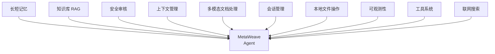
```mermaid
flowchart TD
    长短记忆["长短记忆"] & 知识库RAG["知识库 RAG"] & 安全审核["安全审核"] & 上下文管理["上下文管理"] & 多模态文档处理["多模态文档处理"] --> agent
    agent["MetaWeave<br/>Agent"]
    会话管理["会话管理"] & 规划与编排["本地文件操作"] & 可观测性["可观测性"] & 工具系统["工具系统"] & 联网搜索["联网搜索"] --> agent
```

#### Agent状态转移图
##### Simple模式


```mermaid
flowchart LR
    START -->|"小模型判别: 无需工具"| agent_simple["agent (直答)\n小模型直接生成回答"]
    agent_simple --> END
```

Simple 模式走轻量直答路径。不经过 LangGraph 循环，直接用小模型输出回答。适用于问候、短答等明显无需调用工具的输入。

##### ReAct模式

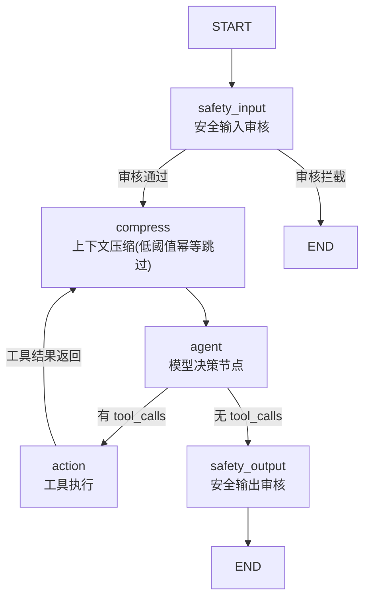
```mermaid
flowchart TD
    START --> safety_input["safety_input\n安全输入审核"]

    safety_input -->|"审核通过"| compress_react["compress\n上下文压缩(低阈值幂等跳过)"]
    safety_input -->|"审核拦截"| END_intercept["END"]

    compress_react --> agent_react["agent\n模型决策节点"]
    agent_react -->|"有 tool_calls"| action_react["action\n工具执行"]
    agent_react -->|"无 tool_calls"| safety_output_react["safety_output\n安全输出审核"]

    action_react -->|"工具结果返回"| compress_react
    safety_output_react --> END_react["END"]
```

ReAct 模式是标准的"思考-行动-观察"循环。agent 节点同时充当决策者和观察者，每轮只调用一次 LLM。有工具调用就执行并回到 agent，没有工具调用就输出审核后结束。每次进入决策前与工具回环后都经 `compress` 节点估算上下文长度：低于阈值幂等跳过，高于阈值用小模型把早期消息压成重要事实摘要（写入长期记忆），防止长循环上下文单调膨胀。

##### Plan模式(Plan-and-Execute)

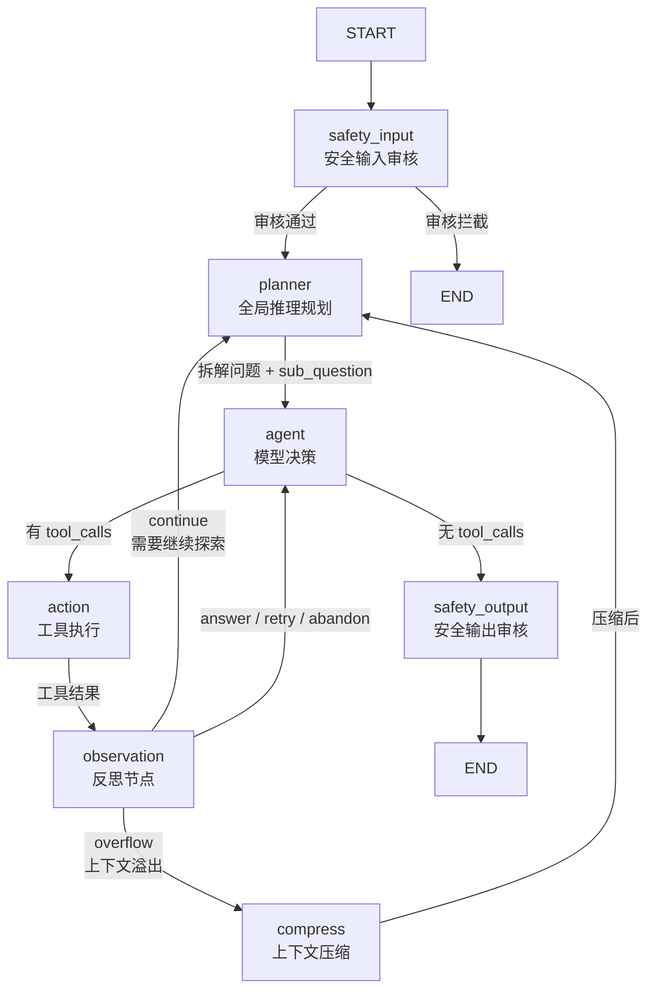
```mermaid
flowchart TD
    START --> safety_input["safety_input\n安全输入审核"]

    safety_input -->|"审核通过"| planner["planner\n全局推理规划"]
    safety_input -->|"审核拦截"| END_intercept["END"]

    planner -->|"拆解问题 + sub_question"| agent_plan["agent\n模型决策"]

    agent_plan -->|"有 tool_calls"| action["action\n工具执行"]
    agent_plan -->|"无 tool_calls"| safety_output["safety_output\n安全输出审核"]

    action -->|"工具结果"| observation["observation\n反思节点"]

    observation -->|"continue\n需要继续探索"| planner
    observation -->|"answer / retry / abandon"| agent_plan
    observation -->|"overflow\n上下文溢出"| compress["compress\n上下文压缩"]

    compress -->|"压缩后"| planner
    safety_output --> END["END"]
```

Plan 模式经过"规划→执行→观察"的循环，每轮会调用 2~3 次 LLM。planner 负责拆解问题，observation 根据工具结果判断要继续执行、重试、给出答案，还是先压缩上下文再接续规划。


### 记忆机制
##### 多模态文件的完整生命周期
**一个文件的完整生命周期**: 入文件夹,多模态解析,json化,语义切块,重叠切片,入向量库,混合检索向量库,合并去重,rerank,联合评分,阈值过滤,最新优先排序,四路记忆合并,注入系统提示词.


```mermaid
flowchart LR
    subgraph ingest["入库阶段"]
        direction LR
        A["文件入知识库"] --> B["多模态解析<br/>按格式提取结构化内容"]
        B --> C["结构化 JSON 落盘"]
        C --> D["语义切块<br/>section 级别分割"]
        D --> E["重叠切片<br/>512/128 char"]
        E --> F["Embedding 向量化"]
        F --> G["ChromaDB 入库"]
    end

    subgraph recall["召回阶段"]
        direction LR
        G --> H_vector["向量召回<br/>ChromaDB 余弦距离"]
        G --> H_keyword["关键词召回<br/>ILIKE + 词频加权"]
        H_vector --> H_merge["合并去重<br/>merge_candidates"]
        H_keyword --> H_merge
        H_merge --> I["CrossEncoder ReRank<br/>BAAI/bge-reranker-v2-m3"]
        I --> J["三维联合评分<br/>0.5rel + 0.3fresh + 0.2auth"]
        J --> K["阈值过滤<br/>score_threshold"]
        K --> L["最新优先排序<br/>updated_at DESC"]
        L --> M["四路记忆合并截断 topK"]
        M --> N["注入系统提示词"]
    end
```

##### 长期记忆 / 知识库入库流程

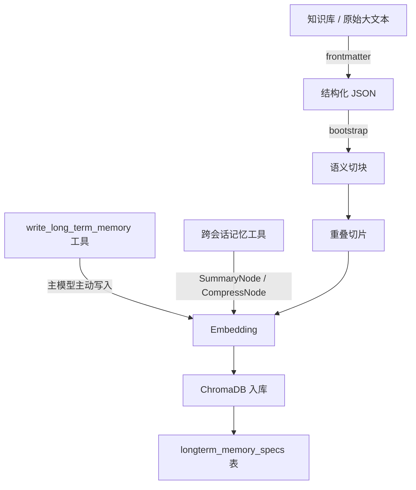
```mermaid
flowchart TD
    A["write_long_term_memory 工具"] -->|"主模型主动写入"| H["Embedding"]
    B["跨会话记忆工具"] -->|"SummaryNode / CompressNode"| H
    C["知识库 / 原始大文本"] -->|"frontmatter"| G["结构化 JSON"]
    G -->|"bootstrap"| D["语义切块"]
    D --> E["重叠切片"]
    E --> H
    H --> F["ChromaDB 入库"]
    F --> I["longterm_memory_specs 表"]
```

##### RAG 召回流程

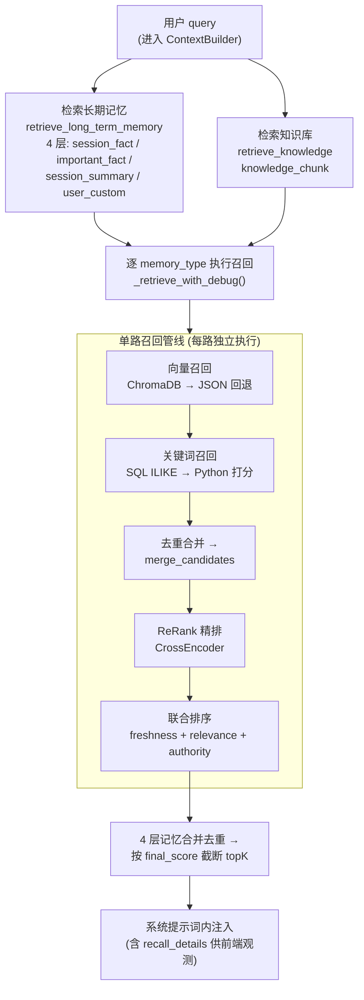
```mermaid
flowchart TD
    A["用户 query<br/>(进入 ContextBuilder)"] --> B["检索长期记忆<br/>retrieve_long_term_memory<br/>4 层: session_fact / important_fact /<br/>session_summary / user_custom"]
    A --> C["检索知识库<br/>retrieve_knowledge<br/>knowledge_chunk"]

    B --> D["逐 memory_type 执行召回<br/>_retrieve_with_debug()"]
    C --> D

    subgraph recall_pipeline["单路召回管线 (每路独立执行)"]
        direction LR
        E["向量召回<br/>ChromaDB → JSON 回退"] --> F["关键词召回<br/>SQL ILIKE → Python 打分"]
        F --> G["去重合并 →<br/>merge_candidates"]
        G --> H["ReRank 精排<br/>CrossEncoder"]
        H --> I["联合排序<br/>freshness + relevance + authority"]
    end

    D --> recall_pipeline
    I --> J["4 层记忆合并去重 →<br/>按 final_score 截断 topK"]
    J --> K["系统提示词内注入<br/>(含 recall_details 供前端观测)"]
```

##### 记忆时效性机制

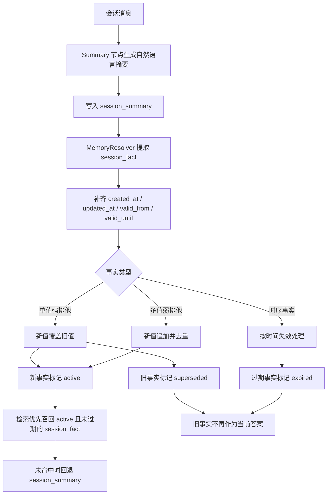
```mermaid
flowchart TD
    A[会话消息] --> B[Summary 节点生成自然语言摘要]
    B --> C[写入 session_summary]
    C --> D[MemoryResolver 提取 session_fact]
    D --> E[补齐 created_at / updated_at / valid_from / valid_until]
    E --> F{事实类型}
    F -->|单值强排他| G[新值覆盖旧值]
    F -->|多值弱排他| H[新值追加并去重]
    F -->|时序事实| I[按时间失效处理]
    G --> J[旧事实标记 superseded]
    G --> K[新事实标记 active]
    H --> K
    I --> L[过期事实标记 expired]
    K --> M[检索优先召回 active 且未过期的 session_fact]
    J --> N[旧事实不再作为当前答案]
    L --> N
    M --> O[未命中时回退 session_summary]
```


##### 混合检索与ReRank机制

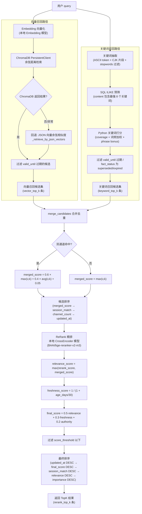
```mermaid
flowchart TD
    A["用户 query"] --> B["Embedding 向量化<br/>(本地 Embedding 模型)"]
    A --> C["关键词抽取<br/>(ASCII token + CJK 片段 + stopwords 过滤)"]

    subgraph vector_path["向量召回路径"]
        B --> D["ChromaDB PersistentClient<br/>余弦距离检索"]
        D --> DA{"ChromaDB 返回结果?"}
        DA -->|"是"| E["过滤 valid_until 过期的候选"]
        DA -->|"否/异常"| DB["回退: JSON 向量余弦相似度<br/>_retrieve_by_json_vectors"]
        DB --> E
        E --> F["向量召回候选集<br/>(vector_top_k 条)"]
    end

    subgraph keyword_path["关键词召回路径"]
        C --> G["SQL ILIKE 预筛<br/>(content 包含最强 8 个关键词)"]
        G --> H["Python 关键词打分<br/>(coverage + 词频加权 + phrase bonus)"]
        H --> I["过滤 valid_until 过期 /<br/>fact_status 为 superseded/expired"]
        I --> J["关键词召回候选集<br/>(keyword_top_k 条)"]
    end

    F --> K["merge_candidates 合并去重"]
    J --> K

    K --> L{"双通道命中?"}
    L -->|"是"| M["merged_score = 0.6 × max(v,k) + 0.4 × avg(v,k) + 0.05"]
    L -->|"否"| N["merged_score = max(v,k)"]
    M --> O["候选排序<br/>(merged_score → session_match → channel_count → updated_at)"]
    N --> O

    O --> P["ReRank 精排<br/>本地 CrossEncoder 模型<br/>(BAAI/bge-reranker-v2-m3)"]

    P --> Q1["relevance_score = max(rerank_score, merged_score)"]
    Q1 --> Q2["freshness_score = 1 / (1 + age_days/30)"]
    Q2 --> Q3["final_score = 0.5·relevance + 0.3·freshness + 0.2·authority"]
    Q3 --> R["过滤 score_threshold 以下"]
    R --> S["最终排序<br/>(updated_at DESC → final_score DESC →<br/> session_match DESC → relevance DESC → importance DESC)"]
    S --> T["返回 TopK 结果<br/>(rerank_top_k 条)"]
```

### 上下文与状态机制

##### 上下文构建器

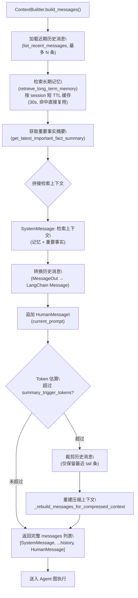
```mermaid
flowchart TD
    A["ContextBuilder.build_messages()"] --> B["加载近期历史消息\\n(list_recent_messages, 最多 N 条)"]
    B --> C["检索长期记忆\\n(retrieve_long_term_memory)<br/>按 session 短 TTL 缓存<br/>(30s, 命中直接复用)"]
    C --> D["获取重要事实摘要\\n(get_latest_important_fact_summary)"]
    D --> E{"拼接检索上下文"}
    E --> F["SystemMessage: 检索上下文\\n(记忆 + 重要事实)"]
    F --> G["转换历史消息\\n(MessageOut → LangChain Message)"]
    G --> H["追加 HumanMessage\\n(current_prompt)"]
    H --> I{"Token 估算\\n超过 summary_trigger_tokens?"}
    I -->|"未超过"| J["返回完整 messages 列表\\n[SystemMessage, ...history, HumanMessage]"]
    I -->|"超过"| K["裁剪历史消息\\n(仅保留最近 tail 条)"]
    K --> L["重建压缩上下文\\n_rebuild_messages_for_compressed_context"]
    L --> J
    J --> M["送入 Agent 图执行"]
```

**消息角色优先级（上下文拼装顺序）：**  
`SystemMessage(检索上下文)` → `历史消息按时间正序` → `HumanMessage(当前输入)`  
检索上下文内部优先级：`important_fact_summary > 长期记忆(已附原文) > 当前 session 摘要`。知识库不再自动召回进上下文，由 Agent 需要时自行调用 `get_knowledge_context` / `search_knowledge` 等工具获取，避免首 token 前重复跑完整 embedding+rerank 链路。

##### 上下文压缩机制

###### compress 路径: 上下文压缩 / 重要事实摘要流程

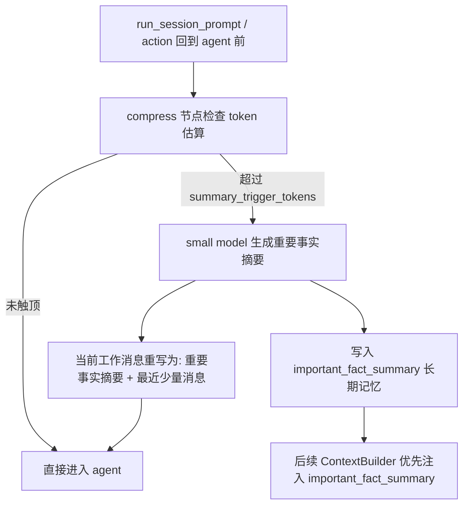
```mermaid
flowchart TD
    A["run_session_prompt / action 回到 agent 前"] --> B["compress 节点检查 token 估算"]
    B -->|"未触顶"| C["直接进入 agent"]
    B -->|"超过 summary_trigger_tokens"| D["small model 生成重要事实摘要"]
    D --> E["写入 important_fact_summary 长期记忆"]
    D --> F["当前工作消息重写为: 重要事实摘要 + 最近少量消息"]
    F --> C
    E --> G["后续 ContextBuilder 优先注入 important_fact_summary"]
```

###### summary 路径: 长期记忆摘要流程

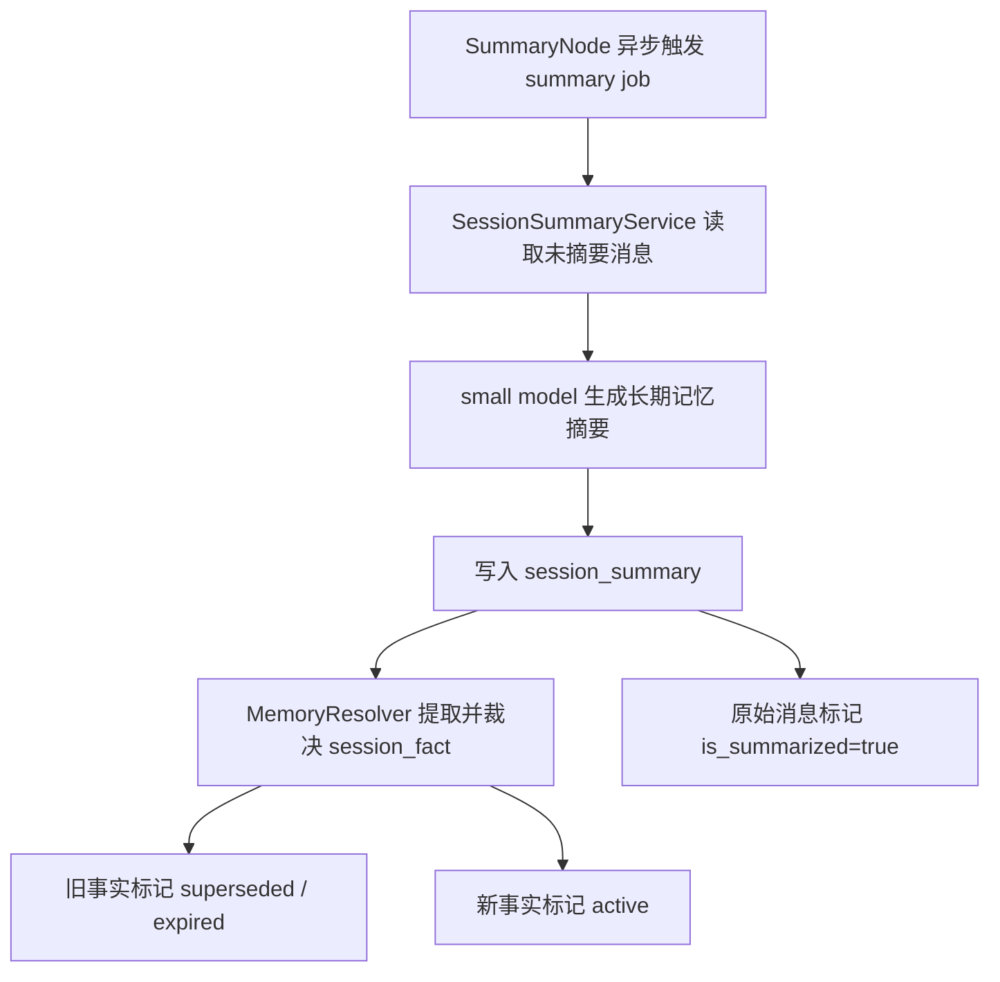
```mermaid
flowchart TD
    A["SummaryNode 异步触发 summary job"] --> B["SessionSummaryService 读取未摘要消息"]
    B --> C["small model 生成长期记忆摘要"]
    C --> D["写入 session_summary"]
    D --> E["MemoryResolver 提取并裁决 session_fact"]
    E --> F["旧事实标记 superseded / expired"]
    E --> G["新事实标记 active"]
    D --> H["原始消息标记 is_summarized=true"]
```

##### 探索状态机制

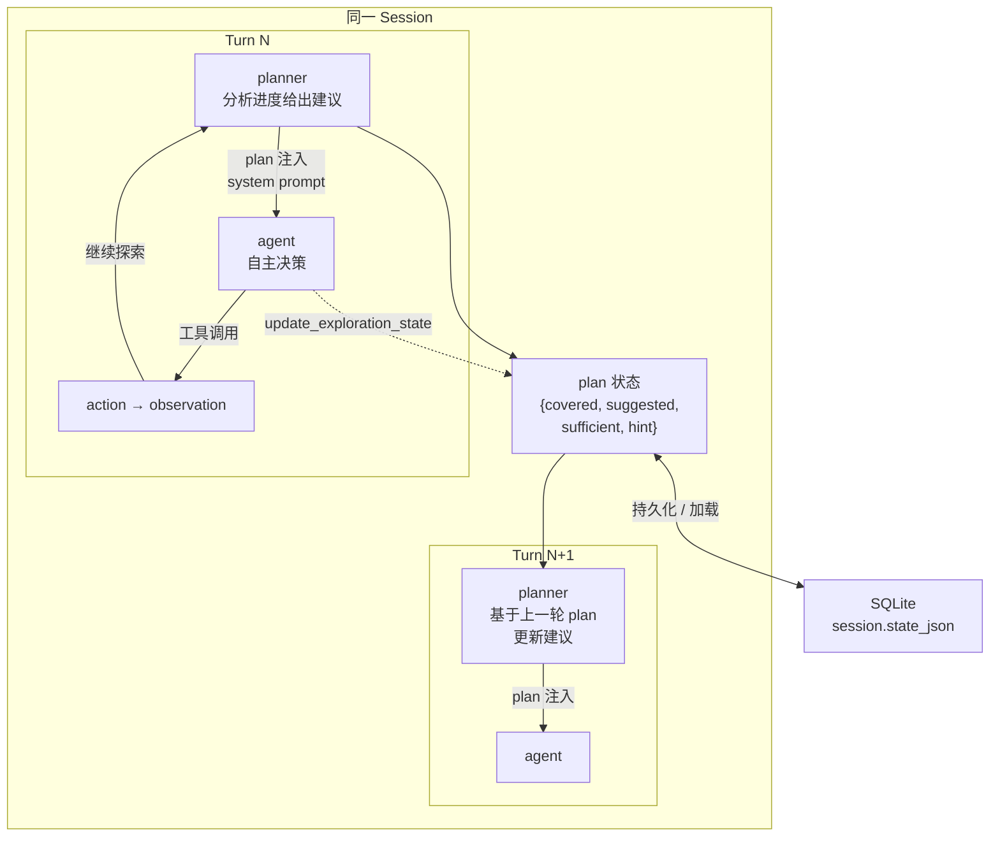
```mermaid
flowchart TD
    subgraph session["同一 Session"]
        subgraph turn1["Turn N"]
            P1["planner<br/>分析进度给出建议"] -->|"plan 注入<br/>system prompt"| A1["agent<br/>自主决策"]
            A1 -->|"工具调用"| T1["action → observation"]
            T1 -->|"继续探索"| P1
        end

        subgraph turn2["Turn N+1"]
            P2["planner<br/>基于上一轮 plan<br/>更新建议"] -->|"plan 注入"| A2["agent"]
        end

        plan["plan 状态<br/>{covered, suggested,<br/>sufficient, hint}"]

        P1 --> plan
        A1 -.->|"update_exploration_state"| plan
        plan --> P2
    end

    plan <-->|"持久化 / 加载"| DB["SQLite<br/>session.state_json"]
```

### 任务调度与节流机制

##### 模型路由与大/小模型池

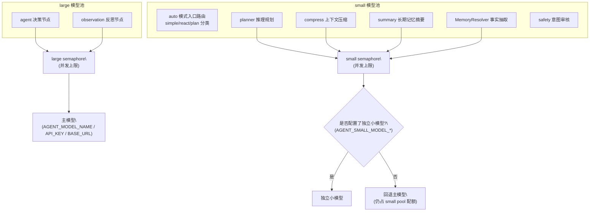
```mermaid
flowchart TD
    subgraph large_pool["large 模型池"]
        L1["agent 决策节点"]
        L2["observation 反思节点"]
    end

    subgraph small_pool["small 模型池"]
        S0["auto 模式入口路由<br/>simple/react/plan 分类"]
        S1["planner 推理规划"]
        S2["compress 上下文压缩"]
        S3["summary 长期记忆摘要"]
        S4["MemoryResolver 事实抽取"]
        S5["safety 意图审核"]
    end

    L1 --> LA["large semaphore\\n(并发上限)"]
    L2 --> LA
    S1 --> SA["small semaphore\\n(并发上限)"]
    S2 --> SA
    S3 --> SA
    S4 --> SA

    LA --> ML["主模型\\n(AGENT_MODEL_NAME / API_KEY / BASE_URL)"]
    SA --> M2{"是否配置了独立小模型?\\n(AGENT_SMALL_MODEL_*)"}

    M2 -->|"是"| ML2["独立小模型"]
    M2 -->|"否"| MF2["回退主模型\\n(仍占 small pool 配额)"]
```

##### (Redis)多级队列调度

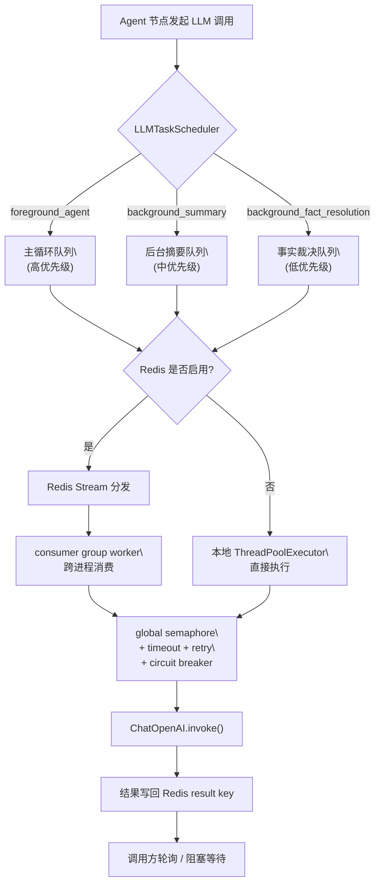
```mermaid
flowchart TD
    A["Agent 节点发起 LLM 调用"] --> B{"LLMTaskScheduler"}

    B -->|"foreground_agent"| C["主循环队列\\n(高优先级)"]
    B -->|"background_summary"| D["后台摘要队列\\n(中优先级)"]
    B -->|"background_fact_resolution"| E["事实裁决队列\\n(低优先级)"]

    C --> F{"Redis 是否启用?"}
    D --> F
    E --> F

    F -->|"否"| G["本地 ThreadPoolExecutor\\n直接执行"]
    F -->|"是"| H["Redis Stream 分发"]

    H --> I["consumer group worker\\n跨进程消费"]
    I --> J["global semaphore\\n+ timeout + retry\\n+ circuit breaker"]

    G --> J
    J --> K["ChatOpenAI.invoke()"]
    K --> L["结果写回 Redis result key"]
    L --> M["调用方轮询 / 阻塞等待"]
```

##### 节流机制

流式对话中每个 SSE token 都直接写入 Vue 响应式对象，触发完整响应链（`visibleMessages` 全量 reduce → 模板重渲染 → vdom diff → scroll 计算）。随会话消息累积（100+ 条），每秒 30~60 次的全量重算产生 ~3,000 个临时对象，GC 频繁停顿导致卡顿。

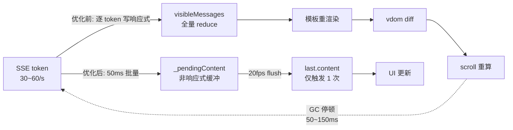
```mermaid
flowchart LR
    A["SSE token<br/>30~60/s"] -->|"优化前: 逐 token 写响应式"| B["visibleMessages<br/>全量 reduce"]
    B --> C["模板重渲染"]
    C --> D["vdom diff"]
    D --> E["scroll 重算"]
    E -.->|"GC 停顿<br/>50~150ms"| A

    A -->|"优化后: 50ms 批量"| F["_pendingContent<br/>非响应式缓冲"]
    F -->|"20fps flush"| G["last.content<br/>仅触发 1 次"]
    G --> H["UI 更新"]
```

**_pendingContent**（`src/stores/chat.js`）：非响应式字符串缓冲，`updateStreamContent` 存入最新累积内容（0 次响应链触发），`flushStreamContent` 每 50ms 写入 `last.content`（1 次响应链触发），`forceFlushContent` 在流结束/中断/异常时立即清空缓冲防丢字。

| 指标 | 优化前 | 优化后 |
|---|---|
| 每次 token 响应链触发 | 1 次 | 0 次 |
| 每秒响应链触发（100 条消息） | ~30 次 | ~20 次 |
| 每秒临时对象 | ~3,000 | ~1,000 |
| 长对话滚动 | 频繁卡顿，无法滚动 | 平滑跟随 |

### 安全机制

##### 三层审核设计

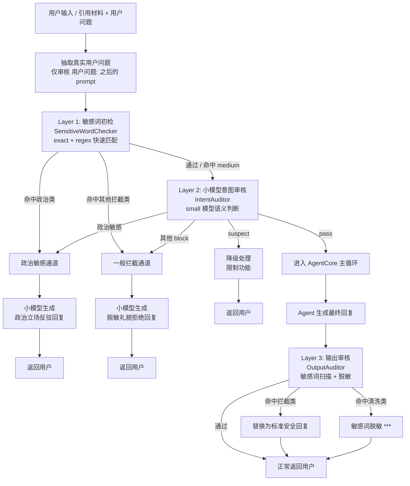
```mermaid
flowchart TD
    A[用户输入 / 引用材料 + 用户问题] --> A1[抽取真实用户问题<br/>仅审核 用户问题: 之后的 prompt]
    A1 --> B[Layer 1: 敏感词初检<br/>SensitiveWordChecker<br/>exact + regex 快速匹配]
    
    B -->|命中政治类| C1[政治敏感通道]
    B -->|命中其他拦截类| C2[一般拦截通道]
    B -->|通过 / 命中 medium| D[Layer 2: 小模型意图审核<br/>IntentAuditor<br/>small 模型语义判断]
    
    C1 --> G1[小模型生成<br/>政治立场反驳回复]
    C2 --> G2[小模型生成<br/>脱敏礼貌拒绝回复]
    
    G1 --> K1[返回用户]
    G2 --> K2[返回用户]
    
    D -->|政治敏感| C1
    D -->|其他 block| C2
    D -->|suspect| E[降级处理<br/>限制功能]
    D -->|pass| F[进入 AgentCore 主循环]
    
    E --> K3[返回用户]
    F --> G[Agent 生成最终回复]
    
    G --> H[Layer 3: 输出审核<br/>OutputAuditor<br/>敏感词扫描 + 脱敏]
    
    H -->|命中拦截类| I[替换为标准安全回复]
    H -->|命中清洗类| J[敏感词脱敏 ***]
    H -->|通过| K[正常返回用户]
    
    I --> K
    J --> K
```

`safety_input`的审核对象是用户真实请求,不是被用户引用或要求分析的文档正文。对于“用户问题引用了以下文档片段...用户问题: ...”这种由`ContextBuilder`包装后的输入,审核服务会先取最后的`用户问题:`段落再进入敏感词初检和小模型意图审核,避免知识库文件正文中的词触发入口误拦截。输出审核仍然作用于 Agent 最终回复,用于防止生成内容本身违规。

### 知识库业务设计


##### 多模态文件入库流程

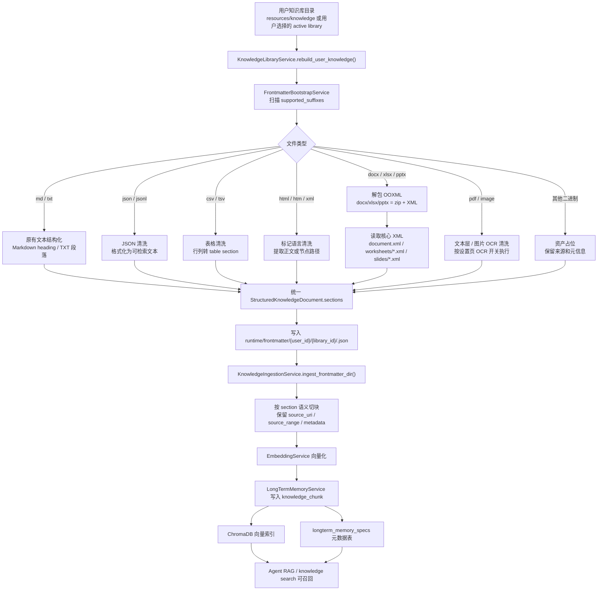
```mermaid
flowchart TD
    A["用户知识库目录<br/>resources/knowledge 或用户选择的 active library"] --> B["KnowledgeLibraryService.rebuild_user_knowledge()"]
    B --> C["FrontmatterBootstrapService<br/>扫描 supported_suffixes"]

    C --> D{"文件类型"}
    D -->|"md / txt"| E["原有文本结构化<br/>Markdown heading / TXT 段落"]
    D -->|"json / jsonl"| F["JSON 清洗<br/>格式化为可检索文本"]
    D -->|"csv / tsv"| G["表格清洗<br/>行列转 table section"]
    D -->|"html / htm / xml"| H["标记语言清洗<br/>提取正文或节点路径"]
    D -->|"docx / xlsx / pptx"| I0["解包 OOXML<br/>docx/xlsx/pptx = zip + XML"]
    I0 --> I["读取核心 XML<br/>document.xml / worksheets/*.xml / slides/*.xml"]
    D -->|"pdf / image"| J["文本层 / 图片 OCR 清洗<br/>按设置页 OCR 开关执行"]
    D -->|"其他二进制"| K["资产占位<br/>保留来源和元信息"]

    E --> L["统一 StructuredKnowledgeDocument.sections"]
    F --> L
    G --> L
    H --> L
    I --> L
    J --> L
    K --> L

    L --> M["写入 runtime/frontmatter/{user_id}/{library_id}/<document>.json"]
    M --> N["KnowledgeIngestionService.ingest_frontmatter_dir()"]
    N --> O["按 section 语义切块<br/>保留 source_uri / source_range / metadata"]
    O --> P["EmbeddingService 向量化"]
    P --> Q["LongTermMemoryService 写入 knowledge_chunk"]
    Q --> R["ChromaDB 向量索引"]
    Q --> S["longterm_memory_specs 元数据表"]

    R --> T["Agent RAG / knowledge search 可召回"]
    S --> T
```

##### 三路并行搜索

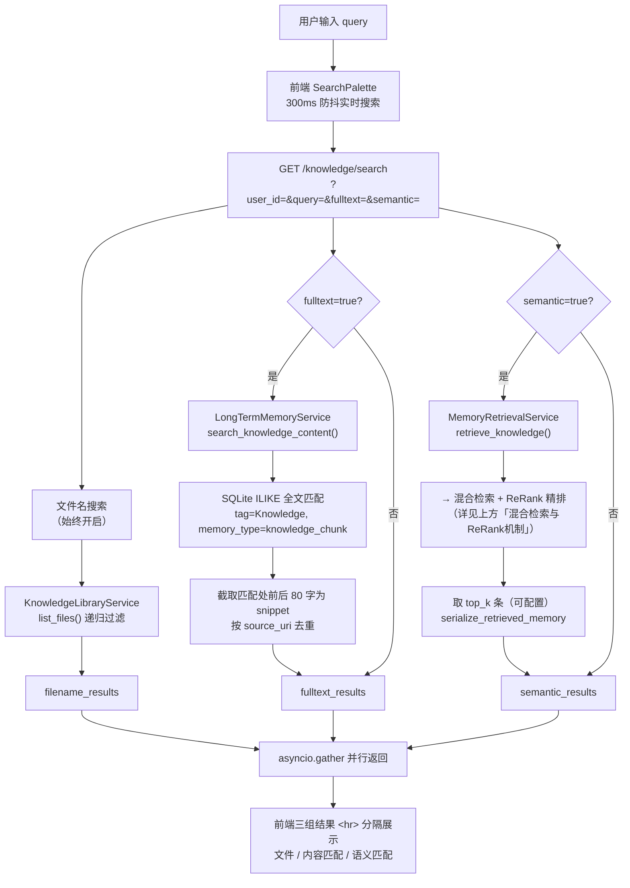
```mermaid
flowchart TD
    A["用户输入 query"] --> B["前端 SearchPalette<br/>300ms 防抖实时搜索"]

    B --> C["GET /knowledge/search<br/>?user_id=&query=&fulltext=&semantic="]

    C --> D["文件名搜索<br/>（始终开启）"]
    C --> E{"fulltext=true?"}
    C --> F{"semantic=true?"}

    D --> G["KnowledgeLibraryService<br/>list_files() 递归过滤"]
    G --> H["filename_results"]

    E -->|是| I["LongTermMemoryService<br/>search_knowledge_content()"]
    I --> J["SQLite ILIKE 全文匹配<br/>tag=Knowledge, memory_type=knowledge_chunk"]
    J --> K["截取匹配处前后 80 字为 snippet<br/>按 source_uri 去重"]
    K --> L["fulltext_results"]
    E -->|否| L

    F -->|是| M["MemoryRetrievalService<br/>retrieve_knowledge()"]
    M --> N["→ 混合检索 + ReRank 精排<br/>（详见上方「混合检索与ReRank机制」）"]
    N --> R["取 top_k 条（可配置）<br/>serialize_retrieved_memory"]
    R --> S["semantic_results"]
    F -->|否| S

    H --> T["asyncio.gather 并行返回"]
    L --> T
    S --> T

    T --> U["前端三组结果 &lt;hr&gt; 分隔展示<br/>文件 / 内容匹配 / 语义匹配"]
```

##### 文件上传

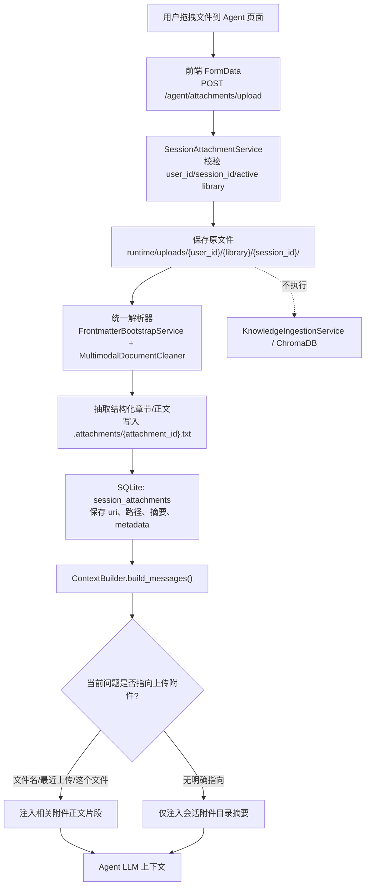
```mermaid
flowchart TD
    A["用户拖拽文件到 Agent 页面"] --> B["前端 FormData<br/>POST /agent/attachments/upload"]
    B --> C["SessionAttachmentService<br/>校验 user_id/session_id/active library"]
    C --> D["保存原文件<br/>runtime/uploads/{user_id}/{library}/{session_id}/"]
    D --> E["统一解析器<br/>FrontmatterBootstrapService + MultimodalDocumentCleaner"]
    E --> F["抽取结构化章节/正文<br/>写入 .attachments/{attachment_id}.txt"]
    F --> G["SQLite: session_attachments<br/>保存 uri、路径、摘要、metadata"]
    G --> H["ContextBuilder.build_messages()"]
    H --> I{"当前问题是否指向上传附件?"}
    I -->|"文件名/最近上传/这个文件"| J["注入相关附件正文片段"]
    I -->|"无明确指向"| K["仅注入会话附件目录摘要"]
    J --> L["Agent LLM 上下文"]
    K --> L
    D -. "不执行" .-> M["KnowledgeIngestionService / ChromaDB"]
```

- 上传附件是 session-scoped context asset, 不是知识库资产; 它不写入知识库目录, 不生成可灌库 frontmatter, 不进入 Embedding/ChromaDB。
- 解析链路复用文件树/知识库的同一套结构化解析器。差别只在消费端: 知识库文件解析后进入灌库, 上传附件解析后只登记到会话附件表并供 ContextBuilder 注入。
- 同一个 session 的后续提问会保留附件目录; 当用户说“这个文件”“刚才上传的文件”或直接提到文件名时, ContextBuilder 会把相关附件正文片段放进本轮 system context。

##### 知识图谱实体提取

```mermaid
flowchart TD
    A["多模态入库"] --> B["Frontmatter JSON<br/>(runtime/frontmatter/*.json)"]
    B --> C["POST /knowledge/graph/rebuild"]
    C --> D["后台线程异步执行<br/>独立并发池(最大2并发)"]
    D --> E{"遍历每篇 JSON 文档"}
    E --> F{"按 source_hash<br/>是否已抽取?"}
    F -->|"是"| G["跳过 skip"]
    F -->|"否"| H["逐 section 调用小模型<br/>(moonshot-v1-8k)"]
    H --> I["输入: 文档标题 + section 文本(至多6000字)"]
    I --> J["输出: entities + relations"]
    J --> K["限流 sleep(0.5s/section)"]
    K --> L["每文档后 sleep(1.0s)"]
    L --> M["文档级实体合并<br/>按 (名称, 类型) 去重"]
    M --> N["语义去重<br/>所有实体候选送小模型<br/>合并同义实体(AI=Artificial Intelligence)"]
    N --> O["重映射关系边<br/>旧名→规范名"]
    O --> P["写入 SQLite"]
    P --> Q["knowledge_graph_nodes"]
    P --> R["knowledge_graph_edges"]
    P --> S["knowledge_graph_document_status"]
    E --> T{"检测熔断<br/>(余额不足/配额超限)?"}
    T -->|"是"| U["停止抽取,输出部分结果"]
    T -->|"否"| E

    subgraph manual_dedup["用户手动全库去重"]
        V["图谱面板<br/>点击「去重」按钮"] --> W["POST /knowledge/graph/dedup"]
        W --> X["读全部实体节点<br/>Embedding 向量化"]
        X --> Y["DBSCAN 聚类<br/>(余弦距离 eps=0.5)"]
        Y --> Z{"非单点簇<br/>(≥2 实体)?"}
        Z -->|"是"| AA["逐簇喂给小模型<br/>判断同义并合并"]
        Z -->|"否(噪声点)"| AB["跳过"]
        AA --> AC["链式解析映射<br/>a→b, b→c → a→c"]
        AC --> AD["更新 DB: 重定向边<br/>删除源节点,清理自环"]
    end

    P -.->|"全库去重<br/>操作对象"| X

```

### 其他设计
##### 引用溯源

```mermaid
flowchart TD
    A["用户提问"] --> B["自动RAG召回"]
    B --> C["系统上下文注入<br/>[1]/[2] 来源 + 片段"]
    B --> D["初始 citation_map<br/>数字编号 1/2/3..."]

    A --> E["Agent 主动调用工具"]
    E --> F["知识库工具<br/>get/read/search"]
    F --> G["register_tool_citation()<br/>工具编号 K1/K2..."]
    G --> H["工具返回文本携带<br/>Citation ID / [Kx]"]
    G --> I["工具 trace.citation_map"]
    F --> Q{"来源类型"}
    Q -->|"get_knowledge_context<br/>read_knowledge_file<br/>read_multimodal_file_info"| R["adopted_by_default=true<br/>明确读入正文"]
    Q -->|"search_knowledge"| S["仅搜索候选<br/>不默认采纳"]

    E --> X["联网搜索工具<br/>web_search"]
    X --> Y["register_network_citation()<br/>网络编号 N1/N2..."]
    Y --> Z["搜索结果携带<br/>Citation ID: [N#]<br/>source_uri = URL"]

    D --> J["AgentCore 合并本轮 citation_map"]
    I --> J
    R --> J
    S --> J
    Y --> J
    C --> K["LLM 最终回答"]
    H --> K
    Z --> K

    K --> L["清理无映射伪引用<br/>删除不存在的 [x]"]
    J --> L
    L --> M{"正文是否已有<br/>有效 [1]/[K1]/[N1]"}
    M -->|"有"| N["按正文锚点过滤来源"]
    M -->|"部分/全部漏写工具锚点"| O["保守行级补锚点<br/>匹配文件名/标题才补 [Kx]"]
    O --> P["不做末尾 citation-only 堆叠"]
    N --> T["保存 assistant metadata<br/>used_citations + citation_map"]
    P --> T
    T --> U["前端 Markdown 渲染<br/>[1]/[K1]/[N1] 可点击"]
    U --> U1["本地来源: 跳转文件树"]
    U --> U2["网络来源: 默认浏览器打开 URL"]
    T --> V["气泡下方来源列表<br/>只显示实际引用文档/网页"]
    T --> W["历史消息使用自身 metadata<br/>不复用当前轮全局来源"]
```

##### 联网搜索工具

Agent 通过 `web_search` 和 `web_image_search` 两个内置工具访问 DuckDuckGo 搜索引擎，需要代理地址才能正常使用。

**工具一览：**

| 工具名 | 用途 | 底层接口 | 返回内容 |
|---|---|---|---|
| `web_search` | 搜索文字信息 | `ddgs.text()` | 标题 + URL + 页面摘要 |
| `web_image_search` | 搜索图片 | `ddgs.images()` | 标题 + 图片 URL + 缩略图 URL + 来源页面 |

**搜索流程：**

```mermaid
flowchart TD
    A["用户提问"] --> B{"是否需要联网搜索?"}
    B -->|"文字信息"| C["web_search<br/>ddgs.text(query)"]
    B -->|"图片展示"| D["web_image_search<br/>ddgs.images(query)"]

    C --> E["DuckDuckGo 返回<br/>搜索结果列表"]
    E --> F["register_network_citation()<br/>生成 [N1][N2] 编号"]
    F --> G["Agent 收到结果<br/>阅读摘要决定是否再搜"]

    D --> H["DuckDuckGo 返回<br/>图片 URL 列表"]
    H --> I["register_network_citation()<br/>生成 [N1][N2] 编号"]
    I --> J["Agent 用热链接展示<br/>![描述](图片URL)"]

    G --> K{"信息足够?"}
    J --> K
    K -->|"不足"| B
    K -->|"足够"| L["组织最终回复"]
    L --> M["任务终止"]
```

**行为规则：**

- 搜索图片必须使用 `web_image_search`，不能用 `web_search` 反复搜文字
- `web_search` 返回的摘要是搜索引擎截断片段，完整内容需访问链接
- 图片直接用 Markdown 热链接展示，不调 `download_file` 下载
- 每次搜索用 `max_results` 参数一次性获取足够多结果，减少搜索轮次
- 信息足够后立即停止搜索，直接生成回复

## 接口设计

本服务同时提供 **REST (FastAPI)** 和 **gRPC (protobuf)** 两套接口，二者功能完全等价、返回结构一致，可根据客户端需求任选其一。

> 约定：下表中参数字段名在 REST 和 gRPC 中相同；REST 使用 JSON body / query string，gRPC 使用对应的 proto message。

### 一、Session 管理

|方法|REST|gRPC|功能|请求参数|返回结构|
|-|-|-|-|-|-|
|ListSessions|`GET /sessions?user_id=`|`ListUserSessions`|列出用户全部会话，按更新时间倒序|`user_id` (string, 必填)|`[{session_id, user_id, session_name, created_at, updated_at}]`|
|CreateSession|`POST /sessions`|`CreateSession`|创建新会话|`user_id` (string, 必填), `session_name` (string, 可选)|`{session_id, user_id, session_name, created_at, updated_at}`|
|GetSession|`GET /sessions/{id}`|`GetSession`|获取单个会话详情|`session_id` (string, 必填)|`{session_id, user_id, session_name, created_at, updated_at}`|
|UpdateSessionName|`PUT /sessions/{id}/name`|`UpdateSessionName`|重命名会话|`session_id` (string, 必填), `session_name` (string, 必填)|`{session_id, user_id, session_name, created_at, updated_at}`|
|DeleteSession|`DELETE /sessions/{id}`|`DeleteSession`|删除单个会话|`session_id` (string, 必填)|`{ok, deleted_count}`|
|DeleteAllSessions|`DELETE /sessions?user_id=`|`DeleteAllSessions`|清空用户全部会话|`user_id` (string, 必填)|`{ok, deleted_count}`|

### 二、消息历史

|方法|REST|gRPC|功能|请求参数|返回结构|
|-|-|-|-|-|-|
|ListMessages|`GET /sessions/{id}/messages?user_id=&limit=`|`ListMessages`|拉取会话历史消息|`session_id` (string, 必填), `user_id` (string, 必填), `limit` (int, 默认 50)|`[{message_id, session_id, user_id, role, content, tool_calls, metadata, created_at}]`|

### 三、Agent 流式对话

|方法|REST|gRPC|功能|请求参数|流事件字段|
|-|-|-|-|-|-|
|StreamSessionPrompt|`GET /agent/stream?prompt=&user_id=&session_id=`|`StreamSessionPrompt`|带 Session 上下文的 SSE 流式对话（长期记忆 + 知识库 + 持久化）|`prompt` (string, 必填), `user_id` (string, 必填), `session_id` (string, 必填)|`node, content, tool_calls, trace, model_name, type, context_messages, metadata, error, done`|
|StreamRun|`GET /agent/stream-run?prompt=&user_id=&session_id=`|`StreamRun`|无状态 SSE 流式运行（无记忆/召回/持久化）|同上|同上|

> 流事件说明：
> - `type`: 普通 chunk 为空；`"system_prompt"` 时 `metadata` 含 RAG 指标；`"context_mirror"` 时 `context_messages` 含模型完整上下文
> - `done`: 流结束标志（REST 以 `data: [DONE]\\n\\n` 结束）
> - `error`: 仅在发生错误时非空，含友好错误描述

### 四、Agent 非流式调用

|方法|REST|gRPC|功能|请求参数|返回结构|
|-|-|-|-|-|-|
|RunSessionPrompt|`POST /agent/run`|`RunSessionPrompt`|带 Session 上下文的单次运行|`prompt` (string, 必填), `user_id` (string, 必填), `session_id` (string, 必填)|`{graph_diagram_path, graph_diagram, final_output, events}`|
|RunOnce|`POST /agent/run-once`|`RunOnce`|无状态单次运行|同上|同上|
|CancelSession|`POST /agent/cancel`|`CancelSession`|取消正在执行的 Agent 图|`session_id` (string, 必填)|`{ok}`|

### 五、观测

|方法|REST|gRPC|功能|请求参数|返回结构|
|-|-|-|-|-|-|
|GetEvents|`GET /agent/events?session_id=&user_id=`|`GetEvents`|获取最近一次执行的 trace 事件列表|`session_id` (string, 必填), `user_id` (string, 必填)|`{session_id, user_id, event_count, events: [{message_id, role, node, content, tool_calls, created_at, metadata}]}`|
|GetRecallDetails|`GET /agent/recall-details?session_id=&user_id=`|`GetRecallDetails`|获取最近一次 RAG 召回快照（pre/post rerank）|同上|`{session_id, user_id, created_at, query, rag_metrics, memory_recall, knowledge_recall}`|

### 六、用户设置

|方法|REST|gRPC|功能|请求参数|返回结构|
|-|-|-|-|-|-|
|ListSystemPromptEntries|`GET /settings/system-prompt?user_id=`|`ListSystemPromptEntries`|列出用户全部系统提示词条目|`user_id` (string, 必填)|`{entries: [{prompt_id, content, created_at}]}`|
|AddSystemPromptEntry|`POST /settings/system-prompt/entries`|`AddSystemPromptEntry`|添加一条系统提示词条目|`user_id` (string, 必填), `content` (string, 必填)|`{prompt_id, content, created_at}`|
|DeleteSystemPromptEntry|`DELETE /settings/system-prompt/entries/{prompt_id}`|`DeleteSystemPromptEntry`|删除指定提示词条目|`prompt_id` (string, 必填)|`{ok, deleted_count}`|
|ListCustomMemories|`GET /settings/memories?user_id=`|`ListCustomMemories`|列出用户全部自定义长期记忆|`user_id` (string, 必填)|`[{memory_id, content, importance, created_at}]`|
|AddCustomMemory|`POST /settings/memories`|`AddCustomMemory`|添加一条自定义长期记忆（自动向量化入库）|`user_id` (string, 必填), `content` (string, 必填), `importance` (float, 可选, 默认 0.5)|`{memory_id, content, importance, created_at}`|
|DeleteCustomMemory|`DELETE /settings/memories/{memory_id}`|`DeleteCustomMemory`|删除指定自定义长期记忆|`memory_id` (string, 必填)|`{ok, deleted_count}`|

> 系统提示词条目在每次 Agent 对话时自动全部加载并拼接到系统提示词末尾；自定义长期记忆通过向量检索在相关对话中自动召回。


## MCP 工具接入

AgentService 通过 MCP（Model Context Protocol）协议对接外部工具服务器。Agent 启动时自动发现并注册 MCP 工具，注册后的工具与内置工具无差别可用。

### 启用 MCP

在.env中:

```bash
AGENT_MCP_ENABLED=true
```

### 配置 MCP 服务器

在 `resources/mcp/` 目录下创建 `.json` 配置文件：

```json
[
  {
    "server_id": "filesystem",
    "command": "npx",
    "args": ["-y", "@modelcontextprotocol/server-filesystem", "/path/to/allowed/dir"],
    "enabled": true
  },
  {
    "server_id": "web-search",
    "command": "python",
    "args": ["-m", "my_mcp_server"],
    "enabled": true,
    "env": {
      "API_KEY": "your-api-key"
    }
  }
]
```

每个服务器条目支持以下字段：

|字段|必填|说明|
|-|-|-|
|`server_id`|是|唯一标识符，只允许小写字母、数字、下划线|
|`command`|是|启动 MCP 服务器的可执行文件（`npx`、`python` 等）|
|`args`|否|命令行参数列表|
|`env`|否|注入子进程的环境变量|
|`enabled`|否|是否启用，默认 `true`|
|`encoding`|否|stdio 编码，默认 `"utf-8"`|

如需用环境变量配置，可设置 `AGENT_MCP_SERVERS_JSON`（JSON 字符串）或逐个服务器的环境变量。但推荐使用 JSON 文件方式，更直观且支持多服务器管理。


### 工具命名与调用规则

MCP 工具自动注册为 `{prefix}__{server_id}__{tool_name}` 格式：

* `prefix` — 默认为 `mcp`，可通过 `AGENT_MCP_TOOL_NAME_PREFIX` 自定义
* `server_id` — 配置中指定的服务器标识
* `tool_name` — MCP 服务器上报的工具名称

例如 `filesystem` 服务器的 `read_file` 工具注册为 `mcp__filesystem__read_file`，Agent 在对话中调用此工具时即通过 MCP 协议转发到对应服务器进程执行。

### 运行机制

1. 启动时 AgentCore 扫描 `resources/mcp/*.json`，加载服务器配置
2. 对每个启用的服务器启动子进程，通过 stdio 建立 MCP 会话
3. 调用 `list_tools()` 发现该服务器提供的工具
4. 将所有 MCP 工具包装为与内置工具相同的 `StructuredTool`，注册到工具注册表
5. 对话中 LLM 选择调用 MCP 工具时，通过同步-异步桥接转发到对应 MCP 服务器执行

MCP 工具与内置工具共用同一个工具选择池，LLM 根据任务自动决定是否调用以及调用哪个。
