# MetaWeave 元织 - 个人多模态知识库Agent

## 产品定位

##### 项目目标

本项目是一个独立的、可定制、可观测、可接MCP的、建立在个人知识库上的多模态智能知识库`MetaWeave`(元织)。

##### 主要服务人群

- 希望在个人文件系统上建立Agent中枢的智能知识库的人.
- 追求高度自定义智能体、希望自己搭建智能体能力的开发者。
- 希望快速使用Agent接口,而不希望手动搭建复杂智能体思考链的人.

##### 项目小心得
做了agent之后发现,用agent骨架是无法弥补LLM自己的幻觉能力的,LLM往往会基于自己的认知就认为这个东西怎么怎么样,而懒得去搜.幻觉和迷之自信是LLM与生俱来的,外部Agent框架只会提供给LLM知识的能力,而不能本质上改变LLM的底层认知.

## 快速启动

### 环境要求

* Python 3.12+
* Node.js 18+
* 已配置 LLM API（OpenAI 兼容接口）

### 1. 配置环境变量

在根目录创建.env文件,配置如下环境变量：

```bash
# 必填：大小模型API-KEY,主模型默认为deepseek-v4-flash,小模型默认为moonshot-v1-8k
AGENT_MODEL_API_KEY=sk-xxxxxxxx
AGENT_SMALL_MODEL_API_KEY=sk-yyyyyyyy
```

### 2. 启动后端（FastAPI）

```bash
# 安装后端依赖
pip install -r agent_service/requirements.txt

# 启动服务（HTTP: 8002, gRPC: 50051）
uvicorn main:app --host 0.0.0.0 --port 8002
```
后端默认将项目目录下的`resources/knowledge/`作为知识库根目录,用户可在前端自行重新选择知识库目录,更换知识库时库内将进行多模态文档扫描,进入向量数据库供Agent使用.

### 3. 启动前端（Vite + Vue 3）

本项目配置双前端,分为编辑器(Editor)与控制台(Console),两者可同时运行,也可单独运行.

##### 编辑器(Editor)--主要关注知识库与图谱的可视化
```bash
cd editor
npm i --verbose
npm run dev:electron # 开发模式 → http://localhost:5173
```

##### 控制台(Console)--主要关注Agent对话与可视化追溯
```bash
cd console
npm i --verbose
npm run dev          # 开发模式 → http://localhost:8003
```


### 4. 验证

编辑器: `npm run dev:electron`时Electron自动打开浏览器内核窗口.或者在浏览器中访问 `http://localhost:5173`,但浏览器模式下可能某些文件服务不兼容.

控制台: 浏览器访问 `http://localhost:8003`，在控制台输入问题即可测试 Agent。

后端健康检查：`curl http://localhost:8002/health`

### 5. 必要设置

1. **务必在editor客户端的设置中配置大小模型的api-key,api-name,api-url**,大模型默认为`deepseek-v4-flash`(`https://api.deepseek.com`),小模型默认为`Moonshot-v1-8k`(`https://api.moonshot.cn/v1`).
    **未配置模型字段时无法使用Agent功能**.
2. 如果需要启用联网搜索引擎,则需要在设置中配置好代理地址(如:`http://127.0.0.1:11719`),因为DuckDuckGo需要连接外网才能正常使用,否则即使启用了联网引擎也无法使用联网.

## 构建

### 前端 — 静态 HTML
##### 编辑器(Editor)
```bash
cd editor
npm i --verbose
npm run build:electron # 输出 → editor/dist/
```
##### 控制台(Console)
```bash
cd console
npm i --verbose
npm run build          # 输出 → console/dist/
```

### 后端 — 单文件 exe

```bash
# 安装 PyInstaller
pip install pyinstaller
# 安装后端依赖
pip install -r agent_service/requirements.txt
# 打包（读取 AgentService.spec）
pyinstaller AgentService.spec
```

产物为 `dist/AgentService.exe`。`.spec` 配置将 `console/dist/`,`editor/dist/`（前端静态资源）和 `resources/`（知识库、MCP 配置、安全词库）一并打包进 exe。

### 部署结构

首次启动自动生成空 `resources/` 和 `runtime/` 目录骨架:

```
AgentService.exe
├── .env                 # 模型 API Key 等配置
├── resources/           # 自动生成空目录,放入文件即可覆盖 exe 内置默认
│   ├── knowledge/       # 默认知识库,启动自动灌库
│   ├── mcp/             # 放 .json MCP 服务器配置,重启自动加载
│   └── safety/          # 放 sensitive_words.json,覆盖内置安全词库
└── runtime/             # 自动生成: db/ models/ frontmatter/ logs/
```

> **读取规则**: 外置目录有文件则用外置,外置为空则回退到 exe 内置副本。按需在外置目录增删文件即生效,无需重新打包。

### 单 exe 运行

双击启动或命令行:

```bash
AgentService.exe
```

启动时自动启动默认浏览器访问 `http://localhost:8002`，后端同时提供 API 和前端界面。`runtime/` 和 `resources/` 目录和 `.env` 空文件首次启动自动生成。
首次启动时无法使用.需要在`.env`里面配置大小模型API-KEY,然后才能启动exe.

## 项目设计


### 技术栈

* 版本：Python 3.12
* 微服务框架：FastAPI
* 通信与工具协议: gRPC + REST/HTTP + MCP
* 观测面板：Vue 3 + Pinia + TypeScript/JavaScript
* 知识图谱：D3.js + Canvas
* 文档编辑器: Vditor(Markdown格式) + CodeEditor(代码格式)
* 反向代理：Vite
* 智能体编排：LangGraph + LangChain
* 模型接入：DeepSeek-v4-flash(大模型) + Moonshot-v1-8k(小模型)
* 关联数据库：SQLite
* 向量数据库：ChromaDB
* 长期记忆方案：RAG（向量检索 + 关键词检索 + ReRank）
* 配置管理：Pydantic / dataclass 风格 AgentConfig
* 异步任务：asyncio
* 知识库文件监听: watchdog
* 联网搜索引擎: DuckDuckGo + ddgs
* OCR引擎: PaddleOCR
* 日志与监控：logging / structlog + Prometheus + Grafana
* 测试与质量：Pytest + Ruff + mypy

### Agent功能与设计

后端服务设计遵循分布式设计原则，形成可插拔、可定制的独立微服务。

各部分的设计如下：

1. 智能体状态转移设计：在LangGraph状态转移图入口处有一个入口节点,调用一次小模型,按照用户提问内容区分三种模式的入口,用户在同一session前后提出简单和困难的问题时,会以小模型决策以下三种图的模式:
      1. 简答模式: 对于明显不需要思考的短输入,不经过循环,只保留 RAG 上下文构建,用小模型直接输出.
      2. ReAct模式: 不经过`planner`节点和`observation`节点,标准的ReAct图.agent节点同时充当观察者和决策者,一个循环只需要调用一次LLM.
      3. 深度思考模式(Plan-and-Execute模式): 经过规划-执行-观察的循环,一个循环会调用2~3次LLM,适合长时间思考.
   auto模式会先调用小模型路由器输出`simple/react/plan`,显式选择模式时不经过路由器;当小模型认为自己能力不足、不确定能否可靠回答、需要事实核验或外部信息时,至少进入`react`,不能选择`simple`;当小模型不可用或输出无法解析时,才回退到本地保守规则.
   前端提供 `auto`/`simple`/`react`/`plan` 思考模式切换,Agent 观测面板状态图按实际执行模式切换.
2. 节点设计：基础节点有以下几种：
   * 启动/终止节点 `START`/`END`
   * 决策/汇合节点 `agent`
   * 工具调用节点 `action`
     * 跨会话记忆检索
     * 上下文压缩与事实持久化
     * 知识库检索
     * 其他内置工具
     * MCP外部工具
   * 安全审核节点（输入/输出两阶段）,包括:
     * 输入安全审核（入口）`safety_input` 
     * 输出安全审核（出口）`safety_output` 
   * 推理规划节点 `planner` : 具备全局规划思想,拆解问题, 跨轮保持计划 + sub_question 状态机 + 绕圈检测,成为agent执行节点的"调度者".
   * 反思节点 `observation`: 根据观察选择路径,可选性的规划而不是每次都进入planner节点. 产出四种状态.
      首次: planner（拆解问题，出 sub_questions）
      agent → action → observation（精炼结果 + 提取事实 + 判方向）
      │ 针对observation的不同输出
      ├─ [continue] → planner（更新计划）→ agent（继续）
      ├─ [answer]   → agent（出最终回复）
      ├─ [retry]    → agent（换参数重试同一工具）
      └─ [abandon]  → agent（承认查不到，给出已有信息）
   * 摘要节点 `summary`
   * 上下文压缩节点 `compress`
3. 工具系统设计：采用 **Function Calling** 模式，对接 **MCP 协议** 接入外部工具。系统自带默认工具,包括记忆召回,知识库检索,规则创建,文件操作,联网搜索等。
   * 注册与执行架构：工具注册器`ToolRegistry` 维护 `工具名 → 工具功能` 映射，支持 JSON Schema 参数校验并自动转换为工具体；工具执行器`ToolExecutor` 负责运行时调度，通过 `get_tool_runtime()` 注入当前用户/会话上下文，确保跨用户隔离与工具函数无状态复用。
   * 可观测性执行流程：每步工具调用逐一执行，产生 start 与 end 双向 trace（含工具名、参数摘要、结果摘要与条目数），通过异步回调实时推送前端观测面板, 工具调用结果则写回消息历史供后续观察节点 `observation`/`agent` 审视，形成完整的可追溯闭合回路。
    Agent可操作用户本地知识库文件.Agent既可以通过RAG获取用户指代的最相关文件,又可以通过通过文件管理系统API具体调查和操作任何所需的具体文档,实现了"中枢智能体"的理念.
4. 数据库设计：
   - 关联库采用 SQLite 存储智能体会话(`session`)与消息(`message`)，每次对话从关联库加载完整会话上下文, 实现多轮对话管理；
   - 向量库采用 ChromaDB，多模态文件经格式解析与元数据提取后统一转为结构化 JSON，再按语义切片写入向量库，检索时通过混合检索（向量相似度 + 关键词覆盖）与 ReRank 重排序实现精准召回，每个切片携带源文件路径与偏移信息可追溯至原始文档.
      - 已入库的文件,未入库或者格式不可识别的文件,屏蔽的文件,三类文件将以不同的索引状态图标(绿,红,灰)显示在文件树中.
      - 惰性灌库: 默认在文件入库时不自动灌库,用户可手动将单文件灌入向量库,或点击header的灌库按钮时进行全知识库范围内的灌库.
      - 屏蔽单个文件/建立屏蔽区: 用户可设置部分文件或者文件夹内文件的屏蔽,被屏蔽的文件将禁止入库,入了也要出库,文档被写入屏蔽区之后也会将以之为来源的切片删除.灌库函数自动忽略屏蔽的文档和屏蔽区子树全部文档.
5. 服务间调用：采用 **gRPC 协议** 函数化接口，暴露智能体信息流、思考轨迹、数据库调用等对外接口。**项目内置Agent既能够调用内外业务工具,其输入输出又能通过gRPC协议被外部服务调用**,从而保持自身智能体的独立性.
6. 配置管理：`AgentConfig` 类管理全部运行时参数，分为系统配置与用户配置两层：
   - 系统配置：模型接入参数、存储路径、服务端口等，内建默认值，可通过 `.env` 文件按需覆盖，无需修改代码。
   - 用户配置：各用户的模型偏好、知识库路径、联网搜索开关等个性化设置，持久化到数据库，通过前端设置页可视化编辑。
7. 可观测性：
   - Agent对话框分为"对话模式"和"工具模式":
     - 对话模式: agent思考过程默认折叠,被归类为"深度思考",处理后最终得到统一输出.
     - 工具模式: 显性展示模型思考过程和工具调用过程.
   - Agent观测面板实时展示 Agent 行动轨迹，包括节点状态、上下文构建器 JSON、RAG 召回条目、召回筛选过程、会话摘要等。日志系统记录全部 Agent 行动，信息传递过程完全可视化。
8. 记忆管理：分层长短记忆的算法和机制。
   * 短期记忆：即会话内上下文管理.
     * 不超过上下文长度的直接追加到上下文，超过最大上下文阈值时会先进入 `compress` 节点,用小模型生成“重要事实摘要”,再把工作上下文重写为 `重要事实摘要 + 最近少量消息`。
     * 上下文拼装优先级为 `短期历史消息 -> 压缩摘要 -> 历史摘要/事实 -> 外部知识库片段`，避免知识库内容覆盖用户刚刚明确给出的事实。
   * 长期记忆：采用 RAG 检索增强生成（向量检索 + 关键词检索 + ReRank 精排）作为长期记忆提取方式。
     * 跨对话记忆(`Memory`)：每次发送 prompt 且内容有用时自动异步提取摘要，存储到用户会话向量库中。
     * 知识库 / 大文本记忆 (`Knowledge`)：包含切片来源和时效性有关字段。本地知识库文件采用哈希锁来锁定文件已读状态。原始数据会先进行针对不同模态的预处理，提取元结构 JSON，读取并得到可操作对象，再进行后续切片。
     * 重要事实摘要记忆：上下文压缩后生成的摘要会写入对话内的长期记忆,后续注入上下文。
     * 长期规则(定制化系统提示词)：本质是追加用户自定义的系统提示词. 不经过 RAG 流程,用户可自行设置,Agent也可以帮助用户更新记忆. 如果用户说“记住一个东西”，默认应该写长期记忆；只有内容是“以后必须/永远/每次都按这个规则做”这种行为规则，才应该写长期规则（追加系统提示词）。
   * 提高 RAG 召回率：采用以下策略：
     * 分块策略：按照语义切块，标题、段落、表格、列表分开处理。
     * 切片策略：采用重叠切片，`512` 个字符一个 chunk，重叠部分为 `128` 个字符。
     * 混合检索：采用多路召回，**向量召回**（优先 ChromaDB 余弦距离，失败时回退 SQLite JSON 向量余弦相似度）与**关键词召回**（SQL ILIKE 预筛 + Python 覆盖率/词频加权打分）并行，各取相关度最高的 5 条，然后合并去重。
     * 重排序：引入本地 CrossEncoder 模型 `BAAI/bge-reranker-v2-m3`，对合并后的候选集做语义相关性精排。启用 ReRank 时相关性得分取ReRank打分和混合检索打分中的最大值，打分都高的语义会更相关,更有机会作为备选:$$相关性得分(Relevance)=\max{混合检索得分,ReRank得分}$$
     * 加权联合排序: $$联合得分(FinalScore) = 0.5 \times 相关性得分(Relevance) + 0.3 \times 新鲜性 + 0.2 \times 权威性$$
   * 信息时效性：为了保证信息时效性，每条记忆都含有内容有效性时间戳字段（`created_at`、`updated_at`、`valid_from`、`valid_until`），检索时采用**优先新内容、旧内容降权、过期内容直接过滤**的算法：
       1. 过滤层：过滤截止时间在当前时间的过时信息。
       2. 排序层：先过滤无关候选，再以**时间优先**策略排序。最新的优先,更新时间相同时则看联合得分(FinalScore),时间和分数都一样则看对话来源,来源一样则看相关性得分(Relevance).
       3. 时效状态管理：配置记忆裁决层，先把自然语言摘要解析为结构化事实单元，再为事实写入 `active(活跃) / superseded(被覆盖) / expired(淘汰)` 状态。
       4. 事实更新策略：
          - **单值强排他事实**执行**新值覆盖旧值**.
          - **多值弱排他事实**执行**新值追加**.
          - **时序事实**执行**到期失效处理**.
       5. 事实类型裁决：有些事实是程序定义的,如项目具体信息,具体所属模块,此时事实由程序决定,LLM由于其输出不稳定性只能作为补充. 
            - 事实已经属于规则的 → LLM 的结果直接扔掉，用规则的结果
            - 事实是全新的 → 才保留 LLM 的结果
9. 多级队列与限流: **模型任务调度器**统一管理所有 LLM 调用。内部多级队列按主 Agent、Summary、Fact Extraction 三个等级分配,同时设置 `large / small` 双模型池路由——主推理走大模型池,摘要/事实抽取/上下文压缩走小模型池,分别配备独立并发上限、超时、熔断与重试机制。
    * 大小模型分流机制：调度器按任务类别决定使用大模型还是小模型。
      * 主回答模型负责复杂推理与最终高质量回答.
      * 小模型负责重要事实摘要、长期记忆摘要、事实抽取、分类与轻量语义压缩,以降低主模型的延迟与负载压力。
    * 物理模型隔离：
      * 用户未配置两个模型的API-KEY时,无法使用;
      * 用户配置了大模型API-KEY但没有配置小模型时,小模型任务会回退到大模型配置,但仍占用小模型池的并发配额;
      * 大小模型都配置时才会真正调用独立小模型.
10. 安全审核机制：采用**三层递进式**安全防线,在 Agent 输入和输出两个位置执行审核,阻断风险请求并清洗敏感输出。
    * 输入审核范围：`safety_input`只审核用户真实问题本身。当前端或`ContextBuilder`把“引用文档片段 + 用户问题”组合成一条`HumanMessage`时,安全审核会先抽取`用户问题:`之后的真实 prompt,不会把引用材料正文当作用户意图来拦截。这样总结、阅读、分析知识库文件时,文档正文中的敏感词不会误伤正常文件问答;如果用户问题本身命中风险规则,仍然会正常拦截。
    * 第一层 — 敏感词初检：
        在请求进入 Agent 主循环前,使用分类词库（`resources/safety/sensitive_words.json`）执行快速的"精确匹配 + 正则匹配"。
       词库按 `政治危险/色情/暴力/非法/垃圾广告/提示词注入/数据窃取` 七大类分组,
       每类标记风险等级（high/medium/low）, high 级别命中直接拦截,medium 级别交由第二层进一步判断。
    * 第二层 — 小模型意图审核：
       敏感词初检通过后,使用小模型对用户意图做语义级安全判断, 审核维度包括：恶意攻击（越狱/注入）、非法请求、信息窃取、骚扰滥用、正常请求。输出 `pass / block / suspect` 三态裁决。
    * 第三层 — 输出审核：
       在 Agent 生成最终回复后、返回用户前,对输出内容执行敏感词扫描。命中拦截类敏感词（政治/色情/暴力/违法）直接替换为标准安全回复;
       命中清洗类敏感词（广告/Prompt注入/数据窃取）执行脱敏替换（`***`）。
    * 拦截回复差异化生成：
       被拦截的用户请求根据拦截类型调用**小模型**生成两类差异化回复：
           * 政治敏感：命中"政治危险"分类或意图审核判定"政治敏感" → 小模型生成"立场正确的反驳性回复"（如"这种说法是完全错误的。中国共产党始终坚持……"）。(先有意识形态,再有意识这一块)
           * 一般拦截：色情/暴力/违法/注入/广告等其他类别 → 小模型生成脱敏的礼貌拒绝（如"对不起,我不能回答这个问题,因为`[脱敏理由]`。如需其他帮助请随时告诉我。"）。
       两项回复均有对应的内置系统提示词,经小模型生成最终回答;小模型不可用时回退到静态后备文案。
11. 可定制性: 用户可自定义长期记忆和系统提示词并持久化.
* 用户自定义长期记忆:用户可以管理长期记忆,可以增加新的自定义长期记忆注入到向量库,或者删除长期记忆.
* 用户自定义系统提示词:用户可编辑"用户设置系统提示词",追加到原本的系统提示词中.
12. 多模态知识库扫描: 系统会扫描知识库中的多模态文件,并将不同模态文件以不同方式转化为JSON(不同知识库隔离存入`runtime/frontmatter/{user_id}/{library_id}/`),切片入ChromaDB向量数据库,供Agent使用.
  按模态策略:
    1. `.md` / `.txt`：
    Markdown 按 heading 结构化，TXT 整体或按段落切。它们是最稳定的文本源。
    2. `.json` / `.jsonl`：
    用`json.loads`后格式化为可检索文本.
    3. `.csv` / `.tsv`：
    Python `csv` 模块读取成表格行.
    4. `.html` / `.htm`：
    Python `html.parser.HTMLParser` 提取正文文本，跳过 `script/style`标签.
    5. `.xml`：
    `xml.etree.ElementTree` 解析节点路径和值.
    6. `.docx`：
    要分成文本、表格、图片三类 block。
    把 docx 当 zip 包读，然后解析 `word/document.xml`，再抽取段落、表格和图片关系引用,从而实现排版的保留.
    **段落**：按标题样式或段落结构生成 text block。
    **表格**：保留结构化表格，同时生成一段可检索摘要。
    **图片**：如果图片有 alt text，先用 alt text；否则走 OCR/视觉描述。
    7. `.ppt` / `.pptx`  ：
    PPT和DOCX类似,把 PPT 当 zip 包读，解析 `ppt/slides/slide*.xml`.
    8. `.xlsx`：
    把 xlsx 当 zip 包读，解析 `xl/sharedStrings.xml` 和 `xl/worksheets/sheet*.xml`.
    不可简单转纯文本，否则会丢掉表格语义。
    可以分三档：
    **小表**：完整提取 rows/columns，生成 table block。
    **大表**：只提 schema、表头、前 N 行样例、统计信息、sheet 摘要。
    **超大或不适合语义检索的表**：只索引元信息，比如 sheet 名、列名、数据范围、文件说明，不把全部单元格灌进向量库。
    9. 图片(`.jpg`,`.jpeg`,`.png`,`.webp`)：
    采用 PaddleOCR 作为 OCR 引擎,优先覆盖中英文文字和表格截图场景.
    默认不启用ocr,当用户在设置中设置成开启ocr的时候,会要求重启后生效,然后重启再预热 PaddleOCR 中英文检测/识别模型,模型缓存放在`runtime/models/paddleocr/`里面,前端也根据是否夹带图片或者本身就是图片来重新加载索引状态.
    图片不要默认都重度处理。先做轻量判定：
    **有文字**：OCR，生成 text block。
    **是图表/截图/流程图**：视觉描述 + OCR + 可能的结构化摘要。
    **是普通照片**：生成 caption，但置信度标低。
    **无意义图片、装饰图、logo、小图标**：只记录 asset metadata，不入语义库或低权重入库。
    10. `.pdf`：
    PDF 必须先分类，因为“文档型 PDF”和“扫描型 PDF”完全不同。
    **文档型 PDF**：优先直接提取 text layout、表格、图片。
    **扫描型 PDF**：先按页渲染图片，再 OCR；必要时对整页做视觉描述。
    **混合型 PDF**：每页判断，有文本层就直接提文本，没有文本层就 OCR。
    **表格 PDF**：能识别表格时输出 table block，不能稳定识别时至少输出 text block + page range。
    11. 文档内嵌图片（`.docx` / `.pdf` 等内部）：
    图片本体不写入 JSON，也不写入向量库；只保存为可引用 asset, 然后在结构化 JSON 中记录引用和识别结果。
    图片提取为独立 asset 落盘，保存在`runtime/assets/users/{user_id}/{library_id}/{document_id}/images/{image_id}.png`.JSON 只保存 asset_path、位置和识别结果。
    对于图片 block,应把图片前后的标题、段落、表格编号、图注一起作为上下文.这样召回时既能搜到图片内容，也能知道它属于哪个文档、哪个章节、哪个原始位置。
13. 多模态查看:
  - editor编辑区不仅提供Markdown编辑器功能,还提供代码高亮功能(`textarea` + `highlight.js`),实现md模式(Vditor)和代码编辑模式(CodeEditor)的切换.可设置支持高亮的代码文件格式,如`cpp`,`c`,`py`,`java`等.
  - 可以查看图片(`.png`/`.jpg`/`.jpeg`/`.webp`/`.gif`/`.svg`,``标签)和PDF(`<iframe>`标签),EXCEL/CSV(后端解析成表格),甚至可以尝试查看WORD(后端用`mammoth`转换成HTML后查看)这样的二进制文档.
14. 引用溯源:
  引用溯源只展示最终回答真正使用的来源,而不是把所有召回结果都挂在气泡下面。自动RAG召回的知识库片段使用数字编号,如`[1]`、`[2]`;Agent主动调用知识库工具得到的结果使用工具编号,如`[K1]`、`[K2]`;联网搜索得到的网页来源使用网络编号,如`[N1]`、`[N2]`.

  一轮对话开始时,`ContextBuilder`会把自动RAG召回结果写入系统上下文,同时生成本轮初始`citation_map`。这些自动来源来自知识库切片,适合在模型直接使用预检索片段时标注。Agent如果继续主动调用`get_knowledge_context`、`search_knowledge`、`read_knowledge_file`或`read_multimodal_file_info`,工具运行时会通过`register_tool_citation()`把工具来源登记进同一个`citation_map`,并在工具返回文本中显式携带`Citation ID: [Kx]`或`[Kx]`提示模型引用. Agent调用`web_search`时,搜索结果会通过`register_network_citation()`登记为`[N1]`、`[N2]`这类网络来源,`source_uri`保存网页URL,`title/content/source=network`写入同一个`citation_map`.

  工具来源分两类处理:`get_knowledge_context`、`read_knowledge_file`和`read_multimodal_file_info`属于明确读取/提供正文内容的来源,会标记为`adopted_by_default`;`search_knowledge`返回的是搜索候选列表,不会默认视为已采纳来源。联网搜索结果同样不会默认采纳,只有最终回答正文里真正使用并标注了对应`[N1]`/`[N2]`的网页,才会进入本条消息的`used_citations`和气泡下方来源列表。这样模型漏写引用时,系统只会兜底处理已经被明确读入的本地文档,不会把搜索命中的全部候选或联网结果都挂到气泡下面.

  模型生成最终回答时应在具体断言、文档行、主题行或联网事实句末尾标注对应来源,例如`01_climate_change_nasa.md ... [K2]`或`某网页报道了最新更新 ... [N1]`。后端会先清理正文中无法映射到本轮`citation_map`的伪引用,再扫描正文中实际出现的`[1]`/`[K1]`/`[N1]`锚点,只保留这些锚点对应的来源。如果模型完全漏写或漏写部分工具引用,后端只做保守的行级补锚点:根据文件名、去扩展名后的文件名或文档标题匹配回答中的具体行,匹配成功才把对应`[Kx]`补到该行末尾;匹配不到时不会在末尾硬塞一串来源,避免制造假的精确溯源. 网络来源不会被自动补锚点,必须由模型在使用网页事实的位置显式写出`[N#]`.

  最终保存消息时,assistant消息自己的`metadata.used_citations`记录本条回答实际采用的编号,`metadata.citation_map`只保存这些编号对应的`source_uri/content/source/title`等来源信息。前端渲染时优先读取当前消息自己的metadata:正文里的`[1]`/`[K1]`会跳转本地知识库文件,`[N1]`会使用默认浏览器打开对应网页URL;气泡下方的来源列表也只显示这些实际被引用的文档或网页,并显示真实 citation id。历史消息依赖自己的metadata复现来源,不会复用当前轮的全局召回结果.


## 工作原理流程图
### 核心Agent结构设计

##### Agent宏观结构

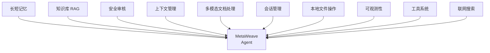
```mermaid
flowchart TD
    长短记忆["长短记忆"] & 知识库RAG["知识库 RAG"] & 安全审核["安全审核"] & 上下文管理["上下文管理"] & 多模态文档处理["多模态文档处理"] --> agent
    agent["MetaWeave<br/>Agent"]
    会话管理["会话管理"] & 规划与编排["本地文件操作"] & 可观测性["可观测性"] & 工具系统["工具系统"] & 联网搜索["联网搜索"] --> agent
```

#### Agent状态转移图
##### Simple模式


```mermaid
flowchart LR
    START -->|"小模型判别: 无需工具"| agent_simple["agent (直答)\n小模型直接生成回答"]
    agent_simple --> END
```

Simple 模式走轻量直答路径。不经过 LangGraph 循环，直接用小模型输出回答。适用于问候、短答等明显无需调用工具的输入。

##### ReAct模式

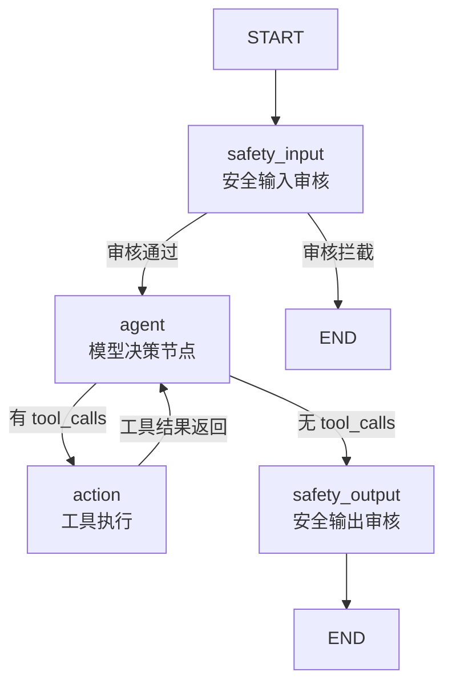
```mermaid
flowchart TD
    START --> safety_input["safety_input\n安全输入审核"]

    safety_input -->|"审核通过"| agent_react["agent\n模型决策节点"]
    safety_input -->|"审核拦截"| END_intercept["END"]

    agent_react -->|"有 tool_calls"| action_react["action\n工具执行"]
    agent_react -->|"无 tool_calls"| safety_output_react["safety_output\n安全输出审核"]

    action_react -->|"工具结果返回"| agent_react
    safety_output_react --> END_react["END"]
```

ReAct 模式是标准的"思考-行动-观察"循环。agent 节点同时充当决策者和观察者，每轮只调用一次 LLM。有工具调用就执行并回到 agent，没有工具调用就输出审核后结束。

##### Plan模式(Plan-and-Execute)

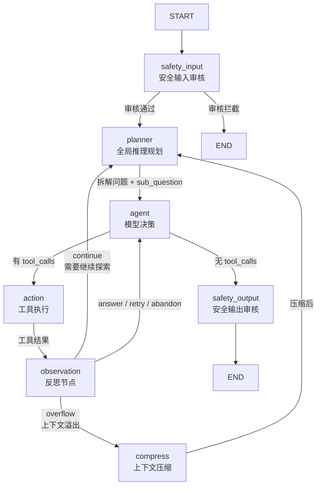
```mermaid
flowchart TD
    START --> safety_input["safety_input\n安全输入审核"]

    safety_input -->|"审核通过"| planner["planner\n全局推理规划"]
    safety_input -->|"审核拦截"| END_intercept["END"]

    planner -->|"拆解问题 + sub_question"| agent_plan["agent\n模型决策"]

    agent_plan -->|"有 tool_calls"| action["action\n工具执行"]
    agent_plan -->|"无 tool_calls"| safety_output["safety_output\n安全输出审核"]

    action -->|"工具结果"| observation["observation\n反思节点"]

    observation -->|"continue\n需要继续探索"| planner
    observation -->|"answer / retry / abandon"| agent_plan
    observation -->|"overflow\n上下文溢出"| compress["compress\n上下文压缩"]

    compress -->|"压缩后"| planner
    safety_output --> END["END"]
```

Plan 模式经过"规划→执行→观察"的循环，每轮会调用 2~3 次 LLM。planner 负责拆解问题，observation 根据工具结果判断要继续执行、重试、给出答案，还是先压缩上下文再接续规划。


### 记忆机制

##### 长期记忆 / 知识库入库流程

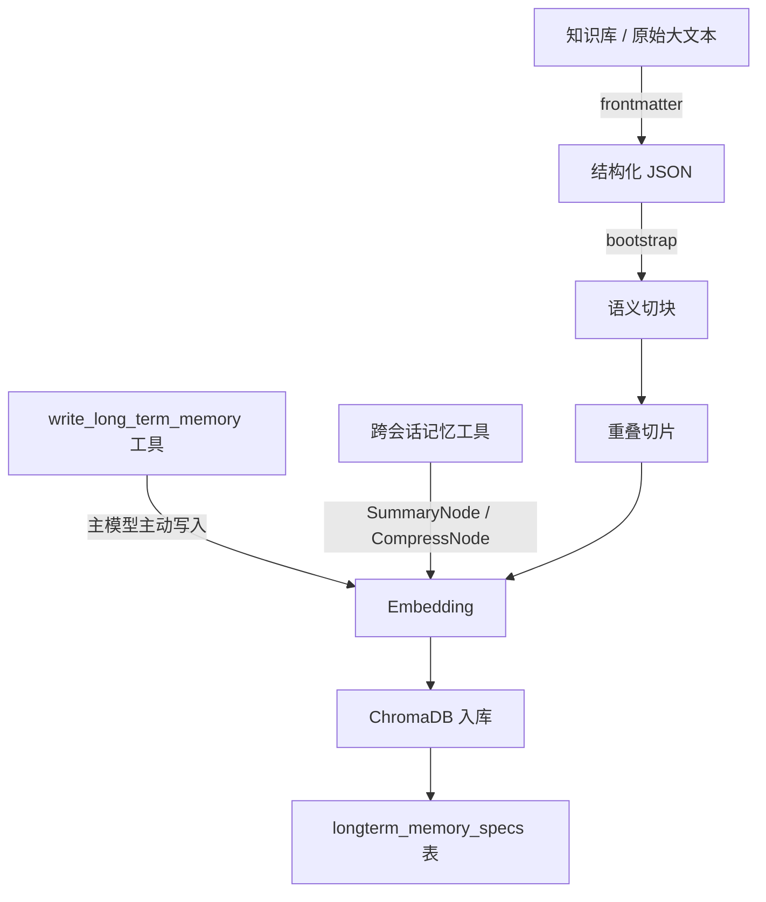
```mermaid
flowchart TD
    A["write_long_term_memory 工具"] -->|"主模型主动写入"| H["Embedding"]
    B["跨会话记忆工具"] -->|"SummaryNode / CompressNode"| H
    C["知识库 / 原始大文本"] -->|"frontmatter"| G["结构化 JSON"]
    G -->|"bootstrap"| D["语义切块"]
    D --> E["重叠切片"]
    E --> H
    H --> F["ChromaDB 入库"]
    F --> I["longterm_memory_specs 表"]
```

##### RAG 召回流程

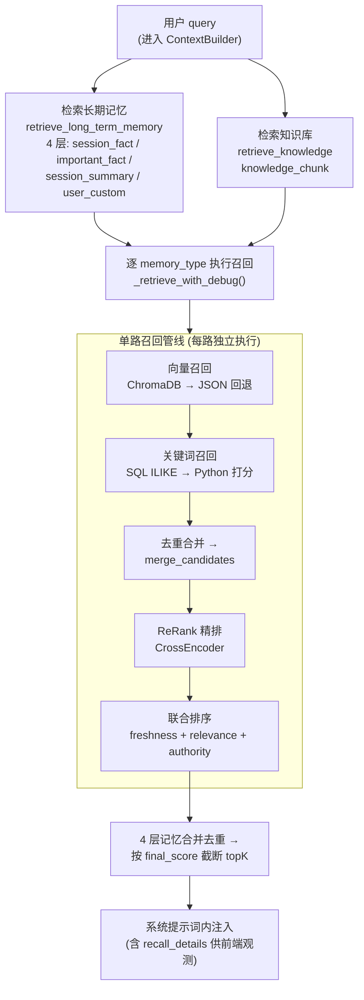
```mermaid
flowchart TD
    A["用户 query<br/>(进入 ContextBuilder)"] --> B["检索长期记忆<br/>retrieve_long_term_memory<br/>4 层: session_fact / important_fact /<br/>session_summary / user_custom"]
    A --> C["检索知识库<br/>retrieve_knowledge<br/>knowledge_chunk"]

    B --> D["逐 memory_type 执行召回<br/>_retrieve_with_debug()"]
    C --> D

    subgraph recall_pipeline["单路召回管线 (每路独立执行)"]
        direction LR
        E["向量召回<br/>ChromaDB → JSON 回退"] --> F["关键词召回<br/>SQL ILIKE → Python 打分"]
        F --> G["去重合并 →<br/>merge_candidates"]
        G --> H["ReRank 精排<br/>CrossEncoder"]
        H --> I["联合排序<br/>freshness + relevance + authority"]
    end

    D --> recall_pipeline
    I --> J["4 层记忆合并去重 →<br/>按 final_score 截断 topK"]
    J --> K["系统提示词内注入<br/>(含 recall_details 供前端观测)"]
```

##### 记忆时效性机制

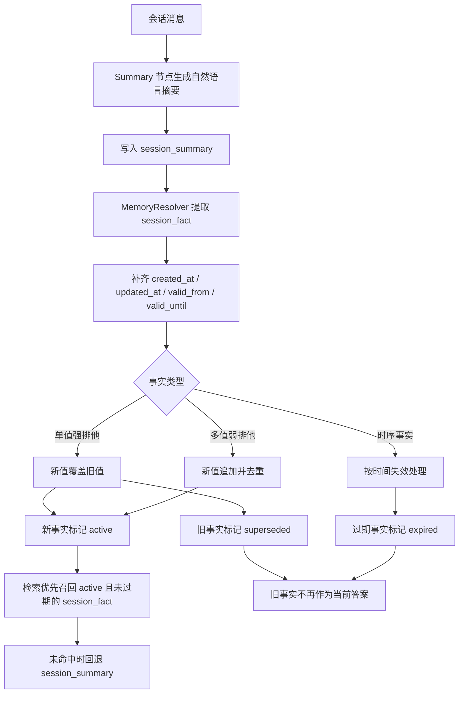
```mermaid
flowchart TD
    A[会话消息] --> B[Summary 节点生成自然语言摘要]
    B --> C[写入 session_summary]
    C --> D[MemoryResolver 提取 session_fact]
    D --> E[补齐 created_at / updated_at / valid_from / valid_until]
    E --> F{事实类型}
    F -->|单值强排他| G[新值覆盖旧值]
    F -->|多值弱排他| H[新值追加并去重]
    F -->|时序事实| I[按时间失效处理]
    G --> J[旧事实标记 superseded]
    G --> K[新事实标记 active]
    H --> K
    I --> L[过期事实标记 expired]
    K --> M[检索优先召回 active 且未过期的 session_fact]
    J --> N[旧事实不再作为当前答案]
    L --> N
    M --> O[未命中时回退 session_summary]
```


##### 混合检索与ReRank机制

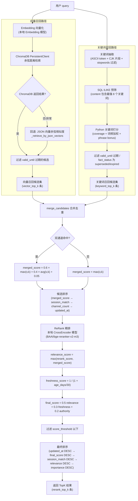
```mermaid
flowchart TD
    A["用户 query"] --> B["Embedding 向量化<br/>(本地 Embedding 模型)"]
    A --> C["关键词抽取<br/>(ASCII token + CJK 片段 + stopwords 过滤)"]

    subgraph vector_path["向量召回路径"]
        B --> D["ChromaDB PersistentClient<br/>余弦距离检索"]
        D --> DA{"ChromaDB 返回结果?"}
        DA -->|"是"| E["过滤 valid_until 过期的候选"]
        DA -->|"否/异常"| DB["回退: JSON 向量余弦相似度<br/>_retrieve_by_json_vectors"]
        DB --> E
        E --> F["向量召回候选集<br/>(vector_top_k 条)"]
    end

    subgraph keyword_path["关键词召回路径"]
        C --> G["SQL ILIKE 预筛<br/>(content 包含最强 8 个关键词)"]
        G --> H["Python 关键词打分<br/>(coverage + 词频加权 + phrase bonus)"]
        H --> I["过滤 valid_until 过期 /<br/>fact_status 为 superseded/expired"]
        I --> J["关键词召回候选集<br/>(keyword_top_k 条)"]
    end

    F --> K["merge_candidates 合并去重"]
    J --> K

    K --> L{"双通道命中?"}
    L -->|"是"| M["merged_score = 0.6 × max(v,k) + 0.4 × avg(v,k) + 0.05"]
    L -->|"否"| N["merged_score = max(v,k)"]
    M --> O["候选排序<br/>(merged_score → session_match → channel_count → updated_at)"]
    N --> O

    O --> P["ReRank 精排<br/>本地 CrossEncoder 模型<br/>(BAAI/bge-reranker-v2-m3)"]

    P --> Q1["relevance_score = max(rerank_score, merged_score)"]
    Q1 --> Q2["freshness_score = 1 / (1 + age_days/30)"]
    Q2 --> Q3["final_score = 0.5·relevance + 0.3·freshness + 0.2·authority"]
    Q3 --> R["过滤 score_threshold 以下"]
    R --> S["最终排序<br/>(updated_at DESC → final_score DESC →<br/> session_match DESC → relevance DESC → importance DESC)"]
    S --> T["返回 TopK 结果<br/>(rerank_top_k 条)"]
```

### 上下文与状态机制

##### 上下文构建器

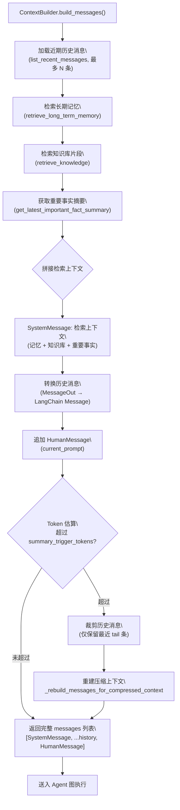
```mermaid
flowchart TD
    A["ContextBuilder.build_messages()"] --> B["加载近期历史消息\\n(list_recent_messages, 最多 N 条)"]
    B --> C["检索长期记忆\\n(retrieve_long_term_memory)"]
    C --> D["检索知识库片段\\n(retrieve_knowledge)"]
    D --> E["获取重要事实摘要\\n(get_latest_important_fact_summary)"]
    E --> F{"拼接检索上下文"}
    F --> G["SystemMessage: 检索上下文\\n(记忆 + 知识库 + 重要事实)"]
    G --> H["转换历史消息\\n(MessageOut → LangChain Message)"]
    H --> I["追加 HumanMessage\\n(current_prompt)"]
    I --> J{"Token 估算\\n超过 summary_trigger_tokens?"}
    J -->|"未超过"| K["返回完整 messages 列表\\n[SystemMessage, ...history, HumanMessage]"]
    J -->|"超过"| L["裁剪历史消息\\n(仅保留最近 tail 条)"]
    L --> M["重建压缩上下文\\n_rebuild_messages_for_compressed_context"]
    M --> K
    K --> N["送入 Agent 图执行"]
```

**消息角色优先级（上下文拼装顺序）：**  
`SystemMessage(检索上下文)` → `历史消息按时间正序` → `HumanMessage(当前输入)`  
检索上下文内部优先级：`important_fact_summary > 当前 session 摘要 > 长期记忆 > 知识库`

##### 上下文压缩机制

###### compress 路径: 上下文压缩 / 重要事实摘要流程

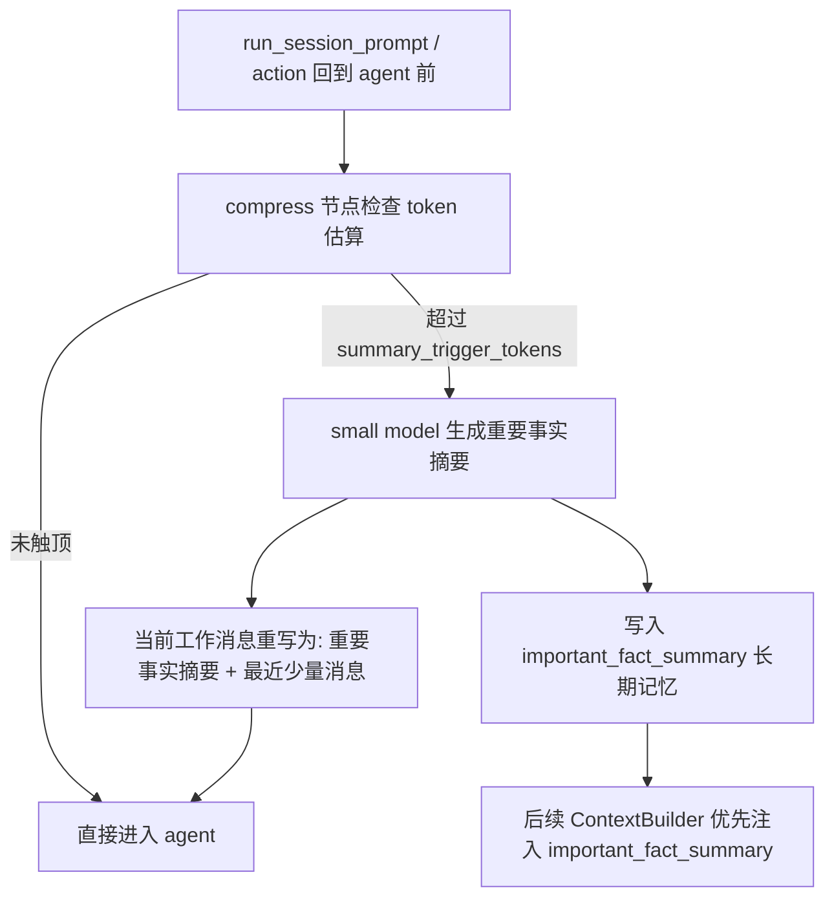
```mermaid
flowchart TD
    A["run_session_prompt / action 回到 agent 前"] --> B["compress 节点检查 token 估算"]
    B -->|"未触顶"| C["直接进入 agent"]
    B -->|"超过 summary_trigger_tokens"| D["small model 生成重要事实摘要"]
    D --> E["写入 important_fact_summary 长期记忆"]
    D --> F["当前工作消息重写为: 重要事实摘要 + 最近少量消息"]
    F --> C
    E --> G["后续 ContextBuilder 优先注入 important_fact_summary"]
```

###### summary 路径: 长期记忆摘要流程

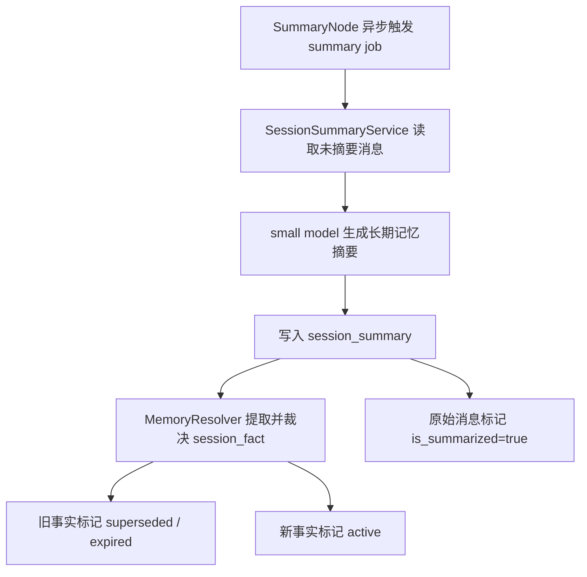
```mermaid
flowchart TD
    A["SummaryNode 异步触发 summary job"] --> B["SessionSummaryService 读取未摘要消息"]
    B --> C["small model 生成长期记忆摘要"]
    C --> D["写入 session_summary"]
    D --> E["MemoryResolver 提取并裁决 session_fact"]
    E --> F["旧事实标记 superseded / expired"]
    E --> G["新事实标记 active"]
    D --> H["原始消息标记 is_summarized=true"]
```

##### 探索状态机制

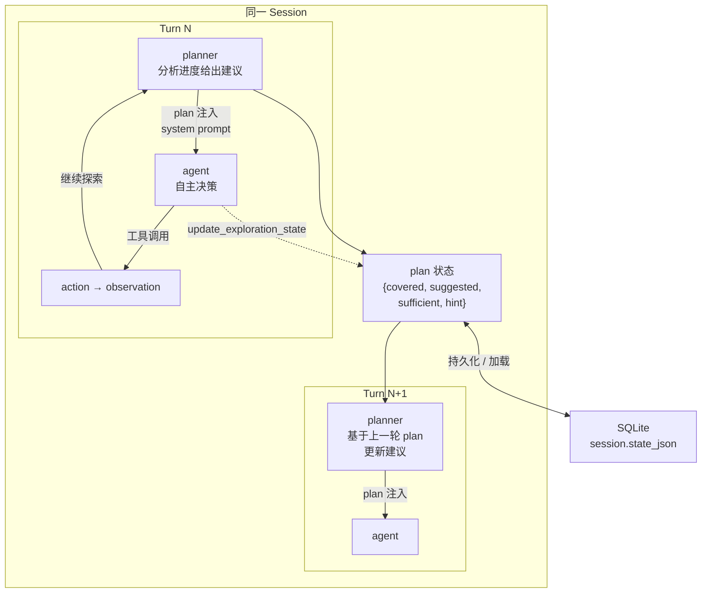
```mermaid
flowchart TD
    subgraph session["同一 Session"]
        subgraph turn1["Turn N"]
            P1["planner<br/>分析进度给出建议"] -->|"plan 注入<br/>system prompt"| A1["agent<br/>自主决策"]
            A1 -->|"工具调用"| T1["action → observation"]
            T1 -->|"继续探索"| P1
        end

        subgraph turn2["Turn N+1"]
            P2["planner<br/>基于上一轮 plan<br/>更新建议"] -->|"plan 注入"| A2["agent"]
        end

        plan["plan 状态<br/>{covered, suggested,<br/>sufficient, hint}"]

        P1 --> plan
        A1 -.->|"update_exploration_state"| plan
        plan --> P2
    end

    plan <-->|"持久化 / 加载"| DB["SQLite<br/>session.state_json"]
```

### 任务调度与节流机制

##### 模型路由与大/小模型池

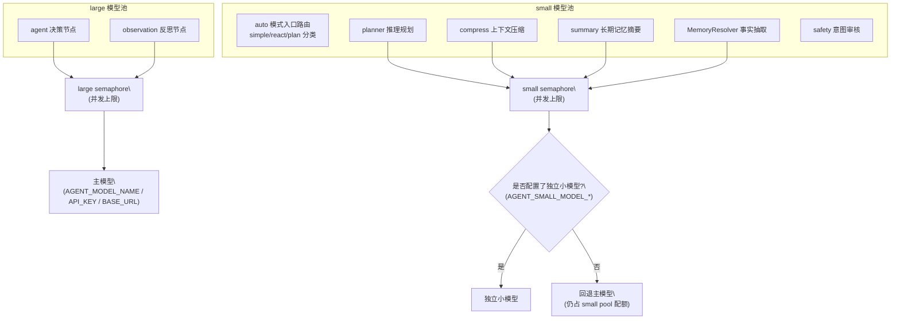
```mermaid
flowchart TD
    subgraph large_pool["large 模型池"]
        L1["agent 决策节点"]
        L2["observation 反思节点"]
    end

    subgraph small_pool["small 模型池"]
        S0["auto 模式入口路由<br/>simple/react/plan 分类"]
        S1["planner 推理规划"]
        S2["compress 上下文压缩"]
        S3["summary 长期记忆摘要"]
        S4["MemoryResolver 事实抽取"]
        S5["safety 意图审核"]
    end

    L1 --> LA["large semaphore\\n(并发上限)"]
    L2 --> LA
    S1 --> SA["small semaphore\\n(并发上限)"]
    S2 --> SA
    S3 --> SA
    S4 --> SA

    LA --> ML["主模型\\n(AGENT_MODEL_NAME / API_KEY / BASE_URL)"]
    SA --> M2{"是否配置了独立小模型?\\n(AGENT_SMALL_MODEL_*)"}

    M2 -->|"是"| ML2["独立小模型"]
    M2 -->|"否"| MF2["回退主模型\\n(仍占 small pool 配额)"]
```

##### (Redis)多级队列调度

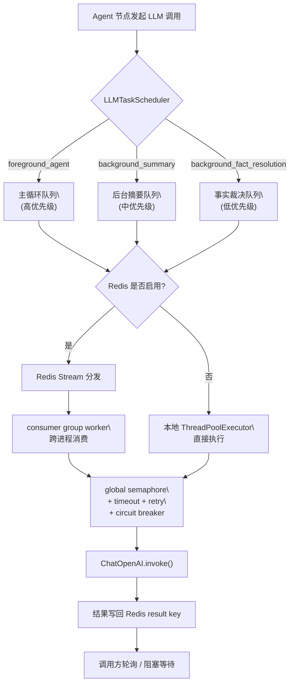
```mermaid
flowchart TD
    A["Agent 节点发起 LLM 调用"] --> B{"LLMTaskScheduler"}

    B -->|"foreground_agent"| C["主循环队列\\n(高优先级)"]
    B -->|"background_summary"| D["后台摘要队列\\n(中优先级)"]
    B -->|"background_fact_resolution"| E["事实裁决队列\\n(低优先级)"]

    C --> F{"Redis 是否启用?"}
    D --> F
    E --> F

    F -->|"否"| G["本地 ThreadPoolExecutor\\n直接执行"]
    F -->|"是"| H["Redis Stream 分发"]

    H --> I["consumer group worker\\n跨进程消费"]
    I --> J["global semaphore\\n+ timeout + retry\\n+ circuit breaker"]

    G --> J
    J --> K["ChatOpenAI.invoke()"]
    K --> L["结果写回 Redis result key"]
    L --> M["调用方轮询 / 阻塞等待"]
```

##### 节流机制

流式对话中每个 SSE token 都直接写入 Vue 响应式对象，触发完整响应链（`visibleMessages` 全量 reduce → 模板重渲染 → vdom diff → scroll 计算）。随会话消息累积（100+ 条），每秒 30~60 次的全量重算产生 ~3,000 个临时对象，GC 频繁停顿导致卡顿。

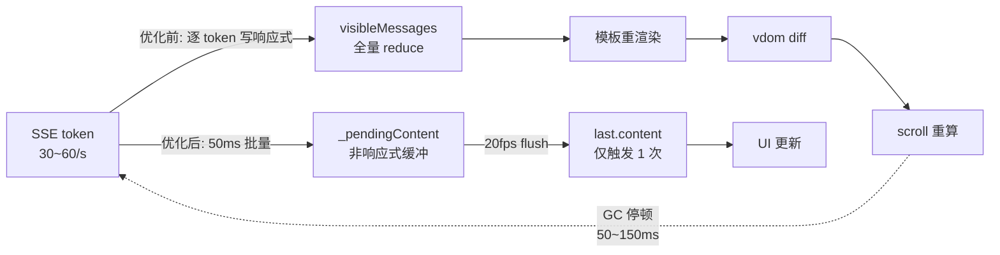
```mermaid
flowchart LR
    A["SSE token<br/>30~60/s"] -->|"优化前: 逐 token 写响应式"| B["visibleMessages<br/>全量 reduce"]
    B --> C["模板重渲染"]
    C --> D["vdom diff"]
    D --> E["scroll 重算"]
    E -.->|"GC 停顿<br/>50~150ms"| A

    A -->|"优化后: 50ms 批量"| F["_pendingContent<br/>非响应式缓冲"]
    F -->|"20fps flush"| G["last.content<br/>仅触发 1 次"]
    G --> H["UI 更新"]
```

**_pendingContent**（`src/stores/chat.js`）：非响应式字符串缓冲，`updateStreamContent` 存入最新累积内容（0 次响应链触发），`flushStreamContent` 每 50ms 写入 `last.content`（1 次响应链触发），`forceFlushContent` 在流结束/中断/异常时立即清空缓冲防丢字。

| 指标 | 优化前 | 优化后 |
|---|---|
| 每次 token 响应链触发 | 1 次 | 0 次 |
| 每秒响应链触发（100 条消息） | ~30 次 | ~20 次 |
| 每秒临时对象 | ~3,000 | ~1,000 |
| 长对话滚动 | 频繁卡顿，无法滚动 | 平滑跟随 |

### 安全机制

##### 三层审核设计

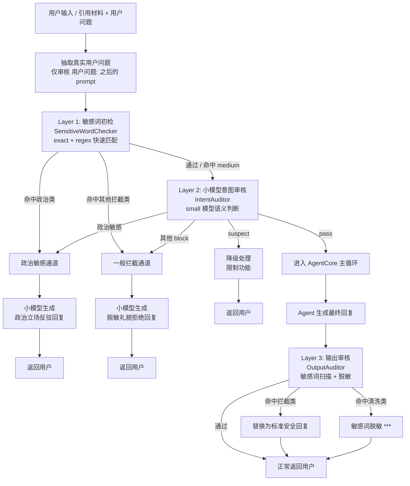
```mermaid
flowchart TD
    A[用户输入 / 引用材料 + 用户问题] --> A1[抽取真实用户问题<br/>仅审核 用户问题: 之后的 prompt]
    A1 --> B[Layer 1: 敏感词初检<br/>SensitiveWordChecker<br/>exact + regex 快速匹配]
    
    B -->|命中政治类| C1[政治敏感通道]
    B -->|命中其他拦截类| C2[一般拦截通道]
    B -->|通过 / 命中 medium| D[Layer 2: 小模型意图审核<br/>IntentAuditor<br/>small 模型语义判断]
    
    C1 --> G1[小模型生成<br/>政治立场反驳回复]
    C2 --> G2[小模型生成<br/>脱敏礼貌拒绝回复]
    
    G1 --> K1[返回用户]
    G2 --> K2[返回用户]
    
    D -->|政治敏感| C1
    D -->|其他 block| C2
    D -->|suspect| E[降级处理<br/>限制功能]
    D -->|pass| F[进入 AgentCore 主循环]
    
    E --> K3[返回用户]
    F --> G[Agent 生成最终回复]
    
    G --> H[Layer 3: 输出审核<br/>OutputAuditor<br/>敏感词扫描 + 脱敏]
    
    H -->|命中拦截类| I[替换为标准安全回复]
    H -->|命中清洗类| J[敏感词脱敏 ***]
    H -->|通过| K[正常返回用户]
    
    I --> K
    J --> K
```

`safety_input`的审核对象是用户真实请求,不是被用户引用或要求分析的文档正文。对于“用户问题引用了以下文档片段...用户问题: ...”这种由`ContextBuilder`包装后的输入,审核服务会先取最后的`用户问题:`段落再进入敏感词初检和小模型意图审核,避免知识库文件正文中的词触发入口误拦截。输出审核仍然作用于 Agent 最终回复,用于防止生成内容本身违规。

### 知识库业务设计


##### 多模态文件入库流程

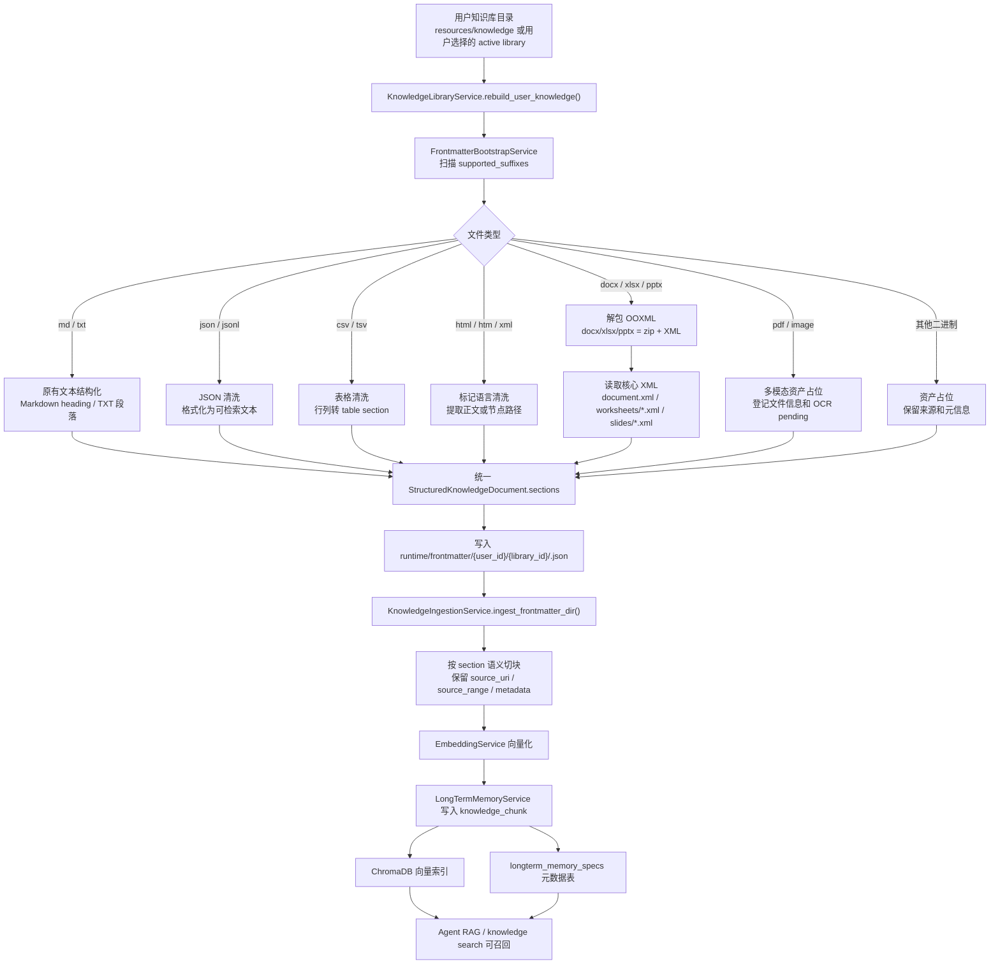
```mermaid
flowchart TD
    A["用户知识库目录<br/>resources/knowledge 或用户选择的 active library"] --> B["KnowledgeLibraryService.rebuild_user_knowledge()"]
    B --> C["FrontmatterBootstrapService<br/>扫描 supported_suffixes"]

    C --> D{"文件类型"}
    D -->|"md / txt"| E["原有文本结构化<br/>Markdown heading / TXT 段落"]
    D -->|"json / jsonl"| F["JSON 清洗<br/>格式化为可检索文本"]
    D -->|"csv / tsv"| G["表格清洗<br/>行列转 table section"]
    D -->|"html / htm / xml"| H["标记语言清洗<br/>提取正文或节点路径"]
    D -->|"docx / xlsx / pptx"| I0["解包 OOXML<br/>docx/xlsx/pptx = zip + XML"]
    I0 --> I["读取核心 XML<br/>document.xml / worksheets/*.xml / slides/*.xml"]
    D -->|"pdf / image"| J["多模态资产占位<br/>登记文件信息和 OCR pending"]
    D -->|"其他二进制"| K["资产占位<br/>保留来源和元信息"]

    E --> L["统一 StructuredKnowledgeDocument.sections"]
    F --> L
    G --> L
    H --> L
    I --> L
    J --> L
    K --> L

    L --> M["写入 runtime/frontmatter/{user_id}/{library_id}/<document>.json"]
    M --> N["KnowledgeIngestionService.ingest_frontmatter_dir()"]
    N --> O["按 section 语义切块<br/>保留 source_uri / source_range / metadata"]
    O --> P["EmbeddingService 向量化"]
    P --> Q["LongTermMemoryService 写入 knowledge_chunk"]
    Q --> R["ChromaDB 向量索引"]
    Q --> S["longterm_memory_specs 元数据表"]

    R --> T["Agent RAG / knowledge search 可召回"]
    S --> T
```

##### 三路并行搜索

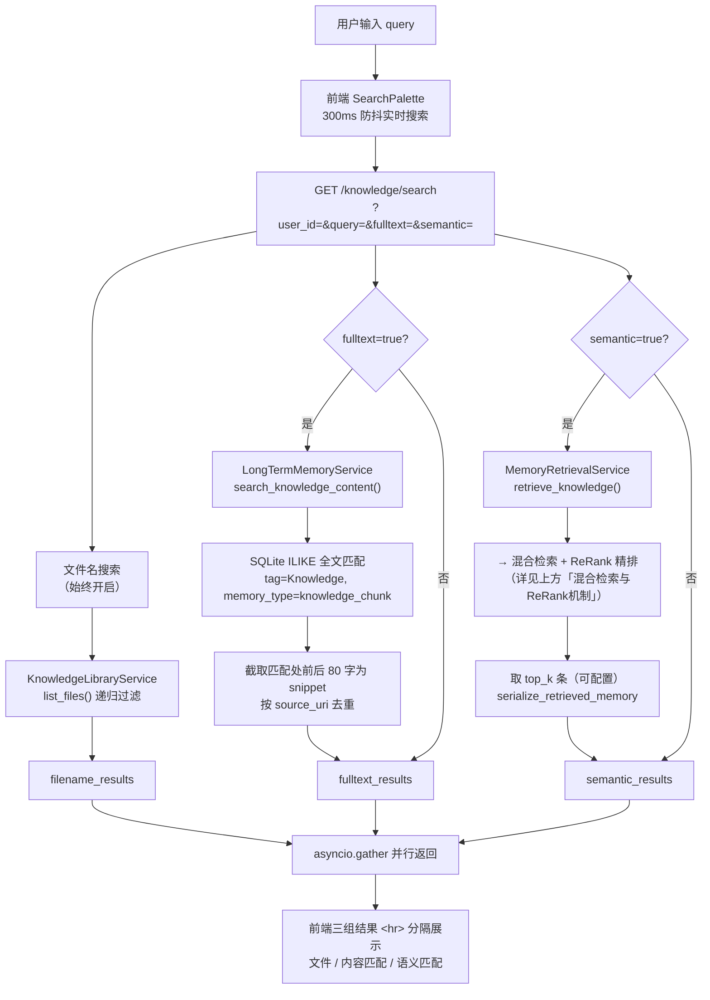
```mermaid
flowchart TD
    A["用户输入 query"] --> B["前端 SearchPalette<br/>300ms 防抖实时搜索"]

    B --> C["GET /knowledge/search<br/>?user_id=&query=&fulltext=&semantic="]

    C --> D["文件名搜索<br/>（始终开启）"]
    C --> E{"fulltext=true?"}
    C --> F{"semantic=true?"}

    D --> G["KnowledgeLibraryService<br/>list_files() 递归过滤"]
    G --> H["filename_results"]

    E -->|是| I["LongTermMemoryService<br/>search_knowledge_content()"]
    I --> J["SQLite ILIKE 全文匹配<br/>tag=Knowledge, memory_type=knowledge_chunk"]
    J --> K["截取匹配处前后 80 字为 snippet<br/>按 source_uri 去重"]
    K --> L["fulltext_results"]
    E -->|否| L

    F -->|是| M["MemoryRetrievalService<br/>retrieve_knowledge()"]
    M --> N["→ 混合检索 + ReRank 精排<br/>（详见上方「混合检索与ReRank机制」）"]
    N --> R["取 top_k 条（可配置）<br/>serialize_retrieved_memory"]
    R --> S["semantic_results"]
    F -->|否| S

    H --> T["asyncio.gather 并行返回"]
    L --> T
    S --> T

    T --> U["前端三组结果 &lt;hr&gt; 分隔展示<br/>文件 / 内容匹配 / 语义匹配"]
```

##### 引用溯源

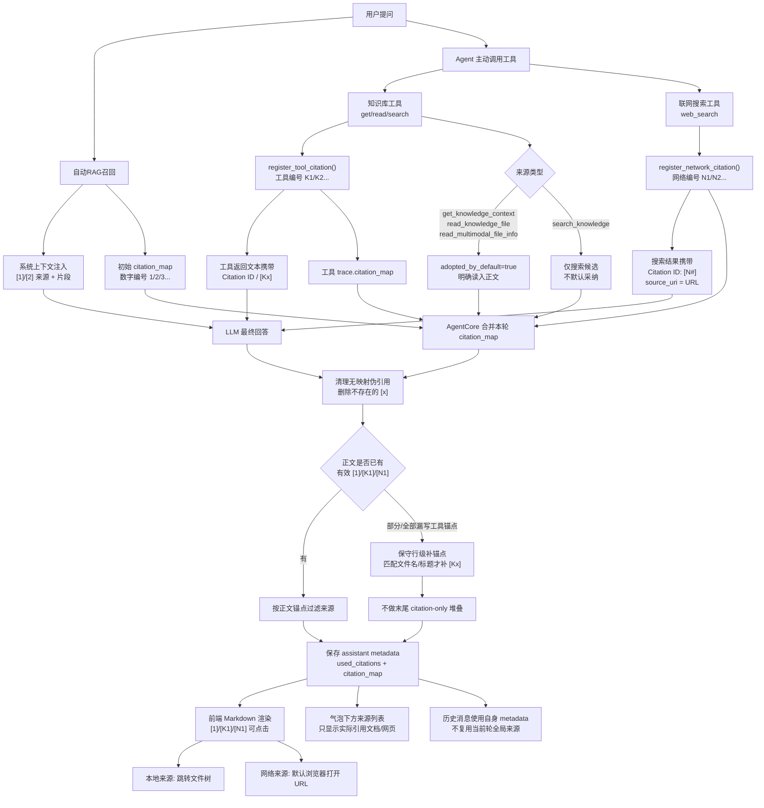
```mermaid
flowchart TD
    A["用户提问"] --> B["自动RAG召回"]
    B --> C["系统上下文注入<br/>[1]/[2] 来源 + 片段"]
    B --> D["初始 citation_map<br/>数字编号 1/2/3..."]

    A --> E["Agent 主动调用工具"]
    E --> F["知识库工具<br/>get/read/search"]
    F --> G["register_tool_citation()<br/>工具编号 K1/K2..."]
    G --> H["工具返回文本携带<br/>Citation ID / [Kx]"]
    G --> I["工具 trace.citation_map"]
    F --> Q{"来源类型"}
    Q -->|"get_knowledge_context<br/>read_knowledge_file<br/>read_multimodal_file_info"| R["adopted_by_default=true<br/>明确读入正文"]
    Q -->|"search_knowledge"| S["仅搜索候选<br/>不默认采纳"]

    E --> X["联网搜索工具<br/>web_search"]
    X --> Y["register_network_citation()<br/>网络编号 N1/N2..."]
    Y --> Z["搜索结果携带<br/>Citation ID: [N#]<br/>source_uri = URL"]

    D --> J["AgentCore 合并本轮 citation_map"]
    I --> J
    R --> J
    S --> J
    Y --> J
    C --> K["LLM 最终回答"]
    H --> K
    Z --> K

    K --> L["清理无映射伪引用<br/>删除不存在的 [x]"]
    J --> L
    L --> M{"正文是否已有<br/>有效 [1]/[K1]/[N1]"}
    M -->|"有"| N["按正文锚点过滤来源"]
    M -->|"部分/全部漏写工具锚点"| O["保守行级补锚点<br/>匹配文件名/标题才补 [Kx]"]
    O --> P["不做末尾 citation-only 堆叠"]
    N --> T["保存 assistant metadata<br/>used_citations + citation_map"]
    P --> T
    T --> U["前端 Markdown 渲染<br/>[1]/[K1]/[N1] 可点击"]
    U --> U1["本地来源: 跳转文件树"]
    U --> U2["网络来源: 默认浏览器打开 URL"]
    T --> V["气泡下方来源列表<br/>只显示实际引用文档/网页"]
    T --> W["历史消息使用自身 metadata<br/>不复用当前轮全局来源"]
```
##### 文件上传

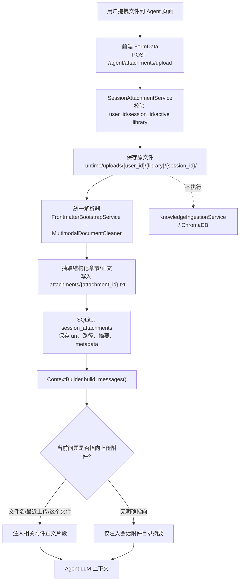
```mermaid
flowchart TD
    A["用户拖拽文件到 Agent 页面"] --> B["前端 FormData<br/>POST /agent/attachments/upload"]
    B --> C["SessionAttachmentService<br/>校验 user_id/session_id/active library"]
    C --> D["保存原文件<br/>runtime/uploads/{user_id}/{library}/{session_id}/"]
    D --> E["统一解析器<br/>FrontmatterBootstrapService + MultimodalDocumentCleaner"]
    E --> F["抽取结构化章节/正文<br/>写入 .attachments/{attachment_id}.txt"]
    F --> G["SQLite: session_attachments<br/>保存 uri、路径、摘要、metadata"]
    G --> H["ContextBuilder.build_messages()"]
    H --> I{"当前问题是否指向上传附件?"}
    I -->|"文件名/最近上传/这个文件"| J["注入相关附件正文片段"]
    I -->|"无明确指向"| K["仅注入会话附件目录摘要"]
    J --> L["Agent LLM 上下文"]
    K --> L
    D -. "不执行" .-> M["KnowledgeIngestionService / ChromaDB"]
```

- 上传附件是 session-scoped context asset, 不是知识库资产; 它不写入知识库目录, 不生成可灌库 frontmatter, 不进入 Embedding/ChromaDB。
- 解析链路复用文件树/知识库的同一套结构化解析器。差别只在消费端: 知识库文件解析后进入灌库, 上传附件解析后只登记到会话附件表并供 ContextBuilder 注入。
- 同一个 session 的后续提问会保留附件目录; 当用户说“这个文件”“刚才上传的文件”或直接提到文件名时, ContextBuilder 会把相关附件正文片段放进本轮 system context。

## 接口设计

本服务同时提供 **REST (FastAPI)** 和 **gRPC (protobuf)** 两套接口，二者功能完全等价、返回结构一致，可根据客户端需求任选其一。

> 约定：下表中参数字段名在 REST 和 gRPC 中相同；REST 使用 JSON body / query string，gRPC 使用对应的 proto message。

### 一、Session 管理

|方法|REST|gRPC|功能|请求参数|返回结构|
|-|-|-|-|-|-|
|ListSessions|`GET /sessions?user_id=`|`ListUserSessions`|列出用户全部会话，按更新时间倒序|`user_id` (string, 必填)|`[{session_id, user_id, session_name, created_at, updated_at}]`|
|CreateSession|`POST /sessions`|`CreateSession`|创建新会话|`user_id` (string, 必填), `session_name` (string, 可选)|`{session_id, user_id, session_name, created_at, updated_at}`|
|GetSession|`GET /sessions/{id}`|`GetSession`|获取单个会话详情|`session_id` (string, 必填)|`{session_id, user_id, session_name, created_at, updated_at}`|
|UpdateSessionName|`PUT /sessions/{id}/name`|`UpdateSessionName`|重命名会话|`session_id` (string, 必填), `session_name` (string, 必填)|`{session_id, user_id, session_name, created_at, updated_at}`|
|DeleteSession|`DELETE /sessions/{id}`|`DeleteSession`|删除单个会话|`session_id` (string, 必填)|`{ok, deleted_count}`|
|DeleteAllSessions|`DELETE /sessions?user_id=`|`DeleteAllSessions`|清空用户全部会话|`user_id` (string, 必填)|`{ok, deleted_count}`|

### 二、消息历史

|方法|REST|gRPC|功能|请求参数|返回结构|
|-|-|-|-|-|-|
|ListMessages|`GET /sessions/{id}/messages?user_id=&limit=`|`ListMessages`|拉取会话历史消息|`session_id` (string, 必填), `user_id` (string, 必填), `limit` (int, 默认 50)|`[{message_id, session_id, user_id, role, content, tool_calls, metadata, created_at}]`|

### 三、Agent 流式对话

|方法|REST|gRPC|功能|请求参数|流事件字段|
|-|-|-|-|-|-|
|StreamSessionPrompt|`GET /agent/stream?prompt=&user_id=&session_id=`|`StreamSessionPrompt`|带 Session 上下文的 SSE 流式对话（长期记忆 + 知识库 + 持久化）|`prompt` (string, 必填), `user_id` (string, 必填), `session_id` (string, 必填)|`node, content, tool_calls, trace, model_name, type, context_messages, metadata, error, done`|
|StreamRun|`GET /agent/stream-run?prompt=&user_id=&session_id=`|`StreamRun`|无状态 SSE 流式运行（无记忆/召回/持久化）|同上|同上|

> 流事件说明：
> - `type`: 普通 chunk 为空；`"system_prompt"` 时 `metadata` 含 RAG 指标；`"context_mirror"` 时 `context_messages` 含模型完整上下文
> - `done`: 流结束标志（REST 以 `data: [DONE]\\n\\n` 结束）
> - `error`: 仅在发生错误时非空，含友好错误描述

### 四、Agent 非流式调用

|方法|REST|gRPC|功能|请求参数|返回结构|
|-|-|-|-|-|-|
|RunSessionPrompt|`POST /agent/run`|`RunSessionPrompt`|带 Session 上下文的单次运行|`prompt` (string, 必填), `user_id` (string, 必填), `session_id` (string, 必填)|`{graph_diagram_path, graph_diagram, final_output, events}`|
|RunOnce|`POST /agent/run-once`|`RunOnce`|无状态单次运行|同上|同上|
|CancelSession|`POST /agent/cancel`|`CancelSession`|取消正在执行的 Agent 图|`session_id` (string, 必填)|`{ok}`|

### 五、观测

|方法|REST|gRPC|功能|请求参数|返回结构|
|-|-|-|-|-|-|
|GetEvents|`GET /agent/events?session_id=&user_id=`|`GetEvents`|获取最近一次执行的 trace 事件列表|`session_id` (string, 必填), `user_id` (string, 必填)|`{session_id, user_id, event_count, events: [{message_id, role, node, content, tool_calls, created_at, metadata}]}`|
|GetRecallDetails|`GET /agent/recall-details?session_id=&user_id=`|`GetRecallDetails`|获取最近一次 RAG 召回快照（pre/post rerank）|同上|`{session_id, user_id, created_at, query, rag_metrics, memory_recall, knowledge_recall}`|

### 六、用户设置

|方法|REST|gRPC|功能|请求参数|返回结构|
|-|-|-|-|-|-|
|ListSystemPromptEntries|`GET /settings/system-prompt?user_id=`|`ListSystemPromptEntries`|列出用户全部系统提示词条目|`user_id` (string, 必填)|`{entries: [{prompt_id, content, created_at}]}`|
|AddSystemPromptEntry|`POST /settings/system-prompt/entries`|`AddSystemPromptEntry`|添加一条系统提示词条目|`user_id` (string, 必填), `content` (string, 必填)|`{prompt_id, content, created_at}`|
|DeleteSystemPromptEntry|`DELETE /settings/system-prompt/entries/{prompt_id}`|`DeleteSystemPromptEntry`|删除指定提示词条目|`prompt_id` (string, 必填)|`{ok, deleted_count}`|
|ListCustomMemories|`GET /settings/memories?user_id=`|`ListCustomMemories`|列出用户全部自定义长期记忆|`user_id` (string, 必填)|`[{memory_id, content, importance, created_at}]`|
|AddCustomMemory|`POST /settings/memories`|`AddCustomMemory`|添加一条自定义长期记忆（自动向量化入库）|`user_id` (string, 必填), `content` (string, 必填), `importance` (float, 可选, 默认 0.5)|`{memory_id, content, importance, created_at}`|
|DeleteCustomMemory|`DELETE /settings/memories/{memory_id}`|`DeleteCustomMemory`|删除指定自定义长期记忆|`memory_id` (string, 必填)|`{ok, deleted_count}`|

> 系统提示词条目在每次 Agent 对话时自动全部加载并拼接到系统提示词末尾；自定义长期记忆通过向量检索在相关对话中自动召回。


## MCP 工具接入

AgentService 通过 MCP（Model Context Protocol）协议对接外部工具服务器。Agent 启动时自动发现并注册 MCP 工具，注册后的工具与内置工具无差别可用。

### 启用 MCP

在.env中:

```bash
AGENT_MCP_ENABLED=true
```

### 配置 MCP 服务器

在 `resources/mcp/` 目录下创建 `.json` 配置文件：

```json
[
  {
    "server_id": "filesystem",
    "command": "npx",
    "args": ["-y", "@modelcontextprotocol/server-filesystem", "/path/to/allowed/dir"],
    "enabled": true
  },
  {
    "server_id": "web-search",
    "command": "python",
    "args": ["-m", "my_mcp_server"],
    "enabled": true,
    "env": {
      "API_KEY": "your-api-key"
    }
  }
]
```

每个服务器条目支持以下字段：

|字段|必填|说明|
|-|-|-|
|`server_id`|是|唯一标识符，只允许小写字母、数字、下划线|
|`command`|是|启动 MCP 服务器的可执行文件（`npx`、`python` 等）|
|`args`|否|命令行参数列表|
|`env`|否|注入子进程的环境变量|
|`enabled`|否|是否启用，默认 `true`|
|`encoding`|否|stdio 编码，默认 `"utf-8"`|

如需用环境变量配置，可设置 `AGENT_MCP_SERVERS_JSON`（JSON 字符串）或逐个服务器的环境变量。但推荐使用 JSON 文件方式，更直观且支持多服务器管理。


### 工具命名与调用规则

MCP 工具自动注册为 `{prefix}__{server_id}__{tool_name}` 格式：

* `prefix` — 默认为 `mcp`，可通过 `AGENT_MCP_TOOL_NAME_PREFIX` 自定义
* `server_id` — 配置中指定的服务器标识
* `tool_name` — MCP 服务器上报的工具名称

例如 `filesystem` 服务器的 `read_file` 工具注册为 `mcp__filesystem__read_file`，Agent 在对话中调用此工具时即通过 MCP 协议转发到对应服务器进程执行。

### 运行机制

1. 启动时 AgentCore 扫描 `resources/mcp/*.json`，加载服务器配置
2. 对每个启用的服务器启动子进程，通过 stdio 建立 MCP 会话
3. 调用 `list_tools()` 发现该服务器提供的工具
4. 将所有 MCP 工具包装为与内置工具相同的 `StructuredTool`，注册到工具注册表
5. 对话中 LLM 选择调用 MCP 工具时，通过同步-异步桥接转发到对应 MCP 服务器执行

MCP 工具与内置工具共用同一个工具选择池，LLM 根据任务自动决定是否调用以及调用哪个。
