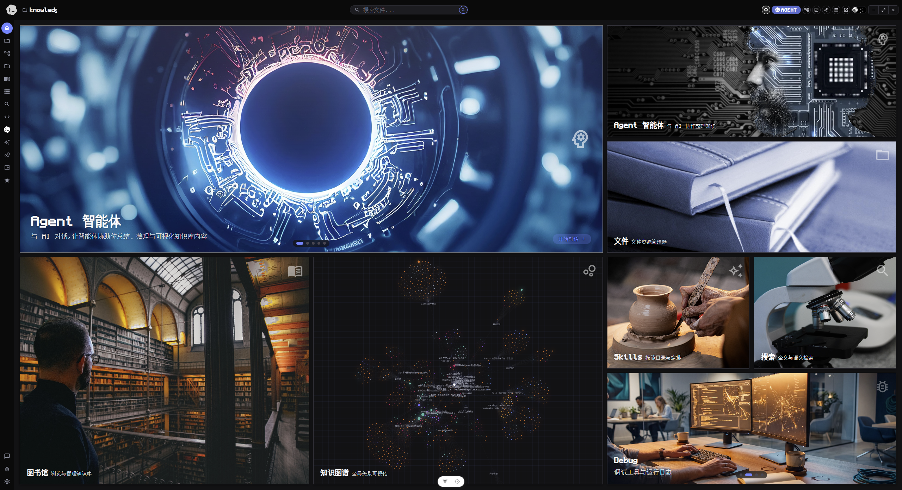
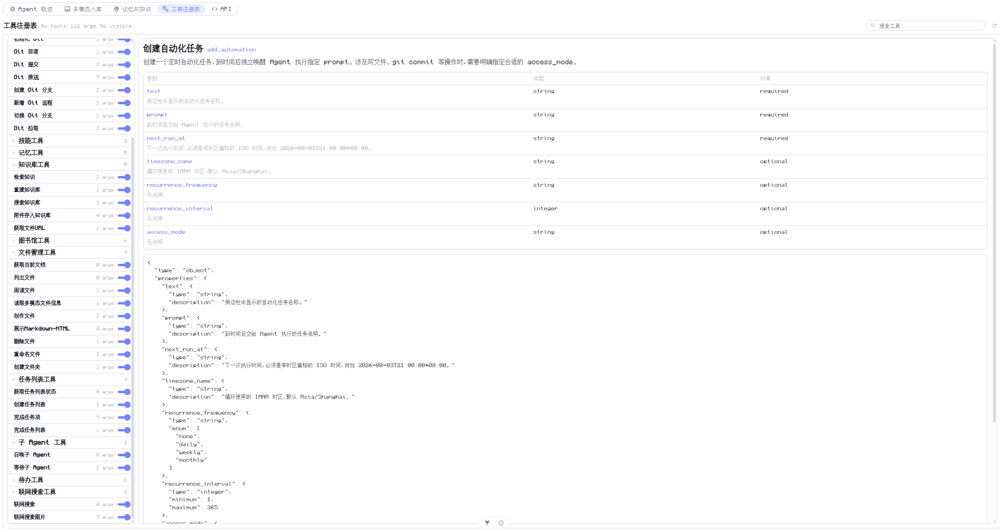

# MetaWeave 元织 - 个人多模态知识库 Agent

## 产品定位

### 项目目标

MetaWeave（元织）是一个建立在个人文件系统上的多模态知识库与 Agent 工作台。它强调可观测和可溯源：用户不仅能让 Agent 使用知识，还能看到知识来自哪里、如何被处理，以及任务执行到了哪一步。

### 现实痛点

个人资料往往散落在 Markdown、PDF、Office 文档、图片、表格和代码中。传统知识库擅长保存文件，却很难让 Agent 统一检索和操作这些不同结构的知识资产。

MetaWeave 将文件、文献、表格、组件和密码条目放在同一个桌面工作台中，并根据内容类型提供合适的浏览、编辑、检索与 Agent 操作方式。

### 项目简介

MetaWeave 集成多轮对话、工具调用、长期记忆、知识库召回、任务队列和多模式推理，可以完成问答、检索、文档理解与自动化任务。前端同时展示模型用量、节点耗时、召回质量和执行轨迹，便于用户理解 Agent 的行为，而不是只看到最终答案。


### 主要服务人群

- 希望在个人文件系统上建立 Agent 中枢的知识管理用户。
- 需要统一管理文档、文献、表格和代码等异构资料的用户。
- 希望自行配置模型、工具和工作流的开发者。

### 设计原则

Agent 框架不能消除模型幻觉。MetaWeave 因此优先提供检索、引用、执行轨迹和调试观测，让用户能够核对依据并发现问题，而不是把模型输出包装成不可解释的结论。


## 核心文档
### 启动与开发
- 启动,构建与部署: [DEVELOPMENT.md](docs/DEVELOPMENT.md)
- 开发规范: [开发规范.md](开发规范.md)
### 功能
- 详细功能介绍: [FEATURES.md](docs/FEATURES.md)
### 系统设计
- 总体架构设计: [ARCHITECTURE.md](docs/ARCHITECTURE.md)
##### 后端
- 业务领域设计: [SERVICES.md](docs/SERVICES.md)
- 部分业务工作流流程图: [WORKFLOW.md](docs/WORKFLOW.md)
- AGENT设计: [AGENT_DESIGN.md](docs/AGENT_DESIGN.md)
- AGENT工具明细: [TOOLS.md](docs/TOOLS.md)
##### 前端
- 前端UI/UX设计规范: [DESIGN.md](docs/DESIGN.md)
### 变更
- TODO: [TODO.md](TODO.md)
- 变更历史: [CHANGE_HISTORY.md](docs/CHANGE_HISTORY.md)
### 接口与扩展
- OPENAPI文档: [metaweave.openapi.json)](docs/api/metaweave.openapi.json)
- MCP 接入: [MCP.md](docs/MCP.md)
- gRPC: [agent_service.proto](protos/agent_service.proto)


## 功能设计

后端服务设计遵循分布式设计原则，配备 REST + gRPC 两套对外接口,形成可插拔、可定制的独立微服务。
### 软件设计
#### 数据库设计
##### 关联库
关联库采用 SQLite 存储智能体会话(`session`)与消息(`message`)，每次对话从关联库加载完整会话上下文, 实现多轮对话管理；
##### 向量库
向量库采用 ChromaDB，多模态文件经格式解析与元数据提取后统一转为结构化 JSON，再按语义切片写入向量库，检索时通过混合检索（向量相似度 + 关键词覆盖）与 ReRank 重排序实现精准召回，每个切片携带源文件路径与偏移信息可追溯至原始文档.
   - 已入库的文件,未入库或者格式不可识别的文件,屏蔽的文件,三类文件将以不同的索引状态图标(绿,红,灰)显示在文件树中.
   - 惰性灌库: 默认在文件入库时不自动灌库,用户可手动将单文件灌入向量库,或点击header的灌库按钮时进行全知识库范围内的灌库.
   - 屏蔽单个文件/建立屏蔽区: 用户可设置部分文件或者文件夹内文件的屏蔽,被屏蔽的文件将禁止入库,入了也要出库,文档被写入屏蔽区之后也会将以之为来源的切片删除.灌库函数自动忽略屏蔽的文档和屏蔽区子树全部文档.
#### 联合搜索

三路联合搜索面向当前选中的知识库，一次输入即可从文件名、文件内容和语义相关性三个维度查找资料。搜索结果按来源分组返回，用户可以根据任务需要打开或关闭全文检索、语义检索；文件名检索始终保留，因此即使关闭其他检索方式，也可以快速定位文件。

- **文件名搜索**：递归遍历当前知识库的文件树，按文件名进行不区分大小写的包含匹配。它适合查找明确知道名称或关键词的文档，并且不依赖文件是否已经完成知识库索引。
- **全文内容搜索**：在知识库文本切片中进行模糊匹配，返回命中文件及其上下文片段。对于尚未完成索引或索引尚未更新的文件，系统还会直接扫描当前知识库文件内容作为兜底；相同文件的重复命中会被合并。
- **语义搜索**：将查询转换为语义检索条件，通过混合召回与 ReRank 排序寻找概念相关的知识片段。语义结果不要求文件中出现完全相同的关键词，适合描述性提问、同义表达和不确定文件名称的查找。

搜索输入采用 300 毫秒防抖，用户连续输入时只提交最后一次查询。顶栏搜索框和搜索页面共用同一套搜索状态、最近搜索历史、检索开关和结果预览；搜索页面还可以在“搜索分离”和“联合搜索”之间切换：分离模式分别查看三类结果，联合模式会按文件合并同一文档的文件名命中、全文片段和语义证据，并保留可点击预览能力。

所有结果都会限定在当前用户的 active 知识库范围内，避免不同知识库之间串库。全文结果展示命中位置附近的摘要，语义结果展示召回片段；点击结果即可打开对应文件或预览内容。全文和语义检索均可独立关闭，关闭后不会影响文件名搜索。

#### 文件入库全流程
##### 第一步: 多模态扫描
系统会扫描知识库中的多模态文件，先按原目录结构生成 `.mw/md/` Markdown 中间层，再将结构化 JSON 写入 `.mw/frontmatter/`，随后切片写入 ChromaDB 向量数据库供 Agent 使用。
- `.md` / `.txt`：
Markdown 按 heading 结构化，TXT 整体或按段落切。它们是最稳定的文本源。
- `.json` / `.jsonl`：
用`json.loads`后格式化为可检索文本.
- `.csv` / `.tsv`：
Python `csv` 模块读取成表格行.
- `.html` / `.htm`：
Python `html.parser.HTMLParser` 提取正文文本，跳过 `script/style`标签.
- `.xml`：
`xml.etree.ElementTree` 解析节点路径和值.
- `.docx`：
要分成文本、表格、图片三类 block。
把 docx 当 zip 包读，然后解析 `word/document.xml`，再抽取段落、表格和图片关系引用,从而实现排版的保留.
**段落**：按标题样式或段落结构生成 text block。
**表格**：保留结构化表格，同时生成一段可检索摘要。
**图片**：如果图片有 alt text，先用 alt text；否则走 OCR。提取后的图片保存到 `.mw/assets/`，并在 Markdown 中登记资源位置。
- `.pptx`：
PPTX 和 DOCX 类似，将文件作为 zip 包读取并解析 `ppt/slides/slide*.xml`。旧版 `.ppt` 不属于支持格式。
- `.xlsx`：
把 xlsx 当 zip 包读，解析 `xl/sharedStrings.xml` 和 `xl/worksheets/sheet*.xml`.
不可简单转纯文本，否则会丢掉表格语义。
可以分三档：
**小表**：完整提取 rows/columns，生成 table block。
**大表**：只提 schema、表头、前 N 行样例、统计信息、sheet 摘要。
**超大或不适合语义检索的表**：只索引元信息，比如 sheet 名、列名、数据范围、文件说明，不把全部单元格灌进向量库。
- 图片(`.jpg`,`.jpeg`,`.png`,`.webp`)：
采用 PaddleOCR 作为 OCR 引擎,优先覆盖中英文文字和表格截图场景.
默认不启用ocr,当用户在设置页开启 OCR 后,后续灌库立即生效,不需要重启;PaddleOCR 中英文检测/识别模型缓存放在`runtime/models/paddleocr/`里面.
图片不要默认都重度处理。先做轻量判定,当前已落地的是文字 OCR:
**有文字**：OCR，生成 text block。
**是图表/截图/流程图**：视觉描述 + OCR + 可能的结构化摘要。
**是普通照片**：生成 caption，但置信度标低。
**无意义图片、装饰图、logo、小图标**：只记录 asset metadata，不入语义库或低权重入库。
- `.pdf`：
PDF 必须先分类，因为“文档型 PDF”和“扫描型 PDF”完全不同。
**文档型 PDF**：优先直接提取 text layout、表格、图片。
**扫描型 PDF**：先按页渲染图片，再 OCR；必要时对整页做视觉描述。当前已落地的是页级 OCR。
**混合型 PDF**：每页判断，有文本层就直接提文本，没有文本层就 OCR。
**表格 PDF**：能识别表格时输出 table block，不能稳定识别时至少输出 text block + page range。
- 文档内嵌图片（`.docx` / `.pdf` 等内部）：
内嵌图片本体不作为独立语义文档写入向量库；结构化 JSON 记录图片引用、OCR 状态和识别结果。
PDF 与 Office 文档提取的图片统一保存在当前知识库的 `.mw/assets/` 中，Markdown 中间层与结构化 JSON 均保留对应资源引用。
对于图片 block,应把图片前后的标题、段落、表格编号、图注一起作为上下文.这样召回时既能搜到图片内容，也能知道它属于哪个文档、哪个章节、哪个原始位置。
  - 其他不支持格式
  首先判定文件是否为二进制:
  1. 第一层：后缀白名单,配置里有一个 knowledge_supported_suffixes 列表，包含 .md、.txt、.json、.csv、.html、.docx、.xlsx、.pptx、.pdf 等。如果文件后缀在这个列表里，直接按对应解析器走，不判断二进制。
  2. 第二层：内容探测,如果后缀不在白名单里，系统读取文件前 8192 字节做四项判断：有 \0 空字节直接视为二进制；尝试用多种编码（UTF-8、GBK 等）解码，全失败则视为二进制；统计控制字符（码点小于 32 且不属于 \n\r\t\f\b 的字符）占比，超过 30% 也视为二进制。三项检测全过则认定为纯文本，虽然没专用解析器，仍然会做基础结构化处理。
  判定结果有三种：
  - 后缀在白名单内 → 走专用解析器
  - 后缀不在白名单内但内容探测判定为文本 → 做基础文本处理
  - 后缀不在白名单内且内容探测判定为二进制 → 登记为资产占位，不做实质解析
  如果既不是受到支持的格式,又判定为二进制文件,则自动被多模态扫描器屏蔽,禁止入库.
  否则即为普通文件,默认按txt纯文本来处理.
##### 第二步: 语义切块与重叠切片

入库服务遍历每个文档的节（section），对每节的正文做切块，默认以 512 字符为窗口大小、128 字符为窗口重叠。算法维护一个游标从文本起始位置向前滑动，每次截取 chunk_size 个字符作为初始窗口。如果窗口终点不在文本末尾，就从终点往回找段落分隔符 `\n\n`，当找到的分隔符离游标超过 80 个字符（或 chunk_size 的三分之一，取较大值）时就切在段落边界上而非字符边界上，避免把一个段落腰斩成两片。没有合适段落分隔符时直接在字符边界切断。当前切片落定后游标移动到 `max(end - chunk_overlap, cursor + 1)`，重复这个过程直到走完全文。每个切片记录它在当前节正文中的起始和结束字符偏移，与该节在完整文档中的偏移组合后可以精确定位任意切片在原始文件中的字符范围。

切片正文在送入 Embedding 之前要经过内容构造器包装，每片正文前加两行前缀，分别是文档标题和章节标题路径。原因是 ChromaDB 按向量相似度召回时只看到片段文本，缺少文档级上下文，前缀可以把文档归属信息注入向量空间，让同源切片自然聚类。包装后的文本以 `knowledge_chunk` 类型写入长期记忆的元数据表，同时记录 `source_hash` 供增量入库的哈希锁使用。切片入库后，文件完成了从原始二进制到可语义检索的知识切片的转换。

#### 多级队列与限流
**模型任务调度器**统一管理所有 LLM 调用。内部多级队列按主 Agent、Summary、Fact Extraction 三个等级分配,同时设置 `large / small` 双模型池路由——主推理走大模型池,摘要/事实抽取/上下文压缩走小模型池,分别配备独立并发上限、超时、熔断与重试机制。
    * 大小模型分流机制：调度器按任务类别决定使用大模型还是小模型。
      * 主回答模型负责复杂推理与最终高质量回答.
      * 小模型负责重要事实摘要、长期记忆摘要、事实抽取、分类与轻量语义压缩,以降低主模型的延迟与负载压力。
    * 物理模型隔离：
      * 用户未配置两个模型的API-KEY时,无法使用;
      * 用户配置了大模型API-KEY但没有配置小模型时,小模型任务会回退到大模型配置,但仍占用小模型池的并发配额;
      * 大小模型都配置时才会真正调用独立小模型.

#### 多模态查看
##### 编辑器预览
编辑器根据文件类型自动选择合适的预览方式:

- **Markdown** → `Edit / Preview / Split`，支持源码编辑、渲染预览与分栏查看. 支持Obsidian的全部功能,包括反向链接和嵌入式链接等.
- **纯文本** → `Text`，直接编辑原始文本
- **代码与标记语言** → `Code`，提供语法高亮和编辑能力
- **CSV** → `Text / Forms`，可在原始 CSV 文本与表格之间切换
- **XLS / XLSX** → `Forms`，只显示表格
- **DOCX / PDF / 图片** → `Preview / Markdown`，分别查看原件和 `.mw/md/` 中间层全文
- **PPTX** → `Preview / Markdown`，当前原件预览留空，Markdown 显示中间层全文
- **其他格式** → 可解码文本显示 `Text`；二进制显示 `Binary` 且不可查看。旧版 DOC 按不支持格式处理

全局图片放大功能: 毛玻璃浮层, 支持左右切换、滚轮缩放、拖拽平移。在 Markdown 预览、Word 文档预览、AI 对话中点击图片均可触发。

##### Markdown-to-HTML功能
Markdown可视化功能：让 Agent 针对某个文档生成 HTML 并在前端展示；多模态文档统一读取其 Markdown 中间层，而不是直接依赖原始格式或 JSON 展示结构。
  - 对文件树或者文件资源管理器的任何文件右键,点击右键菜单的"HTML可视化",则自动先将文档灌库,然后跳转到`HTML可视化`页面,并自动收缩文件树并展开Agent侧边栏给Agent下任务.
  - 可切换"原结构模式"和"AI提炼模式",原结构模式让Agent根据文档原本的结构进行HTML化,AI提炼模式则是Agent将自己理解的相关知识进行总结并写进HTML.HTML放在`runtime/`文件夹.配备一个"展示Markdown-HTML"工具,这个工具会自动触发前端的HTML渲染和挂载.
  - 高级生成配置:可勾选"强动效""阴影""圆角""emoji"...这些HTML的概念配置.
  - 生成后的HTML可以保存到知识库`{user_id}_html/`,或者打开系统资源管理器保存.


#### 图书馆

图书馆是知识库里的资料书架，把文件、文本和网页整理成更适合阅读的"图书卡片"，用户不必直接面对一堆散乱文件。

图书馆里有两类内容:**图书**和**集锦**。图书是一份具体资料,可以来自文件、直接输入的文本或网页地址。集锦是一组资料,适合整理论文、项目文档、课程材料、素材收藏等主题。

- 新增图书时,可以上传文件、输入文本或填写网页地址。文件和封面都支持拖拽上传,也可以点击选择。

- 图书和集锦都可以设置标题、描述、标签和封面。集锦可以继续嵌套子集锦,图书也可以在不同集锦之间移动。

图书馆会维护真实文件位置。新增集锦会创建同名文件夹,新增图书会保存到当前集锦文件夹中。移动或重命名图书、集锦时,真实文件也会跟着移动。

- 真实文件固定保存在当前知识库的 `.mw/library/` 中；该目录由 MetaWeave 管理，在存储设置中只读展示。

- 标题会自动转换成可用文件名。系统会清理非法字符,遇到重名会自动追加序号,避免覆盖已有资料。

- 图书馆卡片会显示资料名称、描述、修改时间、入库状态和图谱状态。用户可以按类型、标签和排序方式筛选。

如果真实文件被手动移动或删除,图书馆不会直接删掉卡片,而是标记为缺失。用户可以据此判断资料是否需要找回、重新加入或修正存储路径。

#### 智能表格
智能表格:面向**科研文献**的智能化字段管理表格.
- 智能表格的文献存储在知识库内的forms/之内,可以有多张表格,每个表格在forms/下有一个文件夹,文件夹内存储表格上传的文献本体.forms/像library/一样默认被系统忽略,但`forms/**/assets/**`不忽略..
- 表格可编辑,可以重排列和行,具有默认列,默认列可删除,也可以插入内置的选择性列,还可以插入自定义的列.
  - 所有列的内置类型:
    - 文本: 普通文本,可编辑.
    - 智能填充文本: 拥有文本的功能,并且自动将上传的文件内容和用户自定义的这个列标题通过LLM自动的异步生成文本,用户可编辑,编辑后可以点击格子右上角的图标按钮进行重新LLM生成,也可以直接保存.
    - 标签: 用户可编辑和增加和删除标签.
    - 智能标签: 拥有标签的功能,并且智能填充,具体生成过程是将现有所有此列的标签和提取的文字一起喂给LLM,LLM选择已有的(多个)标签或者自己生成新的标签.用户可编辑和增加和删除标签.
    - 选择框: 只能选择"是"或者"否",可编辑.
    - 星级: 只能选择1-5颗星,可编辑.
    - 日期: 可以调用待办侧边栏中的日历选择器输入日期和精确时间.
  - 默认列:
    - 序号(文本): 从1开始自动生成,不可编辑.
    - 文献上传(特殊列): 拖拽上传任何知识库支持的格式的文件,自动灌库并提取文字备用.一列只能上传一个文件.
    - 文献内容(文本,其他所有智能列的内容来源): 用户上传文件之后显示抽取的文字内容,不可编辑.
    - 标题(智能填充文本): 提取文字后,自动喂给LLM生成,可编辑.
  - 选择性列:用户可选择性的插入这些列.
    - 文献类型(智能标签): 智能自动填充的标签列,用户可编辑和增加和删除标签.
    - 重要性(星级): 以星级形式显示,默认是空的5颗星,用户可以随时打星.
    - 阅读进度(标签): 只能选择"未读","已读","阅读中"三种标签,默认是"未读",用户可修改.
    - 关键词|摘要|期刊|作者|年份|研究背景(why)|研究内容(what)|研究方法(how)|研究结果|创新点|局限性|未来展望|DOI|URL (智能填充文本): LLM会异步的自动从上传的文献中提取这些信息并填充到表格中,不同的列用不同的彩色浅背景区分.
  - 自定义列: 用户可以自定义列名和列的类型(仅提供内置类型),并插入到任何地方.
- 表格可以(针对某一列或者全表格内)进行匹配搜索(和可选的语义搜索),高亮符合的行;可以筛选,筛选条例如下:
  - 标签筛选: 全表范围内筛选所有标签和智能标签类型的列,只要有一个标签符合就显示.
  - 星级筛选: 筛选1~5星的列.
- 表格可导出为csv文件(不导出文献列),也可以导出为xlsx,md表格(不导出文献列);还可以导出为zip,zip内包含导出的csv文件和文献列的所有文件.也可以从这几个格式中导入.
- 表格不一定要有文献列.如果用户选择删除文献列,那么就退化为普通表格,普通表格只能导入或者手动改列,不再享有智能列功能.

#### 组件库

组件库用于集中收藏、浏览和复用带有真实交互与动效的界面组件。组件会以自适应尺寸的瀑布流卡片展示，小型组件不会被强行撑大，较高或较宽的组件也会按照自身内容自然排布。

- 支持 Vue 单文件组件和独立 HTML。组件会在隔离的实时预览区中编译并显示，按钮、开关、悬停动画等交互可以直接在卡片或详情页中体验。
- 左侧可以按 all、buttons、checkboxes、toggle switches、cards、loaders、inputs、radio buttons、forms、patterns 和 tooltips 分类筛选，也可以通过搜索框按组件名快速查找当前分类中的组件。
- 每张组件卡片都提供复制、查看详情和删除操作。点击组件内容会触发组件自身的交互；点击详情按钮则会进入更大的实时预览与源码对照页面。
- 详情页支持一键复制源码，并允许直接在原位置重命名组件。组件卡片上的名称同样可以直接修改，不需要打开额外表单。
- 上传组件时可以填写组件名、粘贴源码并立即查看编译结果，再为组件选择一个分类标签。也可以从文件资源管理器一次选择一个或多个 Vue、HTML 文件批量加入组件库。
- 删除的组件会先移入知识库回收站，避免误操作后无法找回。
- 组件统一保存在当前知识库的 `.mw/components/` 中，与图书馆和智能表格一样由应用管理；文件浏览和知识入库统一忽略整个 `.mw/`。

#### 密码库（模仿 Bitwarden）

面向本地敏感信息的独立加密库，用于集中管理账号、支付卡、身份资料与安全笔记。
- 密码库是独立的二次解锁区域，不改变软件既有的全局登录逻辑；只有进入密码库时才需要设置或验证当前 `user_id` 的主密码。
- 主密码仅用于密码库解锁，服务端保存安全哈希；敏感字段加密后按 `user_id` 隔离存储。解锁后签发仅适用于密码库的 HS256 JWT（`scope: vault`），有效期 30 分钟；锁定或过期只要求重新解锁密码库，不会退出软件全局登录。
- 设置页支持验证旧主密码后重设，也提供当前用户的重设入口；重设时会重新加密全部条目并立即失效旧密码库会话。
- 条目支持手动保存的新增、查看、编辑、移入回收站、恢复与永久删除，分为登录、支付卡、身份和安全笔记四类；未标注必填的字段均为可选。
  - 登录：项目名称、密码必填；可选用户名、网站 URI、图片、标签和备注。
  - 支付卡：项目名称、号码必填；可选持卡人姓名、品牌、安全码、图片、标签和备注。
  - 身份：项目名称、名字必填；可选称呼、用户名、公司、电子邮箱、电话、国家/省/市、三行地址、邮政编码、图片、标签和备注。
  - 安全笔记：项目名称、笔记内容必填；可选图片、标签和备注。
- 图片为可选字段，存储在受密码库鉴权保护的 runtime 专用目录，不在知识库文件夹内；永久删除条目时会同步清理其关联图片。
- 已解锁状态下支持全字段搜索、标签筛选和类型筛选；列表响应不会暴露密码、安全码及安全笔记明文。
- 支持全库或多选 JSON 导出（导出前提示敏感明文风险）与 JSON 导入；字段不匹配的可识别条目会转换为安全笔记，并返回导入、转换和失败数量。
#### 知识图谱
知识图谱分为四类: 语义知识图谱,文件树图谱,图书馆结构图谱,双向链接图谱. 
四类图谱依赖同一套**前端渲染**:
  - 语义图谱无根节点,实体和文档节点根据 d3-force 力导向布局自动散开
  - 实体节点按类型着色(person→粉色, organization→靛蓝, project→青色, concept→橙色 等)
  - 实体节点为实心球,文档节点为虚线空心球
  - 拖拽节点时暂时固定位置,松手后力布局重新演算
  - 文件树图谱(父子层级)与语义图谱(自由网状)通过前端按钮切换,共享同一个 Canvas 渲染器
  - 对于实体节点,连接了1条边的大小为基础大小,每多连接1条边,则实体节点大小增加基础大小的10%,最多500%,更多则大小固定.
  - 图谱默认为释放态(电荷小球物理排斥),可以进行定格.
##### 语义知识图谱
在多模态文件入库的路径中,当文档被解析为JSON后,一路进行切片入向量库,另一路则进行异步的小模型实体关系提取.
语义知识图谱提取各文档内的实体,用LLM(小模型)异步解析**文档内各实体**的关联,将知识库多模态文件的结构化 JSON 转译为实体-关系图,最终持久化到 SQLite,前端通过 D3.js Canvas 实时渲染.

- **关系类型**: `defines`,`contains`,`depends_on`,`produces`,`consumes`,`calls`,`configures`,`mentions`,`related_to`。
- **实体类型**: `person`,`organization`,`project`,`module`,`class`,`function`,`file`,`concept`,`config`,`data`,`other`。

- **入库模型**:
  抽取结果写入 `runtime/db/relation/agent_service.db` 三张表:
  - `knowledge_graph_nodes` — 全部节点(文档 + 实体)
  - `knowledge_graph_edges` — 全部边,分为两种:
  - **实体-实体边**: LLM 从同一个 section 文本中抽取的语义关系,携带 `evidence`(原文短语)
  - **文档-实体边**: 程序自动生成的 `mentions` 边,连接文档节点与该文档 section 中出现的所有实体,`weight` 由 entity confidence 决定
  - `knowledge_graph_document_status` — 每篇文档的抽取状态(completed/failed/skipped)
  图谱特点是**文档内通过 LLM 输出的语义关系进行关联, 不同文档通过共享实体节点间接连接**,形成隐式的跨文档语义网络.抽取时不做跨文档关系发现,保证每篇文档的独立性,同时共享实体节点在外图中自然实现了桥接.
  重建时按 `source_hash` 增量执行,仅对新增或内容变更的文档重新调用 LLM 抽取,已抽取且未变化的文档直接跳过.

- **语义去重**: 系统提供两层语义去重机制,分别处理文档内和跨文档的同义实体合并。
  - **文档级去重**: 每篇文档的所有 section 抽取完成后,自动将该文档的所有实体候选汇总喂给小模型做语义去重。小模型识别出文字不同但语义一致的实体(如"AI"="Artificial Intelligence"、"星铁"="星穹铁道"),合并为规范名称并重映射关系边。自动触发,无需用户干预。
  - **库级全量去重**: 图谱面板工具栏有"去重"按钮,点击后触发全库所有实体的聚类去重。先对所有实体做 Embedding 向量化,再用 DBSCAN 按余弦距离聚类找出"语义密集团"(如多个称呼同一作品的相近实体),只对每个非单点簇喂给小模型做同义判断和合并,噪声点自动跳过。此外文档抽取完成后还有一个**增量去重**步骤:对每篇文档的新实体,通过 Embedding 从库中检索最相似的已有实体,一并喂给小模型裁决是否合并。


> **注意**: 首次打开图谱页面时,语义图谱默认模式需要显式加载。`GraphPane.vue` 在 `onMounted` 中会调用 `loadSemanticGraph()` 加载语义数据,无需手动切换模式。
##### 图书馆图谱

图书馆图谱按集锦与资料的父子关系展示用户整理后的图书馆结构,并支持按标签筛选。点击集锦可进入对应图书馆目录,点击资料可直接打开源文件。

##### 文件树图谱

文件树图谱将知识库目录、子目录和文件按真实层级连接起来,便于直观看清文件组织结构。点击文件节点即可在编辑器中打开对应文件。

##### 双向链接图谱

双向链接图谱扫描 Markdown 中的 `[[...]]` 反向链接与 `![[...]]` 嵌入链接,展示文档和被引用资源之间的关系及两类链接数量。点击节点即可跳转到对应文档或资源。

#### Git版本管理

系统配备Git管理的功能,主要包括:

1. 在当前知识库根目录创建和管理独立 Git 仓库。
2. 从左侧图标栏或顶部栏打开 Git 边栏,分别显示在左侧或右侧。
3. 查看“更改”和“未进行版本管理的文件”,并按文件勾选要提交或回滚的内容。
4. 在文件树和资源管理器中显示 Git 状态颜色,文件夹会继承内部变更颜色。
5. 在固定底栏填写提交概要,复用历史提交摘要,并切换本地分支。
6. 提交选中文件,或提交后进入推送弹窗。
7. 推送前确认本地分支、远程仓库、远程分支、未推送提交和涉及文件,也可以新建推送目标。
8. 回滚、切换分支和拉取更新时,自动失效对应文件的入库索引与图谱索引,并清理旧切片、旧图谱节点和边。
9. Agent 配备Git管理工具, 可使用同一套 Git 能力读取状态、查看差异、提交、推送、回滚、建分支、切分支、拉取和添加远程仓库。

### Agent设计

#### 智能体状态转移设计
在LangGraph状态转移图入口处有一个入口节点,调用一次小模型,按照用户提问内容区分三种模式的入口,用户在同一session前后提出简单和困难的问题时,会以小模型决策以下三种图的模式:
      1. 简答模式: 对于明显不需要思考的短输入,不经过循环,只保留 RAG 上下文构建,用小模型直接输出.
      2. ReAct模式: 不经过`planner`节点和`observation`节点,标准的ReAct图.agent节点同时充当观察者和决策者,一个循环只需要调用一次LLM.
      3. 深度思考模式(Plan-and-Execute模式): 经过规划-执行-观察的循环,一个循环会调用2~3次LLM,适合长时间思考.
   auto模式会先调用小模型路由器输出`simple/react/plan`,显式选择模式时不经过路由器;当小模型认为自己能力不足、不确定能否可靠回答、需要事实核验或外部信息时,至少进入`react`,不能选择`simple`;当小模型不可用或输出无法解析时,才回退到本地保守规则.
   前端提供 `auto`/`simple`/`react`/`plan` 思考模式切换,Agent 观测面板状态图按实际执行模式切换.
#### 节点设计
节点有以下几种：
   * 启动/终止节点 `START`/`END`
   * 决策/汇合节点 `agent`
   * 工具调用节点 `action`
     * 跨会话记忆检索
     * 上下文压缩与事实持久化
     * 知识库检索
     * 其他内置工具
     * MCP外部工具
   * 安全审核节点（输入/输出两阶段）,包括:
     * 输入安全审核（入口）`safety_input` 
     * 输出安全审核（出口）`safety_output` 
   * 推理规划节点 `planner` : 具备全局规划思想,拆解问题, 跨轮保持计划 + sub_question 状态机 + 绕圈检测,成为agent执行节点的"调度者".
   * 反思节点 `observation`: 根据观察选择路径,可选性的规划而不是每次都进入planner节点. 产出四种状态.
      首次: planner（拆解问题，出 sub_questions）
      agent → action → observation（精炼结果 + 提取事实 + 判方向）
      │ 针对observation的不同输出
      ├─ [continue] → planner（更新计划）→ agent（继续）
      ├─ [answer]   → agent（出最终回复）
      ├─ [retry]    → agent（换参数重试同一工具）
      └─ [abandon]  → agent（承认查不到，给出已有信息）
   * 摘要节点 `summary`
   * 上下文压缩节点 `compress`
#### 工具系统设计
采用 **Function Calling** 模式，对接 **MCP 协议** 接入外部工具。系统自带默认工具,包括记忆召回,知识库检索,规则创建,文件操作,联网搜索等。
   * 注册与执行架构：工具注册器`ToolRegistry` 维护 `工具名 → 工具功能` 映射，支持 JSON Schema 参数校验并自动转换为工具体；工具执行器`ToolExecutor` 负责运行时调度，通过 `get_tool_runtime()` 注入当前用户/会话上下文，确保跨用户隔离与工具函数无状态复用。
   * 工具可开关: 用户可在设置中对Agent可使用的工具进行开关,或者直接在Agent观测页面的工具注册表进行工具开关.
   * 工具全量绑定: 每轮决策直接绑定当前已启用的全部工具(已剔除用户禁用工具),任意工具随时可直接调用,无需在正文中点名或等待下一轮放开,避免多轮长任务因工具缺失或等待绑定导致可用性下降.
   * 工具自发现: 常驻"查看可用工具"工具(`list_available_tools`),任何时候都可查询全部工具的中文名、确切工具名与一句话用途(含 MCP 工具),便于模型快速掌握当前可用工具的完整面貌.
   * 可观测性执行流程：每步工具调用逐一执行，产生 start 与 end 双向 trace（含工具名、参数摘要、结果摘要与条目数），通过异步回调实时推送前端观测面板, 工具调用结果则写回消息历史供后续观察节点 `observation`/`agent` 审视，形成完整的可追溯闭合回路。
    Agent可操作用户本地知识库文件.Agent既可以通过RAG获取用户指代的最相关文件,又可以通过通过文件管理系统API具体调查和操作任何所需的具体文档,实现了"中枢智能体"的理念.

##### 工具明细

下表列出当前默认注册的全部内置工具；MCP 等外部工具由运行时配置动态追加，不在此固定清单中。

| 工具名 | 简要说明 |
|---|---|
| `add_automation` | 创建定时或循环执行的自动化任务。 |
| `add_favorite` | 收藏知识库路径、图书馆条目或会话。 |
| `add_library_book` | 将知识文件、网页或外部文件加入图书馆。 |
| `add_library_collection` | 创建可嵌套的图书馆集锦。 |
| `add_todo` | 新增带可选截止日期的待办事项。 |
| `cancel_knowledge_job` | 取消正在执行的灌库或图谱任务。 |
| `complete_task_list_item` | 完成当前会话任务列表中的一项。 |
| `create_component` | 创建 Vue SFC 或独立 HTML 组件。 |
| `create_custom_skill` | 创建用户定制 Skill。 |
| `create_knowledge_folder` | 在知识库中创建文件夹。 |
| `create_smart_form` | 创建智能文献表或普通表。 |
| `create_task_list` | 为当前多步骤任务创建执行清单。 |
| `create_user_feedback` | 以当前用户身份新增反馈。 |
| `delete_component` | 经确认后删除用户组件。 |
| `delete_custom_skill` | 经确认后删除用户 Skill。 |
| `delete_file_graph` | 删除指定文件的图谱节点、关系和状态。 |
| `delete_knowledge_file` | 将知识库文件或文件夹移入最近删除。 |
| `delete_long_term_memory` | 删除匹配的长期记忆。 |
| `delete_long_term_rule` | 删除匹配的长期系统规则。 |
| `delete_todo` | 删除指定待办事项。 |
| `delete_user_feedback` | 删除当前用户的一条反馈。 |
| `download_file` | 下载并可选保存文件到知识库。 |
| `edit_todo` | 修改待办文本或截止日期。 |
| `export_smart_form` | 将表格导出为 CSV、Markdown 或 JSON。 |
| `extract_all_file_graphs` | 后台抽取当前知识库的全量语义图谱。 |
| `extract_selected_file_graphs` | 灌库并抽取多个选定文件的图谱。 |
| `fill_smart_form_cells` | 根据文献内容生成并保存智能单元格。 |
| `find_knowledge_graph_paths` | 查找两个图谱节点间的最短关系路径。 |
| `finish_task_list` | 完成并关闭当前会话任务列表。 |
| `get_component` | 读取组件源码和元数据。 |
| `get_current_time` | 获取指定 IANA 时区的当前时间。 |
| `get_current_viewing_document` | 获取编辑器当前查看的文档信息。 |
| `get_custom_skill` | 读取用户 Skill 的完整内容。 |
| `get_knowledge_context` | 按语义召回可用于回答的知识片段。 |
| `get_knowledge_file_status` | 查询文件投影、索引和图谱状态。 |
| `get_knowledge_file_url` | 获取知识库文件的浏览器访问地址。 |
| `get_knowledge_job_status` | 查询灌库或图谱后台任务状态。 |
| `get_library_item` | 读取单个图书或集锦的完整信息。 |
| `get_long_term_memory` | 检索当前用户的相关长期记忆。 |
| `get_selected_knowledge_files` | 获取文件管理器当前选中的知识文件。 |
| `get_smart_form` | 读取表格的完整列、行和单元格。 |
| `get_smart_form_literature` | 读取表项关联的文献与抽取内容。 |
| `get_smart_form_schema` | 读取表格列定义和基本信息。 |
| `get_task_list_status` | 查询当前会话任务列表状态。 |
| `get_user_feedback` | 读取当前用户的一条反馈。 |
| `git_add_remote` | 为知识库 Git 仓库添加远程。 |
| `git_commit_files` | 暂存选定文件并创建本地提交。 |
| `git_create_branch` | 创建并可选切换 Git 分支。 |
| `git_diff` | 查看工作区或暂存区差异。 |
| `git_history` | 查看提交历史和未推送变更。 |
| `git_init_repository` | 在知识库根目录初始化 Git 仓库。 |
| `git_pull_branch` | 获取并快进合并远程分支。 |
| `git_push_branch` | 经确认后推送本地分支。 |
| `git_restore_files` | 将选定文件恢复到 HEAD 状态。 |
| `git_status` | 查看仓库、分支和文件变更状态。 |
| `git_switch_branch` | 切换本地分支并更新索引状态。 |
| `import_smart_form` | 从 JSON 或 CSV 内容导入表格。 |
| `ingest_all_knowledge_files` | 后台灌入当前知识库全部支持文件。 |
| `ingest_selected_knowledge_files` | 后台灌入多个指定源文件。 |
| `list_available_tools` | 列出当前运行时可用的全部工具。 |
| `list_components` | 按组件类型筛选并列出组件。 |
| `list_favorites` | 按类型和知识库范围列出收藏。 |
| `list_knowledge_files` | 列出当前知识库的完整文件树。 |
| `list_knowledge_trash` | 列出知识库最近删除条目。 |
| `list_library_items` | 查询并筛选图书馆图书和集锦。 |
| `list_library_tags` | 列出当前图书馆标签。 |
| `list_skills` | 列出可见 Skill 及其启用状态。 |
| `list_smart_forms` | 按标题关键词列出智能表格。 |
| `list_todos` | 列出当前用户的待办事项。 |
| `list_user_feedback` | 列出当前用户提交的反馈。 |
| `patch_knowledge_file` | 按唯一原文片段局部修改文本文件。 |
| `patch_smart_form_rows` | 增量增删改表格行和单元格。 |
| `permanently_delete_knowledge_trash` | 经确认后永久删除最近删除条目。 |
| `preview_smart_form_fill` | 预览智能填充目标而不写入数据。 |
| `read_knowledge_file` | 读取文件的 Markdown 投影并按需自动灌库。 |
| `remove_favorite` | 取消知识库、图书馆或会话收藏。 |
| `remove_library_item` | 将条目移出图书馆而不删除源文件。 |
| `rename_knowledge_file` | 重命名或移动知识库文件。 |
| `restore_knowledge_file` | 从最近删除恢复文件或文件夹。 |
| `retry_failed_graph_extraction` | 重试图谱任务中的失败文件。 |
| `retry_failed_knowledge_files` | 重试灌库任务中的失败文件。 |
| `run_terminal_command` | 在权限约束下执行结构化终端指令。 |
| `save_uploaded_attachment_to_knowledge` | 将会话附件保存并可选灌入知识库。 |
| `search_knowledge` | 联合搜索文件名、路径、全文和语义内容。 |
| `search_knowledge_graph_nodes` | 搜索图谱节点并返回邻接节点和边。 |
| `set_skill_enabled` | 启用或停用内置或用户 Skill。 |
| `show_markdown_html` | 在编辑器中展示 Markdown 的 HTML 可视化。 |
| `spawn_child_agent` | 创建前台或后台子 Agent 执行子任务。 |
| `test_custom_skill` | 测试用户 Skill 对提示词的匹配。 |
| `toggle_todo` | 切换待办事项的完成状态。 |
| `update_component` | 修改组件源码、类型或标题。 |
| `update_custom_skill` | 修改用户 Skill 名称、说明或正文。 |
| `update_library_item` | 修改图书馆条目的虚拟元数据。 |
| `update_smart_form` | 使用完整结构覆盖更新表格。 |
| `update_user_feedback` | 修改当前用户的反馈正文。 |
| `use_skill` | 将指定 Skill 的说明载入当前轮次。 |
| `validate_component` | 校验组件源码及 Vue 或 HTML 结构。 |
| `validate_custom_skill` | 校验 Skill frontmatter 和正文。 |
| `wait_for_child_agents` | 等待并收取后台子 Agent 结果。 |
| `web_image_search` | 通过 DuckDuckGo 搜索图片。 |
| `web_search` | 通过 DuckDuckGo 搜索网页信息。 |
| `write_knowledge_file` | 新建或完整覆写知识库文本文件。 |
| `write_long_term_memory` | 写入可跨会话召回的长期记忆。 |
| `write_long_term_rule` | 写入每轮生效的长期系统规则。 |

#### Skill能力

Skill能力是Agent从通用Agent走向专用Agent的关键。其设计如下：

- 所有的内置Skill默认统一存放在根目录的`resources/skills/`文件夹中，用户级Skill放在用户知识库目录下的`.agents/skills/`文件夹中。
- 统一兼容[OpenAI开放标准](https://developers.openai.com/api/docs/guides/tools-skills)作为主标准，兼容[Anthropic标准](https://platform.claude.com/docs/en/agents-and-tools/agent-skills/overview)扩展字段。
- 目录结构：
  ```text
  skill-name/
    SKILL.md (必须有）
    scripts/ （可选）
    references/ （可选）
    assets/ （可选）
  ```
- 用户级Skill按用户知识库隔离，**用户登录或知识库目录变更时**扫描Skill目录，读取元信息，建立索引。索引只作为本地路由数据使用，不把所有已启用Skill的索引信息全量注入主模型上下文。
- 对于非Simple思考模式下的每次用户输入，Agent决策前先进行本地候选召回：基于Skill的`name`、`description`、`keywords`、`triggers`等元信息做关键词/BM25式粗筛，只保留少量候选（默认不超过20个）交给`Skill路由器`。`Skill路由器`调用小模型从候选中返回针对当前询问场景适合的3个Skill；小模型不可用或返回异常时，使用本地候选分数兜底。随后只将命中的Skill正文（`SKILL.md`）注入本轮运行上下文（用户下一轮询问后从上下文中去除），Skill正文默认只对当前轮生效，下一轮重新路由。
- 主模型上下文只允许看到本轮候选Skill的简短摘要和已路由Skill的正文，不允许看到全量Skill注册表。用户级Skill正文按用户上下文注入，不能提升为不可覆盖的系统级规则。
- 配备有2个Agent工具：列出所有Skill；使用Skill（主动召唤`SKILL.md`正文）。

#### 可观测性
##### 对话内观测
Agent对话框分为"对话模式"和"工具模式":
  - 对话模式: agent思考过程默认折叠,被归类为"深度思考",处理后最终得到统一输出.
  - 工具模式: 显性展示模型思考过程和工具调用过程.
##### 观测面板
Agent观测面板实时展示 Agent 行动轨迹，包括节点状态、上下文构建器、RAG 召回条目、召回筛选过程、会话摘要等。日志系统记录全部 Agent 行动，信息传递过程完全可视化。观测面板不重新推理业务结果，而是从会话消息、系统上下文快照、工具轨迹与模型返回元数据中派生统计值；统计口径按会话累计，同一 session 内不会因为图循环或单个节点结束而清零。
  * 数据采集流程：后端在每个节点执行时记录轨迹。模型节点记录真实 token 用量，工具节点记录开始、结束、参数摘要、结果摘要、结果条数与耗时；RAG 上下文构建器记录自动召回的指标和召回明细。前端观测层只做归并、过滤和累计，不二次生成业务结论。
  * RAG 三率：统计来源包括两类，一类是上下文自动召回，另一类是知识库工具返回的召回条目。每次召回形成一个样本点，会话级指标取累计均值：$$FillRate_t=\frac{1}{t}\sum_{i=1}^{t} fill_i,\quad AvgRelevance_t=\frac{1}{t}\sum_{i=1}^{t} relevance_i,\quad Confidence_t=\frac{1}{t}\sum_{i=1}^{t} confidence_i$$ 知识库工具召回没有显式分数时用 0 作为相关性兜底；填充率按返回条数与请求上限估算，平均相关性取各召回条目重排序分数的均值。请求上限在各通道检索时记录（$memory\\_limit$ + $knowledge\\_limit$），而非硬编码 $top\\_k \\times 2$：$$fill_i=\min(\frac{memory\\_count_i + knowledge\\_count_i}{memory\\_limit_i + knowledge\\_limit_i}\times100,100),\quad relevance_i=\frac{1}{n}\sum_{j=1}^{n} final\\_score_j\times100$$ 上下文自动召回时 $final\\_score_j$ 为 ReRank 精排结果；工具召回时从返回文本中尝试提取重排序分数，提取失败则兜底为 $0$。
  * Token 用量：只统计真实模型调用返回的 token 用量，不按文本长度估算，也不把工具执行、安全审核等运行时节点计入模型用量。模型节点按池归并为大模型和小模型：$$TokenPool_t(p)=\sum_{i=1}^{t}\sum_{调用\in p} tokens(调用)$$ 其中 $p\in\{大模型,小模型\}$，前端图表只展示“大模型 / 小模型”两类。
  * 思考耗时：优先使用节点记录的真实耗时；缺失时才回退到相邻轨迹时间戳或消息时间差估计。每轮耗时为该轮节点耗时之和：$$Latency_k=\sum_{节点\in 第k轮} duration(节点)$$ 折线图展示累计耗时：$$CumulativeLatency_t=\sum_{k=1}^{t}Latency_k$$ 节点饼图和柱状图展示截至当前轮次的累计节点占比：$$Share_t(节点)=\frac{\sum_{k=1}^{t}duration_k(节点)}{\sum_{k=1}^{t}\sum_{n}duration_k(n)}\times100$$
  * 召回条目与上下文：长期记忆召回、知识库片段召回和上下文拼装视图都按当前会话累计展示，自动召回与工具召回分别保留来源、分数、重排序前后状态和引用映射，便于追溯最终回答引用了哪些材料。

#### 记忆系统
##### 短期记忆
即会话内上下文管理.
* 不超过上下文长度的直接追加到上下文，超过最大上下文阈值时会先进入 `compress` 节点,用小模型生成“重要事实摘要”,再把工作上下文重写为 `重要事实摘要 + 最近少量消息`。
* 上下文拼装优先级为 `短期历史消息 -> 压缩摘要 -> 历史摘要/事实 -> 外部知识库片段`，避免知识库内容覆盖用户刚刚明确给出的事实。
###### 上下文压缩机制

上下文压缩用于解决会话越聊越长的问题。Agent 每次进入模型决策前都会估算当前消息长度，低于阈值时继续使用原上下文，超过阈值时才进入压缩流程。

压缩流程会把较早的对话整理成一段重要事实摘要，再保留最近几条消息。摘要负责保留已经形成的事实，最近消息负责保留当前正在执行的动作。
压缩摘要会写入长期记忆，后续对话仍可通过语义召回重新取回。也就是说，被压缩掉的旧消息不会继续原样留在短期上下文里，但其中的重要事实会进入可检索的记忆层。

压缩节点只处理消息上下文。它不会修改任务列表、planner 状态或其他会话级执行状态，避免上下文整理影响 Agent 的长期任务进度。

###### 任务列表

任务列表用于管理复杂任务的长期进度。它属于当前会话，会跨消息保留，直到 Agent 主动结束任务列表。

任务列表有三个核心动作：创建列表、完成列表项、结束列表。创建后，系统会记录每个列表项的 ID，并标记当前正在处理的一项。Agent 完成某一项后必须写入完成概要，然后才能继续处理下一项。

每轮 Agent 启动时，后端都会把当前任务列表写入系统提示词。模型能看到列表状态、当前项、已完成项和完成概要，因此后续回复会继续围绕这份任务列表推进。只要任务列表存在，Agent 会进入具备工具调用能力的执行路径，避免长程任务被简单问答流程截断。

前端右侧栏只展示任务列表状态。Agent 工具更新任务列表后，后端通过流式事件把新状态推给前端，前端收到后自动勾选完成项并显示概要。工具不直接操作界面，界面只根据后端状态渲染。

任务列表和上下文压缩相互隔离。旧消息被压缩后，任务列表仍会保留当前项、完成概要和完成状态，Agent 下一轮仍能从会话状态中恢复任务进度。
#### 任务队列

任务队列是用于并行处理独立 Agent 任务的可视化调度面板。Issue 看板分为“等待认领”“处理中”“等待确认”三列，并可切换到历史页面查看“已确认”和“已终止”的任务。

- 创建任务时可输入 Prompt、设置“极高 / 高 / 中 / 低 / 随便做”五档优先级（默认“中”），并通过拖拽或文件选择器附加多个文件。每个任务绑定独立的持久化 Agent 会话，不会打断其他正在运行的会话。
- 调度器优先认领高优先级任务，并在用户设置的最大并行数内由多个相互独立的 Agent 同时执行；最大并行数默认为 5。
- 看板会持续刷新任务状态并以动效展示跨列移动。卡片支持直接查看详情、删除尚未认领的任务、终止处理中任务，以及确认待确认任务。
- 处理中任务必须维护任务列表，卡片使用分段进度条同步展示列表完成进度。详情区域复用完整 Agent 页面组件，并以静默消息同步更新后台任务输出，不会反复清空和重新加载整段对话。
- 等待确认任务保留完整对话、最终回答、任务进度以及 Agent 页面中的环境与变更、任务列表和子 Agent 信息；用户可确认归档，或输入后续 Prompt 让任务携带原会话上下文重新进入队列。

###### TODO/待办系统 - 自动化定时任务

TODO 系统用于管理用户侧的独立待办事项，与 Agent 会话内的任务列表分离。普通待办用于记录人工事项；自动化任务是 TODO 的特殊分类，用于把一段 Agent 指令绑定到指定时间或循环计划上。

自动化任务创建后会同时生成一条关联 TODO，并把自动化定义持久化到 SQLite。定义内容包括任务提示词、下一次运行时间、时区、循环规则、权限模式、启用状态和最近运行结果。前端 TODO 侧边栏会展示自动化任务及其下一次运行时间。

后端启动时会创建自动化调度器。调度器定期扫描已启用且到期的自动化任务，通过数据库租约抢占任务，避免同一任务被重复执行。到点后，调度器会创建独立 Agent 会话，把自动化任务保存的提示词交给 Agent 执行，并记录本次运行的成功、失败、输出或错误。

自动化任务支持单次、每日、每周和每月循环。循环任务执行完成后会按任务时区计算并写入下一次运行时间；单次任务执行后不再安排下一次。当前实现会更新自动化运行记录和下一次运行时间，但不会把关联 TODO 自动勾选完成，也不会主动向前端推送实时刷新；前端需要重新拉取后才能看到最新状态。

Agent 也可以通过 `add_automation` 工具创建自动化任务。适合的场景包括定时提醒、周期性整理、按计划执行代码库维护命令等。涉及文件写入、提交、删除或联网操作的任务必须选择匹配的权限模式，否则到点执行时可能因权限不足或需要用户确认而中断。


##### 长期记忆/语义召回
采用 **RAG 检索增强生成**作为提取方式。底层数据分为以下类型：
- `会话摘要(session_summary)`：每轮异步摘要，记录对话要点。
- `会话事实(session_fact)`：从摘要中提取的结构化事实单元，由 MemoryResolver 裁决并维护 active/superseded/expired 状态。
- `重要事实摘要(important_fact_summary)`：ContextBuilder 内 compress 节点生成的跨会话重要事实。
- `知识切片(knowledge_chunk)`：知识库文件的语义切片。
- `自定义记忆(user_custom)`：用户手动写入的自定义记忆。
- `用户规则(user_rule)`：用户自定义的长期规则，不经过 RAG 检索，以系统提示词形式直接注入。

##### 长期记忆/语义召回管线完整流程

1. **向量召回** — 使用 ChromaDB 余弦距离检索，`vector_score = clamp(1.0 - distance)`。若 ChromaDB 不可用或返回零得分，回退到 SQLite 内嵌 JSON 向量的余弦相似度（归一化到 [0,1]）。

2. **关键词召回** — 从 query 提取英文 token + 中文 2~4 字子串，过停用词后以 SQL ILIKE 预筛出候选 doc，再用 Python 覆盖率 + 词频加权打分：每个词按长度加权（`weight = min(max(len, 2), 6) / 6`），出现次数加成（`+ min(occ-1, 2) * 0.08 * weight`），最终 `keyword_score = coverage_score + phrase_bonus`（phrase_bonus 为 `min(matched_terms, 4) * 0.03`）。

3. **合并去重** — 以 `memory_id` 为 key 去重。两路都命中的候选：`merged_score = 0.6 × max(v, k) + 0.4 × avg(v, k) + 0.05`（通道奖励）；仅一路命中：`merged_score = max(v, k)`。

4. **CrossEncoder ReRank** — 使用本地 CrossEncoder 模型 `BAAI/bge-reranker-v2-m3` 对 `(query, document)` 对做语义精排，原始 logit 通过 sigmoid 归一化到 [0,1]。未配置 ReRank 模型时回退到 merged_score + 通道数 + importance 排序。

5. **最终联合评分** — 对 ReRank 后的每条结果计算三维分数：
   $$
   relevance\_score = \max(rerank\_score, merged\_score)
   $$
   $$
   freshness\_score = \frac{1}{1 + age\_days / 30}
   $$
   $$
   final\_score = 0.5 \times relevance + 0.3 \times freshness + 0.2 \times authority
   $$
   权重来自配置项 `relevance_weight=0.5, freshness_weight=0.3, authority_weight=0.2`。

6. **阈值过滤** — `final_score < score_threshold` 的直接丢弃。阈值可配置，默认约 0.3。

7. **最终排序** — **以 `updated_at DESC（最新优先）为首要维度**，同等新度下按 `final_score DESC` → `current_session_match DESC` → `relevance DESC` → `importance DESC` 排列。理由是 score_threshold 已经过滤了无关内容，候选集内越新的信息越可能反映当前事实，而非 pure relevance。

8. **四层合并 & topK 截断** — `会话事实` / `重要事实摘要` / `会话摘要` / `自定义记忆` 四路记忆按 `memory_type` 独立执行上述 1~7 步，各自返回 topK（`rerank_top_k`，默认 5），再跨类型合并去重，按 final_score 截断总条数上限，最终注入系统提示词的检索上下文。

##### 信息时效性
每条记忆携带 `created_at` / `updated_at` / `valid_from` / `valid_until` 时间戳，以及 `fact_status: active | superseded | expired`。检索时在过滤层先排除 `expired` 和 `superseded` 条目；排序层内优先召回新内容。事实更新策略：
- 单值强排他事实：新值覆盖旧值，旧事实标记 superseded。
- 多值弱排他事实：新值追加并去重。
- 时序事实：到期自动失效，标记 expired。
- 程序定义事实（如项目规则配置）：以规则为准，LLM 的输出仅作为全新事实的补充。

#### 安全审核机制
采用**三层递进式**安全防线,在 Agent 输入和输出两个位置执行审核,阻断风险请求并清洗敏感输出。
    * 输入审核范围：`safety_input`只审核用户真实问题本身。当前端或`ContextBuilder`把“引用文档片段 + 用户问题”组合成一条`HumanMessage`时,安全审核会先抽取`用户问题:`之后的真实 prompt,不会把引用材料正文当作用户意图来拦截。这样总结、阅读、分析知识库文件时,文档正文中的敏感词不会误伤正常文件问答;如果用户问题本身命中风险规则,仍然会正常拦截。
    * 第一层 — **敏感词初检**：
        在请求进入 Agent 主循环前,使用分类词库（`resources/safety/sensitive_words.json`）执行快速的"精确匹配 + 正则匹配"。
       词库按 `政治危险/色情/暴力/非法/垃圾广告/提示词注入/数据窃取` 七大类分组,
       每类标记风险等级（high/medium/low）, high 级别命中直接拦截,medium 级别交由第二层进一步判断。
    * 第二层 — **小模型意图审核**：
       敏感词初检通过后,使用小模型对用户意图做语义级安全判断, 审核维度包括：恶意攻击（越狱/注入）、非法请求、信息窃取、骚扰滥用、正常请求。输出 `pass / block / suspect` 三态裁决。
    * 第三层 — **输出审核**：
       在 Agent 生成最终回复后、返回用户前,对输出内容执行敏感词扫描。命中拦截类敏感词（政治/色情/暴力/违法）直接替换为标准安全回复;
       命中清洗类敏感词（广告/Prompt注入/数据窃取）执行脱敏替换（`***`）。
    * 拦截回复差异化生成：
       被拦截的用户请求根据拦截类型调用**小模型**生成两类差异化回复：
           * 政治敏感：命中"政治危险"分类或意图审核判定"政治敏感" → 小模型生成"立场正确的反驳性回复"（如"这种说法是完全错误的。中国共产党始终坚持……"）。(先有意识形态,再有意识这一块)
           * 一般拦截：色情/暴力/违法/注入/广告等其他类别 → 小模型生成脱敏的礼貌拒绝（如"对不起,我不能回答这个问题,因为`[脱敏理由]`。如需其他帮助请随时告诉我。"）。
       两项回复均有对应的内置系统提示词,经小模型生成最终回答;小模型不可用时回退到静态后备文案。
用户可自行设置是否开启敏感词初检,或者自行设置是否开启安全审核总开关.
#### 终端沙盒

Agent 通过内置工具 `run_terminal_command` 获得非交互式终端能力。该工具不接受整条 shell 字符串,必须传入结构化参数: `shell`、`cwd`、`segments`。`segments` 分为两类:

- `internal_command`: 由后端直接实现,不经过系统 shell。读取类包括 `pwd`、`ls/dir`（支持 `-R`/`/s` 递归和 `*.docx` glob 通配符）、`cat/type`、`head`、`tail`、`stat`、`wc`（支持 `-l`/`-w`/`-c` 标志和多文件）;写入类包括 `write`、`append`、`touch`、`mkdir`（自动 `-p`）、`rm/del`、`mv/move`。所有内部命令已移除单文件/单路径限制,支持多参数批量操作。
- `external_program`: 通过 `subprocess.run(..., shell=False)` 执行。受权限模式控制:沙盒模式下走白名单+安全参数校验;完全访问模式下跳过白名单,仅拦截嵌套 shell（`cmd`/`powershell`/`bash`/`sh`/`wt`）和 `python -c`、`node -e`、包安装、`git push` 等高风险入口。

终端权限和文件工具权限分开控制:终端权限调控内部读写指令、外部程序和路径边界;文件工具只操作当前知识库,只读模式会拒绝写文件、删除、重命名、建目录、保存附件和重建知识库等写操作。

| 权限 | 终端读 | 终端写 | 终端外部程序 | 文件工具读 | 文件工具写 |
|---|---|---|---|---|---|
| 只读 | 全目录可读 | 禁止 | 禁止 | 知识库内可读 | 禁止 |
| 沙盒 | 全目录可读 | 仅终端工作区内 | 仅终端工作区内，且白名单/安全参数 | 知识库内可读 | 知识库内可写 |
| 完全访问 | 全目录可读 | 全目录可写 | 全目录可用，跳过白名单，仅拦截嵌套 shell 等高风险入口 | 知识库内可读 | 知识库内可写 |
#### 可定制性
* 用户自定义长期记忆:用户可以管理长期记忆,可以增加新的自定义长期记忆注入到向量库,或者删除长期记忆.
* 用户自定义系统提示词:用户可编辑"用户设置系统提示词",追加到原本的系统提示词中.

#### 引用溯源

引用溯源用于说明回答中的事实来自哪里。系统只展示最终回答实际使用的来源，不会把所有搜索命中结果都堆在消息下方。

回答中的引用编号有四种形式：

- `[1]`、`[2]`：本轮对话自动召回的长期记忆或知识片段。
- `[K1]`、`[K2]`：Agent 主动读取的本地知识库文件或知识片段。
- `[N1]`、`[N2]`：联网搜索使用的网页来源。
- `[A1]`、`[A2]`：用户在当前会话中上传的文件。

引用通常写在具体事实、判断或段落的末尾。例如，回答某个知识库文件中的内容时，会在对应句子后标注 `[K1]`；引用网页中的最新信息时，会标注 `[N1]`。引用编号只对应本轮实际可用的来源，系统不会接受模型自行编造的编号。

来源的展示遵循“实际使用优先”原则：

- 搜索结果只是候选来源，只有真正支持最终回答的内容才会出现在消息下方。
- 明确读取的本地文件可以作为回答依据；只被搜索到但没有被采用的文件不会自动列出。
- 网页来源必须在使用相关事实的位置明确标注，未被回答引用的网页不会出现在来源列表中。
- 如果回答遗漏了本地文件引用，系统只会在能够根据文件名或标题准确匹配回答内容时补充；无法确认时不会强行添加来源。

正文中的引用编号和消息下方的来源列表可以点击。点击本地引用会打开或预览对应文件，点击网页引用会使用默认浏览器打开网页。每条历史消息保存自己的来源信息，因此重新查看历史对话时，引用仍然对应当时使用的文件和网页，不会被后续对话覆盖。

#### 多Agent能力
Agent可以召唤子Agent,采用父子Agent设计模式.
  - 子 Agent 由主Agent启动，主Agent送给子Agent一个"子任务合同"(你是谁、要做什么、能用什么、不能做什么、最后交付什么),子Agent完成任务后,任务结果进入主Agent的消息队列(内存queue).子Agent的生命周期:
  ```     
      created → running → completed
                 ↘ failed
                 ↘ stopped
  ```
  - 子Agent分为Plan/agent/Explore三种类型.
  - 子Agent在独立于父Agent的线程中进行,拥有独立的上下文.
  - 子Agent默认可以继承主Agent的全部工具,但是主Agent拥有对子Agent可用工具的配给权以及三种沙盒权限的控制权.**主Agent 不能授予自己没有的能力**。
  - 子Agent分为前台和后台两种模式(子Agent的目标,工具与权限,前后台,工作状态和结果都需要在前端展示,但过程不必显示在前端):
    - 前台子Agent(同步阻塞): 前台子Agent阻塞主Agent,主Agent在等待子Agent的工作结果完成之前一直等待.适合任务有前后依赖的情形.
    - 后台子Agent(异步蜂群): 后台子Agent不阻塞主Agent,主Agent可以召唤多个后台子Agent并行做事,且在此期间主Agent可以继续做其他事情.主Agent可以查看后台任务("显式汇合",主Agent可以等子Agent)，也可以停止子Agent,子Agent收到父Agent的信号(终止/者信息调整)后做出响应(立即终止/将信息注入上下文).
  - 子Agent不能召唤其他子Agent.
  - 角色与身份:召唤时可在 `agent`(全能执行)、`explore`(只读探索)、`plan`(只读规划研究)三类预置角色中选择,系统以"【角色设定】"注入子Agent提示词开头,也可以传入自定义角色描述按原样注入。主Agent可以为子Agent起名,不命名时按同类别的已有数量自动生成递增名(plan1/plan2/agent1);每个子Agent按运行ID稳定分配一个头像,整个会话期间保持不变,方便持续追踪同一任务。
  - 后台显式汇合:主Agent召唤后台子Agent后,可以反复调用"等待子Agent"工具逐个收取结果。该工具一次返回一个子Agent的终态结果,可以指定只等待某些子Agent,也可以等待全部;结果队列有货时立即返回,没有则阻塞到下一个结果或超时。只要还有子Agent处于 created/running,主Agent会继续等待,直到全部进入终态才汇总最终回答。
  - 实时可见:子Agent的创建、开始、完成、失败、停止、上下文更新等生命周期事件实时推送到主Agent对话流,对话区渲染为可展开的事件条,左侧圆点颜色表示当前状态,展开可查看目标、权限、工具范围、阶段摘要、产出结果和错误信息。侧边栏把同一目标的多次召唤合并成一张任务卡片,显示头像、名字、类别、前后台和状态,展开可查看每次运行的详细记录,运行中的子Agent可直接点击停止。后台子Agent在主Agent流结束后才完成时,系统会自动补一条完成事件条提醒,这一机制称为唤醒;已在流内实时推送过的终态事件不会再次提醒,避免重复记录。
  - 权限与隔离:子Agent的沙盒权限不能高于父Agent,可用工具取"父Agent授权的工具"与"父Agent自身工具"的交集,主Agent无法授予自己没有的能力。主Agent可停止子Agent,子Agent在协作式安全检查点响应停止信号立即终止,也可以向运行中的子Agent注入上下文更新,后者在下一个检查点读取。后台子Agent在线程池中并行执行互不阻塞,各会话的结果与事件队列相互隔离。


