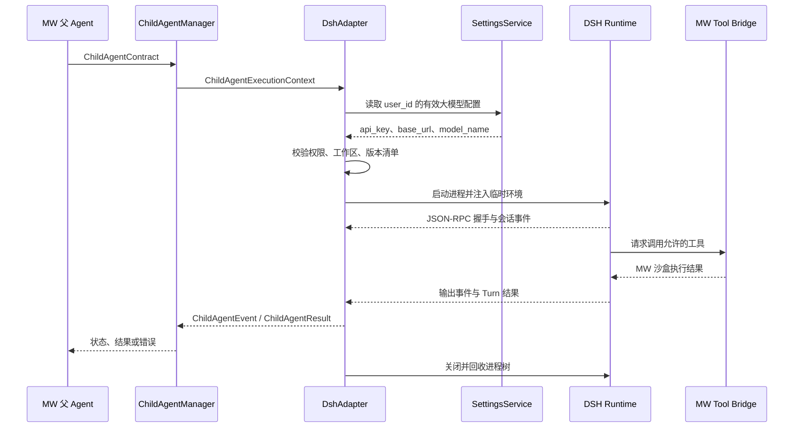

<!--
文件功能：说明 MW Agent 的 DSH Adapter 设计，包括设计原因、技术选择、配置来源、部署方式、运行协议、安全边界、版本策略与验收标准。
使用说明：实现 DSH 子 Agent 接入前先阅读本文；接口、部署或权限策略变化时同步更新本文及对应测试。
-->

# DSH Adapter 设计

## 一句话说明

DSH Adapter 是 MW 父 Agent 和 DSH 代码子 Agent 之间的中介层。父 Agent 把代码任务交给 Adapter，Adapter 在后台启动 DSH、传入模型配置、转交工具调用，再把执行进度和最终结果送回父 Agent。

用户只需要安装 MW，并在 MW 中配置大模型。用户不需要另外安装 DSH、Node、WSL 或 Docker，也不需要登录 DSH。

## 先看完整流程

### 制作 MW 安装包时

```text
下载固定版本的 DSH 源码
    → 编译成可运行的 JavaScript
    → 连同独立 node.exe 和 MW 专用配置一起放进 MW 安装包
```

DSH 源码只在构建阶段使用。最终用户拿到的是已经准备好的运行文件，第一次使用时不会再下载源码，也不会执行 `npm install`。

### 用户运行一个代码子任务时

```text
父 Agent 创建子任务
    → Adapter 读取用户在 MW 中配置的大模型
    → Adapter 启动一个隐藏的 DSH 进程
    → DSH 执行代码任务，并通过 Adapter 使用 MW 工具
    → Adapter 把过程和结果返回父 Agent
    → 任务结束，Adapter 关闭 DSH 及其子进程
```

每个正在执行的 DSH 子任务使用一个独立进程。这样取消某个任务时可以准确停止对应进程，一个任务崩溃也不会影响其他任务。

## API Key 和 URL 从哪里来

用户已经在 MW 的大模型设置中填写了 API Key、URL 和模型名。Adapter 直接读取这份配置，不再提供一套 DSH 配置页面。

| MW 大模型配置 | 交给 DSH 的方式 | 用途 |
| --- | --- | --- |
| `api_key` | 子进程环境变量 `DEEPSEEK_API_KEY` | 访问模型服务 |
| `base_url` | 子进程环境变量 `DEEPSEEK_BASE_URL` | 指定 OpenAI 兼容接口地址 |
| `model_name` | 本次任务的模型参数 | 指定使用哪个模型 |

这些值只在任务启动时交给对应的 DSH 子进程，不写入 DSH 配置文件。用户在 MW 中修改大模型配置后，下一个新任务会自动使用新值。

这里所说的“无需登录”是指 DSH 没有账号登录或 OAuth 流程。模型服务是否需要 API Key，仍由用户选择的模型服务决定。

## Adapter 为什么存在

MW 和 DSH 对任务的表达方式不同。MW 使用 `ChildAgentContract`、`ChildAgentEvent` 和 `ChildAgentResult`，DSH 使用自己的 JSON-RPC 会话与事件。Adapter 负责把两边接起来，主要做五件事：

1. 把 MW 子任务转换成 DSH 可以执行的会话。
2. 从 MW 设置中读取当前用户的大模型配置。
3. 在后台启动、停止和清理 DSH 进程。
4. 让 DSH 的工具调用继续经过 MW 的权限与沙盒检查。
5. 把 DSH 的输出、工具事件和错误转换成 MW 已有的子 Agent 事件。

父 Agent 仍然只和现有的 `ChildAgentManager` 交互，不需要了解 DSH SDK、环境变量或进程细节。将来 DSH 接口发生变化时，修改集中在 Adapter 内部。

## 为什么选择 DSH

DSH 适合作为 MW 的代码子 Agent 运行内核，原因很直接：

- 不要求单独登录，可以直接使用 MW 已有的大模型 API Key 和 URL。
- 源码开放并采用 MIT License，可以审查、构建和固定版本。
- 提供 JSON-RPC 接口，Adapter 可以通过标准输入输出控制它，无需读取终端画面或模拟键盘输入。
- 工具和运行能力可以通过 Cordis 配置组合，便于接入 MW 已有的权限体系。

MW 发行配置会关闭 DSH 默认的本地 Bash、任意文件访问和内部子 Agent 入口。DSH 要读取文件、修改代码或执行命令时，必须通过 MW Tool Bridge，并继续受到 `allowed_tools`、`access_mode`、工作区范围和终端沙盒限制。

## 怎么部署

MW 采用本地 Windows Sidecar。这里的 Sidecar 就是由 AgentService 按需启动的隐藏子进程，没有独立界面，也不是常驻系统服务。

安装包内携带：

```text
resources/dsh/
├── node/node.exe
├── runtime/                 # 编译好的 DSH 及其依赖
├── config/cordis.yml        # MW 专用 DSH 配置
├── manifest.json            # DSH、Node 和配置的固定版本与哈希
├── LICENSE
└── THIRD_PARTY_NOTICES.md
```

运行时，Adapter 使用安装包内的 `node.exe` 启动 DSH 的 JSON-RPC 入口。它不依赖用户电脑上是否装过 Node，也不使用 Electron 自带的 Node。

MW 仍可使用 DSH 官方 Python SDK 的客户端协议，但启动地址通过 `launch_args_override` 指向安装包里的 Node 和 DSH 入口。由于官方 Runtime wheel 当前没有 Windows 版本，MW 不安装该 wheel，实际 Runtime 由安装包中的 Node 运行。

正式接入前必须在 MW 支持的 Windows 版本上验证这套运行包能够连续启动、执行任务、调用 MW 工具并彻底退出。验证失败时，需要重新评估 Windows 运行包，不能在用户不知情的情况下改用 WSL、Docker或运行时下载。

## 版本怎么跟随 DSH

MW 不在用户运行期间自动更新 DSH。构建时固定一个已经验证的 DSH 源码提交，SDK 客户端和 Runtime 使用同一提交，并把版本与文件哈希写进 `manifest.json`。

DSH 上游更新后，MW 先升级固定提交，重新构建运行包并完成协议、权限、代码任务和 Windows 进程清理测试。测试通过后，再随新的 MW 版本发布。这样 DSH 更新不会突然破坏用户正在使用的安装包。

## 组件设计

### DshChildAgentExecutor

`DshChildAgentExecutor` 实现现有 `ChildAgentExecutor` 协议，是 `ChildAgentManager` 注入的执行器。它接收 `ChildAgentExecutionContext`，建立一次 DSH 运行并返回可序列化结果。

执行器承担以下工作：

- 验证用户、会话、目标和输出合同。
- 读取当前用户的大模型配置。
- 解析 MW 允许的工作区根目录。
- 创建运行目录和临时 DSH 会话目录。
- 启动、观察和终止 DSH Runtime。
- 映射 DSH 通知、工具事件、结束原因和错误。
- 在退出路径中回收 Runtime 及其子进程。

执行器不得修改父 Agent 合同，也不得提高工具或文件访问权限。

### DshRuntimeSupervisor

每个活动的 DSH 子 Agent 使用独立 Runtime 进程。单独进程会增加启动成本，但能直接对应 MW 的 `run_id`、取消信号、工作目录和模型配置。一个 Runtime 异常退出不会破坏其他子 Agent，会话内容也不会跨任务混用。

Supervisor 保存进程句柄、进程组、启动时间、最后事件时间和退出码。Windows 上使用 Job Object 或等价的进程树管理方式。停止流程先请求 DSH 中断，等待有限宽限时间；Runtime未退出时终止整个进程树。正常完成、异常、超时和 MW 关闭都必须进入同一清理路径。

### MwModelConfigResolver

Resolver 调用现有设置服务，根据 `context.user_id` 读取有效的大模型配置。配置解析遵循 MW 已有的“用户值优先，服务默认值保底”规则。DSH 代码子 Agent使用大模型字段：

```text
api_key
base_url
model_name
```

Adapter不读取小模型配置，也不在 DSH 配置文件中保存上述值。缺少 `base_url` 或任务所需的 `model_name` 时，运行在启动模型请求前失败并返回明确错误。`api_key` 是否允许为空取决于端点配置，Adapter保留用户原值。

### MwDshToolBridge

DSH 发行配置关闭默认本地 Bash和不受控文件工具。`MwDshToolBridge` 把允许的 MW 工具暴露给 DSH，并在每次调用时带上当前运行上下文。桥接层执行四项检查：

1. 工具名必须属于 `context.allowed_tools`。
2. 工具要求的访问级别不能高于 `context.access_mode`。
3. 文件路径必须位于 MW 已解析的工作区根目录内。
4. 终端命令必须通过现有 `TerminalSandboxSettings` 校验。

DSH 不直接获得 MW 设置数据库、密码库、用户主目录或 AgentService内部对象。工具返回值经过可序列化和敏感字段过滤后再送回 DSH。

### DshEventMapper

EventMapper 保留 DSH 原始事件的顺序，并生成 MW 可消费的事件。最低映射如下：

| DSH 状态 | MW 事件或结果 |
| --- | --- |
| Runtime 已启动并完成握手 | `child_agent.runtime_ready` |
| 模型文本增量 | `child_agent.output_delta` |
| 工具调用开始 | `child_agent.tool_started` |
| 工具调用结束 | `child_agent.tool_finished` |
| Turn 正常结束 | `ChildAgentResult(COMPLETED)` |
| DSH 拒绝或协议错误 | `ChildAgentResult(FAILED)` |
| MW 发出停止并完成中断 | `ChildAgentResult(STOPPED)` |
| 进程异常退出 | `ChildAgentResult(FAILED)`，附退出码和安全错误摘要 |

事件元数据可以保留 DSH 会话 ID、结束原因、模型名和用量，不得包含 API Key、完整环境变量或未经筛选的进程启动参数。最终结果按 `output_contract` 校验；不符合合同时按失败处理，原始输出仅作为诊断摘要保留。

### DshVersionManifest

`manifest.json` 记录 DSH 源码提交、SDK客户端提交、MW Cordis配置版本、Node版本、构建时间和运行闭包哈希。Adapter启动时校验必需文件和版本组合。校验失败时禁止启动 DSH，并给出可定位到安装资源的错误。

MW 不在应用启动时自动更新 DSH。新版本通过依赖升级提交进入代码库，完成构建、协议和真实任务测试后再更新固定提交及清单。

## 一次子 Agent 运行



启动 DSH 前，Adapter为子进程构造最小环境。`DEEPSEEK_API_KEY` 与 `DEEPSEEK_BASE_URL` 只存在于子进程环境中，不写入命令行、Cordis文件、会话日志或 MW 事件。日志仅记录配置是否存在、端点主机和配置来源，禁止记录完整 URL 查询参数与密钥。

工作区来自 MW 当前用户的终端沙盒配置或父任务明确绑定的受控工作区。DSH 传入的路径不能覆盖该结果。每次运行使用独立的临时会话目录，例如 `runtime/dsh/runs/<run_id>`。该目录属于执行期数据，MW 数据库中的任务状态和事件才是正式记录。运行结束后按诊断保留策略清理临时目录，不能把 JSONL 文件当作用户业务持久化。

Adapter在事件循环中检查 `context.raise_if_stopped()`，并读取 `context.drain_updates()`。停止更新触发中断流程；上下文更新转成 DSH 支持的后续消息。无法安全应用的更新返回拒绝事件，不静默改写正在执行的目标。

## Cordis 发行配置

MW 使用专用配置文件，不加载用户目录或 DSH 默认配置。配置至少包含：

- JSON-RPC stdio Server。
- Agent Core 与必要的会话组件。
- OpenAI兼容模型 Provider。
- MW Tool Bridge 或连接该桥的 MCP Client。
- 受控的临时会话存储。

配置明确排除：

- DSH Web UI。
- 默认本地 Bash和任意文件工具。
- 自动发现的用户插件。
- DSH 内部子 Agent工具。
- 未经 MW 登记的 MCP Server。
- 自动下载、自动更新与远程插件安装。

这份配置随安装包只读发布。用户通过 MW 设置修改模型和工具权限，不能直接编辑生产 Cordis配置绕过 MW 安全规则。

## 错误处理

Adapter使用稳定错误码，父 Agent 和界面不依赖 DSH 错误文本：

| 错误码 | 条件 | 处理 |
| --- | --- | --- |
| `DSH_CONFIG_MISSING` | MW 模型配置缺少运行所需字段 | 启动前失败，提示检查 MW 大模型配置 |
| `DSH_RUNTIME_INVALID` | 文件缺失、哈希或版本不匹配 | 禁止启动，提示修复安装 |
| `DSH_START_FAILED` | Node或 Runtime 无法启动 | 回收残留进程并返回安全诊断 |
| `DSH_PROTOCOL_ERROR` | 握手、JSON-RPC或事件格式不兼容 | 终止运行并记录协议版本 |
| `DSH_MODEL_AUTH_FAILED` | 模型端点拒绝 API Key | 提示检查 MW 大模型配置，不输出密钥 |
| `DSH_TOOL_DENIED` | DSH请求了合同外工具或越界路径 | 拒绝该工具调用并产生审计事件 |
| `DSH_TIMEOUT` | 超过合同超时或长期无事件 | 中断后回收进程树 |
| `DSH_PROCESS_EXITED` | Runtime 意外退出 | 返回退出码、最后安全事件和日志引用 |

Provider错误可以按 MW 现有模型调度策略重试，工具拒绝、协议错误和权限错误不自动重试。重试不得创建重复文件修改；发生过写操作后，Adapter先检查工作区状态，再决定是否允许重新执行。

## 安全要求

API Key 只能从设置服务进入子进程环境。Adapter不得把 Key 放入提示词、命令行、异常文本、事件、指标或诊断包。子进程继承白名单环境，不继承 AgentService完整环境。

DSH Runtime以当前用户权限运行，因此操作系统权限不能代替 MW 工具检查。所有产生副作用的文件、Git和终端操作经过 MW Tool Bridge。只读模式不允许编辑或写命令；沙盒模式限制在工作区；完全访问模式仍受父 Agent工具集合约束。

MW 关闭、用户取消会话或父 Agent停止子任务时，Supervisor必须回收 DSH Runtime及其后代进程。任何退出路径留下运行中的 Shell进程都视为失败。

## 版本升级

DSH 处于开发预览阶段，兼容性变化需要通过固定版本和契约测试处理。升级流程如下：

1. 将 DSH 上游提交更新到候选版本，SDK客户端与 Runtime保持同一提交。
2. 重新生成 Windows Node运行闭包和 `manifest.json`。
3. 运行 JSON-RPC 握手、事件顺序、取消、异常退出和版本拒绝测试。
4. 运行只读分析、代码修改、测试执行、工具拒绝和路径越界等真实任务。
5. 检查安装包启动、卸载、残留进程和资源哈希。
6. 测试通过后更新 MW 锁定提交，不允许运行时追踪 DSH 主分支。

MW 对外只承诺自己的 Adapter合同。DSH 字段变化由 Adapter吸收；如果上游删除必需能力，MW保留最后一个通过验证的版本，直到完成兼容修改。

## 验收标准

实现完成时需要满足以下条件：

- 用户未安装 DSH、Node、WSL或 Docker时，MW 安装包仍能启动 DSH 子 Agent。
- 整个流程没有 DSH 登录页面、OAuth回调和独立 DSH 凭证配置。
- Adapter使用当前用户在 MW 大模型配置中的 `api_key` 与 `base_url`，修改配置后新任务立即使用新值。
- 父 Agent继续通过 `ChildAgentManager` 创建和控制 DSH 子 Agent，不依赖 DSH SDK类型。
- DSH无法调用 `allowed_tools` 之外的工具，无法提高 `access_mode`，无法访问工作区外路径。
- DSH 内部子 Agent入口关闭，符合 MW 子 Agent不能继续创建子 Agent的规则。
- 输出增量、工具事件、完成、失败和停止状态可以稳定映射到 MW 事件。
- 正常完成、失败、超时、取消和 MW 退出后均无遗留 DSH或 Shell进程。
- API Key不出现在日志、命令行、事件、会话文件和错误响应中。
- DSH 源码提交、SDK客户端、Node Runtime、Cordis配置和运行闭包哈希可以从 `manifest.json` 核对。
- DSH升级只通过构建和测试后的 MW 版本发布，运行中的安装包不会自动改变 Runtime。

## 上游依据

- [DeepSeek Harness 官方仓库](https://github.com/deepseek-ai/deepseek-harness)
- [DeepSeek Harness Python SDK](https://github.com/deepseek-ai/deepseek-harness/blob/master/python/sdk/README.md)
- [DeepSeek Harness Runtime发行说明](https://github.com/deepseek-ai/deepseek-harness/blob/master/python/sdk-runtime/README.md)
- [DeepSeek Harness MIT License](https://github.com/deepseek-ai/deepseek-harness/blob/master/LICENSE)
