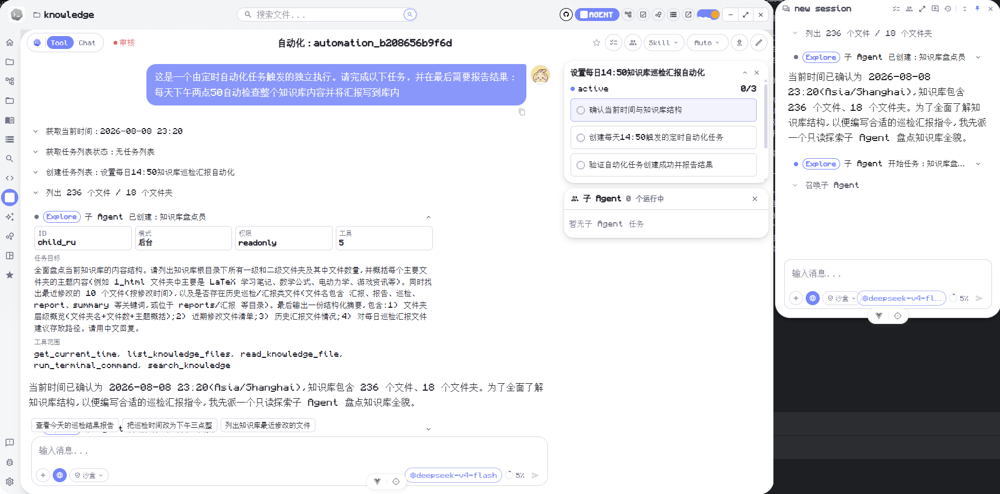
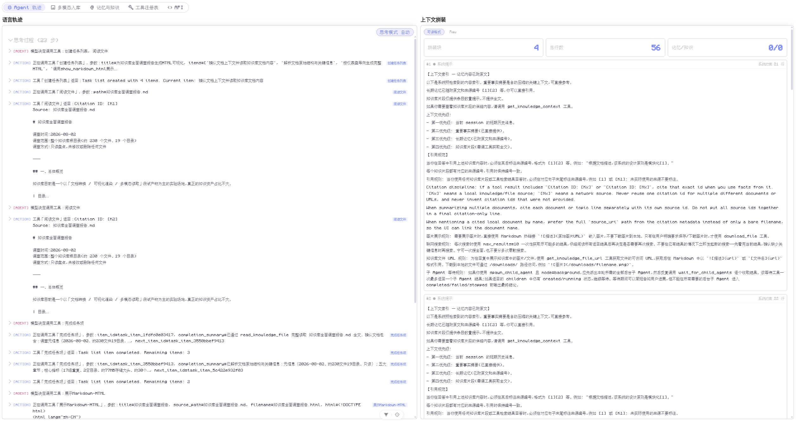

# MetaWeave(元织) Agent 设计

## 多级队列与限流
**模型任务调度器**统一管理所有 LLM 调用。内部多级队列按主 Agent、Summary、Fact Extraction 三个等级分配,同时设置 `large / small` 双模型池路由——主推理走大模型池,摘要/事实抽取/上下文压缩走小模型池,分别配备独立并发上限、超时、熔断与重试机制。
    * 大小模型分流机制：调度器按任务类别决定使用大模型还是小模型。
      * 主回答模型负责复杂推理与最终高质量回答.
      * 小模型负责重要事实摘要、长期记忆摘要、事实抽取、分类与轻量语义压缩,以降低主模型的延迟与负载压力。
    * 物理模型隔离：
      * 用户未配置两个模型的API-KEY时,无法使用;
      * 用户配置了大模型API-KEY但没有配置小模型时,小模型任务会回退到大模型配置,但仍占用小模型池的并发配额;
      * 大小模型都配置时才会真正调用独立小模型.


## 智能体状态转移设计
在LangGraph状态转移图入口处有一个入口节点,调用一次小模型,按照用户提问内容区分三种模式的入口,用户在同一session前后提出简单和困难的问题时,会以小模型决策以下三种图的模式:
      1. 简答模式: 对于明显不需要思考的短输入,不经过循环,只保留 RAG 上下文构建,用小模型直接输出.
      2. ReAct模式: 不经过`planner`节点和`observation`节点,标准的ReAct图.agent节点同时充当观察者和决策者,一个循环只需要调用一次LLM.
      3. 深度思考模式(Plan-and-Execute模式): 经过规划-执行-观察的循环,一个循环会调用2~3次LLM,适合长时间思考.
   auto模式会先调用小模型路由器输出`simple/react/plan`,显式选择模式时不经过路由器;当小模型认为自己能力不足、不确定能否可靠回答、需要事实核验或外部信息时,至少进入`react`,不能选择`simple`;当小模型不可用或输出无法解析时,才回退到本地保守规则.
   前端提供 `auto`/`simple`/`react`/`plan` 思考模式切换,Agent 观测面板状态图按实际执行模式切换.
## 节点设计
节点有以下几种：
   * 启动/终止节点 `START`/`END`
   * 决策/汇合节点 `agent`
   * 工具调用节点 `action`
     * 跨会话记忆检索
     * 上下文压缩与事实持久化
     * 知识库检索
     * 其他内置工具
     * MCP外部工具
   * 安全审核节点（输入/输出两阶段）,包括:
     * 输入安全审核（入口）`safety_input`
     * 输出安全审核（出口）`safety_output`
   * 推理规划节点 `planner` : 具备全局规划思想,拆解问题, 跨轮保持计划 + sub_question 状态机 + 绕圈检测,成为agent执行节点的"调度者".
   * 反思节点 `observation`: 根据观察选择路径,可选性的规划而不是每次都进入planner节点. 产出四种状态.
      首次: planner（拆解问题，出 sub_questions）
      agent → action → observation（精炼结果 + 提取事实 + 判方向）
      │ 针对observation的不同输出
      ├─ [continue] → planner（更新计划）→ agent（继续）
      ├─ [answer]   → agent（出最终回复）
      ├─ [retry]    → agent（换参数重试同一工具）
      └─ [abandon]  → agent（承认查不到，给出已有信息）
   * 摘要节点 `summary`
   * 上下文压缩节点 `compress`

## Skill能力

Skill能力是Agent从通用Agent走向专用Agent的关键。其设计如下：

- 所有的内置Skill默认统一存放在根目录的`resources/skills/`文件夹中，用户级Skill放在用户知识库目录下的`.agents/skills/`文件夹中。
- 统一兼容[OpenAI开放标准](https://developers.openai.com/api/docs/guides/tools-skills)作为主标准，兼容[Anthropic标准](https://platform.claude.com/docs/en/agents-and-tools/agent-skills/overview)扩展字段。
- 目录结构：
  ```text
  skill-name/
    SKILL.md (必须有）
    scripts/ （可选）
    references/ （可选）
    assets/ （可选）
  ```
- 用户级Skill按用户知识库隔离，**用户登录或知识库目录变更时**扫描Skill目录，读取元信息，建立索引。索引只作为本地路由数据使用，不把所有已启用Skill的索引信息全量注入主模型上下文。
- 对于非Simple思考模式下的每次用户输入，Agent决策前先进行本地候选召回：基于Skill的`name`、`description`、`keywords`、`triggers`等元信息做关键词/BM25式粗筛，只保留少量候选（默认不超过20个）交给`Skill路由器`。`Skill路由器`调用小模型从候选中返回针对当前询问场景适合的3个Skill；小模型不可用或返回异常时，使用本地候选分数兜底。随后只将命中的Skill正文（`SKILL.md`）注入本轮运行上下文（用户下一轮询问后从上下文中去除），Skill正文默认只对当前轮生效，下一轮重新路由。
- 主模型上下文只允许看到本轮候选Skill的简短摘要和已路由Skill的正文，不允许看到全量Skill注册表。用户级Skill正文按用户上下文注入，不能提升为不可覆盖的系统级规则。
- 配备有2个Agent工具：列出所有Skill；使用Skill（主动召唤`SKILL.md`正文）。

## 可观测性
### 对话内观测
Agent对话框分为"对话模式"和"工具模式":
  - 对话模式: agent思考过程默认折叠,被归类为"深度思考",处理后最终得到统一输出.
  - 工具模式: 显性展示模型思考过程和工具调用过程.
### 观测面板
Agent观测面板实时展示 Agent 行动轨迹，包括节点状态、上下文构建器、RAG 召回条目、召回筛选过程、会话摘要等。日志系统记录全部 Agent 行动，信息传递过程完全可视化。观测面板不重新推理业务结果，而是从会话消息、系统上下文快照、工具轨迹与模型返回元数据中派生统计值；统计口径按会话累计，同一 session 内不会因为图循环或单个节点结束而清零。
  * 数据采集流程：后端在每个节点执行时记录轨迹。模型节点记录真实 token 用量，工具节点记录开始、结束、参数摘要、结果摘要、结果条数与耗时；RAG 上下文构建器记录自动召回的指标和召回明细。前端观测层只做归并、过滤和累计，不二次生成业务结论。
  * RAG 三率：统计来源包括两类，一类是上下文自动召回，另一类是知识库工具返回的召回条目。每次召回形成一个样本点，会话级指标取累计均值：$$FillRate_t=\frac{1}{t}\sum_{i=1}^{t} fill_i,\quad AvgRelevance_t=\frac{1}{t}\sum_{i=1}^{t} relevance_i,\quad Confidence_t=\frac{1}{t}\sum_{i=1}^{t} confidence_i$$ 知识库工具召回没有显式分数时用 0 作为相关性兜底；填充率按返回条数与请求上限估算，平均相关性取各召回条目重排序分数的均值。请求上限在各通道检索时记录（$memory\\_limit$ + $knowledge\\_limit$），而非硬编码 $top\\_k \\times 2$：$$fill_i=\min(\frac{memory\\_count_i + knowledge\\_count_i}{memory\\_limit_i + knowledge\\_limit_i}\times100,100),\quad relevance_i=\frac{1}{n}\sum_{j=1}^{n} final\\_score_j\times100$$ 上下文自动召回时 $final\\_score_j$ 为 ReRank 精排结果；工具召回时从返回文本中尝试提取重排序分数，提取失败则兜底为 $0$。
  * Token 用量：只统计真实模型调用返回的 token 用量，不按文本长度估算，也不把工具执行、安全审核等运行时节点计入模型用量。模型节点按池归并为大模型和小模型：$$TokenPool_t(p)=\sum_{i=1}^{t}\sum_{调用\in p} tokens(调用)$$ 其中 $p\in\{大模型,小模型\}$，前端图表只展示“大模型 / 小模型”两类。
  * 思考耗时：优先使用节点记录的真实耗时；缺失时才回退到相邻轨迹时间戳或消息时间差估计。每轮耗时为该轮节点耗时之和：$$Latency_k=\sum_{节点\in 第k轮} duration(节点)$$ 折线图展示累计耗时：$$CumulativeLatency_t=\sum_{k=1}^{t}Latency_k$$ 节点饼图和柱状图展示截至当前轮次的累计节点占比：$$Share_t(节点)=\frac{\sum_{k=1}^{t}duration_k(节点)}{\sum_{k=1}^{t}\sum_{n}duration_k(n)}\times100$$
  * 召回条目与上下文：长期记忆召回、知识库片段召回和上下文拼装视图都按当前会话累计展示，自动召回与工具召回分别保留来源、分数、重排序前后状态和引用映射，便于追溯最终回答引用了哪些材料。

## 记忆系统
### 短期记忆
即会话内上下文管理.
* 不超过上下文长度的直接追加到上下文，超过最大上下文阈值时会先进入 `compress` 节点,用小模型生成“重要事实摘要”,再把工作上下文重写为 `重要事实摘要 + 最近少量消息`。
* 上下文拼装优先级为 `短期历史消息 -> 压缩摘要 -> 历史摘要/事实 -> 外部知识库片段`，避免知识库内容覆盖用户刚刚明确给出的事实。
#### 上下文压缩机制

上下文压缩用于解决会话越聊越长的问题。Agent 每次进入模型决策前都会估算当前消息长度，低于阈值时继续使用原上下文，超过阈值时才进入压缩流程。

压缩流程会把较早的对话整理成一段重要事实摘要，再保留最近几条消息。摘要负责保留已经形成的事实，最近消息负责保留当前正在执行的动作。
压缩摘要会写入长期记忆，后续对话仍可通过语义召回重新取回。也就是说，被压缩掉的旧消息不会继续原样留在短期上下文里，但其中的重要事实会进入可检索的记忆层。

压缩节点只处理消息上下文。它不会修改任务列表、planner 状态或其他会话级执行状态，避免上下文整理影响 Agent 的长期任务进度。

#### 任务列表

任务列表用于管理复杂任务的长期进度。它属于当前会话，会跨消息保留，直到 Agent 主动结束任务列表。

任务列表有三个核心动作：创建列表、完成列表项、结束列表。创建后，系统会记录每个列表项的 ID，并标记当前正在处理的一项。Agent 完成某一项后必须写入完成概要，然后才能继续处理下一项。

每轮 Agent 启动时，后端都会把当前任务列表写入系统提示词。模型能看到列表状态、当前项、已完成项和完成概要，因此后续回复会继续围绕这份任务列表推进。只要任务列表存在，Agent 会进入具备工具调用能力的执行路径，避免长程任务被简单问答流程截断。

前端右侧栏只展示任务列表状态。Agent 工具更新任务列表后，后端通过流式事件把新状态推给前端，前端收到后自动勾选完成项并显示概要。工具不直接操作界面，界面只根据后端状态渲染。

任务列表和上下文压缩相互隔离。旧消息被压缩后，任务列表仍会保留当前项、完成概要和完成状态，Agent 下一轮仍能从会话状态中恢复任务进度。
## 任务队列

任务队列是用于并行处理独立 Agent 任务的可视化调度面板。Issue 看板分为“等待认领”“处理中”“等待确认”三列，并可切换到历史页面查看“已确认”和“已终止”的任务。

- 创建任务时可输入 Prompt、设置“极高 / 高 / 中 / 低 / 随便做”五档优先级（默认“中”），并通过拖拽或文件选择器附加多个文件。每个任务绑定独立的持久化 Agent 会话，不会打断其他正在运行的会话。
- 调度器优先认领高优先级任务，并在用户设置的最大并行数内由多个相互独立的 Agent 同时执行；最大并行数默认为 5。
- 看板会持续刷新任务状态并以动效展示跨列移动。卡片支持直接查看详情、删除尚未认领的任务、终止处理中任务，以及确认待确认任务。
- 处理中任务必须维护任务列表，卡片使用分段进度条同步展示列表完成进度。详情区域复用完整 Agent 页面组件，并以静默消息同步更新后台任务输出，不会反复清空和重新加载整段对话。
- 等待确认任务保留完整对话、最终回答、任务进度以及 Agent 页面中的环境与变更、任务列表和子 Agent 信息；用户可确认归档，或输入后续 Prompt 让任务携带原会话上下文重新进入队列。

#### TODO/待办系统 - 自动化定时任务

TODO 系统用于管理用户侧的独立待办事项，与 Agent 会话内的任务列表分离。普通待办用于记录人工事项；自动化任务是 TODO 的特殊分类，用于把一段 Agent 指令绑定到指定时间或循环计划上。

自动化任务创建后会同时生成一条关联 TODO，并把自动化定义持久化到 SQLite。定义内容包括任务提示词、下一次运行时间、时区、循环规则、权限模式、启用状态和最近运行结果。前端 TODO 侧边栏会展示自动化任务及其下一次运行时间。

后端启动时会创建自动化调度器。调度器定期扫描已启用且到期的自动化任务，通过数据库租约抢占任务，避免同一任务被重复执行。到点后，调度器会创建独立 Agent 会话，把自动化任务保存的提示词交给 Agent 执行，并记录本次运行的成功、失败、输出或错误。

自动化任务支持单次、每日、每周和每月循环。循环任务执行完成后会按任务时区计算并写入下一次运行时间；单次任务执行后不再安排下一次。当前实现会更新自动化运行记录和下一次运行时间，但不会把关联 TODO 自动勾选完成，也不会主动向前端推送实时刷新；前端需要重新拉取后才能看到最新状态。

Agent 也可以通过 `add_automation` 工具创建自动化任务。适合的场景包括定时提醒、周期性整理、按计划执行代码库维护命令等。涉及文件写入、提交、删除或联网操作的任务必须选择匹配的权限模式，否则到点执行时可能因权限不足或需要用户确认而中断。


### 长期记忆/语义召回
采用 **RAG 检索增强生成**作为提取方式。底层数据分为以下类型：
- `会话摘要(session_summary)`：每轮异步摘要，记录对话要点。
- `会话事实(session_fact)`：从摘要中提取的结构化事实单元，由 MemoryResolver 裁决并维护 active/superseded/expired 状态。
- `重要事实摘要(important_fact_summary)`：ContextBuilder 内 compress 节点生成的跨会话重要事实。
- `知识切片(knowledge_chunk)`：知识库文件的语义切片。
- `自定义记忆(user_custom)`：用户手动写入的自定义记忆。
- `用户规则(user_rule)`：用户自定义的长期规则，不经过 RAG 检索，以系统提示词形式直接注入。

### 长期记忆/语义召回管线完整流程

1. **向量召回** — 使用 ChromaDB 余弦距离检索，`vector_score = clamp(1.0 - distance)`。若 ChromaDB 不可用或返回零得分，回退到 SQLite 内嵌 JSON 向量的余弦相似度（归一化到 [0,1]）。

2. **关键词召回** — 从 query 提取英文 token + 中文 2~4 字子串，过停用词后以 SQL ILIKE 预筛出候选 doc，再用 Python 覆盖率 + 词频加权打分：每个词按长度加权（`weight = min(max(len, 2), 6) / 6`），出现次数加成（`+ min(occ-1, 2) * 0.08 * weight`），最终 `keyword_score = coverage_score + phrase_bonus`（phrase_bonus 为 `min(matched_terms, 4) * 0.03`）。

3. **合并去重** — 以 `memory_id` 为 key 去重。两路都命中的候选：`merged_score = 0.6 × max(v, k) + 0.4 × avg(v, k) + 0.05`（通道奖励）；仅一路命中：`merged_score = max(v, k)`。

4. **CrossEncoder ReRank** — 使用本地 CrossEncoder 模型 `BAAI/bge-reranker-v2-m3` 对 `(query, document)` 对做语义精排，原始 logit 通过 sigmoid 归一化到 [0,1]。未配置 ReRank 模型时回退到 merged_score + 通道数 + importance 排序。

5. **最终联合评分** — 对 ReRank 后的每条结果计算三维分数：
   $$
   relevance\_score = \max(rerank\_score, merged\_score)
   $$
   $$
   freshness\_score = \frac{1}{1 + age\_days / 30}
   $$
   $$
   final\_score = 0.5 \times relevance + 0.3 \times freshness + 0.2 \times authority
   $$
   权重来自配置项 `relevance_weight=0.5, freshness_weight=0.3, authority_weight=0.2`。

6. **阈值过滤** — `final_score < score_threshold` 的直接丢弃。阈值可配置，默认约 0.3。

7. **最终排序** — **以 `updated_at DESC（最新优先）为首要维度**，同等新度下按 `final_score DESC` → `current_session_match DESC` → `relevance DESC` → `importance DESC` 排列。理由是 score_threshold 已经过滤了无关内容，候选集内越新的信息越可能反映当前事实，而非 pure relevance。

8. **四层合并 & topK 截断** — `会话事实` / `重要事实摘要` / `会话摘要` / `自定义记忆` 四路记忆按 `memory_type` 独立执行上述 1~7 步，各自返回 topK（`rerank_top_k`，默认 5），再跨类型合并去重，按 final_score 截断总条数上限，最终注入系统提示词的检索上下文。

### 信息时效性
每条记忆携带 `created_at` / `updated_at` / `valid_from` / `valid_until` 时间戳，以及 `fact_status: active | superseded | expired`。检索时在过滤层先排除 `expired` 和 `superseded` 条目；排序层内优先召回新内容。事实更新策略：
- 单值强排他事实：新值覆盖旧值，旧事实标记 superseded。
- 多值弱排他事实：新值追加并去重。
- 时序事实：到期自动失效，标记 expired。
- 程序定义事实（如项目规则配置）：以规则为准，LLM 的输出仅作为全新事实的补充。

## 安全审核机制
采用**三层递进式**安全防线,在 Agent 输入和输出两个位置执行审核,阻断风险请求并清洗敏感输出。
    * 输入审核范围：`safety_input`只审核用户真实问题本身。当前端或`ContextBuilder`把“引用文档片段 + 用户问题”组合成一条`HumanMessage`时,安全审核会先抽取`用户问题:`之后的真实 prompt,不会把引用材料正文当作用户意图来拦截。这样总结、阅读、分析知识库文件时,文档正文中的敏感词不会误伤正常文件问答;如果用户问题本身命中风险规则,仍然会正常拦截。
    * 第一层 — **敏感词初检**：
        在请求进入 Agent 主循环前,使用分类词库（`resources/safety/sensitive_words.json`）执行快速的"精确匹配 + 正则匹配"。
       词库按 `政治危险/色情/暴力/非法/垃圾广告/提示词注入/数据窃取` 七大类分组,
       每类标记风险等级（high/medium/low）, high 级别命中直接拦截,medium 级别交由第二层进一步判断。
    * 第二层 — **小模型意图审核**：
       敏感词初检通过后,使用小模型对用户意图做语义级安全判断, 审核维度包括：恶意攻击（越狱/注入）、非法请求、信息窃取、骚扰滥用、正常请求。输出 `pass / block / suspect` 三态裁决。
    * 第三层 — **输出审核**：
       在 Agent 生成最终回复后、返回用户前,对输出内容执行敏感词扫描。命中拦截类敏感词（政治/色情/暴力/违法）直接替换为标准安全回复;
       命中清洗类敏感词（广告/Prompt注入/数据窃取）执行脱敏替换（`***`）。
    * 拦截回复差异化生成：
       被拦截的用户请求根据拦截类型调用**小模型**生成两类差异化回复：
           * 政治敏感：命中"政治危险"分类或意图审核判定"政治敏感" → 小模型生成"立场正确的反驳性回复"（如"这种说法是完全错误的。中国共产党始终坚持……"）。(先有意识形态,再有意识这一块)
           * 一般拦截：色情/暴力/违法/注入/广告等其他类别 → 小模型生成脱敏的礼貌拒绝（如"对不起,我不能回答这个问题,因为`[脱敏理由]`。如需其他帮助请随时告诉我。"）。
       两项回复均有对应的内置系统提示词,经小模型生成最终回答;小模型不可用时回退到静态后备文案。
用户可自行设置是否开启敏感词初检,或者自行设置是否开启安全审核总开关.
## 终端沙盒

Agent 通过内置工具 `run_terminal_command` 获得非交互式终端能力。该工具不接受整条 shell 字符串,必须传入结构化参数: `shell`、`cwd`、`segments`。`segments` 分为两类:

- `internal_command`: 由后端直接实现,不经过系统 shell。读取类包括 `pwd`、`ls/dir`（支持 `-R`/`/s` 递归和 `*.docx` glob 通配符）、`cat/type`、`head`、`tail`、`stat`、`wc`（支持 `-l`/`-w`/`-c` 标志和多文件）;写入类包括 `write`、`append`、`touch`、`mkdir`（自动 `-p`）、`rm/del`、`mv/move`。所有内部命令已移除单文件/单路径限制,支持多参数批量操作。
- `external_program`: 通过 `subprocess.run(..., shell=False)` 执行。受权限模式控制:沙盒模式下走白名单+安全参数校验;完全访问模式下跳过白名单,仅拦截嵌套 shell（`cmd`/`powershell`/`bash`/`sh`/`wt`）和 `python -c`、`node -e`、包安装、`git push` 等高风险入口。

终端权限和文件工具权限分开控制:终端权限调控内部读写指令、外部程序和路径边界;文件工具只操作当前知识库,只读模式会拒绝写文件、删除、重命名、建目录、保存附件和重建知识库等写操作。

| 权限 | 终端读 | 终端写 | 终端外部程序 | 文件工具读 | 文件工具写 |
|---|---|---|---|---|---|
| 只读 | 全目录可读 | 禁止 | 禁止 | 知识库内可读 | 禁止 |
| 沙盒 | 全目录可读 | 仅终端工作区内 | 仅终端工作区内，且白名单/安全参数 | 知识库内可读 | 知识库内可写 |
| 完全访问 | 全目录可读 | 全目录可写 | 全目录可用，跳过白名单，仅拦截嵌套 shell 等高风险入口 | 知识库内可读 | 知识库内可写 |
## 可定制性
* 用户自定义长期记忆:用户可以管理长期记忆,可以增加新的自定义长期记忆注入到向量库,或者删除长期记忆.
* 用户自定义系统提示词:用户可编辑"用户设置系统提示词",追加到原本的系统提示词中.

## 引用溯源

引用溯源用于说明回答中的事实来自哪里。系统只展示最终回答实际使用的来源，不会把所有搜索命中结果都堆在消息下方。

回答中的引用编号有四种形式：

- `[1]`、`[2]`：本轮对话自动召回的长期记忆或知识片段。
- `[K1]`、`[K2]`：Agent 主动读取的本地知识库文件或知识片段。
- `[N1]`、`[N2]`：联网搜索使用的网页来源。
- `[A1]`、`[A2]`：用户在当前会话中上传的文件。

引用通常写在具体事实、判断或段落的末尾。例如，回答某个知识库文件中的内容时，会在对应句子后标注 `[K1]`；引用网页中的最新信息时，会标注 `[N1]`。引用编号只对应本轮实际可用的来源，系统不会接受模型自行编造的编号。

来源的展示遵循“实际使用优先”原则：

- 搜索结果只是候选来源，只有真正支持最终回答的内容才会出现在消息下方。
- 明确读取的本地文件可以作为回答依据；只被搜索到但没有被采用的文件不会自动列出。
- 网页来源必须在使用相关事实的位置明确标注，未被回答引用的网页不会出现在来源列表中。
- 如果回答遗漏了本地文件引用，系统只会在能够根据文件名或标题准确匹配回答内容时补充；无法确认时不会强行添加来源。

正文中的引用编号和消息下方的来源列表可以点击。点击本地引用会打开或预览对应文件，点击网页引用会使用默认浏览器打开网页。每条历史消息保存自己的来源信息，因此重新查看历史对话时，引用仍然对应当时使用的文件和网页，不会被后续对话覆盖。

## 多Agent能力
Agent可以召唤子Agent,采用父子Agent设计模式.
  - 子 Agent 由主Agent启动，主Agent送给子Agent一个"子任务合同"(你是谁、要做什么、能用什么、不能做什么、最后交付什么),子Agent完成任务后,任务结果进入主Agent的消息队列(内存queue).子Agent的生命周期:
  ```
      created → running → completed
                 ↘ failed
                 ↘ stopped
  ```
  - 子Agent分为Plan/agent/Explore三种类型.
  - 子Agent在独立于父Agent的线程中进行,拥有独立的上下文.
  - 子Agent默认可以继承主Agent的全部工具,但是主Agent拥有对子Agent可用工具的配给权以及三种沙盒权限的控制权.**主Agent 不能授予自己没有的能力**。
  - 子Agent分为前台和后台两种模式(子Agent的目标,工具与权限,前后台,工作状态和结果都需要在前端展示,但过程不必显示在前端):
    - 前台子Agent(同步阻塞): 前台子Agent阻塞主Agent,主Agent在等待子Agent的工作结果完成之前一直等待.适合任务有前后依赖的情形.
    - 后台子Agent(异步蜂群): 后台子Agent不阻塞主Agent,主Agent可以召唤多个后台子Agent并行做事,且在此期间主Agent可以继续做其他事情.主Agent可以查看后台任务("显式汇合",主Agent可以等子Agent)，也可以停止子Agent,子Agent收到父Agent的信号(终止/者信息调整)后做出响应(立即终止/将信息注入上下文).
  - 子Agent不能召唤其他子Agent.
  - 角色与身份:召唤时可在 `agent`(全能执行)、`explore`(只读探索)、`plan`(只读规划研究)三类预置角色中选择,系统以"【角色设定】"注入子Agent提示词开头,也可以传入自定义角色描述按原样注入。主Agent可以为子Agent起名,不命名时按同类别的已有数量自动生成递增名(plan1/plan2/agent1);每个子Agent按运行ID稳定分配一个头像,整个会话期间保持不变,方便持续追踪同一任务。
  - 后台显式汇合:主Agent召唤后台子Agent后,可以反复调用"等待子Agent"工具逐个收取结果。该工具一次返回一个子Agent的终态结果,可以指定只等待某些子Agent,也可以等待全部;结果队列有货时立即返回,没有则阻塞到下一个结果或超时。只要还有子Agent处于 created/running,主Agent会继续等待,直到全部进入终态才汇总最终回答。
  - 实时可见:子Agent的创建、开始、完成、失败、停止、上下文更新等生命周期事件实时推送到主Agent对话流,对话区渲染为可展开的事件条,左侧圆点颜色表示当前状态,展开可查看目标、权限、工具范围、阶段摘要、产出结果和错误信息。侧边栏把同一目标的多次召唤合并成一张任务卡片,显示头像、名字、类别、前后台和状态,展开可查看每次运行的详细记录,运行中的子Agent可直接点击停止。后台子Agent在主Agent流结束后才完成时,系统会自动补一条完成事件条提醒,这一机制称为唤醒;已在流内实时推送过的终态事件不会再次提醒,避免重复记录。
  - 权限与隔离:子Agent的沙盒权限不能高于父Agent,可用工具取"父Agent授权的工具"与"父Agent自身工具"的交集,主Agent无法授予自己没有的能力。主Agent可停止子Agent,子Agent在协作式安全检查点响应停止信号立即终止,也可以向运行中的子Agent注入上下文更新,后者在下一个检查点读取。后台子Agent在线程池中并行执行互不阻塞,各会话的结果与事件队列相互隔离。
