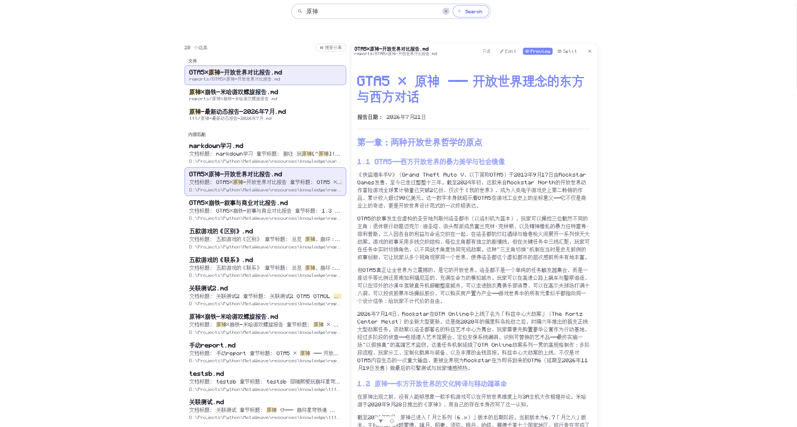
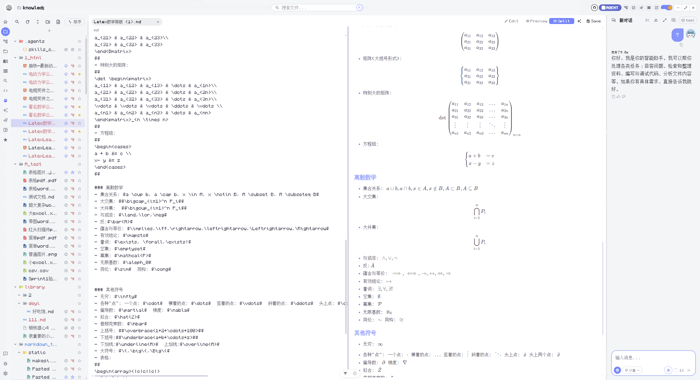
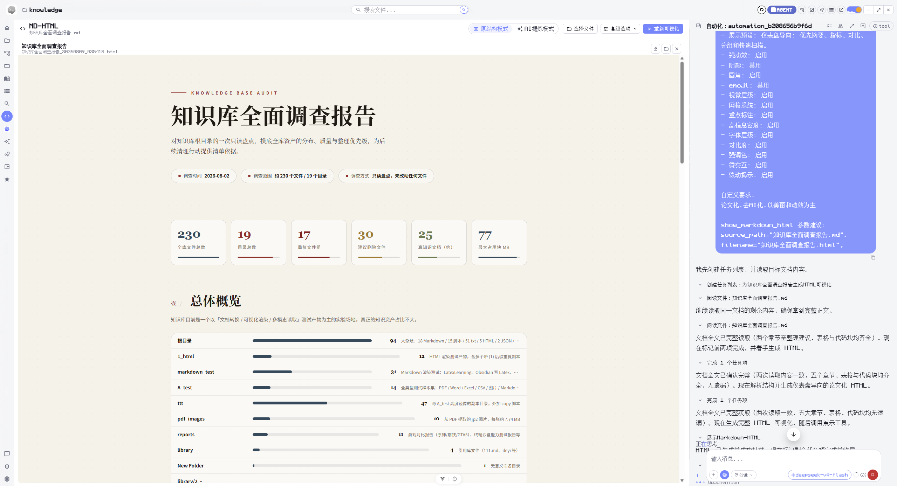

# MetaWeave(元织) 详细功能

## 知识库

### 入库管理

- 文件树使用不同的索引状态图标区分已入库、未入库或格式不可识别、已屏蔽三类文件，分别显示为绿色、红色和灰色。
- 默认采用惰性灌库：文件进入知识库时不自动写入向量库，用户可以手动灌入单个文件，也可以通过顶部命令栏对整个知识库重新灌库。
- 用户可以屏蔽单个文件或建立屏蔽区。被屏蔽的文件不会入库；已经入库的文件被屏蔽后，系统会删除以该文件为来源的知识切片。灌库过程会自动忽略被屏蔽的文件及屏蔽目录的子树。

### 支持格式与 OCR

知识库可以解析 Markdown、纯文本、JSON、CSV、HTML、XML、DOCX、XLSX、PPTX、PDF 和常见图片格式，并将解析结果统一转换为可检索内容。没有专用解析器但可以解码的文件会按纯文本处理，无法识别的二进制文件只登记资源信息，不进入语义索引。

图片、扫描型 PDF 以及文档内嵌图片可以使用 PaddleOCR 提取中英文文字。OCR 默认关闭，用户在设置页开启后会对后续灌库立即生效，无需重启应用。

### 联合搜索

三路联合搜索面向当前选中的知识库，一次输入即可从文件名、文件内容和语义相关性三个维度查找资料。搜索结果按来源分组返回，用户可以根据任务需要打开或关闭全文检索、语义检索；文件名检索始终保留，因此即使关闭其他检索方式，也可以快速定位文件。

- **文件名搜索**：递归遍历当前知识库的文件树，按文件名进行不区分大小写的包含匹配。它适合查找明确知道名称或关键词的文档，并且不依赖文件是否已经完成知识库索引。
- **全文内容搜索**：在知识库文本切片中进行模糊匹配，返回命中文件及其上下文片段。对于尚未完成索引或索引尚未更新的文件，系统还会直接扫描当前知识库文件内容作为兜底；相同文件的重复命中会被合并。
- **语义搜索**：将查询转换为语义检索条件，通过混合召回与 ReRank 排序寻找概念相关的知识片段。语义结果不要求文件中出现完全相同的关键词，适合描述性提问、同义表达和不确定文件名称的查找。

搜索输入采用 300 毫秒防抖，用户连续输入时只提交最后一次查询。顶栏搜索框和搜索页面共用同一套搜索状态、最近搜索历史、检索开关和结果预览；搜索页面还可以在“搜索分离”和“联合搜索”之间切换：分离模式分别查看三类结果，联合模式会按文件合并同一文档的文件名命中、全文片段和语义证据，并保留可点击预览能力。

所有结果都会限定在当前用户正在使用的知识库范围内，避免不同知识库之间串库。全文结果展示命中位置附近的摘要，语义结果展示召回片段；点击结果即可打开对应文件或预览内容。全文和语义检索均可独立关闭，关闭后不会影响文件名搜索。

## 多模态查看
### 编辑器预览
编辑器根据文件类型自动选择合适的预览方式:

- **Markdown** → `Edit / Preview / Split`，支持源码编辑、渲染预览与分栏查看. 支持Obsidian的全部功能,包括反向链接和嵌入式链接等.
- **纯文本** → `Text`，直接编辑原始文本
- **代码与标记语言** → `Code`，提供语法高亮和编辑能力
- **CSV** → `Text / Forms`，可在原始 CSV 文本与表格之间切换
- **XLS / XLSX** → `Forms`，只显示表格
- **DOCX / PDF / 图片** → `Preview / Markdown`，分别查看原件和 `.mw/md/` 中间层全文
- **PPTX** → `Preview / Markdown`，当前原件预览留空，Markdown 显示中间层全文
- **其他格式** → 可解码文本显示 `Text`；二进制显示 `Binary` 且不可查看。旧版 DOC 按不支持格式处理

全局图片放大功能: 毛玻璃浮层, 支持左右切换、滚轮缩放、拖拽平移。在 Markdown 预览、Word 文档预览、AI 对话中点击图片均可触发。

### Markdown-to-HTML功能
Markdown可视化功能：让 Agent 针对某个文档生成 HTML 并在前端展示；多模态文档统一读取其 Markdown 中间层，而不是直接依赖原始格式或 JSON 展示结构。
  - 对文件树或者文件资源管理器的任何文件右键,点击右键菜单的"HTML可视化",则自动先将文档灌库,然后跳转到`HTML可视化`页面,并自动收缩文件树并展开Agent侧边栏给Agent下任务.
  - 可切换"原结构模式"和"AI提炼模式",原结构模式让Agent根据文档原本的结构进行HTML化,AI提炼模式则是Agent将自己理解的相关知识进行总结并写进HTML.HTML放在`runtime/`文件夹.配备一个"展示Markdown-HTML"工具,这个工具会自动触发前端的HTML渲染和挂载.
  - 高级生成配置:可勾选"强动效""阴影""圆角""emoji"...这些HTML的概念配置.
  - 生成后的HTML可以保存到知识库`{user_id}_html/`,或者打开系统资源管理器保存.

## 资料阅读与组织

### 图书馆

图书馆使用“图书”和“集锦”组织文件、文本与网页资料。用户可以建立嵌套集锦，设置标题、描述、标签和封面，并在集锦之间移动资料；真实文件缺失时，图书馆会保留条目并显示缺失状态。

### 智能表格

智能表格面向科研文献和结构化资料管理，支持多张表格、可编辑行列、内置与自定义字段、文献附件、标签、星级、筛选和导出。智能字段可以根据上传文献异步生成标题、摘要、作者、方法、结果等结构化内容，用户仍可手动修改或重新生成。

### 组件库

组件库用于收藏和复用 Vue 单文件组件及独立 HTML。用户可以按类别或名称查找组件，在隔离环境中体验真实交互，查看大尺寸预览与源码，并完成上传、重命名、复制和删除。

### 密码库

密码库集中管理登录信息、银行卡、身份资料和安全笔记，支持标签、附件、搜索、筛选、回收站以及 JSON 导入导出。密码库需要主密码解锁，敏感字段默认隐藏，并在锁定或会话过期后停止访问。

## 知识图谱

MetaWeave 提供语义知识图谱、图书馆图谱、文件树图谱和双向链接图谱。用户可以搜索节点、查看关联节点、筛选图书馆标签、刷新或定格布局，并通过节点打开相应文档；语义图谱还支持重新抽取和全量去重。

## Git 版本管理

当前知识库可以直接初始化为 Git 仓库。Git 面板展示工作区变更和未跟踪文件，支持多选回滚、提交历史、分支切换、提交以及提交并推送。

## Agent 工作台

### 推理模式与工具

Agent 支持 Auto、Simple、ReAct 和 Plan 模式，并可按任务调用知识库、文件、联网搜索、终端、业务资源及 MCP 工具。用户可以启用或关闭 Skill 和工具，并为执行过程选择只读、沙盒或完全访问权限。

### 会话、记忆与引用

Agent 会话支持流式对话、附件、当前文档上下文、短期上下文压缩、长期记忆和自定义系统提示词。回答中的长期记忆、知识库、网页及附件来源使用不同编号标注，点击后可以打开相应文件或网页。

### 任务与自动化

会话任务列表用于持续追踪复杂任务的当前项和完成概要。独立任务队列使用看板管理等待认领、处理中和等待确认的 Agent 任务，并支持优先级、附件、并行执行、终止、确认和继续处理。TODO 侧边栏同时支持普通待办和按单次、每日、每周或每月计划运行的 Agent 自动化。

### 可观测性与变更

对话区展示工具调用、文件变化、召回来源和子 Agent 生命周期事件；观测面板汇总 Token 用量、节点耗时、RAG 指标和上下文。Agent 对文件产生的变更会形成快照，用户可以检查并撤销。

### 安全、终端与多 Agent

安全审核覆盖输入和输出，用户可以配置敏感词及审核开关。终端工具受权限模式、工作区边界和程序白名单约束。主 Agent 可以创建前台或后台子 Agent，限制其角色、工具和权限，并查看、停止或更新运行中的子任务。
