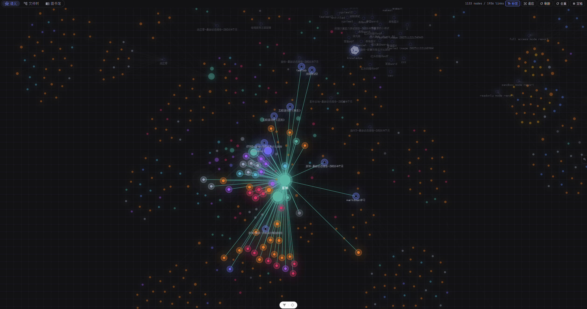

# MetaWeave(元织) 业务领域设计

## 图书馆

图书馆是知识库里的资料书架，把文件、文本和网页整理成更适合阅读的"图书卡片"，用户不必直接面对一堆散乱文件。

图书馆里有两类内容:**图书**和**集锦**。图书是一份具体资料,可以来自文件、直接输入的文本或网页地址。集锦是一组资料,适合整理论文、项目文档、课程材料、素材收藏等主题。

- 新增图书时,可以上传文件、输入文本或填写网页地址。文件和封面都支持拖拽上传,也可以点击选择。

- 图书和集锦都可以设置标题、描述、标签和封面。集锦可以继续嵌套子集锦,图书也可以在不同集锦之间移动。

图书馆会维护真实文件位置。新增集锦会创建同名文件夹,新增图书会保存到当前集锦文件夹中。移动或重命名图书、集锦时,真实文件也会跟着移动。

- 真实文件固定保存在当前知识库的 `.mw/library/` 中；该目录由 MetaWeave 管理，在存储设置中只读展示。

- 标题会自动转换成可用文件名。系统会清理非法字符,遇到重名会自动追加序号,避免覆盖已有资料。

- 图书馆卡片会显示资料名称、描述、修改时间、入库状态和图谱状态。用户可以按类型、标签和排序方式筛选。

如果真实文件被手动移动或删除,图书馆不会直接删掉卡片,而是标记为缺失。用户可以据此判断资料是否需要找回、重新加入或修正存储路径。

## 智能表格
智能表格:面向**科研文献**的智能化字段管理表格.
- 智能表格的文献存储在知识库内的forms/之内,可以有多张表格,每个表格在forms/下有一个文件夹,文件夹内存储表格上传的文献本体.forms/像library/一样默认被系统忽略,但`forms/**/assets/**`不忽略..
- 表格可编辑,可以重排列和行,具有默认列,默认列可删除,也可以插入内置的选择性列,还可以插入自定义的列.
  - 所有列的内置类型:
    - 文本: 普通文本,可编辑.
    - 智能填充文本: 拥有文本的功能,并且自动将上传的文件内容和用户自定义的这个列标题通过LLM自动的异步生成文本,用户可编辑,编辑后可以点击格子右上角的图标按钮进行重新LLM生成,也可以直接保存.
    - 标签: 用户可编辑和增加和删除标签.
    - 智能标签: 拥有标签的功能,并且智能填充,具体生成过程是将现有所有此列的标签和提取的文字一起喂给LLM,LLM选择已有的(多个)标签或者自己生成新的标签.用户可编辑和增加和删除标签.
    - 选择框: 只能选择"是"或者"否",可编辑.
    - 星级: 只能选择1-5颗星,可编辑.
    - 日期: 可以调用待办侧边栏中的日历选择器输入日期和精确时间.
  - 默认列:
    - 序号(文本): 从1开始自动生成,不可编辑.
    - 文献上传(特殊列): 拖拽上传任何知识库支持的格式的文件,自动灌库并提取文字备用.一列只能上传一个文件.
    - 文献内容(文本,其他所有智能列的内容来源): 用户上传文件之后显示抽取的文字内容,不可编辑.
    - 标题(智能填充文本): 提取文字后,自动喂给LLM生成,可编辑.
  - 选择性列:用户可选择性的插入这些列.
    - 文献类型(智能标签): 智能自动填充的标签列,用户可编辑和增加和删除标签.
    - 重要性(星级): 以星级形式显示,默认是空的5颗星,用户可以随时打星.
    - 阅读进度(标签): 只能选择"未读","已读","阅读中"三种标签,默认是"未读",用户可修改.
    - 关键词|摘要|期刊|作者|年份|研究背景(why)|研究内容(what)|研究方法(how)|研究结果|创新点|局限性|未来展望|DOI|URL (智能填充文本): LLM会异步的自动从上传的文献中提取这些信息并填充到表格中,不同的列用不同的彩色浅背景区分.
  - 自定义列: 用户可以自定义列名和列的类型(仅提供内置类型),并插入到任何地方.
- 表格可以(针对某一列或者全表格内)进行匹配搜索(和可选的语义搜索),高亮符合的行;可以筛选,筛选条例如下:
  - 标签筛选: 全表范围内筛选所有标签和智能标签类型的列,只要有一个标签符合就显示.
  - 星级筛选: 筛选1~5星的列.
- 表格可导出为csv文件(不导出文献列),也可以导出为xlsx,md表格(不导出文献列);还可以导出为zip,zip内包含导出的csv文件和文献列的所有文件.也可以从这几个格式中导入.
- 表格不一定要有文献列.如果用户选择删除文献列,那么就退化为普通表格,普通表格只能导入或者手动改列,不再享有智能列功能.

## 组件库

组件库用于集中收藏、浏览和复用带有真实交互与动效的界面组件。组件会以自适应尺寸的瀑布流卡片展示，小型组件不会被强行撑大，较高或较宽的组件也会按照自身内容自然排布。

- 支持 Vue 单文件组件和独立 HTML。组件会在隔离的实时预览区中编译并显示，按钮、开关、悬停动画等交互可以直接在卡片或详情页中体验。
- 左侧可以按 all、buttons、checkboxes、toggle switches、cards、loaders、inputs、radio buttons、forms、patterns 和 tooltips 分类筛选，也可以通过搜索框按组件名快速查找当前分类中的组件。
- 每张组件卡片都提供复制、查看详情和删除操作。点击组件内容会触发组件自身的交互；点击详情按钮则会进入更大的实时预览与源码对照页面。
- 详情页支持一键复制源码，并允许直接在原位置重命名组件。组件卡片上的名称同样可以直接修改，不需要打开额外表单。
- 上传组件时可以填写组件名、粘贴源码并立即查看编译结果，再为组件选择一个分类标签。也可以从文件资源管理器一次选择一个或多个 Vue、HTML 文件批量加入组件库。
- 删除的组件会先移入知识库回收站，避免误操作后无法找回。
- 组件统一保存在当前知识库的 `.mw/components/` 中，与图书馆和智能表格一样由应用管理；文件浏览和知识入库统一忽略整个 `.mw/`。

## 密码库（模仿 Bitwarden）

面向本地敏感信息的独立加密库，用于集中管理账号、支付卡、身份资料与安全笔记。
- 密码库是独立的二次解锁区域，不改变软件既有的全局登录逻辑；只有进入密码库时才需要设置或验证当前 `user_id` 的主密码。
- 主密码仅用于密码库解锁，服务端保存安全哈希；敏感字段加密后按 `user_id` 隔离存储。解锁后签发仅适用于密码库的 HS256 JWT（`scope: vault`），有效期 30 分钟；锁定或过期只要求重新解锁密码库，不会退出软件全局登录。
- 设置页支持验证旧主密码后重设，也提供当前用户的重设入口；重设时会重新加密全部条目并立即失效旧密码库会话。
- 条目支持手动保存的新增、查看、编辑、移入回收站、恢复与永久删除，分为登录、支付卡、身份和安全笔记四类；未标注必填的字段均为可选。
  - 登录：项目名称、密码必填；可选用户名、网站 URI、图片、标签和备注。
  - 支付卡：项目名称、号码必填；可选持卡人姓名、品牌、安全码、图片、标签和备注。
  - 身份：项目名称、名字必填；可选称呼、用户名、公司、电子邮箱、电话、国家/省/市、三行地址、邮政编码、图片、标签和备注。
  - 安全笔记：项目名称、笔记内容必填；可选图片、标签和备注。
- 图片为可选字段，存储在受密码库鉴权保护的 runtime 专用目录，不在知识库文件夹内；永久删除条目时会同步清理其关联图片。
- 已解锁状态下支持全字段搜索、标签筛选和类型筛选；列表响应不会暴露密码、安全码及安全笔记明文。
- 支持全库或多选 JSON 导出（导出前提示敏感明文风险）与 JSON 导入；字段不匹配的可识别条目会转换为安全笔记，并返回导入、转换和失败数量。
## 知识图谱
知识图谱分为四类: 语义知识图谱,文件树图谱,图书馆结构图谱,双向链接图谱.
四类图谱依赖同一套**前端渲染**:
  - 语义图谱无根节点,实体和文档节点根据 d3-force 力导向布局自动散开
  - 实体节点按类型着色(person→粉色, organization→靛蓝, project→青色, concept→橙色 等)
  - 实体节点为实心球,文档节点为虚线空心球
  - 拖拽节点时暂时固定位置,松手后力布局重新演算
  - 文件树图谱(父子层级)与语义图谱(自由网状)通过前端按钮切换,共享同一个 Canvas 渲染器
  - 对于实体节点,连接了1条边的大小为基础大小,每多连接1条边,则实体节点大小增加基础大小的10%,最多500%,更多则大小固定.
  - 图谱默认为释放态(电荷小球物理排斥),可以进行定格.
### 语义知识图谱
在多模态文件入库的路径中,当文档被解析为JSON后,一路进行切片入向量库,另一路则进行异步的小模型实体关系提取.
语义知识图谱提取各文档内的实体,用LLM(小模型)异步解析**文档内各实体**的关联,将知识库多模态文件的结构化 JSON 转译为实体-关系图,最终持久化到 SQLite,前端通过 D3.js Canvas 实时渲染.

- **关系类型**: `defines`,`contains`,`depends_on`,`produces`,`consumes`,`calls`,`configures`,`mentions`,`related_to`。
- **实体类型**: `person`,`organization`,`project`,`module`,`class`,`function`,`file`,`concept`,`config`,`data`,`other`。

- **入库模型**:
  抽取结果写入 `runtime/db/relation/agent_service.db` 三张表:
  - `knowledge_graph_nodes` — 全部节点(文档 + 实体)
  - `knowledge_graph_edges` — 全部边,分为两种:
  - **实体-实体边**: LLM 从同一个 section 文本中抽取的语义关系,携带 `evidence`(原文短语)
  - **文档-实体边**: 程序自动生成的 `mentions` 边,连接文档节点与该文档 section 中出现的所有实体,`weight` 由 entity confidence 决定
  - `knowledge_graph_document_status` — 每篇文档的抽取状态(completed/failed/skipped)
  图谱特点是**文档内通过 LLM 输出的语义关系进行关联, 不同文档通过共享实体节点间接连接**,形成隐式的跨文档语义网络.抽取时不做跨文档关系发现,保证每篇文档的独立性,同时共享实体节点在外图中自然实现了桥接.
  重建时按 `source_hash` 增量执行,仅对新增或内容变更的文档重新调用 LLM 抽取,已抽取且未变化的文档直接跳过.

- **语义去重**: 系统提供两层语义去重机制,分别处理文档内和跨文档的同义实体合并。
  - **文档级去重**: 每篇文档的所有 section 抽取完成后,自动将该文档的所有实体候选汇总喂给小模型做语义去重。小模型识别出文字不同但语义一致的实体(如"AI"="Artificial Intelligence"、"星铁"="星穹铁道"),合并为规范名称并重映射关系边。自动触发,无需用户干预。
  - **库级全量去重**: 图谱面板工具栏有"去重"按钮,点击后触发全库所有实体的聚类去重。先对所有实体做 Embedding 向量化,再用 DBSCAN 按余弦距离聚类找出"语义密集团"(如多个称呼同一作品的相近实体),只对每个非单点簇喂给小模型做同义判断和合并,噪声点自动跳过。此外文档抽取完成后还有一个**增量去重**步骤:对每篇文档的新实体,通过 Embedding 从库中检索最相似的已有实体,一并喂给小模型裁决是否合并。

> **注意**: 首次打开图谱页面时,语义图谱默认模式需要显式加载。`GraphPane.vue` 在 `onMounted` 中会调用 `loadSemanticGraph()` 加载语义数据,无需手动切换模式。
### 图书馆图谱

图书馆图谱按集锦与资料的父子关系展示用户整理后的图书馆结构,并支持按标签筛选。点击集锦可进入对应图书馆目录,点击资料可直接打开源文件。

### 文件树图谱

文件树图谱将知识库目录、子目录和文件按真实层级连接起来,便于直观看清文件组织结构。点击文件节点即可在编辑器中打开对应文件。

### 双向链接图谱

双向链接图谱扫描 Markdown 中的 `[[...]]` 反向链接与 `![[...]]` 嵌入链接,展示文档和被引用资源之间的关系及两类链接数量。点击节点即可跳转到对应文档或资源。

## Git版本管理

系统配备Git管理的功能,主要包括:

1. 在当前知识库根目录创建和管理独立 Git 仓库。
2. 从左侧图标栏或顶部栏打开 Git 边栏,分别显示在左侧或右侧。
3. 查看“更改”和“未进行版本管理的文件”,并按文件勾选要提交或回滚的内容。
4. 在文件树和资源管理器中显示 Git 状态颜色,文件夹会继承内部变更颜色。
5. 在固定底栏填写提交概要,复用历史提交摘要,并切换本地分支。
6. 提交选中文件,或提交后进入推送弹窗。
7. 推送前确认本地分支、远程仓库、远程分支、未推送提交和涉及文件,也可以新建推送目标。
8. 回滚、切换分支和拉取更新时,自动失效对应文件的入库索引与图谱索引,并清理旧切片、旧图谱节点和边。
9. Agent 配备Git管理工具, 可使用同一套 Git 能力读取状态、查看差异、提交、推送、回滚、建分支、切分支、拉取和添加远程仓库。
