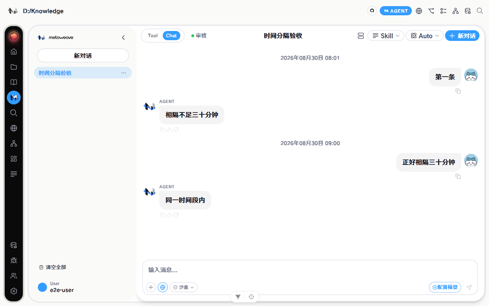

# Agent 消息时间分隔验收

## 验收映射

- 旧位置：`ChatBubble` 与 `ToolBubble` 已删除用户气泡左下角时间 DOM、格式化逻辑和响应式样式。
- 30 分钟阈值：`MessageList` 以相邻有效可见消息时间差 `>= 30 分钟` 判断；首条有效时间消息显示时间起点。
- 展示格式：统一使用查看者本地时区的 `YYYY年MM月DD日 HH:mm`，秒不显示。
- 双模式：chat/tool 均通过同一个 `MessageList` 派生分隔，避免模式间差异。
- 持久化：数据库 `MessageRecord.created_at`、历史 API、前端历史恢复、YAML 导出和 YAML/JSON 导入均保留消息原始时间。

## 验证结果

- Vitest 失败基线：chat/tool 两项均因 0 个分隔条失败。
- Vitest 修复后：时间边界 2/2，ChatBubble 整文件 23/23。
- 导出回归：5/5；导入时间保真：1/1。
- 定向 ESLint：通过；Vite 生产构建：通过。
- Chromium：亮色 Agent 页面加载历史并重新加载页面后，两次均仅显示 `2026年08月30日 08:01` 与 `2026年08月30日 09:00`；29:59、无效时间和同时间段消息均未新增分隔。

