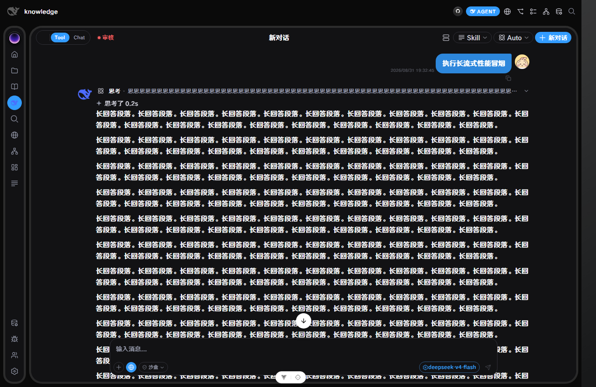

# Agent 长流式输出性能验收

## TODO—实现—验收对应

| TODO | 实现 | 验收 |
| --- | --- | --- |
| T1：移除逐 token 动态 metadata | graph/simple 两条后端流仅在首个正文 delta 报告首字延迟，thinking 与后续 delta 使用空 metadata；前端兼容性剥离 `backend_elapsed_ms` | 后端正式图线程回调测试验证 thinking 两次、正文两次的 metadata 契约；前端测试验证旧后端耗时不会进入消息 |
| T2：跨窗口 O(delta) 同步 | `chat-stream` 使用 `seq + index + upsert/append`；`chat-meta` 独立同步非消息状态；完整 `chat-state` 仅用于同步边界；隐藏 BrowserWindow 丢弃中间流事件 | 乱序和重复 seq 被丢弃；20,000 个文本事件只产生两次 append 负载且不含历史；真实 Electron 两个 BrowserWindow 验证隐藏时 0 个 stream、仍收到 terminal snapshot，显示后恢复 stream |
| T3：隔离流式草稿成本 | thinking/content 使用非响应式 Map 聚合，每 50ms 提交；终止、异常和取消强制冲刷；空 tool_calls/trace 不再逐 token 重设 | chat store 23/23，通过取消、归属、思考、正文、窗口同步及 10,000+10,000 字长流测试 |
| T4：增量 Markdown | 追加扫描器只读取新增字符；已稳定 DOM 永不重建；每个草稿批次只解析/净化一次新增稳定片段；活跃尾部单独重绘；终态全量校正一次 | Markdown 12/12，已完成段落 DOM identity 在尾部增长时保持不变；列表、表格、代码高亮和终态一致性通过 |
| T5：Thinking 与动画 | 折叠态不挂载全文；摘要以增量尾部更新且限制 300 字；扫光和共享 shimmer 改用 transform 合成动画；移除布局宽度读取 | Think/ChatBubble 26/26；实际展开/收起 30,000 字思考成功，无内容丢失 |
| T6：长流与实际界面 | Playwright 通过真实 Vite 代理和真实后端启动页面，拦截模型 SSE 注入 30,000 个 thinking + 3,000 个正文事件 | 最终：thinking 30,000 字、正文 18,150 字、按钮 44–66ms、最长 long task 50–51ms、无 pageerror；截图见下方 |

## 实际界面截图

## 其他验证

- Vite production build：通过，5,117 modules transformed。
- API SSE 回归：4/4。
- 后端 reasoning 持久化：3/3。
- `git diff --check`：无空白错误。
- 全量 `vue-tsc` 仍被仓库既有类型错误阻塞；本次新增的 Markdown 和窗口同步类型错误已清零，剩余错误包括 ImagePreviewer、SmartForms、既有 chat child status 等未修改范围。
- 验收启动的 5173/8002 服务均由生命周期脚本关闭；最终仅存在 TIME_WAIT，无 LISTEN 端口。
- Electron 双窗口断言输出：`windows=2`、`hiddenStreamCount=0`、隐藏窗口收到 `chat-state`、重新显示后收到 `chat-stream`；自动化 Electron 在断言后未自行结束，已中断托管命令并确认无 Electron 进程或监听端口残留。
