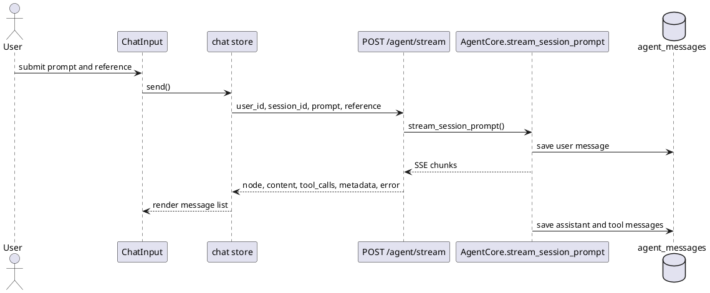
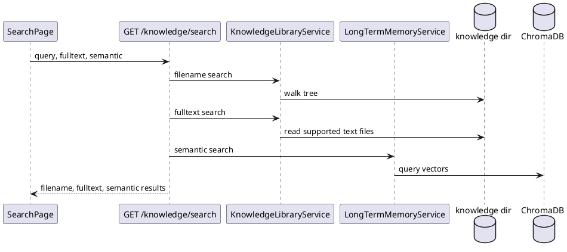

# MetaWeave 接口设计文档

## 1. 接口范围

MetaWeave 对外提供两套接口。REST 接口主要服务 editor 和 console 前端，承担页面交互、文件管理、设置管理、流式对话和观测数据读取。gRPC 接口面向外部程序集成，覆盖 Agent 调用、会话管理、消息历史、知识库文件、系统提示词、长期记忆和工具注册表。

REST 与 gRPC 的能力保持同源。后端业务逻辑集中在 service 层和 AgentCore，接口层只做参数转换、错误处理和响应序列化。

## 2. REST 接口分组

REST 路由集中在 `agent_service/api/rest`。前端 API 路径注册在 `editor/src/router/api_routes.ts`，业务组件不直接硬编码路径。

| 分组 | 主要路径 | 用途 |
| --- | --- | --- |
| 健康检查 | `GET /health` | 判断后端服务是否在线 |
| Agent 调用 | `GET/POST /agent/stream` | 有 session 的流式对话 |
| Agent 调用 | `POST /agent/run` | 有 session 的非流式对话 |
| Agent 调用 | `POST /agent/run-once` | 单次无状态调用 |
| Agent 控制 | `POST /agent/cancel` | 取消指定 session 的运行 |
| Agent 观测 | `GET /agent/events` | 读取会话事件和 trace |
| Agent 观测 | `GET /agent/recall-details` | 读取召回详情 |
| 工具注册表 | `GET /agent/tools` | 读取最终注册工具列表 |
| 当前文档 | `PUT/GET /agent/editor-context/current-document` | 同步编辑区当前文档 |
| 会话 | `/sessions` | 创建、查询、删除和重命名会话 |
| 消息 | `/sessions/{session_id}/messages` | 读取消息历史 |
| 知识库文件 | `/knowledge/files` | 文件树、内容、预览、上传、删除、复制、重命名 |
| 知识库搜索 | `GET /knowledge/search` | 文件名、全文和语义搜索 |
| 文件事件 | `GET /knowledge/files/events` | 文件树变更 SSE |
| 用户设置 | `/settings/profile` | 用户资料和知识库目录 |
| 系统提示词 | `/settings/system-prompt` | 长期规则条目 |
| 长期记忆 | `/settings/memories` | 手动维护长期记忆 |
| 模型设置 | `/settings/model-config` | 主模型和小模型配置 |
| Web 搜索 | `/settings/web-search` | 代理和搜索开关 |

## 3. Agent 流式接口

前端主要使用 `POST /agent/stream`。请求体包含 `user_id`、`session_id`、`prompt` 和可选 `reference`。后端返回 SSE，事件内容来自 AgentCore 图执行过程。前端 chat store 会逐行解析流，更新 assistant 气泡、工具调用气泡、思考提示、错误状态和完成状态。



SSE chunk 的关键字段包括 `node`、`content`、`tool_calls`、`trace`、`done`、`model_name`、`type`、`context_messages`、`metadata` 和 `error`。其中 `context_messages` 只用于观测，不作为普通用户回答展示。错误事件会被前端转成可读提示。

引用文本不只显示在输入框上方。发送后，它会进入用户消息 metadata，并被 ContextBuilder 拼入当前用户消息内容。历史消息加载时，前端也会根据 metadata 在用户气泡上方恢复引用块。

## 4. 会话接口

会话接口用于保存对话列表和每个 session 的消息历史。每个会话属于一个 `user_id`。创建会话时如果没有传入名称，后端使用默认名称。对话开始后，系统可以根据第一轮内容自动重命名。

| 方法 | 路径 | 说明 |
| --- | --- | --- |
| GET | `/sessions?user_id=` | 查询用户会话列表 |
| POST | `/sessions` | 创建会话 |
| GET | `/sessions/{session_id}` | 查询单个会话 |
| DELETE | `/sessions/{session_id}` | 删除单个会话 |
| DELETE | `/sessions?user_id=` | 清空用户会话 |
| PUT | `/sessions/{session_id}/name` | 修改会话名称 |
| GET | `/sessions/{session_id}/messages` | 查询消息历史 |

消息历史按创建时间返回。前端在切换 session 时会加载最近消息，并把 `tool_calls_json` 和 `metadata_json` 映射成聊天气泡需要的结构。

## 5. 知识库文件接口

知识库文件接口围绕当前 active 知识库目录工作。后端通过 SettingsService 找到当前用户的 active library，再把前端传入的相对路径解析到该目录下。路径解析会检查越界，避免通过 `..` 访问知识库外部文件。

| 方法 | 路径 | 说明 |
| --- | --- | --- |
| GET | `/knowledge/files` | 获取文件树 |
| GET | `/knowledge/files/content` | 读取文本内容 |
| GET | `/knowledge/files/preview` | 获取多模态预览数据 |
| GET | `/knowledge/files/raw` | 返回 PDF 或图片等原始文件 |
| POST | `/knowledge/files/content` | 写入文本内容 |
| POST | `/knowledge/files/file` | 创建文件 |
| POST | `/knowledge/files/folder` | 创建文件夹 |
| POST | `/knowledge/files/upload` | 上传文件 |
| POST | `/knowledge/files/copy` | 复制文件或目录 |
| POST | `/knowledge/files/rename` | 重命名或移动路径 |
| DELETE | `/knowledge/files` | 删除文件或目录 |
| GET | `/knowledge/files/events` | 监听文件树变化 |

预览接口会按文件类型返回不同 `kind`。图片返回 data URL 或 raw URL，PDF 返回可嵌入 iframe 的 raw URL，CSV 和 XLSX 返回 sheets，DOCX 返回 HTML，无法预览的文件返回 unsupported。文本编辑接口不会强行处理这些二进制文件。

## 6. 知识库搜索接口

`GET /knowledge/search` 接收 `user_id`、`query`、`limit`、`fulltext` 和 `semantic`。后端先查文件名，再根据参数执行磁盘全文搜索和语义搜索。语义搜索依赖长期记忆和向量库，全文搜索可以在文件刚导入、索引还未更新时提供兜底。



返回结果分为 `filename`、`fulltext` 和 `semantic` 三类。前端可以分别展示，也可以在 UI 中合并排序。

## 7. 设置接口

设置接口服务于用户资料、知识库目录、系统提示词、长期记忆、模型配置和 Web 搜索。用户资料中最关键的是 active knowledge library。系统允许一个用户拥有多个知识库目录，每次只有一个处于 active 状态。

系统提示词条目用于长期规则。新增条目后，ModelDecisionNode 会在后续对话中读取并拼接到系统提示词。长期记忆则写入统一长期记忆表，进入召回流程。

## 8. 工具注册表接口

`GET /agent/tools` 返回最终 ToolRegistry 中所有工具的基本信息，包括名称、展示名称、描述、参数 schema 和参数数量。该接口支持 OPTIONS，避免前端跨源请求时预检失败。

```json
{
  "tool_count": 3,
  "tools": [
    {
      "name": "search_knowledge",
      "display_name": "搜索知识库",
      "description": "按关键词搜索当前知识库",
      "args_schema": {
        "type": "object",
        "properties": {}
      },
      "argument_count": 2
    }
  ]
}
```

实际返回工具数量由注册表决定，上面的 JSON 只表示字段结构。

## 9. gRPC 接口

gRPC 定义在 `protos/agent_service.proto`。它覆盖的能力比前端当前使用面更完整，适合外部软件集成。服务名为 `AgentService`。

| RPC | 说明 |
| --- | --- |
| `StreamRun` | 无状态流式运行 |
| `RunOnce` | 无状态单次运行 |
| `StreamSessionPrompt` | 有 session 的流式运行 |
| `RunSessionPrompt` | 有 session 的单次运行 |
| `CreateSession` | 创建会话 |
| `GetSession` | 查询会话 |
| `ListUserSessions` | 查询用户会话 |
| `UpdateSessionName` | 修改会话名称 |
| `DeleteSession` | 删除会话 |
| `DeleteAllSessions` | 清空用户会话 |
| `ListMessages` | 查询消息历史 |
| `CancelSession` | 取消运行 |
| `GetEvents` | 查询 trace 事件 |
| `GetRecallDetails` | 查询召回详情 |
| `GetRegisteredTools` | 查询工具注册表 |
| `EnsureUserProfile` | 确保用户资料存在 |
| `UpdateUserKnowledgeDir` | 切换知识库目录 |
| `RebuildKnowledge` | 重建知识库索引 |
| `UploadKnowledgeFile` | 上传知识库文件 |
| `ListKnowledgeFiles` | 查询文件树 |
| `ReadKnowledgeFile` | 读取文件 |
| `WriteKnowledgeFile` | 写入文件 |
| `CreateKnowledgeFile` | 创建文件 |
| `CreateKnowledgeFolder` | 创建文件夹 |
| `CopyKnowledgePath` | 复制路径 |
| `DeleteKnowledgePath` | 删除路径 |
| `RenameKnowledgePath` | 重命名路径 |
| `ListSystemPromptEntries` | 查询系统提示词条目 |
| `AddSystemPromptEntry` | 新增系统提示词条目 |
| `DeleteSystemPromptEntry` | 删除系统提示词条目 |
| `ListCustomMemories` | 查询手动长期记忆 |
| `AddCustomMemory` | 新增手动长期记忆 |
| `DeleteCustomMemory` | 删除手动长期记忆 |

## 10. 关键消息结构

`RunRequest` 是 Agent 调用的核心请求。它包含 `prompt`、`user_id`、`session_id` 和 `reference`。其中 reference 是从文档选区进入对话的引用文本。

`ChunkMessage` 是流式返回的核心结构。它包含当前节点、文本片段、工具调用、trace、是否完成、模型名、类型、上下文镜像、元数据和错误信息。

`KnowledgeRebuildResponse` 用于反馈入库统计。它包含扫描到的 frontmatter 文件数、写入数量、跳过数量、原始文件数、入库文件数、切片数、删除切片数和上传路径。header 上的小进度条可以根据上传和 rebuild 生命周期展示状态，最终统计仍以后端返回为准。

## 11. 错误处理

REST 接口使用 HTTP 状态码表示请求错误。参数不合法时返回 422，服务依赖未初始化时返回 503，运行过程中的模型或连接错误会进入 SSE error chunk。前端不直接展示原始异常栈，只展示用户可理解的连接失败、请求失败或导入失败提示。

模型供应商返回限流时，后端会记录具体 HTTP 日志。对前端而言，最终表现为该轮 Agent 执行失败。后续可以在接口层把 429 单独映射成“模型服务限流”，以便用户区分网络断开和额度不足。

## 12. 接口一致性要求

项目约定 REST 和 gRPC 应尽量同步。只给前端新增 REST 能力而不补 gRPC，会导致外部集成无法复现面板能力。只给 gRPC 新增能力而不补 REST，则 editor 无法直接使用。后续新增文件屏蔽区、OCR 状态查询或索引任务管理时，应同时设计两套入口。

