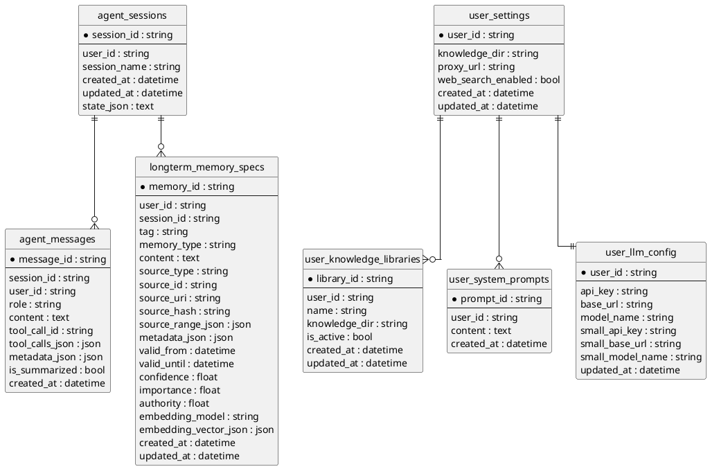
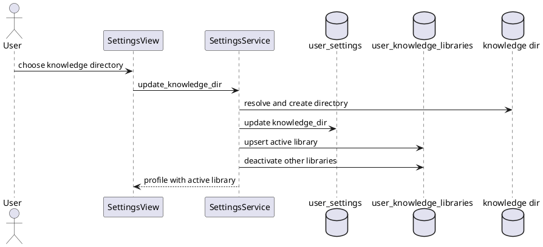
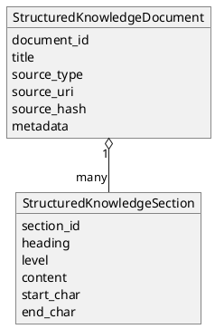
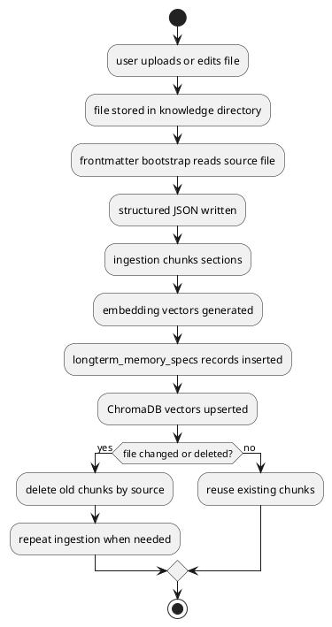

# MetaWeave 数据模型设计

## 1. 数据存储概览

MetaWeave 使用 SQLite 保存结构化业务数据，使用 ChromaDB 保存向量索引，使用普通文件系统保存知识源和 frontmatter JSON。SQLite 中的表由 SQLModel 定义并在服务启动时自动创建。向量库中的记录与 `longterm_memory_specs` 保持同源，通过 memory_id 和元数据关联。

文件系统也是数据模型的一部分。用户知识库目录中的原始文件不被复制到数据库，数据库保存的是消息、配置、记忆、知识切片和索引元数据。这样可以让用户继续用系统文件管理器处理知识源，也方便把项目打包成桌面软件。

## 2. 核心实体关系

上图中的 user_id 没有单独建用户表。当前项目把用户标识作为轻量字符串使用，默认前端会维护一个本地 user_id。后续如果接入登录系统，可以补一张用户表，再把这些表中的 user_id 改成正式外键。

## 3. 会话表

`agent_sessions` 保存会话生命周期。`session_id` 是主键，`user_id` 用于用户隔离，`session_name` 用于侧边栏展示，`created_at` 和 `updated_at` 用于排序。`state_json` 保存 Agent 探索状态或计划状态，便于跨轮继续执行。

这个表不保存消息正文。消息正文在 `agent_messages` 中一条条记录。

| 字段 | 类型 | 说明 |
| --- | --- | --- |
| `session_id` | string | 会话主键 |
| `user_id` | string | 所属用户 |
| `session_name` | string | 会话展示名 |
| `created_at` | datetime | 创建时间 |
| `updated_at` | datetime | 更新时间 |
| `state_json` | text | Agent 状态 JSON |

## 4. 消息表

`agent_messages` 是对话历史和观测数据的基础。用户消息、助手消息、工具调用消息都写入同一张表，通过 `role` 区分。工具调用请求保存在 `tool_calls_json`，工具结果可通过 `tool_call_id` 关联。`metadata_json` 用于保存模型名、节点名、trace、引用内容、reasoning_content 和其他扩展信息。

引用链路依赖这个字段。

当用户选中文档片段并点击提问时，前端把该片段作为 reference 发送。后端保存用户消息时把 reference 写入 metadata。上下文构建器再读取 metadata，把引用文本拼进模型看到的用户消息。历史消息回显时，前端也从 metadata 中取出 reference 并显示在用户气泡上方。

| 字段 | 类型 | 说明 |
| --- | --- | --- |
| `message_id` | string | 消息主键 |
| `session_id` | string | 所属会话 |
| `user_id` | string | 所属用户 |
| `role` | string | user、assistant、tool、system |
| `content` | text | 消息正文 |
| `tool_call_id` | string | 工具结果对应的调用 ID |
| `tool_calls_json` | json | 助手发起的工具调用 |
| `metadata_json` | json | 扩展元数据 |
| `is_summarized` | bool | 是否已经被摘要覆盖 |
| `created_at` | datetime | 创建时间 |

## 5. 长期记忆表

`longterm_memory_specs` 是系统最重要的数据表之一。它同时承载长期记忆、重要事实摘要、知识库切片和手动记忆。不同来源通过 `tag`、`memory_type`、`source_type` 和 `source_uri` 区分。

这张表的字段较多，原因是它要支持检索、排序、溯源、过期、屏蔽、重建和向量同步。比如知识库文件重新入库时，服务会根据 source_hash 判断是否跳过未变化文件，也可以根据 source_uri 删除某个文件产生的旧 chunk。记忆冲突处理则可以通过 metadata 中的 fact_status 和 superseded 信息完成。

| 字段 | 类型 | 说明 |
| --- | --- | --- |
| `memory_id` | string | 记忆主键 |
| `user_id` | string | 所属用户或知识库 owner |
| `session_id` | string | 可选会话 ID |
| `tag` | string | Memory 或 Knowledge |
| `memory_type` | string | important_fact_summary、knowledge_chunk 等 |
| `content` | text | 可检索正文 |
| `source_type` | string | session_messages、knowledge_file 等 |
| `source_id` | string | 来源 ID |
| `source_uri` | string | 来源文件或外部 URI |
| `source_hash` | string | 来源内容哈希 |
| `source_range_json` | json | chunk 位置、字符范围、消息范围 |
| `metadata_json` | json | 章节、标题、模态、事实状态等 |
| `valid_from` | datetime | 生效时间 |
| `valid_until` | datetime | 失效时间 |
| `confidence` | float | 可信度 |
| `importance` | float | 重要性 |
| `authority` | float | 权威性 |
| `embedding_model` | string | 向量模型 |
| `embedding_vector_json` | json | 向量副本 |
| `created_at` | datetime | 创建时间 |
| `updated_at` | datetime | 更新时间 |

## 6. 用户设置表

`user_settings` 保存用户的基础配置，包括当前知识库目录、Web 搜索代理和 Web 搜索开关。它是 SettingsService 的入口表。用户第一次进入系统时，后端会确保这条记录存在。

`knowledge_dir` 是兼容早期结构的字段。当前版本还引入了 `user_knowledge_libraries`，用于支持一个用户拥有多个知识库。

## 7. 知识库配置表

`user_knowledge_libraries` 保存用户的知识库目录列表。`library_id` 由 user_id 和 knowledge_dir 生成，`is_active` 表示当前使用的库。KnowledgeLibraryService 每次处理文件树、读取文件、上传文件或搜索文件时，都会先通过 SettingsService 找到 active library。

这个设计允许后续在 UI 中做知识库切换、知识库重命名和知识库隔离。向量库 owner id 也可以根据 library_id 派生，避免不同知识库的 chunk 混在一起。

## 8. 系统提示词表

`user_system_prompts` 保存长期规则。每条规则独立存储，删除时按 prompt_id 删除。模型决策节点在执行前会读取当前用户全部条目，拼接到默认系统提示词后面。

它和长期记忆表的区别在于读取方式。长期记忆需要召回，系统提示词每轮都进入模型上下文。比如“以后回答都用中文”更适合系统提示词，“用户喜欢研究本地 OCR”更适合长期记忆。

## 9. 用户模型配置表

`user_llm_config` 保存用户级模型覆盖项。字段分为主模型和小模型两组。主模型用于正式回答和工具决策，小模型用于轻量任务，例如摘要、分类或事实抽取。为空的字段会回退到 AgentConfig 中的默认配置。

API Key 存储在本地 SQLite。这个方案适合单机验收项目，但如果后续做多用户远程部署，需要重新设计密钥加密、访问控制和审计。

## 10. frontmatter 结构化文档

frontmatter JSON 不在 SQLite 表中，但它是知识库入库过程的中间数据模型。每个源文件会生成一个对应 JSON，通常包含 `document_id`、`title`、`source_type`、`source_uri`、`source_hash`、`summary`、`tags`、`authority`、`valid_from`、`valid_until`、`metadata` 和 `sections`。

`sections` 是最关键的数组。每个 section 包含章节编号、标题、正文、字符起止位置和层级。入库服务只消费这个结构，不再关心原始文件是 Markdown、CSV、DOCX、XLSX 还是 PPTX。

DOCX、XLSX 和 PPTX 会在清洗阶段读取内部 XML。这个选择能避开大量无关二进制细节，也能保留段落、表格、工作表、幻灯片等相对结构。

## 11. 向量索引模型

ChromaDB 保存知识 chunk 和记忆 chunk 的向量索引。SQLite 中仍保留 `embedding_vector_json`，主要用于可追溯和调试。实际语义检索时，RetrievalService 会查询向量库，再回到长期记忆结构中组织结果。

向量记录的元数据至少包含 user_id、tag 和 memory_type。这样可以在查询时限制当前用户和当前知识库范围，避免跨库召回。

## 12. 文件预览数据模型

前端的 `FilePreviewPayload` 根据文件类型返回不同字段。常见字段包括 `kind`、`path`、`title`、`readonly`、`content`、`html`、`url`、`mime_type` 和 `sheets`。其中 `sheets` 用于表格预览，内部包含 sheet 名称、列名、行数据和截断状态。

该模型没有落库。它由后端按请求即时解析，前端在 workspace store 中做短期缓存。这样可以避免把大文件预览内容长期写入数据库。

## 13. 数据生命周期

文件是源头，frontmatter 是中间结构，长期记忆表是检索主数据，ChromaDB 是加速索引。删除或屏蔽文件时，应以 source_uri 或 source_hash 找到相关 memory，再同步删除向量库记录。

## 14. 后续扩展点

第一个扩展点是屏蔽区。当前数据模型已经具备按来源删除记忆的能力，可以新增一张 blocked_sources 表，记录 user_id、library_id、source_uri、source_hash、blocked_at 和 reason。文件进入屏蔽区后，服务删除对应 chunk，并在后续扫描中跳过。

第二个扩展点是 OCR。可以在 frontmatter metadata 中补充 `ocr_status`、`ocr_engine`、`ocr_text_hash` 和 `ocr_updated_at`。扫描 PDF 或图片时先写 pending，OCR 完成后重新生成 sections 并触发入库。

第三个扩展点是正式用户系统。当前 user_id 是轻量标识，适合本地项目。若部署到多人环境，需要把用户资料、密钥、知识库目录权限和日志审计纳入统一身份模型。

