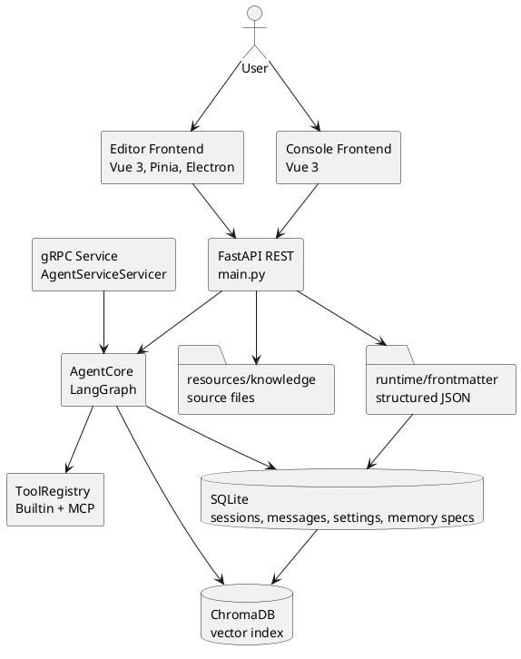
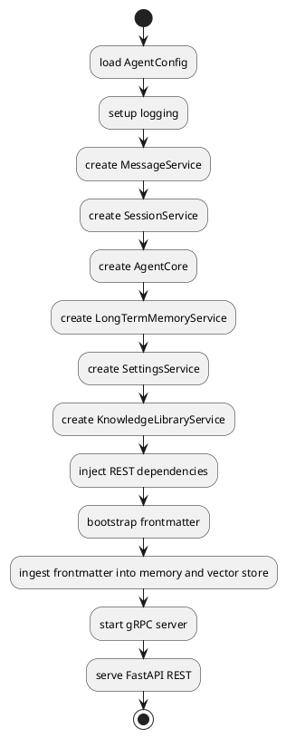
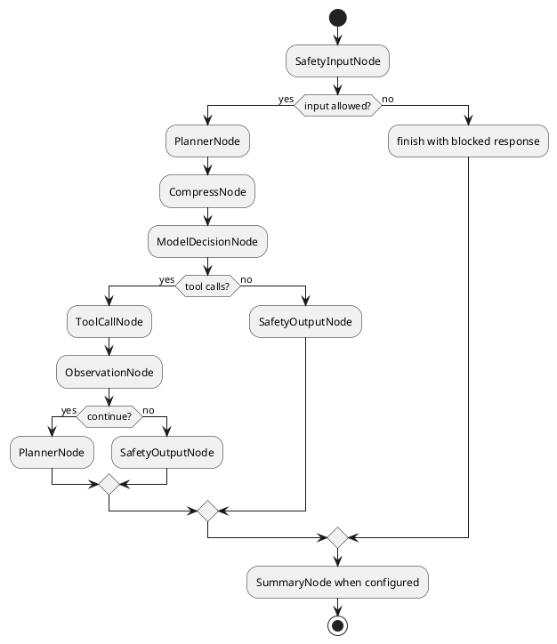
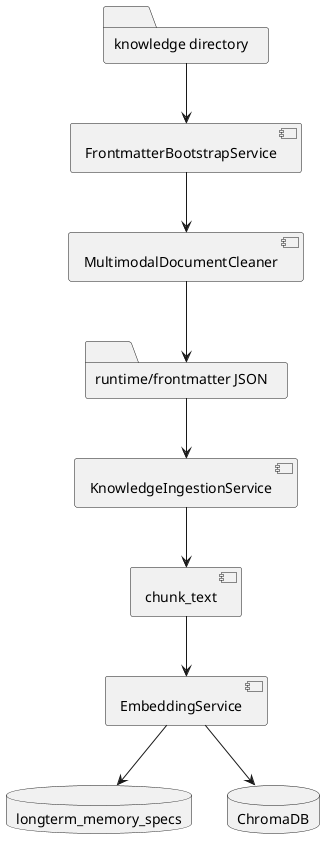

# MetaWeave 架构设计文档

## 1. 项目定位

MetaWeave 是一个面向本地知识工作场景的桌面化 Agent 系统。项目把文档编辑、文件管理、知识库入库、语义检索、长期记忆、工具调用和对话观测放在同一个工作台里，用户可以在左侧文件树中管理知识源，在编辑区查看或修改文档，在 Agent 页或侧边栏中发起任务，也可以通过外部 gRPC 接口把它当作一个普通 Agent 服务接入其他软件。

它的核心价值在于把“文件”变成 Agent 能够稳定读取的上下文。普通 Markdown 和文本文件可以直接编辑，Office Open XML 格式会先清洗成结构化章节，CSV 和 Excel 会转成表格文本，随后统一写入结构化 JSON，再进行切片和向量化。

这条链路是整个系统的基础。

## 2. 总体架构

系统由三个主要部分组成。第一部分是 editor 前端，负责桌面工作台、文件树、编辑器、预览、图谱、搜索、设置、Agent 对话页和观测页。第二部分是后端服务，入口为 FastAPI，同时提供 REST 和 gRPC。第三部分是知识与记忆层，包括 SQLite、ChromaDB、frontmatter JSON 目录、本地知识源目录，以及可选 MCP 工具配置。

前端不直接操作数据库。所有文件读写、会话读写、模型配置、系统提示词、长期记忆和工具注册表都通过后端接口完成。这样做的好处是桌面前端、console 前端和未来外部应用可以复用同一套能力，不需要把 Agent 逻辑散落到多个 UI 工程里。

## 3. 进程与启动结构

后端入口是 `main.py`。服务启动时先加载 `AgentConfig`，然后初始化日志、数据库目录、消息服务、会话服务、AgentCore、长期记忆服务、设置服务、知识库服务和检索服务。REST 依赖对象会在启动阶段注入，gRPC 服务也在同一个生命周期里启动。

启动时还会尝试执行一次知识库结构化和入库。这个动作不会阻塞整个服务不可用，失败时记录日志，HTTP 服务继续运行。

验收时如果知识库里有损坏文件，系统仍能打开，用户可以继续修改配置或删除问题文件。

## 4. 前端工作台

editor 是当前主要交互入口。工作台由 ActivityBar、文件树、主编辑区、Agent 侧边栏、独立 Agent 页、搜索页、设置页和观测页构成。文件树负责本地知识库目录的浏览、拖拽、复制、剪切、粘贴、重命名和删除。编辑区根据文件类型切换不同查看方式，Markdown 使用 Vditor，代码使用高亮编辑模式，图片、PDF、表格和文档预览走多模态预览组件。

Agent 侧边栏和独立 Agent 页复用同一套聊天组件。侧边栏适合在读文档时快速提问，独立页适合持续对话。引用链路通过聊天输入框上方的引用块展示，并把引用文本写进用户消息的 metadata 和上下文构建器。

前端状态主要在 Pinia store 中维护。`workspace` store 管理文件树、打开的 tab、预览缓存、选区引用、搜索结果和灌库进度。`chat` store 管理 SSE 流式输出、历史消息、工具调用展示和引用消息。`settings` store 负责用户 ID、知识库目录、主题、模型配置和 Web 搜索配置。

## 5. Agent 执行图

AgentCore 基于 LangGraph 组织执行。一次有 session 的对话会先保存用户输入，再构造上下文，随后进入图执行。图中节点按责任拆分，安全检查处理输入和输出边界，Planner 负责形成执行计划，ModelDecisionNode 调用主模型并决定是否使用工具，ToolCallNode 执行工具，ObservationNode 根据工具结果判断是否继续，CompressNode 在上下文过长时压缩短期消息。

模型本身不直接读取磁盘文件。它通过工具系统访问知识库、长期记忆、当前查看文档和文件内容。这样的边界可以让工具调用过程被记录、被观测，也方便后续把工具注册表开放给前端页面。

## 6. 工具系统

工具系统分为内置工具和 MCP 工具。内置工具包含时间、JSON、文本统计、计算、长期记忆读写、长期规则写入、知识库搜索、知识库上下文读取、文件读写、当前文档读取、Web 搜索和探索状态更新。MCP 工具通过配置目录加载，最终都进入 ToolRegistry。

前端工具注册表页面读取的是 AgentCore 暴露的最终注册表，因此不需要区分工具来源。这一点符合用户在观测页里看到“当前 Agent 实际可用工具”的需求。

## 7. 知识库入库链路

知识库入库分为两段。第一段是结构化，把不同格式文件清洗成统一的 StructuredKnowledgeDocument，再写入 runtime/frontmatter。第二段是灌库，把结构化文档按章节切片，计算 embedding，写入长期记忆表，并同步到 ChromaDB。

DOCX、XLSX 和 PPTX 都属于 Office Open XML 格式。系统不会按普通二进制随便读，而是打开压缩包里的 XML 内容，提取段落、表格、工作表或幻灯片文本。CSV 和 TSV 直接按分隔表格读。HTML 会剥离标签后保留正文。XML 会按节点路径展开。PDF 和图片当前记录文件信息和 OCR 状态，预留后续 OCR 处理空间。

这条链路的设计留出了屏蔽区和重新入库的扩展点。现有长期记忆服务已经支持按 source 删除记忆，如果后续把文件加入屏蔽区，可以通过 source_uri 或 source_hash 找到对应 chunk，并从关系表和向量库中移除。

## 8. 检索链路

检索分为文件名搜索、磁盘全文搜索和语义搜索。文件名搜索直接遍历知识库文件树，磁盘全文搜索读取当前 active 知识库中的文本内容，语义搜索通过长期记忆和 ChromaDB 找相似 chunk。混合检索服务会合并关键词候选和向量候选，并按相关性、时效性和权威性计算分数。

普通用户感知到的是一个搜索框。后端实际在兜底处理索引未更新的情况，所以即使文件刚导入，全文搜索仍然有机会直接命中磁盘内容。

## 9. 记忆与规则

系统把长期记忆和长期规则分开处理。长期记忆写入 `longterm_memory_specs`，它可以被召回，也可能因为相关性不足没有进入上下文。长期规则写入 `user_system_prompts`，在模型决策节点中拼接到系统提示词里，属于 Agent 每次对话都必须读取的内容。

这一区分解决了一个实际问题：用户让 Agent 记住偏好时，偏好可以作为记忆；用户让 Agent 永久遵守某条工作规范时，它应当进入系统提示词条目。

## 10. 外部接入

系统保留了 gRPC 端口，外部软件可以不经过 editor UI，直接创建 session、发送 prompt、接收流式 chunk、读取消息历史、查看工具注册表、操作知识库文件和写入系统提示词。REST 接口服务当前前端使用，gRPC 接口更适合被外部进程或其他桌面软件集成。

这也是项目区别于普通笔记软件的地方。它有编辑器界面，也有可被外部程序调用的 Agent 服务边界。

## 11. 运行时目录

项目把源码、资源和运行数据分开。`resources/knowledge` 保存用户知识源，`resources/mcp` 保存 MCP Server 配置，`runtime/db/relation` 保存 SQLite，`runtime/db/vector` 保存向量库，`runtime/frontmatter` 保存结构化知识 JSON，`runtime/models` 保存 embedding 和 rerank 模型，`runtime/logs` 保存日志。

打包后，外置资源目录优先。内置资源只用于初次运行或默认示例，用户修改后的知识库不会写回程序包内部。

## 12. 设计边界

当前版本的多模态能力重点在“文本提取和预览”。主模型和小模型通过 OpenAI Compatible 接口接入，embedding 和 rerank 使用本地模型目录。配置层支持环境变量、`.env` 和用户设置覆盖，但模型服务本身仍需要用户提供可用 API Key 或本地模型文件。

