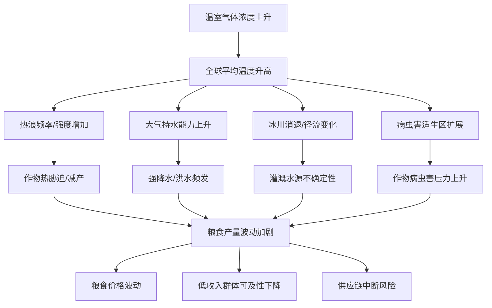
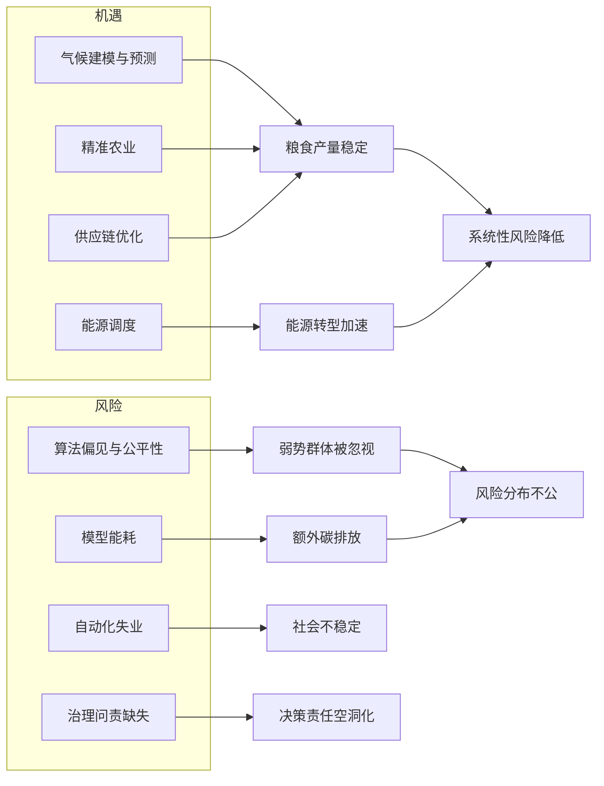
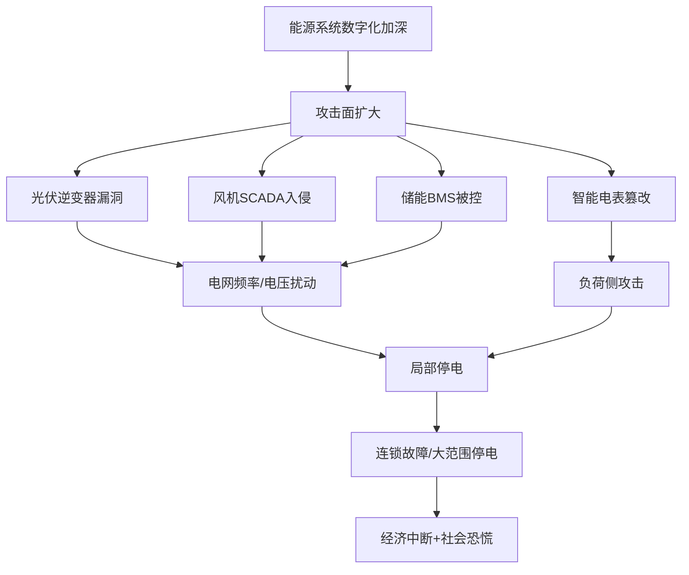
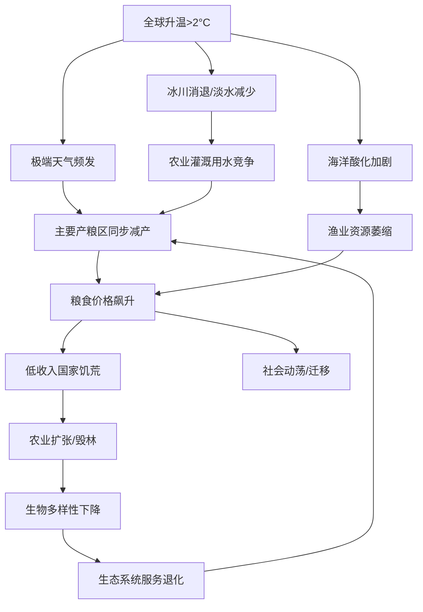
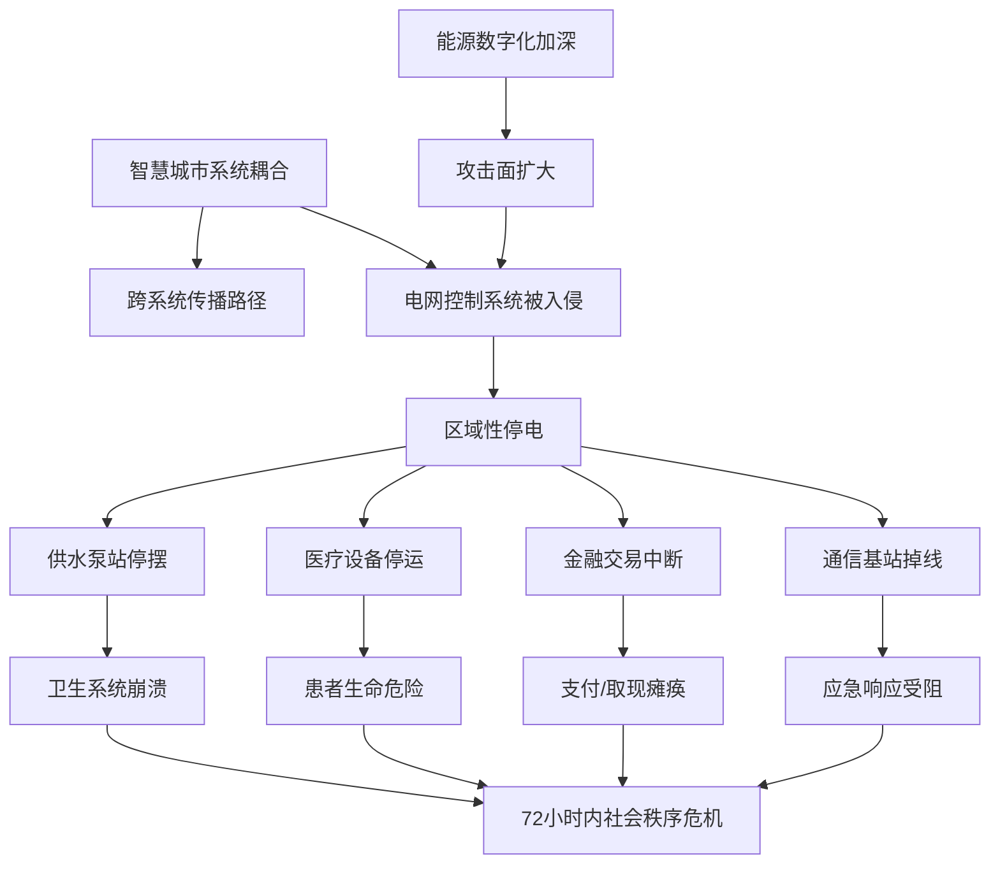
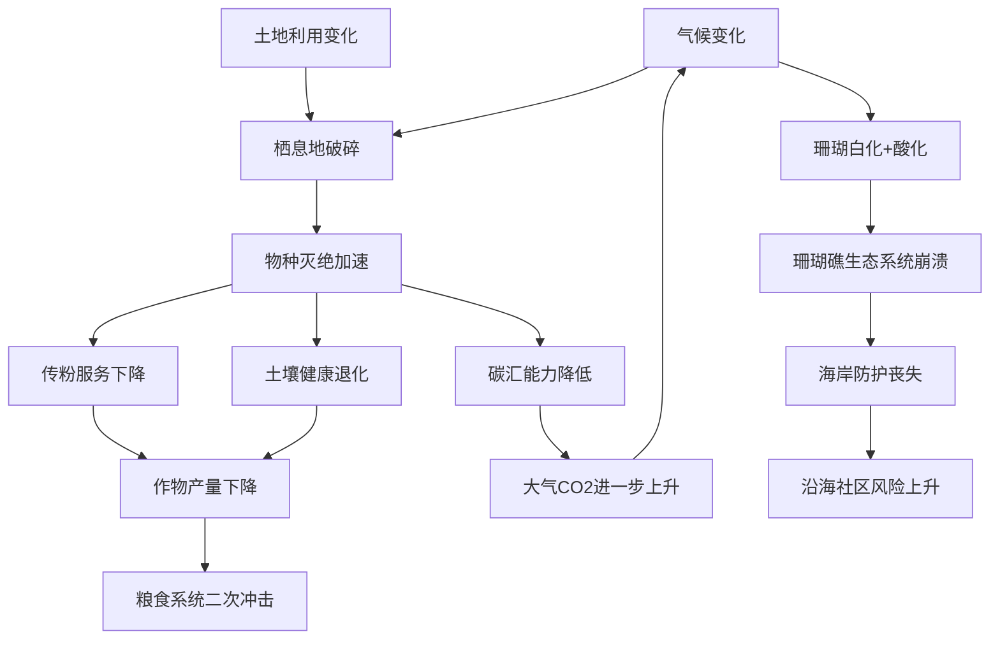

# 全球系统性风险交叉分析战略备忘录

## 目录

1. [引言与 scope](#1-引言与-scope)
2. [气候变化对粮食系统的影响：多文件证据链](#2-气候变化对粮食系统的影响多文件证据链)
3. [AI技术在气候与粮食危机中的角色：机遇与风险](#3-ai技术在气候与粮食危机中的角色机遇与风险)
4. [网络安全脆弱性对可再生能源与智慧城市的威胁评估](#4-网络安全脆弱性对可再生能源与智慧城市的威胁评估)
5. [未来20年三大系统性风险综合评估](#5-未来20年三大系统性风险综合评估)
6. [风险可控性与影响范围对比](#6-风险可控性与影响范围对比)
7. [政策建议](#7-政策建议)

---

## 1. 引言与 scope

本备忘录基于多源知识库资料（覆盖气候变化、生物多样性、可再生能源、粮食系统、公共卫生、城市发展、AI伦理治理、网络安全等八个领域），采用交叉影响分析（Cross-Impact Analysis）方法，识别不同系统之间的非线性耦合风险，评估若无有效干预的演化路径，并提出可落地的政策建议。

核心分析框架为三阶段递推：**影响路径识别 → 反馈机制建模 → 临界点评估**。

---

## 2. 气候变化对粮食系统的影响：多文件证据链

### 2.1 直接生产冲击

气候变化通过多条路径直接影响粮食生产。联合国粮农组织（FAO）的资料指出，"气候变化会通过高温、干旱、洪水、病虫害和降雨变化影响粮食产量与供应稳定性"[Source: 05_food_systems_fao.txt]。同机构的气候与农业专题文件进一步细化："气候变化威胁粮食安全、减贫和可持续发展，其影响包括降雨模式变化、温度升高、极端天气增加、干旱洪水、病虫害扩散和海洋酸化"[Source: 08_agrifood_climate_fao.md]。

NASA 的气候证据资料补充了物理机制："更暖的大气可容纳更多水汽，从而影响强降水风险；更高的平均温度会抬升热浪基线；干旱、土壤湿度和植被状态变化会影响野火风险"[Source: 01_climate_change_nasa.md]。这意味着粮食系统面临的不是单一压力，而是高温、干旱、洪水、野火和病虫害的多重叠加。

### 2.2 间接系统性影响

海洋生态系统也受到气候变化波及。NOAA 的研究指出，海洋酸化会改变碳酸盐体系，影响珊瑚和贝类等钙化生物的骨骼形成——"珊瑚礁不仅美丽，它们支持渔业、旅游和海岸防护。珊瑚退化会影响食物安全、地方收入和海岸社区韧性"[Source: 09_ocean_acidification_noaa.md]。这构成了对沿海社区粮食安全（蛋白质来源）的第二条冲击路径。

粮食安全的多维性在 FAO 资料中被强调：粮食安全包含"可获得性、可获取性、利用和稳定性。气候冲击可能降低作物产量，破坏运输和储存系统，推高食品价格，影响家庭购买力"[Source: 08_agrifood_climate_fao.md]。对低收入农户而言，风险更高，因为他们"往往缺少保险、灌溉、储备资金和替代生计"。

---

## 3. AI技术在气候与粮食危机中的角色：机遇与风险

### 3.1 机遇维度

AI 技术在应对气候与粮食危机中可发挥多重正向作用，核心机遇集中在以下四个方面：

**气候建模与预测**：地球观测卫星采集的海量遥感数据（植被指数、海温、土壤湿度、大气水汽等）为 AI 模型提供了训练基础。深度学习可以提升极端天气事件的预报精度和提前量，为农业决策争取更长的响应窗口。

**精准农业与资源优化**：AI 驱动的精准农业系统可基于土壤传感器、卫星影像和气象数据，优化灌溉、施肥和病虫害防治的时间和用量，从而在产量不降的前提下减少水、肥和农药的消耗。这直接对应 FAO 提出的"提升资源效率"和"气候适应型农业"方向。

**供应链效率提升**：机器学习可优化农产品冷链调度、仓储管理和需求预测，减少采后损失。FAO 指出"减少损失不仅可以提高粮食供应效率，还可以减少不必要的土地、水、能源和排放压力"。

**能源系统优化**：可再生能源的高比例接入需要更强的预测与调度能力。AI 可提升风光出力预测精度、电池储能调度效率和需求侧响应能力，加速能源系统脱碳。

### 3.2 风险维度

AI 大规模应用也引入了不容忽视的风险。

**算法偏见与公平性**：UNESCO 的 AI 伦理建议指出，"公平性要求系统不要放大已有社会偏见。训练数据、标注方式、目标函数、部署环境和反馈机制都可能引入偏差"[Source: 03_ai_ethics_unesco.md]。在粮食危机场景中，若 AI 驱动的信贷评估或保险定价系统内置了地域或收入偏见，最需要支持的脆弱农户可能被系统性排除在外。

**模型能耗与环境成本**：大规模 AI 模型的训练和推理消耗大量计算资源和电力。UNESCO 资料明确警示，"大规模模型训练和推理可能消耗能源和计算资源……负责任的 AI 政策应兼顾创新、包容和可持续性"。

**人类监督与问责空洞化**：在气候变化和粮食安全这样的高风险领域，AI 的决策影响可能涉及基本权利和生命财产安全。UNESCO 强调，"在生命安全、基本权利、司法、医疗、公共资源分配等领域，应保留明确的人类责任链。不能把'算法说了算'当成逃避责任的理由"[Source: 03_ai_ethics_unesco.md]。缺乏治理嵌入的 AI 系统可能在关键时刻造成不可逆损失。

---

## 4. 网络安全脆弱性对可再生能源与智慧城市的威胁评估

### 4.1 可再生能源基础设施的攻击面

随着可再生能源占比提高，电力系统的数字化程度也在加深——光伏逆变器、风机控制系统、储能管理系统、智能电表和调度平台都依赖软件和网络连接。IEA 的资料指出，"高比例风光需要更灵活的调度、输电扩容、储能配置、备用容量和市场机制"[Source: 06_renewable_energy_iea.md]。这种灵活性依赖数字通信和远程控制，也意味着攻击面扩大。

NIST 网络安全框架强调，网络安全不是单一工具问题，而是"一套持续的风险管理过程"[Source: 05_cybersecurity_nist.md]。对于可再生能源基础设施，潜在的脆弱点包括：

- 分布式光伏逆变器的固件漏洞可能被利用进行大规模电网扰动
- 风电场的远程监控系统若遭入侵，可能导致风机超速或停机
- 储能系统的电池管理系统（BMS）被攻击可能引发安全问题
- 需求响应聚合平台被操控可能造成负荷侧攻击

### 4.2 智慧城市的耦合脆弱性

城市发展资料指出，"基础设施是城市发展的骨架。道路、桥梁、公共交通、供水、排水、电力、通信、学校、医院和公共空间共同影响居民生活质量"[Source: 04_urban_development_worldbank.md]。智慧城市将这些基础设施统一接入物联网和数字平台，带来了管理效率，也创造了单一故障点。

城市韧性的世界银行资料进一步说明，"城市韧性不仅要在灾后修复，还要在平时通过规划、投资和治理降低脆弱性"[Source: 04_urban_development_worldbank.md]。但脆弱性若来源于网络攻击，传统的物理冗余策略（如备用发电机）无法消除数字侧的单点失效风险。

NIST 的供应链安全分析指出，"软件依赖、云服务、外包运维、硬件设备和第三方数据接口都可能引入风险"[Source: 05_cybersecurity_nist.md]。智慧城市系统通常由多个供应商的软硬件拼合而成，任一环节的漏洞都可能成为攻击跳板。

### 4.3 综合威胁评级

| 威胁场景                                   | 发生概率 | 影响严重性 | 总体风险等级 |
| ------------------------------------------ | -------- | ---------- | ------------ |
| 针对可再生能源调度的网络攻击导致区域性停电 | 中高     | 高         | 极高         |
| 智慧城市交通信号/供水系统被勒索软件攻击    | 中       | 高         | 高           |
| 分布式能源设备被僵尸网络利用进行电网攻击   | 中高     | 中高       | 高           |
| 智能建筑/家庭能源管理系统数据泄露          | 高       | 低中       | 中           |

---

## 5. 未来20年三大系统性风险综合评估

### 风险一：气候-粮食-水耦合崩溃

**逻辑链**：

1. 全球变暖持续加剧，极端天气（热浪、干旱、暴雨）频率和强度双升（NASA 多证据）
2. 主要产粮区遭遇同步或级联气候冲击，全球粮食产量波动加大（FAO 证据）
3. 海洋酸化导致渔业资源萎缩，动植物蛋白供应双降（NOAA 证据）
4. 粮食价格飙升触发社会动荡，低收入国家地区性饥荒风险上升
5. 农业用水竞争加剧，叠加冰川消退导致的淡水供给下降
6. 正反馈：农业扩张进一步破坏森林和生物多样性，降低生态系统缓冲能力

**临界点**：全球升温超过 2°C 后，多个产粮区同时减产的概率非线性上升；海洋酸化突破珊瑚礁生态阈值后，渔业恢复周期长达数十年。

### 风险二：关键基础设施的网络-物理连锁失效

**逻辑链**：

1. 能源系统深度数字化+可再生能源高占比，攻击面前所未有地扩大
2. 智慧城市系统耦合度上升，一个领域的攻破可横向蔓延
3. NIST 框架指出多数组织的安全治理水平跟不上数字化速度
4. 国家级APT组织或勒索软件集团针对能源和城市基础设施发动攻击
5. 电网故障引发通信中断→金融系统离线→医疗系统瘫痪→供水系统停机
6. 社会秩序在48-72小时内面临严峻考验

**临界点**：当可再生能源占比超过50%且备用化石燃料调峰能力不足时，网络攻击造成的功率缺额难以通过传统手段弥补。智慧城市跨系统耦合达到"不可分离"程度时，隔离失效的边际成本急剧上升。

### 风险三：生物多样性丧失触发生态系统服务不可逆衰退

**逻辑链**：

1. 气候变化（升温+酸化）叠加土地利用变化，物种灭绝速率远超自然背景值
2. IPBES 指出的关键生态系统服务——授粉、水源涵养、土壤形成、气候调节、灾害缓冲——同步下降
3. 珊瑚礁系统白化/酸化达到不可逆阈值，海岸防护能力丧失（NOAA 证据）
4. 传粉昆虫减少→作物授粉率下降→粮食产量二次冲击
5. 森林退化→碳汇能力下降→加速气候变化，形成气候-生物多样性正反馈
6. 生态系统服务崩溃无法通过技术手段替代，经济损失具有永久性

**临界点**：珊瑚礁全球覆盖率低于关键阈值（约10-15%）后，繁殖网络断裂，自然恢复停止。传粉昆虫多样性下降超过50%后，人工授粉成本使大宗作物失去经济可行性。

---

## 6. 风险可控性与影响范围对比

| 风险维度                          | 可控性 | 影响范围   | 关键可控因素                                     |
| --------------------------------- | ------ | ---------- | ------------------------------------------------ |
| 气候-粮食-水耦合崩溃              | 中     | 全球       | 全球减排力度、农业适应投资、国际粮食储备机制     |
| 关键基础设施网络-物理连锁失效     | 中高   | 区域→全球 | 安全治理成熟度、供应链安全、跨部门应急协同       |
| 生物多样性丧失触发不可逆衰退      | 低     | 全球       | 保护地覆盖、土地可持续管理、全球减排（前提条件） |
| AI技术治理失当导致的不公平/不可控 | 高     | 全球       | 法规框架、审计机制、透明度和人类监督要求         |
| 可再生能源并网安全事件            | 中     | 局部→区域 | 电网灵活性、储能配置、安全设计前置               |
| 智慧城市单点失效                  | 高     | 局部       | 系统冗余设计、供应商安全评估、隔离机制           |

---

## 7. 政策建议

### 建议一：建立气候-粮食-水安全交叉预警系统

**优先级**：P0
**预估实现难度**：8/10

构建融合气候预测、农业产出监测、水文模型和价格波动的多源预警平台。利用地球观测卫星数据（如 ESA 的 Sentinel 系列）和 AI 预测能力，对产粮区同步气候冲击进行提前30-60天预警。预警触发后，自动激活粮食储备释放、应急物流调度和国际人道援助协调机制。难点在于数据共享的政治意愿和跨机构协调成本。

### 建议二：关键基础设施网络安全基线标准强制化

**优先级**：P0
**预估实现难度**：7/10

参照 NIST CSF 2.0 框架，针对可再生能源电站、智能电网调度系统和智慧城市核心平台制定强制性网络安全基线。具体要求包括：设备固件安全开发周期、漏洞披露窗口（<7天）、第三方组件物料清单（SBOM）提供义务、年度攻防演练和独立审计。难点在于现有存量设备的改造成本和中小企业合规负担。

### 建议三：AI治理嵌入气候与粮食决策高风险场景

**优先级**：P1
**预估实现难度**：6/10

在 AI 应用于农业信贷、保险定价、灾害应急分配和粮食市场预测等场景时，强制实施 UNESCO 建议中的人类监督和公平性评估。具体机制包括：高风险系统上线前的独立伦理审查、决策日志可溯源、受影响人群的申诉渠道、年度偏差审计公开报告。难点在于治理流程可能延缓部署速度，需要在速度与可信度之间平衡。

### 建议四：全球珊瑚礁和传粉昆虫保护紧急行动

**优先级**：P1
**预估实现难度**：9/10

珊瑚礁恢复周期长且依赖全球减排，短期内应优先加强本地管理（减少陆源污染、控制过度捕捞、设立保护区），同时启动大规模珊瑚移植和耐热品种培育。传粉昆虫保护需要农药管理改革、栖息地恢复和景观连通性规划。两项行动都需要大规模国际融资和技术转移。难点在于保护效果需 `5-10`年才显现，政治耐心不足。

### 建议五：城市韧性基础设施的系统冗余与隔离设计

**优先级**：P2
**预估实现难度**：5/10

在新建和改建城市基础设施时，要求数字控制系统具备故障隔离能力，确保单一系统被攻破或故障不会横向蔓延至其他关键功能。具体措施包括：网络分段、离线手动备用控制模式、关键数据定期离线备份、供应商安全能力分级准入。难度相对较低，但需要城市规划部门和网络安全部门的深度协作，并纳入项目招标要求。

---

*本备忘录基于知识库中 FAO、NASA、NOAA、UNESCO、NIST、IEA、World Bank、ESA 等多源资料交叉分析得出。各风险场景的发生概率和影响评估基于现有文献证据的合理推演，不构成对未来事件的精确预测。*
